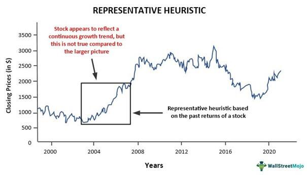

Algorithmic trading has fundamentally transformed financial markets by leveraging sophisticated algorithms to make trading decisions at high velocities. These advanced systems significantly enhance trading efficiency and consistency, yet they are not exempt from the influences of human cognitive biases that can inadvertently affect their decision-making processes. One such cognitive bias is the representativeness bias, a mental shortcut whereby individuals judge the probability of an event based on its similarity to an existing prototype without considering other pertinent information.

This article focuses on representativeness bias and examines its implications for algorithmic trading. Understanding this bias is crucial because it often leads to oversimplified decision-making based on perceived similarities rather than a comprehensive analysis. Representativeness bias can cause traders and developers to overlook important statistical data or base rates, potentially resulting in flawed investment decisions. By acknowledging this bias, traders and developers can work towards creating more robust trading systems, thereby enhancing financial outcomes.

We will investigate the representativeness heuristic, which underpins this bias, and its potential to skew algorithmic trading strategies. The article aims to provide useful insights into reducing the negative impacts of this bias on trading decisions. By recognizing how representativeness bias manifests in algorithmic trading environments and implementing strategies to mitigate its effects, traders and developers can foster more reliable and effective trading systems. Let us begin by defining representativeness bias and understanding its influence on algorithmic trading systems.

## Table of Contents

## What is Representativeness Bias?

Representativeness bias is a cognitive shortcut, or heuristic, that individuals use to make judgments about the likelihood of an event by comparing it with an existing prototype in their minds. This bias often leads to the oversimplification of complex decisions, relying on perceived similarities rather than a comprehensive evaluation of the situation.

In the context of trading, representativeness bias can cause traders and automated systems to equate superficial similarities between current and past market conditions or companies, potentially leading to misguided decisions. For instance, a trader might assume that a company exhibiting rapid growth will replicate the success of established industry giants, disregarding significant differences in market context, financial indicators, or managerial competence. This oversimplified approach can result in overlooking critical information, such as changes in economic policies, technological advancements, or shifts in consumer behavior, which are essential for accurate analysis and forecasting.

Errors in judgment due to representativeness bias often occur because statistical data and base rates are neglected. Instead, decisions are influenced by familiar patterns or historical events that may not truly reflect current circumstances. This over-reliance on representativeness can skew investment decisions and lead to unexpected losses. For example, a trader might act on the belief that after a series of losses, a winning streak is due, ignoring the statistical independence of these events—this is akin to the gambler's fallacy.

Understanding representativeness bias is critical for recognizing its potential impact on trading systems. It prompts the need for integrating a robust statistical approach, ensuring that decisions are based on data-driven insights rather than surface-level resemblances. This awareness serves as the foundational step toward developing strategies to counteract the bias's influence, leading to more effective trading strategies and better financial outcomes.

## Impact of Representativeness Bias on Algorithmic Trading

Representativeness bias poses significant challenges to [algorithmic trading](/wiki/algorithmic-trading) by influencing the way algorithms are developed and how they function in dynamic market environments. When coding trading algorithms, developers may inadvertently adopt strategies that closely imitate past successes, without adequately accounting for current market variables that diverge from historical norms. This approach can hinder the algorithm’s ability to adapt to new conditions, making it susceptible to performance issues.

This bias often leads to an overreliance on recent market trends, with algorithms projecting those trends to persist into the future despite evidence of potential change. For instance, an algorithm might consistently forecast upward trends because of a short-term bullish market, ignoring the variability and possible downturns indicated by other economic factors. The formula used by such algorithms might look something like this:

$$
\text{Predicted Value} = \alpha \times \text{Historical Trend} + \beta \times \text{Current Indicator}
$$

In this equation, a high value of $\alpha$ relative to $\beta$ emphasizes historical trends over current indicators, highlighting potential bias towards representativeness.

Furthermore, algorithms affected by representativeness bias may overestimate the probability of certain outcomes based solely on historical data patterns, which can be detrimental in atypical market scenarios. For example, if an algorithm predicts stock price movements based exclusively on patterns seen in a historical bull market, it may underperform or incur losses when unexpected variables like geopolitical events or sudden policy changes arise.

By focusing primarily on surface-level resemblances and past patterns, this bias can obscure crucial economic indicators and [statistics](/wiki/bayesian-statistics) that are essential for informed decision-making. For effective algorithmic trading, these cues should be integrated into the model to allow for a comprehensive analysis of prevailing conditions.

Understanding representativeness bias and acknowledging its repercussions are critical for optimizing algorithmic strategy development. Developers can achieve more data-informed and accurate strategies by counterbalancing this bias, thereby enhancing the overall reliability and robustness of trading outcomes.

## Examples of Representativeness Bias in Trading

Historical financial events offer critical insights into how representativeness bias has influenced trading decisions, often with significant market repercussions. One of the most illustrative examples is the dot-com bubble of the late 1990s and early 2000s. During this period, investors were driven by the belief that new tech startups would replicate the groundbreaking success of firms like Microsoft and Intel. This perception led to mass overvaluation of internet-based companies regardless of their actual financial health or business viability. When many of these companies failed to deliver on their inflated promises, the market saw a dramatic crash, erasing trillions of dollars of market value. The representativeness bias here was evident as investors equated all tech startups with established tech giants, ignoring critical differences in business models and market fundamentals.

Another example is the housing market boom of the mid-2000s, which culminated in the financial crisis of 2007-2008. Investors and homeowners assumed that the rise in housing prices would persist indefinitely, based largely on recent upward trends without adequately considering broader economic indicators that signaled potential instability. The assumption that past growth patterns would continue unaltered led to widespread speculative investments and subprime mortgage lending. Ultimately, when the housing bubble burst, it resulted in a cascading effect on the global economy. Here, the representativeness bias caused market participants to focus on superficial similarities with past trends, overlooking underlying economic vulnerabilities.

These events underscore the risks of applying representativeness bias in trading without comprehensive analysis. They illustrate the potential pitfalls of making decisions based solely on perceived resemblances to past successes. To mitigate such risks, traders can benefit from incorporating a broader spectrum of financial data and market indicators in their decision-making processes.

Through learning from these historical incidents, traders and developers can design more robust algorithmic trading strategies. By recognizing the limitations of relying strictly on past patterns, they can reduce susceptibility to representativeness bias and foster more resilient market strategies.

## Strategies to Mitigate Representativeness Bias

To reduce the influence of representativeness bias on algorithmic trading, several effective strategies can be implemented. These strategies enhance the objectivity and reliability of trading algorithms by ensuring a more data-driven approach rather than simply drawing parallels with past events.

First, incorporating comprehensive statistical analysis into algorithmic models is crucial. This involves using advanced statistical techniques and models that evaluate current data in its entirety. By focusing on statistical relationships and distributions rather than superficial similarities, traders can make more informed decisions. Techniques such as regression analysis, time series analysis, and [machine learning](/wiki/machine-learning) can help in crafting algorithms that respond to real-time data more accurately. For example, a linear regression model can be used to understand the relationship between different economic indicators and stock prices:

$$

Y = \beta_0 + \beta_1X_1 + \beta_2X_2 + \ldots + \beta_nX_n + \epsilon 
$$

where $Y$ is the dependent variable (like stock price), $\beta_0$ is the intercept, $\beta_1, \beta_2, \ldots, \beta_n$ are the coefficients, $X_1, X_2, \ldots, X_n$ are the independent variables (like economic indicators), and $\epsilon$ is the error term.

Second, diversifying data sources and integrating various perspectives helps mitigate the dependence on familiar patterns. By incorporating diverse datasets and viewpoints, traders can develop a well-rounded view of the market, thereby minimizing the likelihood of biased judgments. Different data sources may offer unique insights into market trends and anomalies, which can be overlooked if relying solely on a limited set of data.

Another significant strategy is slowing down the decision-making process. Implementing mechanisms that introduce intentional delays or checkpoints can provide the algorithm with more time to analyze and verify the data before executing trades. This approach allows for more thorough reflection on the data, reducing the risks associated with impulsive decisions driven by cognitive biases.

Finally, by implementing these measures, traders can enhance the accuracy and reliability of their algorithmic trading systems. Through rigorous statistical analysis, data diversification, and paced decision-making, algorithms can be made more resilient to biases, ultimately leading to more successful trading outcomes. Employing these strategies not only improves the robustness of trading algorithms but also aligns trading practices with a more empirical, evidence-based framework.

## Conclusion

Understanding and addressing representativeness bias is crucial for optimizing algorithmic trading strategies and improving financial performance. At its core, the representativeness bias can lead to oversimplified decision-making based on perceived similarities rather than thorough analytical processes. This cognitive bias often results in algorithmic models that wrongly project historical market patterns onto current situations, potentially leading to flawed investment decisions.

Recognizing the limitations of representativeness bias is essential for traders and developers who aim to create more resilient trading algorithms. By acknowledging the pitfalls associated with this bias, traders are better equipped to anticipate and counteract its influence, promoting a more accurate understanding of market dynamics. This awareness fosters the development of trading models that not only rely on historical data but also incorporate a broader spectrum of market variables and economic indicators.

To mitigate the negative effects of representativeness bias, several strategies can be employed. Incorporating comprehensive statistical analysis into algorithmic models allows for a more objective evaluation of data. By adopting data-driven approaches, traders are encouraged to look beyond surface-level patterns and consider underlying statistical distributions. Diversifying data perspectives helps counterbalance the undue emphasis on familiar patterns. By integrating a wider range of data sources and analytical techniques, traders can enhance the robustness of their models and reduce the risk of bias-driven errors.

Deliberate decision-making processes also play a critical role in mitigating representativeness bias. Slowing down the decision-making processes allows for more thoughtful and reflective analysis, effectively reducing the likelihood of impulsive, biased choices. Implementing checks and balances within the trading algorithms ensures that decisions are made based on comprehensive data assessments rather than superficial similarities.

Ultimately, overcoming representativeness bias paves the way for more accurate predictions and successful trading outcomes. By emphasizing data-driven analysis, diversified perspectives, and calculated decision-making, traders can enhance their algorithmic trading systems, ensuring they remain adaptive and effective in dynamic market environments. This proactive stance against cognitive biases facilitates the achievement of optimized financial performance and strategic advancement in algorithmic trading.

## References & Further Reading

[1]: Tversky, A., & Kahneman, D. (1974). ["Judgment under Uncertainty: Heuristics and Biases."](https://www2.psych.ubc.ca/~schaller/Psyc590Readings/TverskyKahneman1974.pdf) Science, 185(4157), 1124-1131.

[2]: Barberis, N., & Thaler, R. (2003). ["A Survey of Behavioral Finance."](https://www.nber.org/papers/w9222) In Handbook of the Economics of Finance (Vol. 1, pp. 1053-1128). Elsevier.

[3]: Kahneman, D., & Tversky, A. (1983). ["Extensional versus intuitive reasoning: The conjunction fallacy in probability judgment."](https://psycnet.apa.org/record/1984-03110-001) Psychological Review, 90(4), 293.

[4]: Golec, J., & Tamarkin, M. (1998). ["Bettors Love Skewness, Not Risk, at the Horse Track."](https://papers.ssrn.com/sol3/papers.cfm?abstract_id=58548) Journal of Political Economy, 106(1), 205-225.

[5]: Brynjolfsson, E., & McAfee, A. (2014). ["The Second Machine Age: Work, Progress, and Prosperity in a Time of Brilliant Technologies."](https://psycnet.apa.org/record/2014-07087-000) W.W. Norton & Company.