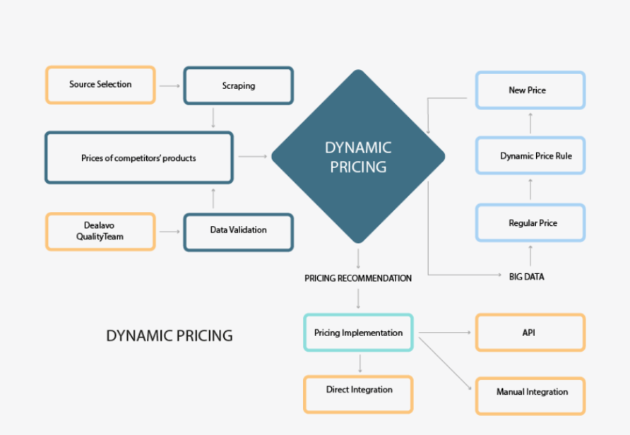

The world of trading and investment is experiencing unprecedented change, driven largely by technological advancements that redefine how financial markets operate. Among the key areas that have captured the attention of modern investors is the innovative use of pricing strategies and algorithmic trading to identify and leverage market opportunities—a process often referred to as repricing. This approach involves dynamically adjusting the prices of financial assets based on real-time data and market conditions to maximize returns and maintain competitiveness.

Pricing strategy in trading is a fundamental aspect that provides traders and businesses with the tools needed to optimize returns on investment. By setting prices based on market demand, competitor actions, and cost structures, traders can enhance trade execution and profitability. The strategic pricing of assets such as stocks, bonds, and derivatives directly influences market behaviors and determines investment outcomes.



Market opportunities emerge from various macroeconomic factors, sector-specific developments, and shifts in consumer preferences. Repricing opportunities, a subset of these market opportunities, occur when there is a necessity to adjust asset prices in response to new information or evolving trends. These opportunities require astute market awareness and strategic thinking, enabling traders to effectively capitalize on fluctuating conditions. For instance, retailers may adjust prices due to changes in consumer demand, while financial sectors might respond to interest rate fluctuations.

Algorithmic trading, or "algo trading," revolutionizes this landscape by utilizing algorithms to execute trades based on predefined criteria. This method provides unmatched speed, precision, and scalability compared to manual trading approaches. With features such as automation, rapid execution, backtesting, and adaptability, algo trading strategies have become increasingly sophisticated. The integration of artificial intelligence and machine learning has further honed the precision of buy-sell decisions, reducing spreads and enhancing profitability.

By understanding and applying the principles of pricing strategy, market awareness, and algorithmic automation, traders and businesses can significantly improve their financial outcomes. These elements, when effectively integrated, empower stakeholders to navigate complex market conditions and maintain a competitive edge. As the financial landscape continues to evolve, those who can harness these advancements will find themselves well-positioned for success.

## Table of Contents

## Understanding Pricing Strategy in Trading

Pricing strategies are critical in the trading domain, serving as a cornerstone for investors aiming to optimize returns on their investments. A well-crafted pricing strategy involves setting asset prices by weighing several elements, including market demand, competitor pricing, and the cost of production. Successful strategies ensure that prices reflect the intrinsic value of the asset while considering external factors that could impact its market price.

In trading, the timing and profitability of trade executions hinge significantly on pricing strategies. Investors utilize these strategies to determine when to enter or [exit](/wiki/exit-strategy) positions in the market. For example, a trader might adjust their pricing approach based on the current demand for a particular stock and the pricing adopted by competitors in order to maximize profits or minimize losses. This proactive approach ensures that they capitalize on time-sensitive opportunities, such as sudden market shifts or announcements affecting stock prices.

The strategic pricing of stocks, bonds, or other securities not only influences individual investment outcomes but also plays a pivotal role in shaping overall market behavior. When investors collectively respond to pricing signals, they can create market trends or counteract them, thereby affecting pricing dynamics across the market. For instance, if a significant number of traders perceive a stock as undervalued due to a strategic pricing decision, they might increase their demand for the stock, which could drive up its market price.

Furthermore, the appropriate pricing strategy can lead to improved market efficiency by ensuring that securities are traded at prices reflecting their true market value. This can foster [liquidity](/wiki/liquidity-risk-premium), reduce market [volatility](/wiki/volatility-trading-strategies), and enhance price discovery processes.

Prices in trading can be set by various models and algorithms that leverage historical data, predictive analytics, and [machine learning](/wiki/machine-learning). These models aim to forecast price movements and determine optimal pricing points for trade placements, creating a competitive advantage for traders who adopt them. By continuously honing these models and integrating real-time data analysis, traders can maintain adaptability and precision in their pricing strategies, ultimately contributing to more effective and profitable trading practices.

## Market Opportunities and Repricing Mechanisms

Market opportunities are often precipitated by volatile economic conditions, sector-specific events, or shifts in consumer behavior. These factors create an environment conducive to dynamic changes in asset pricing, presenting traders with unique chances to maximize returns. 

Repricing opportunities, a specific subset of market opportunities, occur when an asset's pricing must be adjusted due to new market information or emerging trends. For example, in retail, changes in customer preferences and purchasing power can lead to fluctuating demand, prompting businesses to reprice products to maintain competitiveness and profitability. Similarly, in the financial sector, shifts in interest rates can create opportunities to reprice securities, affecting everything from bond yields to mortgage rates.

The key to effectively leveraging these opportunities lies in keen market awareness and strategic foresight. Traders and businesses must monitor market indicators closely and use sophisticated analytical tools to predict when and how repricing should occur. Python, in particular, provides a robust framework for building predictive models and algorithms that can analyze large datasets to identify optimal repricing instances.

For example, a simple Python function to detect potential repricing moments based on moving average convergence divergence (MACD) might look like this:

```python
import numpy as np

def detect_repricing_opportunity(prices):
    # Calculate MACD
    short_ema = prices.ewm(span=12, adjust=False).mean()
    long_ema = prices.ewm(span=26, adjust=False).mean()
    macd = short_ema - long_ema
    signal = macd.ewm(span=9, adjust=False).mean()

    # Find crossovers
    crossovers = np.where((macd > signal) & (macd.shift() <= signal.shift()))[0]

    return crossovers

# Example usage
import pandas as pd
prices = pd.Series([...])  # replace with a list of price data
repricing_points = detect_repricing_opportunity(prices)
```

This function utilizes the exponential moving average (EMA) to compute MACD and detects when the MACD line crosses above the signal line, indicating a potential opportunity for repricing.

Ultimately, the ability to navigate these market shifts by identifying repricing opportunities can significantly influence a trader's or a business's strategic advantage and financial performance. By recognizing and acting on these opportunities, entities can optimize their pricing strategies, ensure better resource allocation, and maintain a competitive edge in ever-fluctuating markets.

## Algorithmic Trading: A Modern Approach

Algorithmic trading, commonly known as algo trading, utilizes computer algorithms to automate the process of trading financial instruments. This approach leverages pre-defined criteria to make trading decisions, enhancing factors such as speed, precision, and trading [volume](/wiki/volume-trading-strategy) beyond what is possible with manual methods. The automation inherent in [algorithmic trading](/wiki/algorithmic-trading) allows for the rapid execution of trades, a crucial advantage in financial markets where timing can significantly impact profitability.

Key features of algorithmic trading systems involve automation, which reduces the need for manual intervention and human error, allowing traders to execute strategies with high efficiency. The speed advantage is vital; algorithms can process market data and execute trades in microseconds, a speed far superior to human capabilities. Backtesting is essential in algo trading, allowing strategies to be tested against historical data to evaluate performance before deploying capital in live markets. This systematic approach helps in refining strategies to handle various market conditions.

Scalability is another significant benefit of algorithmic systems. These systems can execute multiple trades across different markets and asset types simultaneously, offering opportunities to diversify strategies. Common strategies employed in algorithmic trading include trend-following, [arbitrage](/wiki/arbitrage), market-making, and mean reversion. Each strategy is driven by different mechanisms: trend-following exploits directional [momentum](/wiki/momentum) in markets, arbitrage seeks to profit from price discrepancies across different markets, market-making improves liquidity by continuously quoting buy and sell prices, and mean reversion predicts asset prices will revert to their mean over time.

The integration of advanced technologies like Artificial Intelligence (AI) and Machine Learning (ML) has further transformed algorithmic trading. These technologies contribute to increased sophistication in trading models, enabling the algorithms to analyze vast data sets, recognize patterns, and adapt to dynamic market conditions efficiently. AI and ML facilitate the development of predictive models that learn and evolve, continually improving trading strategies over time.

These advancements reduce the bid-ask spreads, enhancing profitability by making trade execution more cost-efficient. As computational power continues to grow and data becomes more accessible, algorithmic trading is expected to become increasingly dominant, driving innovation across global financial markets.

## Harnessing Repricing in Algorithmic Trading

Repricing in algorithmic trading is a strategic approach that involves adjusting trade positions to capitalize on changes in market conditions. This technique is particularly effective in volatile markets, where price fluctuations create opportunities for profit. By incorporating repricing into trading algorithms, traders can automate the adjustment of their positions in real-time, maintaining the profitability of their strategies.

In high-frequency trading ([HFT](/wiki/high-frequency-trading-strategies)) scenarios, where the speed of execution is paramount, repricing becomes especially crucial. HFT algorithms operate on the millisecond scale, executing trades faster than human capabilities. The ability to reprice swiftly allows traders to respond to market movements almost instantaneously, ensuring their positions are optimized for maximal profit. The use of advanced technologies, such as co-location services and low-latency networks, further enhances the efficiency of repricing mechanisms in these scenarios.

Successful implementation of repricing in algorithmic trading relies heavily on advanced data analysis and accurate model predictions. Traders must employ sophisticated analytical tools to process vast amounts of market data and extract actionable insights. Machine learning and [artificial intelligence](/wiki/ai-artificial-intelligence) are often leveraged to build predictive models that can forecast market movements with high precision. These models analyze historical data to identify patterns and trends that indicate potential price changes, providing a basis for repricing decisions.

An example of a mathematical model that could be applied is the Black-Scholes model, used for options pricing, which can be adapted for dynamic repricing strategies. Additionally, Python offers powerful libraries such as NumPy and pandas for data manipulation, and scikit-learn for implementing machine learning algorithms, facilitating the development of effective repricing strategies.

Overall, repricing within algo trading requires a robust infrastructure and technical expertise to manage real-time data processing, model training, and algorithm deployment. Traders who excel in these areas are better positioned to harness the full potential of repricing strategies, thus maximizing their profitability in the ever-evolving financial markets.

## Challenges and Risks in Repricing and Algo Trading

Despite their advantages, repricing and algorithmic trading present a set of unique challenges and risks that must be carefully managed. Key among these challenges are technical failures or system errors, which can result in substantial financial losses if not properly monitored. In algorithmic trading, the reliance on electronic systems and automated processes means that even a minor glitch can have cascading effects on trade execution, potentially leading to unintended trades or losses. This vulnerability underscores the need for robust technological infrastructure, vigilant system monitoring, and comprehensive contingency planning.

Another significant challenge is the risk of overfitting in predictive models used for repricing and algorithmic trading strategies. Overfitting occurs when a model is excessively tailored to historical data, capturing noise rather than the underlying signal. This can lead to inaccurate predictions when applied to new or unseen data, making it difficult to adjust to current market conditions. To mitigate this risk, traders and analysts must regularly update and validate their models, ensuring they remain relevant and accurate in varying market environments. Techniques such as cross-validation and regularization are commonly employed to prevent overfitting in machine learning models.

Market impact is another critical risk associated with repricing and algorithmic trading. The simultaneous execution of large volume trades by automated systems can significantly influence asset prices, potentially causing substantial swings and increasing volatility. This phenomenon can be particularly pronounced when numerous algorithms react to market movements in similar ways, exacerbating trends and contributing to market instability. To manage market impact, traders often use sophisticated techniques such as order slicing, where large orders are divided into smaller parts to minimize their effect on the market.

Furthermore, the increasing complexity and interconnectivity of trading systems introduce cybersecurity risks. As systems become more reliant on interconnected networks and software, they become susceptible to cyber-attacks that can disrupt operations or manipulate markets. Ensuring the security and integrity of trading systems is therefore critical, requiring continuous assessment and enhancement of cybersecurity measures.

In summary, while repricing and algorithmic trading offer enhanced efficiency and profitability, they also introduce substantial challenges related to technical reliability, model accuracy, market stability, and cybersecurity. Addressing these risks requires a strategic approach that combines advanced technology, rigorous risk management practices, and continuous adaptation to market and technological developments.

## Future Trends in Pricing Strategy and Algo Trading

The evolution of pricing strategy and algorithmic trading is increasingly driven by advances in technology, particularly artificial intelligence (AI), machine learning (ML), and blockchain. These technologies are enhancing the precision and responsiveness of trading models in unprecedented ways.

AI and ML are facilitating the development of sophisticated trading algorithms capable of analyzing vast amounts of data and identifying patterns that humans might overlook. For instance, ML models can learn from historical trading data to predict future market trends and optimize pricing strategies. A simple example of how machine learning might be used in predictive modeling could include regression analysis to forecast prices:

```python
from sklearn.linear_model import LinearRegression
import numpy as np

# Sample data
X = np.array([[1], [2], [3], [4], [5]])
y = np.array([2, 4, 6, 8, 10])

# Creating the model
model = LinearRegression().fit(X, y)

# Predicting future prices
future_X = np.array([[6], [7]])
predictions = model.predict(future_X)
print(predictions)
```

Blockchain technology is revolutionizing transparency and security in financial transactions. By providing a decentralized ledger, blockchain ensures that all transactions are immutable and traceable, reducing fraudulent activities and enhancing trust among traders.

Emerging markets and new asset classes, such as cryptocurrencies, offer fresh avenues for repricing and algo strategies. The volatility and 24/7 nature of [cryptocurrency](/wiki/cryptocurrency) markets present unique challenges and opportunities for traders seeking to capitalize on rapid price movements. Algorithmic trading strategies in these markets benefit from continuous data feeds and real-time analytics facilitated by AI.

Companies and traders who maintain adaptability and innovation are poised to leverage these technological advancements for economic gain. Staying attuned to the latest trends and continuously updating trading models will be crucial for maintaining a competitive edge. Those who can seamlessly integrate AI, ML, and blockchain into their trading strategies will likely dominate the future landscape of investment and trading.

## Conclusion

In a constantly evolving financial landscape, the integration of strategic pricing, market opportunities, and algorithmic trading has proven indispensable. Establishing a coherent synergy between these components allows traders and businesses to maintain a robust approach in a dynamic market environment. By cultivating a deep understanding of pricing strategies, traders can make informed decisions that maximize returns while minimizing risks. Strategic pricing involves not only setting attractive price points but also adjusting these in response to new information and market shifts, a practice critical for capitalizing on emerging opportunities.

The rapid advancements in technology further accentuate the importance of adopting algorithmic trading techniques. By leveraging algorithms and automated systems, traders can execute strategies with precision and speed that far surpass manual methods. This technological edge ensures that traders are not only reactive but also proactive in capturing fleeting market opportunities. Moreover, advancements in artificial intelligence and machine learning are refining these algorithms, allowing for more sophisticated and adaptive trading strategies that learn from data to predict market trends more accurately.

Ultimately, the ability to adeptly implement these elements correlates with enhanced financial outcomes. Traders and companies that remain agile and well-informed position themselves to effectively navigate the inherent complexities of the market. As technological innovation continues to drive evolution in trading methods, the focus on continuous adaptation and strategic foresight will be decisive for success. Embracing these changes and deploying them effectively promises not just survival but prosperity in the competitive trading and investment sectors.

## References & Further Reading

[1]: Bergstra, J., Bardenet, R., Bengio, Y., & Kégl, B. (2011). ["Algorithms for Hyper-Parameter Optimization."](https://dl.acm.org/doi/10.5555/2986459.2986743) Advances in Neural Information Processing Systems 24.

[2]: ["Advances in Financial Machine Learning"](https://www.amazon.com/Advances-Financial-Machine-Learning-Marcos/dp/1119482089) by Marcos Lopez de Prado

[3]: ["Evidence-Based Technical Analysis: Applying the Scientific Method and Statistical Inference to Trading Signals"](https://www.amazon.com/Evidence-Based-Technical-Analysis-Scientific-Statistical/dp/0470008741) by David Aronson

[4]: ["Machine Learning for Algorithmic Trading"](https://github.com/stefan-jansen/machine-learning-for-trading) by Stefan Jansen

[5]: ["Quantitative Trading: How to Build Your Own Algorithmic Trading Business"](https://www.amazon.com/Quantitative-Trading-Build-Algorithmic-Business/dp/1119800064) by Ernest P. Chan