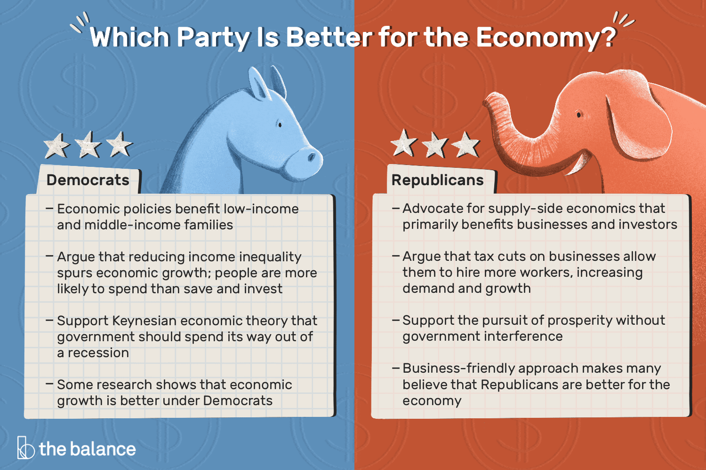

## Table of Contents

## What are the basic differences between Republican and Democratic approaches to economic regulation?

Republicans and Democrats have different views on how the government should regulate the economy. Republicans usually believe in less government control. They think that businesses should be free to make their own decisions without a lot of rules from the government. They believe this helps the economy grow because businesses can be more creative and efficient. Republicans also support lower taxes, especially for businesses and wealthy people, thinking that this will encourage them to invest more money and create jobs.

On the other hand, Democrats believe that the government should play a bigger role in regulating the economy. They think that rules are needed to make sure businesses act fairly and don't harm workers or the environment. Democrats support higher taxes on wealthy people and businesses to help pay for programs that help everyone, like healthcare and education. They believe that this approach helps to reduce inequality and make sure everyone has a fair chance to succeed.

In summary, the main difference is that Republicans favor a free-market approach with less regulation and lower taxes, while Democrats support more government involvement, regulation, and higher taxes to promote fairness and equality.

## How do Republicans typically view the role of government in the economy?

Republicans usually believe that the government should not control the economy too much. They think that businesses should be free to make their own choices without a lot of rules from the government. This, they believe, helps the economy grow because businesses can be more creative and efficient. Republicans also support lower taxes, especially for businesses and wealthy people. They think that if taxes are low, businesses and rich people will invest more money and create more jobs.

In short, Republicans want the government to have a small role in the economy. They believe that when the government stays out of the way, the economy does better. This means fewer regulations and lower taxes, which they think leads to more growth and more jobs.

## What is the Democratic perspective on government intervention in the economy?

Democrats believe that the government should play a big role in the economy. They think the government should make rules to make sure businesses treat workers and the environment fairly. Democrats want the government to help everyone, not just the rich. They believe that if the government steps in, it can stop businesses from doing things that hurt people or the planet.

Democrats also support higher taxes on rich people and big businesses. They think this money should be used to help pay for things like healthcare and education for everyone. Democrats believe that when the government uses taxes to help everyone, it makes society more equal. They think this way, everyone gets a fair chance to succeed, not just those who already have a lot of money.

## Can you explain how Republican policies affect business regulations?

Republicans usually want fewer rules for businesses. They think that if the government doesn't control businesses too much, companies can be more creative and make more money. This, they believe, helps the whole economy grow because businesses can do things their own way without a lot of paperwork and restrictions. Republicans believe that when businesses have more freedom, they can create more jobs and make things cheaper for everyone.

Republicans also think that lower taxes help businesses. They believe that if businesses and rich people pay less in taxes, they will have more money to invest in new projects and hire more workers. This can lead to more jobs and more growth in the economy. Overall, Republicans want the government to step back and let businesses run more freely, thinking this will make the economy stronger and better for everyone.

## How do Democratic policies aim to protect consumers through economic regulation?

Democrats believe that the government should make rules to keep businesses from hurting consumers. They think that without these rules, companies might sell unsafe products or charge too much money. Democrats want the government to check that products are safe before they are sold. They also want rules to stop businesses from tricking people with false ads. This way, consumers can trust that what they buy is safe and that they are getting a fair deal.

Democrats also want the government to make sure that big companies don't take advantage of their power. They think that if a few big companies control everything, they might raise prices and make it hard for new businesses to start. Democrats support rules that stop big companies from working together to keep prices high. They believe these rules help keep the market fair for everyone, so consumers can get good products at fair prices.

## What historical examples illustrate Republican economic regulation strategies?

During the 1920s, under Republican Presidents Warren G. Harding and Calvin Coolidge, the government followed a policy called "laissez-faire." This means they did not make many rules for businesses. They believed that if businesses were free to do what they wanted, the economy would grow. They also lowered taxes for rich people and companies. This time is known as the "Roaring Twenties" because the economy was doing very well. But some people think that not having enough rules helped cause the Great Depression in 1929.

Another example is during the presidency of Ronald Reagan in the 1980s. Reagan believed in a policy called "Reaganomics." This meant cutting taxes a lot, especially for rich people and businesses. He also wanted to get rid of many rules that told businesses what they could and couldn't do. Reagan thought this would make the economy grow faster. Many people think it did help the economy for a while, but it also made the gap between rich and poor people bigger.

## What are some case studies of Democratic economic regulation in action?

During the presidency of Franklin D. Roosevelt in the 1930s, the government made a lot of new rules to help fix the economy after the Great Depression. Roosevelt's plan was called the New Deal. It had many new laws to help people who lost their jobs and to make sure businesses treated workers fairly. One big law was the Social Security Act, which gave money to old people and helped people who couldn't work. Another law was the Wagner Act, which let workers join unions to fight for better pay and working conditions. Democrats believed these rules helped protect people and made the economy stronger.

Another example is during the presidency of Barack Obama. After the financial crisis in 2008, Obama and the Democrats made a law called the Dodd-Frank Act. This law made new rules for banks and big financial companies to stop them from taking big risks that could hurt the economy. The law also created a new group called the Consumer Financial Protection Bureau, which made sure banks and other companies didn't trick people with money. Democrats believed these rules would keep the economy safe and protect regular people from being hurt by big businesses.

## How do Republicans and Democrats differ in their approach to financial regulation?

Republicans think the government should not make too many rules for banks and financial companies. They believe that if these businesses are free to do what they want, they can help the economy grow. Republicans want lower taxes for banks and rich people too. They think this will make banks want to lend more money to people and businesses, which can create more jobs. Republicans worry that too many rules can slow down the economy and stop businesses from being creative and successful.

Democrats believe the government should make strict rules for banks and financial companies. They think these rules are needed to stop banks from taking big risks that could hurt the economy. Democrats also want the government to watch over banks to make sure they treat people fairly. They support higher taxes on rich people and big banks to help pay for programs that help everyone. Democrats think these rules and taxes can make the economy more stable and fair for everyone, not just the rich.

## What are the expert opinions on the effectiveness of Republican economic deregulation?

Some experts believe that Republican economic deregulation can help the economy grow. They think that when the government makes fewer rules for businesses, companies can be more creative and make more money. This can lead to more jobs and a stronger economy. For example, during the 1980s under President Ronald Reagan, many rules were taken away, and the economy did grow for a while. These experts argue that less government control lets businesses do what they do best without being slowed down by red tape.

However, other experts worry that too much deregulation can cause problems. They point out that without enough rules, businesses might take big risks that can hurt the economy. The financial crisis in 2008 is often mentioned as an example of what can go wrong when there are not enough rules. These experts believe that some rules are needed to keep the economy safe and make sure businesses treat people fairly. They think that while deregulation can help in some ways, it needs to be balanced with enough oversight to prevent big problems.

## How have Democratic economic regulations influenced income inequality?

Democrats believe that making rules for businesses can help make income inequality smaller. They think that if the government makes sure businesses pay workers fairly and don't hurt the environment, it can help everyone have a better chance. For example, during Franklin D. Roosevelt's time, the New Deal made laws like the Social Security Act, which gave money to old people and helped those who couldn't work. These rules helped many people who were poor and made the gap between rich and poor smaller.

However, some people think that Democratic rules can also make it harder for businesses to grow. They say that if businesses have to follow too many rules, they might not be able to create as many jobs or make as much money. This could mean that even though the rules try to help, they might not always make income inequality smaller. It's a tricky balance, and experts have different opinions on how well these rules work to make things more equal.

## What are the long-term economic impacts of Republican and Democratic regulatory approaches?

Republican policies that favor less government control and lower taxes can lead to a strong economy in the short term. When businesses have fewer rules to follow, they can be more creative and make more money. This can create more jobs and help the economy grow quickly. However, some experts worry that without enough rules, businesses might take big risks that can hurt the economy in the long run. The financial crisis in 2008 is an example of what can happen when there are not enough rules. Over time, less regulation might make the gap between rich and poor people bigger because businesses and rich people can keep more of their money.

Democratic policies that support more government rules and higher taxes aim to make the economy more fair and stable over time. By making sure businesses treat workers and the environment well, Democrats believe they can help everyone have a better chance to succeed. Programs like Social Security and rules that stop big companies from taking advantage of people can make income inequality smaller. However, some people think that too many rules can slow down the economy and make it harder for businesses to grow. It's a balance, and experts have different opinions on which approach works better in the long run.

## How do international economic policies influence Republican and Democratic regulatory strategies?

Republicans often look at what other countries are doing and want the U.S. to be competitive. They think that if other countries have fewer rules for businesses, the U.S. should too. This way, American businesses can make more money and create more jobs. Republicans believe that if the U.S. has too many rules, businesses might move to other countries where it's easier to make money. So, they want to keep taxes low and rules simple to make sure the U.S. stays a good place for businesses.

Democrats also care about what other countries are doing, but they think the U.S. should lead by making fair rules. They believe that if the U.S. makes good rules for businesses, other countries might follow. Democrats want to make sure American businesses treat workers and the environment well, even if other countries don't have the same rules. They think this can help the whole world be fairer and safer. Democrats also support working with other countries to make global rules that protect everyone, not just the rich.

## References & Further Reading

[1]: Blinder, A. S., & Watson, M. W. (2016). ["Presidents and the U.S. Economy: An Econometric Exploration."](https://www.nber.org/papers/w20324) American Economic Review.

[2]: Mulligan, C. B. (2015). ["Fiscal Policies and the Democratic Economy: A Comparison with Republican Strategies."](https://www.sciencedirect.com/science/article/pii/S0922142596002368) Journal of Economic History.

[3]: "Advances in Financial Machine Learning" by Marcos Lopez de Prado. Available at [Amazon](https://www.amazon.com/Advances-Financial-Machine-Learning-Marcos/dp/1119482089).

[4]: "Quantitative Trading: How to Build Your Own Algorithmic Trading Business" by Ernest P. Chan. Available at [Amazon](https://www.amazon.com/Quantitative-Trading-Build-Algorithmic-Business/dp/0470284889).

[5]: Jones, C. M. (2013). ["What Do We Know About High-Frequency Trading?"](https://papers.ssrn.com/sol3/papers.cfm?abstract_id=2236201) Financial Analysts Journal.

[6]: Carstens, A. (2020). ["The Rise of Algorithmic Trading: Impacts on Markets and Regulatory Challenges."](https://www.researchgate.net/publication/378548435_Algorithmic_Trading_and_AI_A_Review_of_Strategies_and_Market_Impact) Bank for International Settlements.