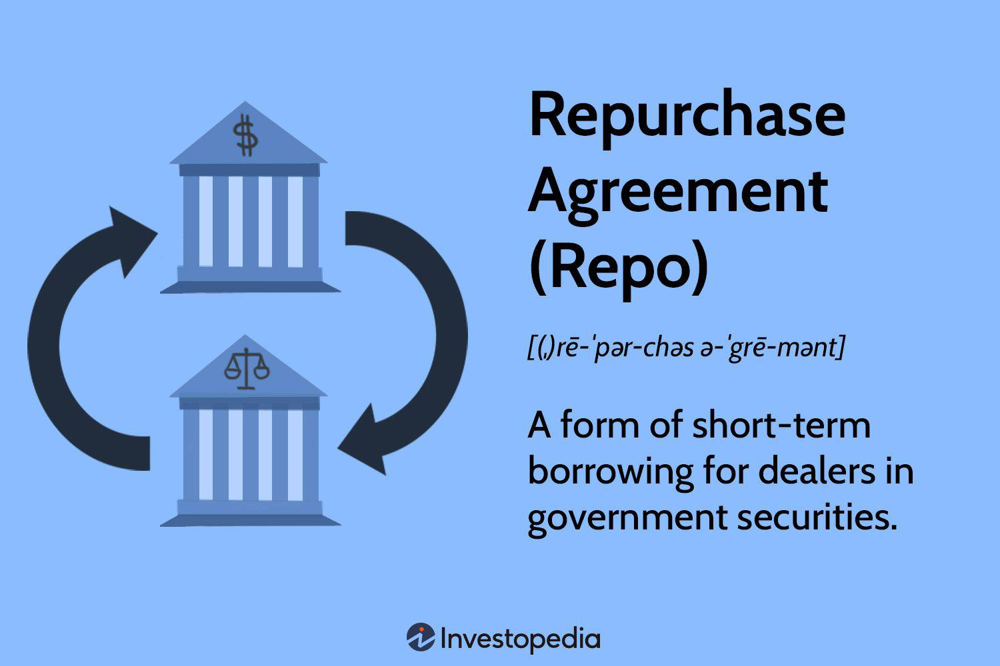

## Table of Contents

## What is a repurchase agreement (repo)?

A repurchase agreement, often called a repo, is a short-term borrowing tool used mainly by banks and other financial institutions. In a repo, one party sells a security to another party with the agreement to buy it back at a later date, usually the next day, at a slightly higher price. The difference between the selling price and the buying price is essentially the interest on the loan.

Repos are important because they help banks manage their cash flow and meet their short-term funding needs. They are considered safe because the loan is backed by the security, which acts as collateral. If the borrower fails to repurchase the security, the lender can keep it. This makes repos a popular choice for banks looking for quick and secure ways to borrow money.

## How does a repurchase agreement work?

A repurchase agreement, or repo, is like a short-term loan between two parties, usually banks or financial institutions. One party sells a security, like a bond, to the other party. At the same time, they agree to buy it back later, often the next day. The price to buy it back is a bit higher than the selling price. This difference is the interest on the loan. It's a quick way for banks to get cash they need for a short time.

The security that's sold acts like a safety net for the lender. If the borrower can't buy the security back, the lender keeps it. This makes repos a safe way to borrow money because the loan is backed by something valuable. Repos help banks manage their money better and meet their short-term needs without much risk.

## What are the key components of a repurchase agreement?

A repurchase agreement, or repo, has a few main parts that make it work. First, there's the security, which is like a bond or other valuable thing that one party sells to the other. This security acts as a safety net or collateral for the loan. Second, there's the sale price, which is how much the security is sold for at the start. This is important because it sets the base for the loan.

Then, there's the repurchase price, which is the amount the original seller agrees to pay to buy back the security. This price is higher than the sale price, and the difference between them is the interest on the loan. Finally, there's the term or duration of the repo, which is how long the agreement lasts before the security needs to be bought back. This is usually very short, often just overnight, but can be longer. These parts together make a repo a useful tool for quick and safe borrowing.

## What are the different types of repurchase agreements?

There are a few types of repurchase agreements, or repos. The first type is called an overnight repo. This is the most common kind and lasts for just one day. A bank sells a security to another bank and agrees to buy it back the next day at a slightly higher price. This is a quick way for banks to get cash they need for a very short time.

Another type is a term repo. This lasts for a longer time, maybe a few days, weeks, or even months. The bank still sells a security and agrees to buy it back later, but the time is set longer than just overnight. Term repos are useful when a bank knows it will need money for a longer period.

The last type is an open repo. This doesn't have a set end date. The agreement stays open until one of the parties decides to end it. Open repos give more flexibility because the bank can keep the loan going as long as it needs to, and end it when it's ready.

## Who are the typical participants in repurchase agreements?

The main players in repurchase agreements, or repos, are banks and other financial institutions. These include big banks, smaller banks, investment banks, and even central banks like the Federal Reserve. They use repos to borrow or lend money quickly and safely. For example, a bank might sell a bond to another bank and agree to buy it back later. This helps the first bank get cash it needs right away.

Other participants can be money market funds and other types of investors. These groups might lend money to banks through repos because they see it as a safe way to earn a little interest. The security, like a bond, acts as a safety net for the lender. So, if the bank can't pay back the money, the lender can keep the bond. This makes repos a popular choice for all these players in the financial world.

## What are the benefits of using repurchase agreements?

Repurchase agreements, or repos, offer several benefits to banks and other financial institutions. One big benefit is that they provide quick access to cash. Banks can sell a security, like a bond, to another bank and agree to buy it back later. This helps them get the money they need right away, often overnight. It's like a short-term loan that helps banks manage their cash flow smoothly.

Another benefit is that repos are very safe. The security that's sold acts as a safety net or collateral for the loan. If the bank can't buy the security back, the lender gets to keep it. This makes repos less risky than other kinds of loans. Plus, because repos are often short-term, banks can use them to meet their immediate needs without worrying about long-term commitments.

## What are the risks associated with repurchase agreements?

Even though repurchase agreements, or repos, are considered safe, they do come with some risks. One risk is that the value of the security used as collateral might drop suddenly. If this happens, the lender might find that the security isn't worth enough to cover the loan if the borrower can't pay it back. This is called a "haircut" risk, where the lender might need to sell the security at a loss.

Another risk is that the borrower might not be able to buy back the security. This could happen if the borrower runs into financial trouble. If the borrower can't pay, the lender might be stuck with the security, which might not be easy to sell quickly. This can tie up the lender's money and cause problems. So, while repos are generally safe, these risks mean that both parties need to be careful and keep an eye on the market.

## How are repurchase agreements used in monetary policy?

Repurchase agreements, or repos, are used by central banks like the Federal Reserve to control the amount of money in the economy. When the central bank wants to add more money to the economy, it can buy securities from banks with an agreement to sell them back later. This gives banks more cash to lend out, which can help the economy grow. On the other hand, if the central bank wants to take money out of the economy to slow things down, it can sell securities to banks with a repurchase agreement. This takes cash away from banks, making them lend less.

Central banks also use repos to manage short-term interest rates. By setting the terms of the repo, like the interest rate and the amount of money involved, the central bank can influence the rates that banks charge each other for short-term loans. This helps the central bank keep the economy stable. For example, if the central bank wants to lower interest rates, it might offer repos at a lower rate, encouraging banks to borrow more and lend at lower rates too.

## What is the difference between a repurchase agreement and a reverse repurchase agreement?

A repurchase agreement, or repo, is when a bank sells a security to another bank and agrees to buy it back later at a higher price. This is like a short-term loan where the selling bank gets cash quickly and the buying bank earns a bit of interest. The security, like a bond, acts as a safety net for the loan. If the selling bank can't buy the security back, the buying bank keeps it.

A reverse repurchase agreement, or reverse repo, is the other side of the same deal. It's when a bank buys a security from another bank with the agreement to sell it back later. So, in a reverse repo, the bank that buys the security is lending money, and the bank that sells it is borrowing money. Both repos and reverse repos are used by banks to manage their cash and meet their short-term needs, but they just look at the deal from different angles.

## How do repurchase agreements affect liquidity in financial markets?

Repurchase agreements, or repos, help make money flow more easily in financial markets. When banks use repos, they can quickly turn their securities, like bonds, into cash. This is good because it lets banks have more money to lend to businesses and people. More lending means more money moving around in the economy, which helps keep things running smoothly. Central banks also use repos to add or take away money from the economy, which helps them control how much cash is out there.

But repos can also make things tricky if not used carefully. If too many banks rely on repos for quick cash, it might lead to problems if something goes wrong, like if the value of the securities drops suddenly. This could make it hard for banks to get the money they need, which might slow down the economy. So, while repos help keep money flowing and markets liquid, they need to be managed well to avoid big problems.

## What role do repurchase agreements play in the shadow banking system?

Repurchase agreements, or repos, are a big part of the shadow banking system. This system is made up of banks and other financial groups that work outside the usual rules that regular banks follow. They use repos to borrow and lend money quickly and easily. For example, a bank might sell a bond to another bank with the promise to buy it back later. This helps them get cash fast without going through the normal banking system.

In the shadow banking system, repos can help keep money moving smoothly. But they can also make things risky. If too many groups rely on repos and something goes wrong, like the value of the bonds dropping suddenly, it might cause big problems. This could make it hard for these groups to get the money they need, which might slow down the economy. So, while repos help keep the shadow banking system going, they need to be watched closely to make sure they don't cause trouble.

## How are repurchase agreements regulated and what are the recent regulatory changes?

Repurchase agreements, or repos, are watched over by rules to make sure they are used safely. In the United States, the main rule maker is the Securities and Exchange Commission (SEC). They make sure that banks and other financial groups follow the rules when they use repos. Another important group is the Federal Reserve, which can set rules for how repos are used in the bigger money system. These rules help keep the financial world stable and safe.

In recent years, there have been some big changes to the rules about repos. After the big financial crisis in 2008, people saw that repos could be risky if not used carefully. So, new rules were made to make repos safer. One big change was the Dodd-Frank Act, which made banks keep more money on hand and use less risky ways to borrow. Also, the SEC made new rules in 2021 to make sure that the money used in repos is safer and easier to keep track of. These changes help make sure that repos don't cause big problems in the future.

## References & Further Reading

[1]: Gorton, G., & Metrick, A. (2012). ["Securitized Banking and the Run on Repo."](https://www.sciencedirect.com/science/article/pii/S0304405X1100081X) Journal of Financial Economics, 104(3), 425-451.

[2]: ["Advances in Financial Machine Learning"](https://www.amazon.com/Advances-Financial-Machine-Learning-Marcos/dp/1119482089) by Marcos Lopez de Prado

[3]: ["Quantitative Trading: How to Build Your Own Algorithmic Trading Business"](https://www.amazon.com/Quantitative-Trading-Build-Algorithmic-Business/dp/1119800064) by Ernest P. Chan

[4]: Fleming, M. J., & Garbade, K. D. (2002). ["When the Back Office Moved to the Front Burner: Settlement Fails in the Treasury Market after 9/11."](https://www.newyorkfed.org/research/epr/02v08n2/0211flem.html) Federal Reserve Bank of New York Economic Policy Review.

[5]: Chaboud, A. P., Chiquoine, B., Hjalmarsson, E., & Vega, C. (2013). ["Rise of the Machines: Algorithmic Trading in the Foreign Exchange Market."](https://papers.ssrn.com/sol3/papers.cfm?abstract_id=1501135) Journal of Finance, 69(5), 2045-2084.