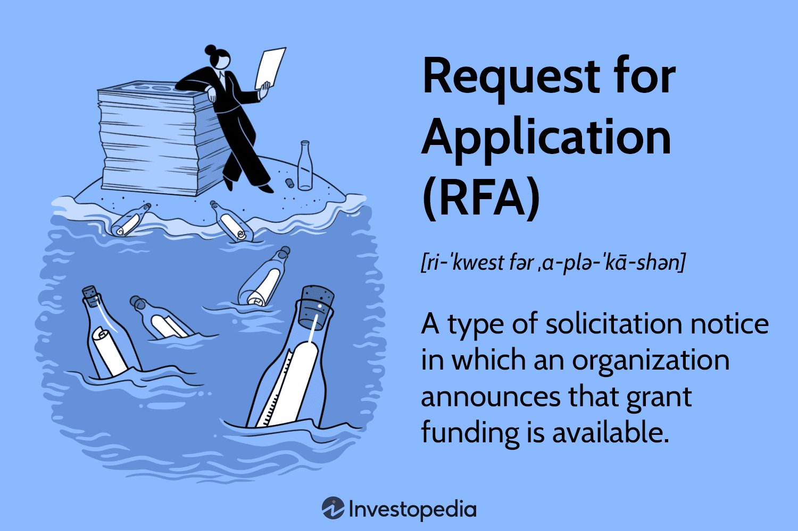

In the rapidly changing financial landscape, securing funding has become imperative, especially in sectors that demand constant innovation, such as algorithmic trading. Algorithmic trading utilizes complex algorithms and high-frequency trading systems to make decisions on the purchasing and selling of securities. This sector relies heavily on cutting-edge technology and research, which requires significant financial investment.

Government grants emerge as a crucial financial resource for traders and institutions embarking on ambitious algorithmic trading projects. Unlike traditional loans, these grants do not burden recipients with repayment obligations, thus providing a financial incentive to push the boundaries of innovation. By eliminating the pressure of debt, these grants enable firms to allocate resources effectively towards research and development, fostering an environment conducive to major technological advancements.

Understanding and navigating the grant application process is paramount for traders and financial institutions aspiring to capitalize on these governmental opportunities. Securing funding through grants can fuel the development of sophisticated trading systems, thereby enhancing efficiency and boosting competitiveness. Those who skillfully maneuver through the intricacies of grant proposals and align their projects with funding priorities can secure substantial advantages, positioning themselves at the forefront of financial technology advancements.

## Table of Contents

## Understanding Government Grants

Government grants are financial allocations made by governmental entities at various levels—federal, state, or local—to support projects that promise to benefit society in specific ways. These grants are structured to foster innovation and development across a multitude of sectors, from education and healthcare to technology and, increasingly, financial services such as algorithmic trading. The fundamental advantage of these grants, distinguishing them from loans, is that they do not necessitate repayment. This non-reciprocal nature makes grants particularly attractive for projects with substantial risks and potential for high returns, such as those involving cutting-edge algorithmic strategies in trading.

These grants function as catalysts, enabling individuals and organizations to pursue ambitious initiatives without the looming pressure of financial liability associated with traditional financing methods. By alleviating some of the financial burdens, government grants can encourage the allocation of resources toward research and development that might otherwise be deemed too financially risky. For instance, in the technology sector, grants can support the creation and testing of new algorithms, thereby facilitating advancements that can lead to greater efficiency and liquidity in financial markets.

The role of government grants also extends to leveling the playing field among various-sized entities. Smaller firms or startups in fields like algorithmic trading may not have access to the same financial resources as larger, established companies. Grants can provide them with the necessary capital to invest in the technology and manpower needed to develop competitive trading algorithms. Hence, these funds help democratize access to technological advancement, ensuring that innovation is not limited to organizations with significant capital reserves.

At a structural level, the grant application and awarding process are designed to ensure that funds are directed towards projects with clear, measurable benefits. This often involves a rigorous vetting process where applicants must illustrate how their projects align with the broader objectives defined by the funding body. As a result, the allocation of government grants not only aims to push forward technological and industrial advancement but also ensures that these advancements are aligned with the public interest. By incentivizing projects that promise widespread societal benefits, government grants contribute to a continuous cycle of innovation and improvement within the economy.

## The Grant Application Process

Identifying suitable grant opportunities is the initial step in the grant application process. This is often facilitated through comprehensive databases like [Grants.gov](https://www.grants.gov/), which provide access to a wide range of federal funding opportunities. These platforms enable potential applicants to filter grants by category, agency, eligibility, and other criteria, ensuring they find opportunities that align with their project's objectives.

Once a grant opportunity is identified, the next step involves crafting a detailed proposal. This proposal is a critical component, as it outlines the project's objectives, scope, and methodology. Applicants must ensure that the proposal clearly articulates how the project aligns with the goals of the funding agency and highlights the anticipated positive impacts. This might include advancements in technology, economic benefits, or social improvements.

The budget outline is another essential part of the application. It provides a transparent and detailed account of how the funds will be allocated across various project components. This includes direct costs such as personnel, equipment, and materials, as well as indirect costs that might arise. Ensuring that the budget is realistic and well-justified is key to convincing the grant reviewers of the project's feasibility and merit.

Supporting documentation is also required to substantiate the claims made in the proposal and budget. This can include letters of support, institutional endorsements, previous project outcomes, and credentials of the project team. All documentation should be organized and presented coherently to facilitate the review process.

A successful grant application will effectively link the project objectives with the funding body's mission and goals. Demonstrating the project's potential positive impacts, such as enhancing market efficiency in [algorithmic trading](/wiki/algorithmic-trading) or increasing access to innovative technologies, can significantly strengthen the application. By aligning their proposal with these objectives and outlining clear, achievable impacts, applicants can improve their chances of securing the necessary funding to advance their projects.

## Importance of Grants in Algorithmic Trading

Algorithmic trading, which employs automated systems to execute trading decisions, is an increasingly vital component of modern financial markets. This form of trading relies heavily on advanced technology, sophisticated mathematical models, and continual innovation to maintain an edge in highly competitive environments. As such, it requires substantial investment, particularly in research and development, to create and refine the algorithms that underpin trading strategies.

Government grants play a crucial role in supporting these investments. By providing funding without the burden of repayment, grants can significantly lower entry barriers for smaller institutions and startups, enabling them to compete with larger, more established entities. This democratization of access to financial resources encourages a more vibrant and competitive marketplace, fostering diversity in thought and innovation.

Funding from grants facilitates the development of new trading algorithms, which can improve market efficiency. These algorithms often incorporate cutting-edge technologies such as [machine learning](/wiki/machine-learning) and [artificial intelligence](/wiki/ai-artificial-intelligence) to analyze vast amounts of data and identify trading opportunities at speeds and accuracies unattainable by human traders. As a result, they enhance [liquidity](/wiki/liquidity-risk-premium), as trades are executed more quickly and efficiently, benefiting the market as a whole.

Furthermore, the development of innovative algorithms supported by grant funding can lead to the discovery of new trading strategies that reduce risks and improve returns, thus contributing to the overall stability of financial markets. For instance, grants can enable traders to work on projects that explore the integration of [alternative data](/wiki/best-alternative-data) sources or the application of advanced statistical techniques, which may yield novel insights and strategies.

Ultimately, through the targeted support of algorithmic trading initiatives, government grants can catalyze advances in technology and contribute to the robustness and efficiency of global financial markets. This approach not only benefits individual institutions but also enhances the entire trading ecosystem, promoting a more efficient allocation of capital and fostering economic growth.

## Strategies for Successful Grant Applications

To secure a government grant effectively, tailoring applications to meet the specific criteria of grant-making agencies is essential. Each funding agency has unique priorities and guidelines, so carefully reviewing the specific criteria of each grant program is crucial. This involves a thorough analysis of the grant announcement and understanding the focus areas that are emphasized by the funding body. This targeted approach ensures that proposals are relevant and directly address the priorities and goals outlined by the granting agency.

Engaging professional grant writers can significantly enhance the quality and persuasiveness of a grant application. These experts are skilled in articulating the technical aspects of a project, providing clarity and precision that can be highly persuasive. They also adeptly present the broader impacts of the project, aligning them with the strategic goals of the grant-funding agency. By incorporating their expertise, applications are likely to communicate effectively the project's technical feasibility and its potential benefits, increasing the chances of a favorable evaluation.

Highlighting the potential economic and social benefits of projects is another pivotal strategy for strengthening grant applications. Decision-makers often consider the anticipated return on investment, not just in monetary terms but also in societal impacts. Demonstrating how a project could lead to job creation, economic growth, or societal advancements can significantly bolster an application's appeal. For instance, outlining the positive societal impact of a new algorithmic trading platform, such as increased market efficiency or improved financial inclusivity, can provide compelling reasons for grant approval.

In conclusion, a successful grant application strategy hinges on aligning the proposal with the grant agency’s specific criteria, employing the expertise of professional grant writers, and showcasing the project's broader economic and social impacts. This comprehensive approach enhances the probability of securing funding, ensuring that the application not only meets the technical requirements but also resonates with the evaluative body's strategic goals.

## Challenges and Considerations

The grant application process for algorithmic trading projects is inherently competitive, necessitating a thorough and strategic approach. Applicants must meticulously prepare their proposals, ensuring they align closely with both the specific criteria outlined by the grant-making agencies and the broader objectives aimed at fostering technological innovation.

A significant consideration for successful applicants is post-award compliance, which is integral to maintaining eligibility for current and future funding. This involves the submission of regular progress reports and detailed financial documentation to depict the clear use and management of funds. Such transparency not only supports ongoing accountability to the grant provider but also serves as a record of project milestones and fiscal responsibility. Failure to adhere to these reporting requirements can lead to the revocation of funds and negatively affect an institution's reputation and eligibility for subsequent grants.

Furthermore, applicants must navigate the landscape of potential scams posing as legitimate funding opportunities. These fraudulent schemes can manifest as deceptive emails or websites mimicking genuine grant sources, attempting to collect personal or financial information under the guise of providing funding. Vigilance is key; prospective applicants should verify the authenticity of grant opportunities by cross-referencing with official government databases such as Grants.gov. It is advisable to follow up with direct inquiries to the respective agencies to confirm legitimacy.

The competitive nature of the grant process, coupled with the rigorous demands of compliance, underscores the importance of thorough preparation and due diligence. By maintaining awareness of these challenges and considerations, algorithmic trading entities can position themselves effectively to secure funding, thereby fostering innovation and maintaining competitive edges in the financial markets.

## Conclusion

Government grants play a significant role in the advancement of algorithmic trading technologies by providing financial support without the burden of repayment. This support enables traders and institutions to innovate and capture new market opportunities. The competitive nature of the grant application process requires applicants to engage in meticulous preparation, ensuring their proposals align with the funding body's objectives and demonstrate potential positive impacts on the industry.

For successful applicants, the advantages are substantial. Access to government funding can lower entry barriers, particularly for smaller institutions, allowing them to invest in computing power, research, and the development of cutting-edge algorithms. This fosters enhanced market efficiency and liquidity, contributing to a more dynamic trading environment. For instance, grants can support the exploration of machine learning models in trading strategies, optimizing trade executions and risk management.

To maximize the benefits of government grants, applicants must adhere to rigorous compliance standards, including regular progress reporting and financial documentation. Compliance ensures the credibility of the project and aligns ongoing developments with grant objectives. Moreover, a diligent approach to grant procurement can open doors to further funding opportunities, creating a cycle of innovation and development within the financial sector.

By leveraging government grants, traders and institutions can secure the capital needed to push technological boundaries and maintain competitiveness in an ever-evolving market landscape. This strategic approach not only advances individual projects but also contributes to broader economic growth and technological progress.

## References & Further Reading

[1]: ["Grant Writing For Dummies"](https://www.dummies.com/article/business-careers-money/business/nonprofits/grant-writing-for-dummies-cheat-sheet-207734/) by Beverly A. Browning

[2]: ["Winning Grants Step by Step: The Complete Workbook for Planning, Developing and Writing Successful Proposals"](https://www.amazon.com/Winning-Grants-Step-Developing-Jossey-Bass/dp/1119547342) by Tori O'Neal-McElrath

[3]: ["Advances in Financial Machine Learning"](https://www.amazon.com/Advances-Financial-Machine-Learning-Marcos/dp/1119482089) by Marcos Lopez de Prado

[4]: ["Grant Application Writer's Handbook"](https://www.amazon.com/Grant-Application-Writers-Handbook-Reif-Lehrer/dp/0763716421) by Liane Reif-Lehrer

[5]: ["Machine Learning for Algorithmic Trading: Predictive models to extract signals from market and alternative data for systematic trading strategies with Python"](https://www.amazon.com/Machine-Learning-Algorithmic-Trading-alternative/dp/1839217715) by Stefan Jansen

[6]: ["Algorithmic Trading and DMA: An introduction to direct access trading strategies"](https://www.amazon.com/Algorithmic-Trading-DMA-introduction-strategies/dp/0956399207) by Barry Johnson