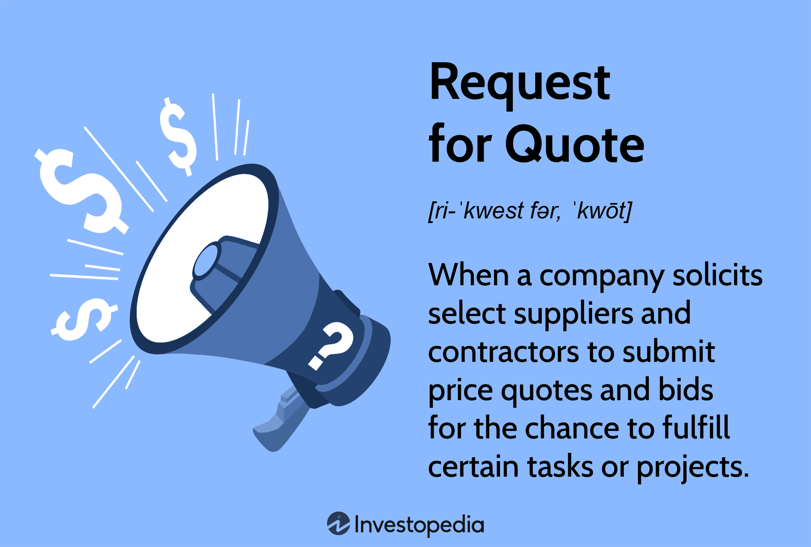

In today's fast-paced financial markets, trading mechanisms play a crucial role in maintaining liquidity and transparency. Request for Quotes (RFQ) trading is a pivotal component in these markets, particularly within over-the-counter (OTC) venues. RFQ trading allows institutional traders to interact directly with multiple liquidity providers, facilitating the execution of large, complex trades. Unlike traditional order book systems, which can be less flexible and efficient for large transactions, RFQ systems cater to bespoke trading requirements, allowing for tailored pricing and improved trade execution.

The significance of RFQ trading lies not only in its tailored approach but also in its capacity to enhance market liquidity and transparency. By involving multiple liquidity providers in the pricing process, RFQ trading fosters a competitive environment that often results in better pricing, particularly for trades involving significant volumes. This competitive pricing is crucial for institutional traders who require precise and efficient execution of trades to meet investment objectives.



This article explores the workings and benefits of RFQ trading and its application within the financial industry, particularly through algorithmic trading strategies. Readers will gain a comprehensive understanding of why RFQ is a preferred choice for many institutional traders seeking efficiency, liquidity, and price competitiveness in the dynamic arena of financial markets. As the financial landscape continues to evolve, mastering RFQ trading mechanisms will be paramount for traders aiming to optimize their strategies and enhance trade outcomes.

## Table of Contents

## What is Request for Quote (RFQ) Trading?

Request for Quote (RFQ) trading is a mechanism primarily used in over-the-counter (OTC) markets, where the complexity and customization of trades require an efficient and flexible approach that traditional order book systems cannot offer. In RFQ trading, traders reach out to multiple liquidity providers to request quotes for a specific financial instrument. This process involves submitting a request that outlines the desired instrument and trade details to a network of liquidity providers, who then respond with their respective price quotes.

RFQ trading is particularly advantageous for trades involving substantial volumes, as it allows traders to secure the best possible pricing by comparing different offers from various liquidity providers. The RFQ mechanism enhances the ability of traders to make informed decisions by offering them a snapshot of current market conditions, enabling them to assess competitive prices before executing a trade.

The flexibility inherent in an RFQ system is a key benefit that differentiates it from traditional order book systems. While order [books](/wiki/algo-trading-books) require traders to adhere to the current bid and ask prices listed, RFQ trading offers a more tailored approach. By engaging directly with multiple liquidity providers, traders can negotiate and potentially achieve more favorable terms, leading to more efficient trade executions.

In essence, RFQ trading facilitates a more dynamic and interactive method of trading that aligns well with the requirements of modern financial markets, especially within the OTC space. It empowers traders by providing them with multiple pricing options and the ability to execute large trades with reduced market impact and increased confidence.

## The RFQ Process in Algorithmic Trading

The RFQ process in [algorithmic trading](/wiki/algorithmic-trading) begins with traders selecting the financial instrument they wish to trade. This crucial decision is guided by factors including market conditions, portfolio diversification strategies, and risk management plans. Once a trader identifies the target instrument, they proceed to submit a request for quotes to a network of [liquidity](/wiki/liquidity-risk-premium) providers via an electronic trading platform.

When the quote request is made, it is broadcast to multiple liquidity providers. These entities, which may include large financial institutions, market makers, or specialized trading firms, respond with binding quotes. A significant advantage of RFQ trading is the ability to obtain multiple competitive bids, which are then displayed on the trading platform for the trader's evaluation.

Traders must then analyze the available quotes. This assessment involves comparing the quoted prices and associated terms to determine the most favorable offer. An algorithmic approach can streamline this process by implementing decision-making criteria that automatically select the optimal quote. For instance, an algorithm could be programmed in Python to parse through quotes and evaluate them based on criteria such as price, [volume](/wiki/volume-trading-strategy), and provider reliability:

```python
def select_best_quote(quotes):
    # Example criteria: minimizing price
    best_quote = min(quotes, key=lambda quote: quote['price'])
    return best_quote

# Example usage
quotes = [
    {'provider': 'A', 'price': 100.5},
    {'provider': 'B', 'price': 99.75},
    {'provider': 'C', 'price': 101.0}
]

best_quote = select_best_quote(quotes)
print("Best quote selected from provider:", best_quote['provider'])
```

Once a decision is made, the trade is executed based on the selected quote. The transaction process follows with settlement and post-trade activities to finalize the trade. Settlement typically involves the transfer of the financial instrument from the seller to the buyer and the corresponding payment, possibly through a clearinghouse in many OTC markets. Post-trade processes may include reconciliation and recording in trade databases to ensure compliance and transparency obligations are met. This structured sequence of activities ensures the integrity and efficiency of the RFQ trading process in an algorithmic context.

## Benefits of RFQ Trading in Algorithmic Contexts

In the context of algorithmic trading, Request for Quote (RFQ) trading holds several advantages that contribute to improved pricing, market liquidity, and transparency. One of the primary benefits is its ability to secure better pricing, particularly for large volume trades. By soliciting price quotes from multiple liquidity providers, traders can obtain competitive rates that might not be available in traditional [order book](/wiki/order-book-trading-strategies) systems. This multi-provider approach ensures that large trades are executed at optimal prices, mitigating the adverse effects of market impact.

Moreover, RFQ trading enhances market liquidity. Instead of relying on a single liquidity source, RFQ trading involves multiple providers in the pricing process. This not only increases the depth of available liquidity but also reduces the risk of significant price moves due to large orders. In essence, RFQ systems distribute the demand across a network of liquidity providers, broadening the financial market's ability to absorb large trades without destabilizing prices.

Traders benefit from considerable flexibility when engaging in RFQ trading. The system allows for direct negotiation of trade terms with liquidity providers, enabling traders to tailor trades according to their specific needs. This direct interaction can facilitate bespoke agreements that align with traders’ strategic objectives, providing an additional layer of control over trade execution.

Transparency is another significant advantage of RFQ trading. The RFQ process inherently involves comparing real-time competitive quotes submitted by different providers. This transparency not only empowers traders to make informed decisions based on the most favorable conditions but also instills confidence in the trading mechanism as a fair and open competitive environment. By having the capability to assess various offers simultaneously, traders can ensure they are achieving the best possible market prices. 

In summary, RFQ trading effectively balances the needs for competitive pricing, enhanced liquidity, and transparent trade execution, placing it as a strategic tool in the algorithmic trading arsenal.

## Key Use Cases for RFQ in Financial Markets

Request for Quotes (RFQ) trading is a versatile mechanism with significant applications across various financial markets. It is particularly prevalent in sectors where transaction sizes are usually substantial, and the need for customized trading solutions is paramount.

In the trading of fixed income securities, such as municipal bonds, RFQ trading plays a crucial role. These securities often involve large, intricate transactions that require precision and tailored pricing, attributes that RFQ platforms are well-equipped to offer. By obtaining multiple quotes from liquidity providers, traders can secure the most competitive pricing available for these non-standardized contracts.

RFQ trading is equally important in the commodities markets, where price certainty is vital, especially for high-value trades. For example, when a buyer needs to lock in a price for a substantial quantity of a commodity, an RFQ system allows them to request quotes from various suppliers, ensuring that they can purchase the commodity at the most favorable price. This process minimizes the uncertainty and [volatility](/wiki/volatility-trading-strategies) typically associated with commodity pricing.

In the foreign exchange ([FX](/wiki/fx-anomaly)) markets, RFQ systems are indispensable for achieving quick and favorable currency pair pricing. Given the global nature of FX trading, the ability to swiftly request and receive quotes is critical for executing trades at optimal rates. The RFQ system enables traders to efficiently navigate the complex landscape of currency markets and secure the best available rates without significant delays.

Within over-the-counter (OTC) markets, where transparency may be limited, RFQ trading aids significantly in price discovery. In these markets, standard order book visibility is often absent, making it challenging to ascertain real-time pricing. By soliciting quotes directly from liquidity providers, RFQ systems help bridge this gap, offering a mechanism for traders to gain insight into market pricing and execute trades with greater confidence.

In summary, RFQ trading is integral across various financial domains, providing crucial benefits such as customized pricing solutions, enhanced price certainty, and efficient price discovery. Its role in facilitating large transactions and offering transparency in less-liquid markets underscores its importance in the financial ecosystem.

## Advantages and Disadvantages of RFQ Trading

Request for Quotes (RFQ) trading is a notable method in financial markets, particularly for executing trades that involve large volumes and tailored specifications. One of the primary advantages of RFQ trading is its ability to provide tailored pricing. This customization stems from the competitive quotes solicited from a network of liquidity providers, allowing traders to select the most favorable terms. Such a mechanism is especially beneficial when orders are substantial, as RFQ trading can significantly reduce the market impact by executing these trades discreetly, away from the main order book.

An additional benefit of RFQ trading is its ability to facilitate efficient execution. By directly engaging multiple liquidity providers, traders can quickly compare and secure competitive prices, which is instrumental in optimizing trade execution times and ensuring that trades are settled at the best available prices. This competitive environment fosters improved pricing for large volume trades, enhancing the overall trading experience and outcome.

Despite these advantages, RFQ trading also presents certain disadvantages. One notable limitation is its reduced utility for smaller trades. The RFQ process, which involves soliciting bids from several providers, may not be cost-effective or time-efficient for smaller transactions where quick execution is often more critical than obtaining the absolute best price. Traders dealing with smaller quantities might find traditional trading mechanisms more suitable in such scenarios.

Another challenge is the reliance on liquidity provider responses. The efficiency and success of an RFQ transaction are contingent upon the availability and promptness of responses from liquidity providers. In circumstances where liquidity providers are unresponsive or slow to respond, the advantages of RFQ trading could diminish, potentially leading to missed trading opportunities or unfavorable price movements.

Understanding these pros and cons is crucial for traders aiming to optimize their strategies. By weighing the benefits of tailored pricing and efficient execution against the limitations regarding trade size and dependency on liquidity providers, market participants can better align their trading approaches with their specific needs and objectives.

## How FinchTrade Enhances RFQ Trading

FinchTrade enhances the Request for Quotes (RFQ) trading experience through its advanced platform, specifically designed for institutional clients. The platform facilitates real-time quote requests across a diverse range of digital assets, ensuring competitive pricing by leveraging advanced algorithms and technology. This system connects traders to an extensive network of liquidity providers, maximizing the opportunities for optimal trade execution.

One of the primary features of FinchTrade is its ability to offer transparent and efficient execution. By streamlining the process of obtaining and evaluating multiple quotes from liquidity providers, the platform significantly reduces the complexity and delays often associated with large transactions. This not only enhances the speed of execution but also lowers the counterparty risk, thereby increasing confidence among traders in the integrity and reliability of their transactions.

FinchTrade's platform is engineered to handle large volumes of data and provide real-time analytics, aiding traders in making informed decisions rapidly. The utilization of cutting-edge technology ensures that pricing is competitive and reflective of current market conditions. Additionally, the platform supports various digital assets, providing flexibility and adaptability to meet the diverse needs of institutional traders.

The robust infrastructure of FinchTrade also includes measures to ensure security and compliance with regulatory standards, further instilling trust in the platform's capabilities. Through its sophisticated RFQ platform, FinchTrade offers an exemplary solution for institutional clients seeking efficiency, transparency, and competitive pricing in RFQ trading.

## Conclusion

Request for Quote (RFQ) trading serves as an essential mechanism for executing large-scale trades with precision and efficacy. By enabling the solicitation of competitive quotes from multiple liquidity providers, RFQ trading significantly improves trading efficiency, enhances market liquidity, and ensures price competitiveness. This competitive landscape empowers traders to achieve optimal trade outcomes while minimizing market impact and transaction costs.

As financial markets continue to evolve and adapt, RFQ systems like those offered by FinchTrade are poised to become increasingly crucial. These platforms provide sophisticated tools that streamline the RFQ process, facilitate real-time communication with liquidity providers, and enhance the transparency of transactions. By integrating advanced technologies and robust networks, platforms like FinchTrade's allow traders to strategically optimize their trading operations.

Embracing cutting-edge RFQ platforms is vital for institutional traders aiming to refine their strategies and improve trade outcomes. By leveraging these advanced systems, traders can not only navigate complex market environments more effectively but also unlock opportunities for superior execution and price discovery, reinforcing the strategic advantage of RFQ trading in modern financial markets.

## References & Further Reading

[1]: Vella, D. (2014). ["Request for Quote (RFQ): Improving Transparency & Efficiency in Over-the-counter (OTC) Markets."](https://finchtrade.com/blog/understanding-request-for-quote-trading-how-it-works-and-why-it-matters) Markets Media.

[2]: Scheid, J. (2020). ["Understanding Request for Quote (RFQ) and Real-Time Pricing."](https://www.wrike.com/blog/rfqs-explained-how-to-write-a-request-for-quote/) Nasdaq.

[3]: Lee, B. (2019). ["Exploring Algorithmic Trading: Insights and Implications"](https://www.researchgate.net/publication/378548435_Algorithmic_Trading_and_AI_A_Review_of_Strategies_and_Market_Impact) Investopedia.

[4]: Hasbrouck, J., & Saar, G. (2013). ["Low-Latency Trading."](https://papers.ssrn.com/sol3/papers.cfm?abstract_id=1695460) The Journal of Financial Markets, 16(4), 646-679.

[5]: Jamieson, J. (2019). ["Algorithmic and High-frequency Trading: Concepts and Applications."](https://assets.cambridge.org/97811070/91146/frontmatter/9781107091146_frontmatter.pdf) Euromoney Institutional Investor PLC.

[6]: O'Hara, M. (2015). ["High Frequency Market Microstructure."](https://www.sciencedirect.com/science/article/pii/S0304405X15000045) Annual Review of Financial Economics, 7, 22-41.