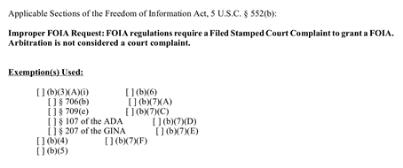

## Table of Contents

## What is the FOIA and why is it important?

The FOIA, or Freedom of Information Act, is a law in the United States that lets people ask for information from the government. It was made in 1966 and it helps people see records from federal agencies. This can include things like emails, reports, and other documents. Anyone can make a FOIA request, and the government has to give the information unless it falls into certain exceptions, like national security or personal privacy.

The FOIA is important because it helps keep the government open and honest. It lets people know what their government is doing, which is a big part of democracy. When people can see government records, they can make better choices about who to vote for and how to be involved in their community. It also helps journalists and watchdog groups keep an eye on the government and make sure it is doing its job the right way.

## What is the EEOC and what type of information can I request from them under FOIA?

The EEOC, or Equal Employment Opportunity Commission, is a government agency in the United States that makes sure everyone is treated fairly at work. It helps stop discrimination based on things like race, color, religion, sex, national origin, age, disability, or genetic information. The EEOC investigates complaints, tries to fix problems, and can even take legal action if needed.

Under the Freedom of Information Act (FOIA), you can ask the EEOC for information they have. This can include records about discrimination cases, reports, data, and other documents they keep. You can request information about specific cases or general [statistics](/wiki/bayesian-statistics), but some information might be private or protected, so the EEOC might not be able to give you everything you ask for.

## How do I submit a FOIA request to the EEOC?

To submit a FOIA request to the EEOC, you can do it online, by mail, or by fax. The easiest way is to use the EEOC's online FOIA request form on their website. Just fill out the form with your name, contact information, and a clear description of the records you want. If you prefer, you can also send your request by mail to the EEOC's FOIA office at their headquarters in Washington, D.C., or by fax to the number listed on their website.

When you make your request, be as specific as you can about the information you need. This helps the EEOC find the records faster. You don't need to say why you want the information, but giving a clear description of the records will help. Once you submit your request, the EEOC will let you know they got it and will work on getting you the information, usually within 20 business days, unless they need more time.

## What information should I include in my FOIA request to the EEOC?

When you make a FOIA request to the EEOC, you should include your name and contact information, like your address, phone number, and email. This helps them get in touch with you about your request. It's also important to clearly describe the records you want. Be as specific as you can about the information you need, like the type of records, the time period you're interested in, and any specific cases or topics.

For example, if you want information about discrimination cases from the last year, say that clearly in your request. The more details you give, the easier it will be for the EEOC to find the right records. You don't need to explain why you want the information, but a clear and detailed description will help them process your request faster.

## Are there any fees associated with requesting information from the EEOC under FOIA?

Yes, there might be fees when you ask for information from the EEOC under FOIA. The fees depend on what kind of information you want and how much work it takes to find it. The EEOC can charge for looking for the records, copying them, and sending them to you. But they might not charge you if the cost is less than $25 or if they decide to waive the fee.

If you think the fee is too high, you can ask the EEOC to lower it or not charge you at all. They might agree if giving you the information helps the public a lot. When you make your request, you can ask for a fee waiver if you think it's important for the public to have the information. The EEOC will look at your request and decide if they can waive the fee.

## How long does it typically take to receive a response from the EEOC to a FOIA request?

When you send a FOIA request to the EEOC, they usually try to answer within 20 business days. This is the time they have to let you know if they will give you the information you asked for. But sometimes, it can take longer. If the EEOC needs more time, they will tell you and explain why. They might need more time if your request is very big or if they need to look through a lot of records.

If the EEOC decides to give you the information, it might take a bit longer to actually get it to you. They have to find the records, check if they can share them, and then send them to you. Sometimes, they might need to take out private information before they can share the records with you. So, while they aim to respond within 20 business days, the whole process from start to finish can take longer depending on how complicated your request is.

## What are common reasons for a FOIA request to the EEOC being denied?

A FOIA request to the EEOC might be denied for a few common reasons. One reason is if the information you want is protected by privacy laws. The EEOC has to keep some information private, like personal details about people involved in cases. If your request includes this kind of information, they might not be able to give it to you. Another reason is if the information could harm national security or law enforcement. If sharing the information could cause problems, the EEOC will not give it to you.

Another common reason for denial is if the records you want do not exist or cannot be found. Sometimes, the EEOC might not have the exact records you are asking for, or they might not be able to find them. If this happens, they will let you know that they cannot fulfill your request. Also, if your request is too broad or unclear, the EEOC might deny it or ask you to make it more specific. This helps them find the right information and respond to your request more easily.

## How can I appeal a denial of my FOIA request from the EEOC?

If the EEOC denies your FOIA request, you can appeal the decision. To do this, you need to write a letter to the EEOC's Office of Legal Counsel in Washington, D.C. In your appeal letter, you should say that you want to appeal the denial of your FOIA request. Include your original request number, the date you got the denial, and why you think the EEOC should give you the information. You have 90 days from when you get the denial to send in your appeal.

The EEOC will look at your appeal and decide if they should give you the information after all. They usually take about 20 business days to respond to your appeal, but it might take longer if your case is complicated. If the EEOC still says no after your appeal, you can take your case to court. You can file a lawsuit in a federal district court to try to get the information you want.

## What are the best practices for crafting an effective FOIA request to the EEOC?

To craft an effective FOIA request to the EEOC, start by being clear and specific about what information you want. Give details like the type of records, the time period you're interested in, and any specific cases or topics. This helps the EEOC find the right records faster and makes it more likely you'll get the information you need. Also, include your name and contact information so they can reach you easily. You don't need to explain why you want the information, but a clear description is key.

It's also a good idea to ask for a fee waiver if you think the information will help the public a lot. The EEOC might not charge you if the cost is less than $25 or if they agree that the information is important for the public. If you're worried about fees, say so in your request. Finally, be patient and prepared to wait. The EEOC usually tries to respond within 20 business days, but it can take longer if your request is big or complicated.

## How does the EEOC handle requests for confidential or sensitive information under FOIA?

When someone asks for confidential or sensitive information from the EEOC under FOIA, the EEOC has to be very careful. They have to follow the law, which means they can't just give out information that is private or could harm someone. For example, if you ask for details about a specific discrimination case, the EEOC might have to take out names and other personal details before they can share the records with you. This is to protect people's privacy and make sure they don't share information that could cause problems.

If the EEOC thinks the information you want is too sensitive to share, they might deny your request. They will tell you why they can't give you the information, and you can appeal if you think they made a mistake. The EEOC tries to balance being open with protecting important information. They want to help people get the information they need, but they also have to follow the rules to keep things private and safe.

## What resources are available to help me understand and navigate the FOIA process with the EEOC?

If you want to learn more about the FOIA process with the EEOC, there are some good resources to help you. The EEOC's own website has a lot of information about FOIA. They have a section just for FOIA where you can find forms to use, instructions on how to make a request, and answers to common questions. You can also read their FOIA reference guide, which explains everything in detail and tells you how to appeal if your request is denied.

Another helpful resource is the FOIA.gov website. This site is run by the government and gives you a general overview of FOIA, not just for the EEOC but for all federal agencies. It has a lot of useful information, like how to make a request, what to expect, and what to do if you have problems. If you want more personalized help, you can also talk to a librarian at a public or university library. Librarians often know a lot about how to find government information and can give you tips on how to make your FOIA request as effective as possible.

## How can I use the information obtained from a FOIA request to the EEOC in legal or advocacy work?

Information you get from a FOIA request to the EEOC can be very useful for legal or advocacy work. If you're a lawyer, you might use the information to help build a case about workplace discrimination. The records could show patterns of unfair treatment or give you specific details about how the EEOC handled similar cases in the past. This can help you make stronger arguments in court or during settlement talks. For advocacy groups, the information can be used to raise awareness about discrimination issues. You could share the data in reports or press releases to show the public what's happening and push for changes in laws or company policies.

Advocates can also use the information to help educate people about their rights. By sharing real examples from EEOC records, you can show people what discrimination looks like and what they can do about it. This can encourage more people to speak up and report unfair treatment. Plus, if you find out the EEOC isn't doing a good job with certain cases, you can use that information to push for better enforcement of anti-discrimination laws. Overall, FOIA information from the EEOC can be a powerful tool to make workplaces fairer and more equal.

## References & Further Reading

[1]: United States Department of Justice. ["FOIA.gov"](https://www.justice.gov/oip/doj-guide-freedom-information-act-0). Accessed October 2023.

[2]: Robbins, Ira P. (1983). ["The Freedom of Information Act and the Commission on Wartime Relocation and Internment of Civilians"](https://en.wikipedia.org/wiki/Commission_on_Wartime_Relocation_and_Internment_of_Civilians). Michigan Law Review, 81(5), 1023-1055.

[3]: Adene, Funmilayo O. (2017). ["FOIA: A Tool for Development Journalism in Nasarawa State, Nigeria"](https://scholar.google.com/citations?user=WQDapkAAAAAJ&hl=en). Global Media Journal.

[4]: FINRA. ["Algorithmic Trading"](https://www.finra.org/rules-guidance/key-topics/algorithmic-trading). Accessed October 2023.

[5]: O'Neil, Cathy. (2016). ["Weapons of Math Destruction: How Big Data Increases Inequality and Threatens Democracy."](https://dl.acm.org/doi/10.5555/3002861) Crown Publishing Group.

[6]: Zuboff, Shoshana. (2019). ["The Age of Surveillance Capitalism: The Fight for a Human Future at the New Frontier of Power."](https://www.jstor.org/stable/26862460) PublicAffairs.

[7]: Financial Industry Regulatory Authority (FINRA). ["A Few Words About High-Frequency Trading"](https://www.finra.org/). Accessed October 2023.