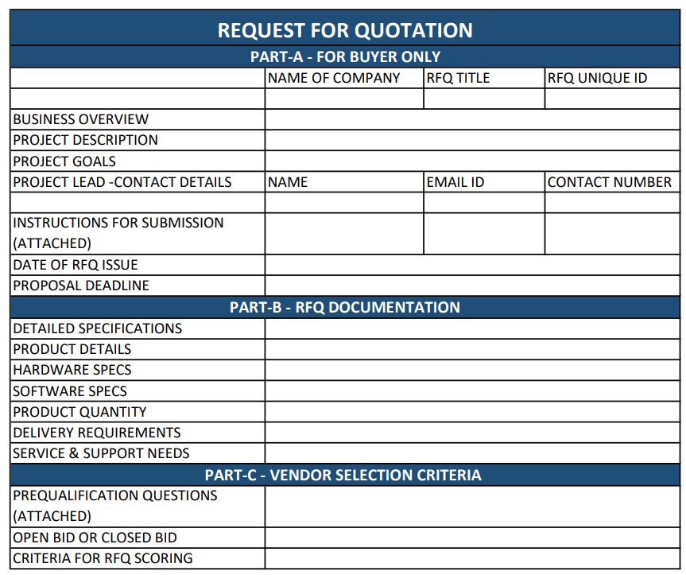

Request for Quote (RFQ) trading is a pivotal mechanism in modern financial markets, especially in the realm of algorithmic trading. The RFQ process operates by allowing traders to solicit competitive price quotes from multiple liquidity providers, thus playing a crucial role in both price discovery and efficient trade execution. In today’s fast-paced financial environment, characterized by rapid technological advancements and increasing complexity, RFQ offers a strategic advantage to traders seeking improved pricing and enhanced liquidity.

The RFQ system is especially significant in over-the-counter (OTC) markets, where liquidity can be fragmented, and price transparency is often limited. By enabling direct communication with liquidity providers, RFQs facilitate the acquisition of competitive quotes, essential for executing large-volume trades efficiently. This mechanism not only assists in achieving favorable pricing but also aids in navigating the challenges of OTC markets by providing a clearer view of available price levels and liquidity.



This article aims to offer a comprehensive understanding of RFQ trading, focusing on its benefits and how it integrates into algorithmic trading strategies. By exploring the operational framework and advantages of RFQ, we hope to illuminate its integral role in enhancing trade execution and liquidity management within the context of modern financial markets.

## Table of Contents

## What is RFQ in Algo Trading?

Request for Quote (RFQ) represents a specialized trading model designed to secure competitive pricing from a multitude of liquidity providers. In algorithmic trading, RFQs are particularly employed to facilitate the efficient execution of large-scale orders by leveraging access to diverse liquidity pools. This mechanism contrasts with traditional order book trading, as RFQ offers a personalized and negotiable pricing structure, making it highly suitable for transacting large volumes.

The RFQ model provides an infrastructure where a trader can solicit price quotes for a specific financial instrument from several market participants. This system is especially beneficial in markets where price transparency and the ability to negotiate terms are crucial. By obtaining quotes from various sources, traders can compare offerings in real time and select the most advantageous one. This process aids in achieving optimal transaction terms without the need to publicly display large orders, which could otherwise disrupt market stability.

Unlike a conventional order book that lists buy and sell orders, an RFQ system allows for direct interaction between the trader and liquidity providers. This interaction can be structured programmatically within algorithmic trading strategies, enabling automatic and efficient selection processes based on pre-defined criteria such as price, market depth, or provider reliability. 

In the algorithmic context, RFQs are incorporated to dynamically engage with multiple [liquidity](/wiki/liquidity-risk-premium) providers, allowing algorithms to parse and evaluate a variety of bids before committing to a trade. For example, an algorithm might execute the following pseudocode:

```python
def request_rfq(quotes, instrument):
    best_quote = None
    for provider in quotes:
        current_quote = provider.request_quote(instrument)
        if best_quote is None or current_quote.price < best_quote.price:
            best_quote = current_quote
    return best_quote

quotes = [provider1, provider2, provider3]
best_trade = request_rfq(quotes, "AAPL")
execute_trade(best_trade)
```

This pseudocode illustrates how an algorithm can interact with several liquidity providers to obtain and compare quotes for an instrument, such as "AAPL". By evaluating these quotes, the algorithm can make an informed decision to execute a trade at the optimal price.

RFQs, therefore, empower traders by broadening their access to liquidity and offering bespoke pricing, which is significantly beneficial for executing large transactions efficiently.

## The RFQ Process in Algorithmic Trading

The Request for Quote (RFQ) process in [algorithmic trading](/wiki/algorithmic-trading) begins with the initiation of a request by a trader who seeks pricing information on a specific financial instrument. This request is directed toward multiple liquidity providers. The primary goal is to obtain competitive quotes that lead to efficient execution of trades, especially in markets where liquidity can vary significantly.

Upon receiving the RFQ, liquidity providers generate responses comprising price quotes. These quotes are typically customized based on the liquidity provider’s current exposure, market conditions, and the relationship with the requesting party. The trader receives these quotes almost instantaneously, allowing for a direct comparison of available options. This is crucial in ensuring the trader can select the best possible terms for the execution of their trade.

The RFQ process is beneficial because it facilitates real-time price discovery and efficient decision-making. By granting traders access to a spectrum of price quotes, it helps circumvent issues related to market impact, wherein large orders might otherwise distort prices and market equilibrium. Calculation of the optimal trade can involve the comparison of quotes using pre-defined algorithms, which assess factors such as price, quantity, and execution time.

In high-frequency trading environments, the ability to swiftly obtain and assess various quotes is invaluable, permitting the execution of large trades with minimal slippage. Traders can implement automated systems that handle RFQ responses, allowing them to execute the trade that best suits their strategic goals. This automation can be achieved using programming languages like Python, where traders can script the evaluation and selection processes to ensure that trades meet specific criteria within set parameters. This integration of algorithmic processes with RFQ enhances the strategic deployment of trading capital, optimizing returns while managing risk.

## Key Benefits of Using RFQ in Algo Trading

RFQ trading significantly enhances market liquidity by providing traders with access to a broader array of liquidity providers. This access is especially crucial for executing large-[volume](/wiki/volume-trading-strategy) trades, as it allows traders to tap into various sources of liquidity, ensuring that they can fulfill substantial orders without drastically impacting the market. By engaging multiple liquidity providers, traders can achieve a more competitive pricing structure, effectively distributing large trades across different channels to minimize potential market disturbances.

Moreover, RFQ facilitates better pricing flexibility, which is invaluable for traders who aim to find optimal prices while avoiding the adverse effects of placing large visible orders in the market. In traditional [order book](/wiki/order-book-trading-strategies) systems, a large order can materially impact the market price, leading to slippage and increased costs for the trader. In contrast, RFQ allows for a more discreet approach by enabling traders to negotiate prices with multiple providers. This negotiation process helps in securing more favorable terms and can lead to price improvements when providers compete for the order.

The RFQ process also bolsters transparency in price discovery. As multiple liquidity providers submit their price quotes, traders gain a comprehensive view of the current market pricing dynamics, allowing them to make more informed decisions. This transparency is a critical component in achieving efficient trade execution. By comparing multiple price offers in real time, traders can choose the most advantageous quote, thereby minimizing the market impact of their trades and achieving execution at the desired price level.

In summary, the integration of RFQ trading in algorithmic strategies provides substantial benefits: it enhances liquidity access, offers pricing flexibility, and increases transparency in price discovery, all while promoting efficient trade execution and minimizing market impact.

## Challenges and Considerations

While RFQ trading presents distinct advantages, certain challenges and considerations must be addressed to optimize its application. One primary challenge is the dependence on the responsiveness of liquidity providers. In the RFQ process, traders issue requests to multiple liquidity providers, and the efficacy of this system hinges on the promptness and reliability of the responses received. Delays or non-responsiveness from liquidity providers can lead to missed opportunities for traders, as market conditions may evolve rapidly.

Traders often face execution delays if liquidity providers do not respond timely to RFQ requests. Such delays can result in missed opportunities, especially in fast-moving markets where price fluctuations can occur within fractions of a second. The lack of immediate responses can be particularly detrimental in scenarios where urgent execution is necessary to capitalize on favorable market conditions.

Furthermore, RFQ trading is more tailored to institutional investors rather than retail traders. The benefits of RFQ are more pronounced for large-volume trades due to the potential for negotiating better pricing and accessing a broader set of liquidity providers. Retail traders, who generally deal with smaller trade sizes, may not experience the same level of advantage through RFQ trading. The costs and infrastructure required to implement and maintain an effective RFQ system can also be a barrier for smaller trading entities.

Lastly, while RFQ systems enhance transparency in price discovery, the process still relies heavily on the strategic behavior of liquidity providers, who may have their own motivations and constraints. Traders must consider the possibility of information asymmetry, where liquidity providers have access to more comprehensive market data, potentially influencing their quoted prices.

In conclusion, while RFQ serves as a valuable tool for improving liquidity and price discovery in algorithmic trading, its effectiveness is contingent on several factors, including provider responsiveness, trade size, and market conditions. Addressing these challenges is crucial for maximizing the benefits of RFQ trading systems.

## Conclusion

In conclusion, RFQ trading is an essential tool in the arsenal of algorithmic traders, offering a customizable and effective pathway to liquidity and price discovery. Its significance is particularly pronounced in modern trading strategies, as it provides a mechanism for executing large trades in over-the-counter (OTC) markets, where traditional exchanges may not offer sufficient liquidity. The RFQ process enables traders to solicit competitive price quotes from multiple liquidity providers, ensuring optimal trade terms and enhancing market liquidity by engaging a broader set of participants.

The ability to negotiate and obtain personalized pricing through RFQ systems is invaluable for minimizing market impact and achieving efficient execution, which are critical considerations in today's high-volume trading environments. Additionally, by offering transparency in price discovery and reducing the potential for large orders to influence market prices, RFQ trading aligns with the goals of algorithmic trading systems that aim for precision and cost-effectiveness.

Embracing RFQ trading systems can greatly enhance trading efficiency, allowing traders to navigate complex markets with more agility and insight. This approach not only reduces market impact but also provides competitive advantages by leveraging technology to access optimal pricing and liquidity conditions in real time. As financial markets continue to evolve, RFQ trading will remain a pivotal component of sophisticated trading strategies, enabling traders to execute large trades effectively and maintain a competitive edge in the fast-paced trading environment.

## References & Further Reading

[1]: Harris, L. (2003). ["Trading and Exchanges: Market Microstructure for Practitioners."](https://www.amazon.com/Trading-Exchanges-Market-Microstructure-Practitioners/dp/0195144708) Oxford University Press.

[2]: Schwartz, R. A., & Francioni, R. (2004). ["Equity Markets in Action: The Fundamentals of Liquidity, Market Structure & Trading."](https://books.google.com/books/about/Equity_Markets_in_Action.html?id=fPV16sxH8oUC) Wiley.

[3]: ["Algorithmic Trading & DMA: An Introduction to Direct Access Trading Strategies"](https://www.amazon.com/Algorithmic-Trading-DMA-introduction-strategies/dp/0956399207) by Barry Johnson

[4]: Vaananen, L. (2015). ["Modeling High-Frequency Data in Finance."](https://www.wiley.com/en-us/Handbook+of+Modeling+High-Frequency+Data+in+Finance-p-x000550033) Wiley.

[5]: Budish, E., Cramton, P., & Shim, J. (2015). ["The High-Frequency Trading Arms Race: Frequent Batch Auctions as a Market Design Response."](https://academic.oup.com/qje/article/130/4/1547/1916146) Quarterly Journal of Economics, 130(4), 1547-1621.