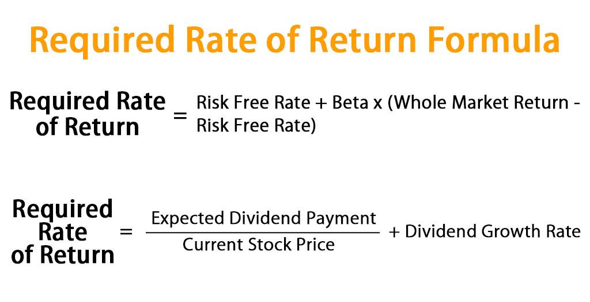

## Table of Contents

## What is the Required Rate of Return (RRR)?

The Required Rate of Return (RRR) is the minimum amount of money an investor expects to earn from an investment. It's like a benchmark that helps investors decide if an investment is worth it. The RRR takes into account things like how risky the investment is, what other investment options are available, and the overall economic situation.

To figure out the RRR, investors often look at things like the risk-free rate, which is the return you'd get from a very safe investment like a government bond. They then add a bit extra to account for the risk of the specific investment they're considering. If the expected return from an investment is higher than the RRR, the investor might decide to go ahead with it. If not, they might look for other opportunities that could give them a better return for the level of risk they're willing to take.

## Why is the Required Rate of Return important for investors?

The Required Rate of Return (RRR) is super important for investors because it helps them figure out if an investment is a good choice. It's like a guide that tells them the minimum they should expect to earn from their money. If an investment doesn't offer at least this much return, it might not be worth the risk. By knowing their RRR, investors can compare different investment options and pick the ones that meet or beat their expectations.

Think of the RRR as a personal benchmark. It's different for everyone because it depends on things like how much risk someone is okay with and what other investments are out there. For example, if someone is very cautious, they might have a higher RRR because they want to be sure they're getting enough reward for taking any risk. On the other hand, someone who's okay with more risk might have a lower RRR. Either way, understanding and using the RRR helps investors make smarter choices with their money.

## How is the Required Rate of Return different from the Expected Rate of Return?

The Required Rate of Return (RRR) and the Expected Rate of Return (ERR) are two important ideas in investing, but they serve different purposes. The RRR is the minimum return an investor needs to see to consider an investment worthwhile. It's like a personal standard that depends on how much risk an investor is willing to take and what other investment options are available. If an investment's potential return is less than the RRR, the investor might decide it's not worth the risk.

On the other hand, the Expected Rate of Return (ERR) is a prediction of how much an investment might actually earn in the future. It's based on things like past performance, current market conditions, and other factors that might affect the investment's value. The ERR is more about what could happen, while the RRR is about what needs to happen for an investor to feel good about their decision.

In simple terms, the RRR sets a bottom line for what an investor wants, while the ERR is a guess about what might actually happen. If the ERR is higher than the RRR, the investment looks promising. But if the ERR is lower than the RRR, the investor might look elsewhere for a better opportunity.

## What factors influence the Required Rate of Return?

The Required Rate of Return (RRR) is influenced by several factors that help investors figure out what kind of return they need from an investment. One big [factor](/wiki/factor-investing) is the risk-free rate, which is the return you'd get from a super safe investment like a government bond. Investors start with this rate and then add extra to account for the risk of the specific investment they're looking at. The more risky an investment seems, the higher the RRR will be because investors want more reward for taking on more risk.

Another important factor is the investor's own comfort with risk, often called their risk tolerance. If someone is very cautious and doesn't like taking chances, they'll probably have a higher RRR because they want to be sure they're getting enough return for any risk they take. On the other hand, if someone is okay with taking bigger risks, they might be fine with a lower RRR. Also, the overall economic situation can affect the RRR. During tough economic times, investors might demand a higher RRR to feel safe about their investments.

Lastly, the availability of other investment options plays a role too. If there are lots of good investment choices out there, investors might set a higher RRR because they can be pickier. But if options are limited, they might be willing to accept a lower RRR. All these factors together help investors decide what their personal RRR should be for any given investment.

## How can the Required Rate of Return be calculated?

Calculating the Required Rate of Return (RRR) involves looking at several factors that help investors figure out the minimum return they need from an investment. One common way to calculate the RRR is to start with the risk-free rate, which is the return you'd get from a very safe investment like a government bond. Then, you add something called a risk premium, which is extra return to make up for the risk of the specific investment you're thinking about. The riskier the investment, the bigger the risk premium you'll want to add. So, the basic formula is: RRR = Risk-Free Rate + Risk Premium.

Another important thing to consider when calculating the RRR is your own comfort with risk, or risk tolerance. If you don't like taking chances, you might want a higher RRR because you need more reward to feel okay about the risk. On the other hand, if you're okay with taking risks, you might be fine with a lower RRR. Also, the overall economic situation and what other investment options are out there can affect your RRR. If times are tough or there are lots of good investment choices, you might want a higher RRR to feel safe about your money. By thinking about all these things, you can come up with a personal RRR that helps you decide if an investment is worth it.

## What role does the risk-free rate play in determining the Required Rate of Return?

The risk-free rate is a key part of figuring out the Required Rate of Return (RRR). It's the return you'd get from a super safe investment, like a government bond. When calculating the RRR, you start with this risk-free rate because it's the minimum return you can expect without taking any risk. Then, you add a risk premium, which is extra return to make up for the risk of the specific investment you're thinking about. The riskier the investment, the bigger the risk premium you'll want to add. So, the risk-free rate sets the baseline for your RRR.

The risk-free rate also helps investors compare different investments. If an investment's expected return is only a little bit higher than the risk-free rate, it might not be worth the risk. But if the expected return is a lot higher, it could be a good choice. The risk-free rate changes over time based on things like the economy and interest rates, so it's important to keep an eye on it when figuring out your RRR. By starting with the risk-free rate and adding a risk premium, you can find a RRR that matches your comfort with risk and helps you make smart investment choices.

## How does the Capital Asset Pricing Model (CAPM) relate to the Required Rate of Return?

The Capital Asset Pricing Model (CAPM) is a way to figure out the Required Rate of Return (RRR) for an investment. It helps investors understand how much return they should expect from an investment based on how risky it is. The CAPM formula is pretty simple: it starts with the risk-free rate, which is the return you'd get from a super safe investment like a government bond. Then, it adds something called the equity risk premium, which is extra return to make up for the risk of the specific investment. The equity risk premium is calculated by multiplying the market risk premium (the extra return you expect from the overall market) by the investment's beta, which measures how much the investment's price moves compared to the market.

Using the CAPM, investors can find a specific RRR that matches the risk of their investment. If the expected return from an investment is higher than the RRR calculated by CAPM, it might be a good choice. But if the expected return is lower, the investor might look for other opportunities. The CAPM is really helpful because it gives investors a clear way to compare different investments and see if they're getting enough reward for the risk they're taking. It's like a tool that helps make investment decisions easier and more informed.

## Can the Required Rate of Return vary between different types of investments?

Yes, the Required Rate of Return (RRR) can definitely vary between different types of investments. This is because different investments come with different levels of risk. For example, a government bond is usually seen as a very safe investment, so the RRR for it might be pretty low. On the other hand, investing in a new startup company can be very risky, so investors might want a much higher RRR to feel okay about putting their money into it. The RRR also depends on things like how long the money will be tied up in the investment and what other investment options are available at the time.

The type of investment also affects the RRR because different investments have different ways of making money. For instance, stocks might give you dividends and the chance for the stock price to go up, while real estate might give you rental income and the chance for the property value to increase. Each type of investment has its own set of risks and rewards, so investors need to think about these when figuring out their RRR. By understanding how the RRR can change based on the type of investment, investors can make smarter choices about where to put their money.

## How do market conditions affect the Required Rate of Return?

Market conditions play a big role in setting the Required Rate of Return (RRR). When the economy is doing well and there are lots of good investment options, investors might feel more confident and be okay with a lower RRR. They might think that even if one investment doesn't do great, other opportunities are out there. But if the economy is struggling, investors might want a higher RRR. They might be more worried about losing money, so they'll want a bigger reward to take on any risk.

Also, things like interest rates and inflation can change the RRR. If interest rates go up, the risk-free rate goes up too, which means the RRR for other investments might go up as well. When inflation is high, investors might ask for a higher RRR to make sure their money keeps its value over time. So, keeping an eye on market conditions helps investors figure out what kind of return they need from their investments to feel good about their choices.

## What are the implications of a high Required Rate of Return for a company's valuation?

When a company has a high Required Rate of Return (RRR), it means that investors want a bigger reward for putting their money into the company. This can make the company seem riskier, so investors might not be willing to pay as much for its stocks or other investments. As a result, the company's valuation, or how much it's worth, can go down. If the RRR is high, the company needs to show that it can make a lot of money to meet those high expectations. If it can't, investors might look for other places to put their money where they think they can get a better return for the risk.

A high RRR can also affect how a company plans its future. The company might need to work harder to find ways to grow and make more money to meet the high return that investors want. This could mean taking on new projects or finding ways to cut costs. If the company can't meet these high expectations, it might have trouble getting new investments or loans. This can make it harder for the company to grow and might even put it at risk of financial trouble if it can't find enough money to keep going.

## How can an investor adjust their portfolio based on changes in the Required Rate of Return?

When the Required Rate of Return (RRR) changes, investors need to look at their portfolio and see if it still matches their goals. If the RRR goes up, it means investors want more money from their investments because they think things are riskier. They might decide to sell some of their riskier investments and buy safer ones, like government bonds or stocks from big, stable companies. This way, they can lower the risk in their portfolio and still try to meet their new, higher RRR.

On the other hand, if the RRR goes down, it might mean that investors feel more confident about the market and are okay with taking on more risk. They could decide to put more money into stocks or other investments that have a chance to grow a lot. This could help them take advantage of good opportunities and still meet their lower RRR. By keeping an eye on changes in the RRR and adjusting their portfolio, investors can make sure their investments are always working hard to meet their goals.

## What advanced methods exist for estimating the Required Rate of Return beyond traditional models?

Beyond traditional models like the Capital Asset Pricing Model (CAPM), there are more advanced ways to estimate the Required Rate of Return (RRR). One method is the Arbitrage Pricing Theory (APT), which looks at how different economic factors affect an investment's return. Instead of just using one measure of risk like CAPM, APT uses several factors, like inflation rates, interest rates, and even how well the economy is doing. This can give a more detailed picture of what return an investor might need, especially in a complex market where lots of things can change the value of an investment.

Another advanced method is the Multifactor Models, which build on the idea of APT but can include even more factors. These models might look at things like a company's size, how much it's growing, and how much it pays out in dividends. By considering all these different pieces, investors can get a better idea of the RRR for a specific investment. These advanced methods help investors make smarter choices by giving them a fuller understanding of what kind of return they should expect, especially when traditional models might not capture all the risks and rewards in today's markets.

## What is the Investment Rate of Return and How Can It Be Understood?

The investment rate of return is a crucial metric in evaluating the effectiveness of an investment, expressed as a percentage of profit or loss over a defined period. It serves as a cornerstone for investors in examining the performance of their portfolios and refining strategies to optimize gains and mitigate losses. Calculating the rate of return can involve various methodologies, each with its distinct approach and application.

The simplest method to calculate the rate of return is the simple return formula, which is given by:

$$
\text{Simple Return} = \frac{\text{End Value} - \text{Start Value}}{\text{Start Value}} \times 100
$$

This method is straightforward and provides a quick overview of investment performance over a specific period, but it does not account for the time value of money or multiple compounding periods.

The compounded annual growth rate (CAGR) offers a more refined approach by considering the investment's growth on an annualized basis. The formula for CAGR is:

$$
\text{CAGR} = \left( \frac{\text{End Value}}{\text{Start Value}} \right)^{\frac{1}{n}} - 1
$$

where $n$ represents the number of years. CAGR is particularly useful for assessing the performance of investments over multiple periods, smoothing out volatility to offer a clearer picture of true annual growth.

The internal rate of return (IRR) provides an even deeper level of analysis by calculating the discount rate at which the net present value (NPV) of all cash flows from the investment equals zero. Because it considers the time value of money and all cash flows, IRR is often used to evaluate the potential profitability of investment projects. The IRR can be computed through iterative numerical methods or software solutions due to its complexity:

```python
from scipy.optimize import irr

cash_flows = [-1000, 200, 300, 400, 500]  # Example cash flows
internal_rate_of_return = irr(cash_flows)
```

Each of these methods offers valuable insights into investment performance, aiding investors in making informed decisions to align their portfolios with financial goals. Understanding these calculations and their implications is essential for achieving strategic and informed investment management.

## How do you calculate Return on Investment in Algo Trading?

In [algorithmic trading](/wiki/algorithmic-trading), assessing the return on investment (ROI) involves analyzing several key performance metrics that provide insights into the risk-adjusted returns and potential vulnerabilities of trading strategies. Among the most crucial metrics are the Sharpe Ratio, Maximum Drawdown, and Profit Factor.

The Sharpe Ratio is a widely utilized measure that helps determine how well the returns of an investment compensate for the inherent risks. It is calculated by subtracting the risk-free rate from the expected return of the investment, and then dividing the result by the standard deviation of the investment's excess return:

$$
\text{Sharpe Ratio} = \frac{E[R_i - R_f]}{\sigma_i}
$$

where $E[R_i]$ is the expected return of the investment, $R_f$ is the risk-free rate, and $\sigma_i$ is the standard deviation of the investment's excess return. A higher Sharpe Ratio indicates better risk-adjusted returns.

Maximum Drawdown (MDD) quantifies the largest peak-to-trough decline in a portfolio, serving as an indicator of the worst-case capital erosion scenario. It is expressed as the maximum observed loss from a peak to a trough of a portfolio, before a new peak is attained:

$$
\text{Maximum Drawdown} = \frac{\text{Peak Value} - \text{Trough Value}}{\text{Peak Value}}
$$

Maximum Drawdown is crucial for understanding the potential severity of losses and provides an insight into the [volatility](/wiki/volatility-trading-strategies) and risk profile of an algorithmic trading strategy.

Profit Factor is another critical metric which measures the ratio of gross profits to gross losses from trades, providing a straightforward way to evaluate the profitability of a trading strategy over time:

$$
\text{Profit Factor} = \frac{\text{Total Gross Profit}}{\text{Total Gross Loss}}
$$

A Profit Factor greater than 1 indicates that the strategy is profitable.

Incorporating these metrics into the evaluation process of algorithmic trading strategies allows for a more nuanced understanding of performance, taking into account both potential returns and associated risks. By leveraging these metrics, traders can fine-tune their strategies, optimize risk-reward balance, and improve overall investment decision-making in algorithmic trading activities.

## References & Further Reading

[1]: ["Advances in Financial Machine Learning"](https://www.amazon.com/Advances-Financial-Machine-Learning-Marcos/dp/1119482089) by Marcos Lopez de Prado

[2]: ["Evidence-Based Technical Analysis: Applying the Scientific Method and Statistical Inference to Trading Signals"](https://www.amazon.com/Evidence-Based-Technical-Analysis-Scientific-Statistical/dp/0470008741) by David Aronson

[3]: ["Machine Learning for Algorithmic Trading"](https://github.com/PacktPublishing/Machine-Learning-for-Algorithmic-Trading-Second-Edition) by Stefan Jansen

[4]: ["Quantitative Trading: How to Build Your Own Algorithmic Trading Business"](https://www.amazon.com/Quantitative-Trading-Build-Algorithmic-Business/dp/1119800064) by Ernest P. Chan

[5]: Bergstra, J., Bardenet, R., Bengio, Y., & Kégl, B. (2011). ["Algorithms for Hyper-Parameter Optimization."](https://dl.acm.org/doi/10.5555/2986459.2986743) Advances in Neural Information Processing Systems 24.