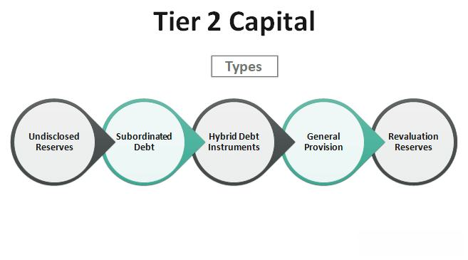

## Table of Contents

## What is trading capital in the context of Forex trading?

Trading capital in Forex trading is the money that a trader uses to buy and sell currencies. It's the amount of money you have in your trading account that you're willing to risk in the market. This capital is important because it determines how much you can trade and the potential profits or losses you might experience.

When you start Forex trading, you need to decide how much money you can afford to use as trading capital. It's crucial to only use money that you can afford to lose, as trading always involves risks. The size of your trading capital will affect your trading strategy, including how much you can trade at one time and how you manage your trades.

## How much capital do beginners typically need to start Forex trading?

For beginners, the amount of capital needed to start Forex trading can vary a lot. Many brokers let you start with a small amount, like $100 or even less. But, it's smart to have more money if you can. A common suggestion for beginners is to start with at least $1,000. This gives you a bit more room to make mistakes and learn without losing all your money quickly.

Having more capital also helps you use something called leverage, which can make your trades bigger. But be careful, because leverage can make you lose money faster too. So, if you're new, it's good to start small and learn the ropes before putting in a lot of money. Remember, you should only use money you can afford to lose, because trading can be risky.

## What factors should be considered when determining the required trading capital?

When deciding how much money to use for Forex trading, you need to think about your financial situation. This means looking at how much money you have and how much you can afford to lose. Trading can be risky, so it's important to only use money that won't hurt you if it's gone. Also, think about your goals. If you want to make a lot of money quickly, you might need more money to start with. But if you're okay with growing your money slowly, you can start with less.

Another thing to consider is how much you know about trading. If you're new, it's a good idea to start with a smaller amount of money. This way, you can learn and make mistakes without losing too much. As you get better, you can put in more money. Also, think about how much time you can spend on trading. If you can't watch the markets all the time, you might need more money to cover the times when you're not trading.

## How does leverage affect the amount of capital needed for Forex trading?

Leverage in Forex trading lets you control a big amount of money with just a small amount of your own. It's like borrowing money from your broker to make bigger trades. If you use leverage, you can start trading with less money in your account. For example, with a leverage of 100:1, you can control $100,000 with just $1,000. But, leverage is a double-edged sword. It can make your profits bigger, but it can also make your losses bigger. So, if you use a lot of leverage, you need to be careful because you could lose your trading capital faster.

Because of leverage, you might think you need less money to start trading. But, you still need to have enough money to cover possible losses. If the market moves against you, you might get a margin call, where you need to add more money to your account or close your trades. So, even with leverage, it's smart to have enough capital to handle the ups and downs of the market. This way, you can keep trading and learning without running out of money too quickly.

## What are the risks of undercapitalizing a Forex trading account?

Undercapitalizing a Forex trading account means starting with too little money. This can be really risky. When you don't have enough money, even a small move in the market can wipe out your account. If you use leverage, which lets you trade with more money than you have, the risk gets even bigger. If the market goes against you, you might get a margin call. This means you need to put more money into your account fast, or your broker will close your trades to stop the losses.

Another problem with undercapitalizing is that it limits how you can trade. With less money, you can't take as many trades or hold onto them as long as you might want to. This can make it hard to stick to a good trading plan. You might feel pressured to take bigger risks to make more money, which can lead to even bigger losses. So, it's important to start with enough money to give yourself a chance to learn and grow as a trader without running out of money too quickly.

## How can a trader calculate the appropriate trading capital based on their risk tolerance?

To figure out the right amount of trading capital based on your risk tolerance, you need to think about how much money you're okay with losing. Everyone has a different level of comfort when it comes to risk. If you're someone who gets worried easily about losing money, you might want to start with more capital. This way, you can trade smaller amounts and still feel safe. For example, if you're okay with losing up to 2% of your capital on a single trade, and you want to trade $10,000 at a time, you'd need at least $500,000 in your account. But if you're okay with losing more, say 5%, you could start with less, like $200,000.

Another thing to consider is your trading strategy and how often you plan to trade. If you're going to make a lot of trades, you'll need more money to keep going even if some trades don't work out. Also, think about how much you know about trading. If you're new, it's better to start with more money so you can make mistakes and learn without losing everything. As you get more experienced, you can adjust your capital based on what you've learned about your risk tolerance and how the markets work.

## What are the differences in capital requirements between retail and professional Forex traders?

Retail Forex traders and professional Forex traders have different capital requirements because of their different levels of experience and the rules they have to follow. Retail traders are usually people who trade for themselves and not as a job. They can start with a small amount of money, sometimes as little as $100. But, it's better for them to have more money, like $1,000 or more, so they can handle the ups and downs of the market and learn without losing everything quickly. Retail traders often use leverage to make bigger trades with less money, but this can be risky if they don't have enough money to cover losses.

Professional Forex traders, on the other hand, are usually people who trade as a job or for big companies. They need more money to start with because they are expected to handle bigger trades and have a deeper understanding of the market. Professional traders might need tens of thousands or even millions of dollars in their accounts. They also have to follow stricter rules set by financial regulators, which can affect how much capital they need. Because they trade with more money and have more experience, professional traders can handle more risk, but they still need enough capital to manage their trades safely.

## How does the choice of trading strategy impact the necessary trading capital?

The trading strategy you choose can really change how much money you need to start trading. If you like to trade a lot and hold onto your trades for a short time, like day trading, you'll need more money. This is because you'll be making many trades in a day, and each trade needs money to cover possible losses. Also, if you want to use a strategy that needs you to keep trades open for a long time, like swing trading, you'll need enough money to handle the ups and downs of the market while you wait for your trades to work out.

On the other hand, if you choose a strategy that involves trading less often, like position trading, you might be able to start with less money. Position trading means you hold onto your trades for weeks or months, so you don't need as much money to keep trading all the time. But no matter what strategy you pick, it's important to have enough money to cover the risks that come with it. This way, you can stick to your plan and not worry about running out of money too quickly.

## What are the regulatory requirements for trading capital in different countries?

The rules about how much money you need to start trading can be different in different countries. In the United States, the Commodity Futures Trading Commission (CFTC) and the National Futures Association (NFA) say that Forex brokers have to follow certain rules. One of these rules is about leverage. For retail traders in the U.S., the most leverage they can use is 50:1 for major currency pairs. This means that if you want to trade $50,000, you need at least $1,000 in your account. In the European Union, the rules changed a few years ago. Now, retail traders can only use up to 30:1 leverage for major currency pairs. So, if you want to trade $30,000, you need at least $1,000.

In Australia, the rules are a bit different. The Australian Securities and Investments Commission (ASIC) lets retail traders use up to 500:1 leverage. This means you can trade a lot more with less money, but it's also riskier. In Japan, the Financial Services Agency (FSA) sets the maximum leverage at 25:1 for retail traders. So, if you want to trade $25,000, you need at least $1,000. These rules are there to protect traders from losing too much money too quickly. But remember, even if the rules let you use a lot of leverage, it's still smart to start with enough money to handle the risks of trading.

## How can traders manage their capital effectively to maximize returns and minimize risks?

To manage capital effectively, traders need to have a clear plan for how much they're willing to risk on each trade. A common rule is to not risk more than 1-2% of your total trading capital on any single trade. This helps keep your account safe even if you have a few losing trades in a row. It's also important to use stop-loss orders, which automatically close your trade if the market moves against you by a certain amount. This way, you can limit your losses and protect your capital. Another good practice is to keep some money aside as a buffer, so you can keep trading even if the market goes against you for a while.

Another key part of managing capital is to keep track of how well your trading strategy is working. If you're losing more money than you're making, it might be time to change your strategy or take a break. It's also helpful to keep learning about the markets and improving your skills. As you get better, you can slowly increase the amount of money you trade with. But always remember, the goal is to grow your capital over time, not to get rich quick. By being patient and sticking to your plan, you can maximize your returns while keeping risks under control.

## What are advanced techniques for optimizing trading capital in Forex markets?

One advanced technique for optimizing trading capital in Forex markets is using position sizing. This means figuring out how much money to put into each trade based on how risky it is and how much money you have. If you think a trade has a good chance of making money, you might want to put more money into it. But if it's riskier, you might want to use less money. By changing the size of your trades, you can make the most of your money while keeping your risks under control. Another technique is to use a trailing stop-loss. This is a type of stop-loss order that moves with the market. If your trade is making money, the trailing stop-loss moves up too, so you can lock in some of your profits while still giving the trade room to grow.

Another way to optimize your trading capital is by diversifying your trades. This means not putting all your money into one trade or one currency pair. Instead, you can spread your money across different trades and different markets. This can help lower your risk because if one trade doesn't work out, you might still make money from other trades. Also, using advanced risk management tools like hedging can help protect your capital. Hedging means opening another trade to offset the risk of your first trade. For example, if you think the value of a currency might go down, you can open a trade that will make money if it does go down, helping to protect your other trades. By using these advanced techniques, you can make the most of your trading capital and keep your risks under control.

## How do experienced traders adjust their capital allocation based on market conditions and performance?

Experienced traders often change how they use their money based on what's happening in the market and how well they're doing. If the market is moving a lot and seems risky, they might decide to use less money on each trade. This way, they can keep their money safe if the market goes against them. On the other hand, if the market is calm and they feel confident, they might put more money into their trades to try to make more money. They also look at how well their trades have been doing lately. If they've been making money, they might feel okay about using more money on their next trades. But if they've been losing money, they might use less money until things get better.

Another way experienced traders adjust their capital is by looking at different parts of the market. If they see that one currency pair is doing really well, they might decide to put more money into trades with that pair. But if another pair is doing badly, they might use less money on those trades. They also think about how much money they have in total. If their account is growing, they might slowly start using more money on their trades. But if their account is shrinking, they'll be more careful and use less money. By keeping an eye on the market and their own performance, experienced traders can make smart choices about how to use their money to keep growing their account while staying safe.

## How do profits and fees impact forex trading capital?

Fees and commissions are integral components of forex trading that can significantly impact trading profits and, consequently, the capital requirements of a trader. These costs, often overlooked by novice traders, can erode potential profits if not properly accounted for.

### Methods to Calculate Potential Fees and Their Impact on Trading Results

Forex trading involves several types of fees, including spreads, commissions, and overnight financing charges. The spread is the difference between the bid and ask price and represents the primary cost of executing a trade. Many brokers offer commission-free trading, relying on spreads to generate revenue. However, some brokers apply a fixed or variable commission per trade, especially in ECN (Electronic Communication Network) accounts, where spreads might be tighter.

Calculating the impact of these fees on trading outcomes involves several steps. For instance, if you are trading one standard lot (100,000 units) of a currency pair with a spread of 2 pips, the cost of the trade would be:

$$
\text{Cost} = \text{Spread in Pips} \times \left( \frac{\text{Lot Size}}{10,000} \right) = 2 \times \left( \frac{100,000}{10,000} \right) = \$20
$$

This cost is multiplied by the number of trades executed, thereby affecting overall profitability.

### Ways to Optimize Trading Strategies to Counterbalance Fees

Optimizing trading strategies to counterbalance fees involves several approaches. Traders can pursue strategies such as scalping, which capitalizes on small price movements and involves numerous trades, or swing trading, which holds positions for longer periods to capture larger price movements. Each strategy has different implications on fees and profitability.

To mitigate the impact of fees on profits, traders often focus on:

1. **Choosing Brokers with Competitive Spreads and Fees:** Selecting a broker with competitive fees can substantially enhance net profits.

2. **Minimizing Frequent Trading:** Limiting the number of trades can reduce cumulative fees, which can significantly improve profitability for strategies that do not depend on high-frequency trading.

3. **Improving Trade Execution:** Using advanced order types and ensuring rapid execution speeds can optimize entry and exit points, minimizing slippage and indirectly reducing trading costs.

### Leveraging Lower-Cost Trading Platforms

In today’s trading environment, technology plays a crucial role in reducing costs and enhancing capital efficiency. Traders can leverage lower-cost trading platforms that offer competitive spreads, low or no commissions, and additional benefits such as rebates or discounts for high-[volume](/wiki/volume-trading-strategy) trading.

Platforms that provide additional analytical tools, access to algorithmic trading, and risk management features can further enhance profitability by allowing traders to make informed decisions and manage positions effectively. Additionally, these platforms often provide extensive educational resources, which can help traders optimize their strategies and minimize unnecessary costs.

Ultimately, optimizing fee structures and selecting the right trading platform are critical steps in maintaining effective capital management in forex trading. By minimizing fee-related expenses and leveraging cost-effective solutions, traders can protect and potentially enhance their trading capital over time.

## References & Further Reading

[1]: Bergstra, J., Bardenet, R., Bengio, Y., & Kégl, B. (2011). ["Algorithms for Hyper-Parameter Optimization."](https://proceedings.neurips.cc/paper/2011/file/86e8f7ab32cfd12577bc2619bc635690-Paper.pdf) Advances in Neural Information Processing Systems 24.

[2]: ["Advances in Financial Machine Learning"](https://www.amazon.com/Advances-Financial-Machine-Learning-Marcos/dp/1119482089) by Marcos Lopez de Prado

[3]: ["Evidence-Based Technical Analysis: Applying the Scientific Method and Statistical Inference to Trading Signals"](https://www.amazon.com/Evidence-Based-Technical-Analysis-Scientific-Statistical/dp/0470008741) by David Aronson

[4]: ["Machine Learning for Algorithmic Trading"](https://github.com/stefan-jansen/machine-learning-for-trading) by Stefan Jansen

[5]: ["Quantitative Trading: How to Build Your Own Algorithmic Trading Business"](https://books.google.com/books/about/Quantitative_Trading.html?id=j70yEAAAQBAJ) by Ernest P. Chan