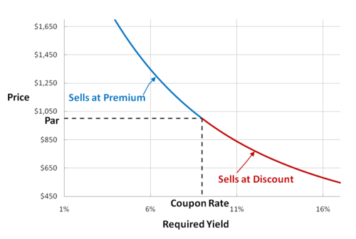

The world of finance is extensive and intricate, characterized by a constant pursuit among investors to optimize returns while effectively managing risk. Central to this pursuit is a thorough understanding of financial concepts such as required yield and investment returns, which are foundational for sound financial planning. Required yield is crucial because it represents the minimum return that justifies participation in an investment, particularly within fixed-income markets like bonds. This concept helps investors evaluate the attractiveness of various investment opportunities relative to their risk levels.

Investment returns, on the other hand, encompass the total financial gains or losses realized from an investment over a specific timeframe. These returns include income, such as dividends and interest, as well as capital gains, both of which are essential for investors to evaluate the performance of their investments in relation to predefined financial goals.



Integrating these concepts into algorithmic trading—where computer algorithms automate and optimize trading strategies—can significantly enhance decision-making. Algorithmic trading leverages complex financial data and formulas to execute trades with speed and precision, thereby allowing investors to respond more effectively to market changes by using financial benchmarks such as required yield and detailed analyses of investment returns.

By understanding and connecting these financial elements, investors are better equipped to make informed decisions that lead to superior investment outcomes. As technology continues to advance, the integration of these concepts will likely further refine the efficiency and effectiveness of investment strategies, empowering investors to achieve their financial objectives in an increasingly competitive market.

## Table of Contents

## What is Required Yield?

Required yield is a crucial concept in the domain of fixed-income investments, prominently encompassing bonds. It denotes the minimum acceptable rate of return investors require to consider an investment attractive and worthwhile. This concept is pivotal not only for investors seeking to understand their investment's potential return relative to risk but also for issuers to appropriately price their new bond issues.

### Influence of Market Conditions
Market conditions play a significant role in determining the required yield. It fluctuates based on various factors such as interest rates, inflation expectations, credit risk, and broader economic factors. For instance, in periods of rising interest rates, the required yield tends to increase because investors demand higher returns to compensate for the opportunity cost of holding lower-yielding assets. Conversely, during periods of lower interest rates, the required yield may decrease as affordable borrowing costs make bonds more attractive.

### Benchmark for Investment Returns
Required yield acts as a benchmark against which expected investment returns are measured. It serves as a gauge of the risk level associated with the investment; higher required yields typically imply higher perceived risks and vice versa. This benchmark is essential for both issuers and investors to assess whether the potential returns on a bond justify the associated risks.

### Mathematical Representation
Mathematically, the required yield can be calculated using present value and future cash flows of the bond. Suppose $C$ is the annual coupon payment, $F$ is the face value of the bond, $P$ is the current market price, and $n$ is the number of years until maturity. The required yield, or yield to maturity (YTM), is approximated using the formula:

$$
YTM = \frac{C + \frac{F - P}{n}}{\frac{F + P}{2}}
$$

This formula helps investors and analysts compute the return on a bond if it is held until maturity, taking into account all cash flows, including coupon payments and the face value repayment.

In summary, required yield is foundational in evaluating the viability of fixed-income investments. By establishing a minimum expected return, it aligns investor expectations with market realities, ensuring that the pricing of securities appropriately reflects their valuation in light of prevailing risks and economic conditions.

## Understanding Investment Returns

Investment returns represent the total financial gain or loss achieved from an investment over a predetermined time frame. This gain or loss is fundamental in evaluating how effectively an investment has met specific financial objectives. Typically, investment returns are derived from two primary components: income and capital appreciation.

Income from investments is commonly realized through dividends in the case of equity investments, or interest payments for bonds and other fixed-income assets. Dividends are portions of a company's profits distributed to shareholders and serve as a direct financial benefit for holding particular stocks. Interest income, on the other hand, is the yield received from bond investments, reflecting periodic payouts based on the bond's [interest rate](/wiki/interest-rate-trading-strategies) and principal value.

Capital appreciation denotes the increase in the value of an asset beyond its original purchase price. This gain becomes apparent when an asset is sold at a higher value than it was purchased. For instance, if a stock is bought at $100 per share and later sold at $150, the $50 gain represents capital appreciation.

A comprehensive understanding of investment returns is critical for aligning investment activities with strategic financial goals. Investors analyze returns to determine whether their portfolios are generating the desired outcomes, balancing risk, and achieving growth. The total return is often expressed as a percentage and can be calculated using the formula:

$$
\text{Total Return (\%)} = \left( \frac{\text{End Value} - \text{Initial Value} + \text{Income}}{\text{Initial Value}} \right) \times 100
$$

where:
- End Value is the asset’s value at the end of the period.
- Initial Value is the asset’s value at the beginning of the period.
- Income refers to any dividends or interest received during the period.

Python can be employed to calculate investment returns efficiently, allowing investors to model and simulate potential outcomes. Here is a simple Python illustration to compute total investment return:

```python
def calculate_total_return(initial_value, end_value, income):
    return ((end_value - initial_value + income) / initial_value) * 100

initial_value = 1000  # Initial investment value
end_value = 1150      # End investment value
income = 50           # Dividends or interest received

total_return = calculate_total_return(initial_value, end_value, income)
print(f"Total Investment Return: {total_return:.2f}%")
```

Understanding these concepts enables investors to systematically evaluate their portfolios, make informed investment decisions, and adjust strategies to better meet individual or institutional financial objectives.

## Algorithmic Trading and Financial Concepts

Algorithmic trading is a sophisticated trading strategy that utilizes computer algorithms to automate the execution of trades, harnessing the power of advanced mathematical models and high-speed data processing. This approach allows for the swift execution of trades, often across multiple markets and asset classes, using predefined criteria or rules that dictate the trading parameters.

One of the key advantages of [algorithmic trading](/wiki/algorithmic-trading) is its ability to leverage financial formulas and yield data to make swift and informed trading decisions. By utilizing real-time market data, these algorithms can process vast amounts of information more rapidly than human traders, identifying trends and executing trades based on complex calculations. This can include models for pricing derivatives, assessing [volatility](/wiki/volatility-trading-strategies), and other financial engineering techniques that are beyond the scope of traditional human analysis.

Integrating financial concepts such as required yield and investment returns into algorithmic trading algorithms enhances both strategy precision and market responsiveness. Required yield, as the benchmark for acceptable investment returns, can serve as a critical input for determining the attractiveness of a particular asset. By integrating this data, algorithms can more accurately assess risk-reward tradeoffs and ensure that trades meet the necessary return criteria.

Moreover, investment return data are used to continuously refine trading strategies. Algorithms can analyze historical returns on assets and adjust their parameters to optimize for expected future performance. This dynamic adjustment capability allows for better alignment with market conditions, which are inherently volatile and subject to rapid change.

In practical terms, algorithmic trading can be implemented in various programming languages, with Python being one of the most popular choices due to its vast libraries for data analysis and [machine learning](/wiki/machine-learning). For instance, a simple Python code snippet that executes a trade based on a moving average crossover strategy might look like this:

```python
import numpy as np
import pandas as pd

def moving_average_crossover_trading_strategy(prices, short_window=40, long_window=100):
    # Calculate moving averages
    short_ma = prices.rolling(window=short_window, min_periods=1).mean()
    long_ma = prices.rolling(window=long_window, min_periods=1).mean()

    # Generate signals
    signals = pd.DataFrame(index=prices.index)
    signals['signal'] = 0.0
    signals['signal'][short_window:] = np.where(short_ma[short_window:] > long_ma[short_window:], 1.0, 0.0)

    # Generate trading orders
    signals['positions'] = signals['signal'].diff()

    return signals
```

In this example, the algorithm calculates short- and long-term moving averages of asset prices and generates buy and sell signals (represented as 1 and 0 in the `signal` column) based on the crossover of these averages. This kind of strategy could be further refined by incorporating financial performance indicators such as the required yield to adjust trading positions dynamically.

Overall, the integration of required yield and investment returns into algorithmic trading frameworks allows investors to achieve enhanced efficiency and improved risk management, ultimately contributing to superior investment outcomes in the financial markets.

## Integrating Required Yield and Investment Returns into Algo Trading

To optimize trading efficiency, algorithms incorporate financial benchmarks such as required yield by establishing a minimum acceptable return threshold. By defining this threshold, algorithms ensure that trades occur only when potential returns meet or exceed the investor's risk-adjusted expectations. This approach helps prevent investments in underperforming assets, allowing algorithms to focus on more promising opportunities.

Investment return data is crucial for enriching trading algorithms. It offers a dynamic evaluation of asset profitability by incorporating factors such as income from dividends or interest and potential capital appreciation. By processing this data, algorithms can dynamically compare different assets, aiding in the selection of securities that align with investors' objectives and risk profiles.

Advanced computational techniques enable algorithms to automatically adjust based on real-time market data. This adaptability is achieved through machine learning models and quantitative finance techniques that actively monitor market conditions. For instance, algorithms can be programmed to use historical yield data alongside current market indicators to forecast future asset performance. These predictions inform buy, hold, or sell decisions, increasing the potential for profitable trades.

Below is a basic Python example illustrating how an algorithm might adjust trading strategies based on dynamic yield benchmarks and predicted returns:

```python
import pandas as pd
from sklearn.linear_model import LinearRegression
import numpy as np

# Sample historical data
historical_data = pd.DataFrame({
    'yield': np.random.rand(100) * 0.05,  # simulate historical yield data
    'market_signal': np.random.rand(100) * 100  # simulate market signal data
})

# Define the required yield threshold
required_yield = 0.03

# Train a predictive model
X = historical_data[['market_signal']]
y = historical_data['yield']
model = LinearRegression().fit(X, y)

# Real-time market signal
current_market_signal = 85  # example market condition

# Predict the expected yield
predicted_yield = model.predict([[current_market_signal]])

# Trading decision
if predicted_yield > required_yield:
    decision = "Buy"
else:
    decision = "Hold/Sell"

print(f"Predicted Yield: {predicted_yield}, Decision: {decision}")
```

In this example, a linear regression model predicts the yield based on market signals. The algorithm evaluates whether the predicted yield surpasses a pre-defined required yield, thereby guiding trading decisions. Such automated evaluations facilitate fast and data-driven investment strategies.

By integrating required yield and investment returns into algorithmic trading, investors can leverage real-time adaptability and data analytics to enhance the precision and efficiency of their trading activities. This integration marks a significant advancement in the application of financial theory to practical, technology-driven investment management.

## Conclusion

The integration of required yield, investment returns, and algorithmic trading provides investors with a robust framework for optimizing financial outcomes. Required yield sets a foundational benchmark by defining the minimum return necessary to justify investment risk, particularly in fixed-income securities. This benchmark allows investors to assess whether potential investments meet their risk-return profiles, supporting informed decision-making.

Investment returns, encompassing income and capital gains, offer critical insights into the overall performance of investment portfolios. By comprehensively evaluating these returns, investors can align their portfolios more effectively with their financial goals, optimizing the balance between risk and return.

Algorithmic trading further enhances these efforts by utilizing sophisticated algorithms to automate trading strategies. The ability to process large datasets and execute trades with precision allows for rapid adjustment to market conditions. By incorporating financial benchmarks like required yield and analyzing real-time investment return data, these algorithms can dynamically evaluate asset profitability and adapt strategies with minimal human intervention.

For example, in Python, an algorithm could continuously assess an asset's yield against the required yield and decide whether to buy, hold, or sell based on real-time data:

```python
def evaluate_trade(asset_yield, required_yield):
    if asset_yield > required_yield:
        return "buy"
    elif asset_yield < required_yield:
        return "sell"
    else:
        return "hold"

# Example usage
asset_yield = 0.05
required_yield = 0.04
decision = evaluate_trade(asset_yield, required_yield)
print(f"Trade decision: {decision}")
```

As financial markets become increasingly complex, continued innovation in algorithmic strategies will likely refine investment processes further. Advancements in technology, particularly in machine learning and [artificial intelligence](/wiki/ai-artificial-intelligence), offer new opportunities for precision and efficiency. By mastering these concepts and technologies, investors position themselves to make strategic decisions that significantly enhance their portfolios' profitability and resilience.

## References & Further Reading

Explore the intersection of financial formulas, yield types, and algorithmic trading for deeper insights through reputable resources and further learning.

1. **Books and Texts**:
   - "Options, Futures, and Other Derivatives" by John C. Hull: This book provides an extensive overview of financial derivatives, their valuation, and trading strategies, suitable for understanding investment returns and risk management.
   - "Algorithmic Trading: Winning Strategies and Their Rationale" by Ernest P. Chan: This resource is ideal for exploring the practical aspects of creating and implementing algorithmic trading strategies.
   - "Fixed Income Analysis" by Frank J. Fabozzi: It offers in-depth coverage of yield concepts and fixed-income securities analysis, creating a foundation for understanding required yield.

2. **Online Courses**:
   - Coursera's "Financial Markets" by Yale University: This course offers insights into financial markets, instruments, risk management, and the dynamics between yield and returns.
   - edX's "Algorithmic Trading and Finance Models" by Georgia Tech: It covers the principles of algorithmic strategies, including leveraging financial data such as yields and returns.

3. **Journal Articles**: 
   - Articles from journals like the "Journal of Finance" and "The Journal of Financial Economics" can provide cutting-edge research and analysis of financial models and market dynamics informing the role of yield and returns in trading.

4. **Research Papers and Publications**:
   - Google's Scholar database can be a significant starting point to find academic papers on financial concepts that detail the mathematical modeling of yields and returns.

5. **Python Libraries for Financial Analysis**:
   - Libraries such as `pandas` for data manipulation and analysis, `numpy` for numerical computations, and `quantlib`—a comprehensive library for quantitative finance—can assist in analyzing and modeling financial data related to yields and returns.

6. **Additional Resources**:
   - Financial news websites and platforms like Bloomberg and Reuters frequently publish articles and analyses that keep investors updated on the latest market trends related to investment returns and trading strategies.

Engaging with these materials will support a deeper understanding of how fundamental financial concepts are applied within algorithmic trading contexts, further enhancing decision-making skills and strategic thinking in financial markets.

