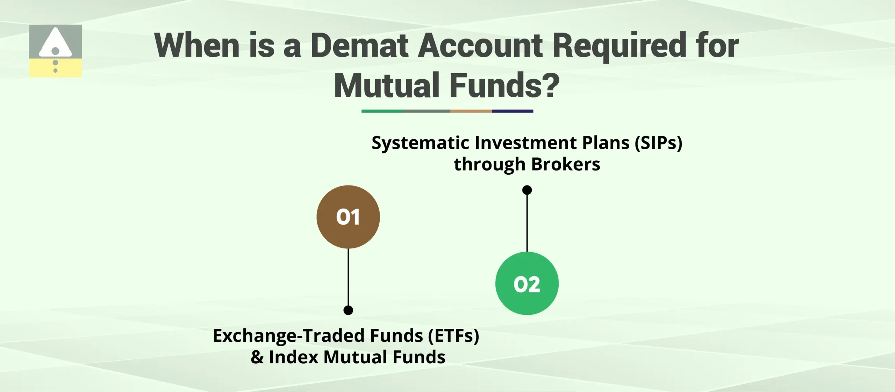

## Table of Contents

## What is a Demat account and how does it relate to mutual funds?

A Demat account is like a bank account for your shares and securities, but instead of money, it holds your investments in electronic form. It stands for "dematerialized" account, which means it converts paper-based physical certificates into electronic records, making it easier and safer to manage your investments. You need a Demat account to buy and sell shares in the stock market, and it's managed by two depositories in India: NSDL and CDSL.

When it comes to mutual funds, a Demat account isn't always necessary, but it can be useful. Mutual funds are investment vehicles that pool money from many investors to buy a diversified portfolio of stocks, bonds, or other assets. You can buy mutual fund units directly from the fund house or through a distributor without needing a Demat account. However, if you want to hold your mutual fund units in electronic form, similar to shares, you can choose to have them in your Demat account. This can make it easier to keep track of all your investments in one place and can simplify the process of buying and selling.

## Is it mandatory to have a Demat account to invest in mutual funds?

No, it's not mandatory to have a Demat account to invest in mutual funds. You can buy mutual fund units directly from the fund house or through a distributor without needing a Demat account. This means you can start investing in mutual funds easily, without the extra step of opening a Demat account.

However, if you want, you can choose to hold your mutual fund units in a Demat account. This can be helpful if you want to keep all your investments in one place. It makes it easier to track your investments and can simplify buying and selling. But remember, it's an option, not a requirement.

## What are the benefits of holding mutual funds in a Demat account?

Holding mutual funds in a Demat account can make managing your investments easier. When you keep all your investments, like stocks and mutual funds, in one place, it's simpler to keep track of everything. You can see how your investments are doing without having to check different accounts. Plus, if you want to buy or sell your mutual fund units, doing it through a Demat account can be faster and more convenient.

Another benefit is that a Demat account can make transferring your mutual fund units to someone else easier. If you want to give your investments to family members or anyone else, it's simpler to do this through a Demat account. Also, having your mutual funds in a Demat account can help keep them safe. Since everything is electronic, you don't have to worry about losing physical certificates or dealing with paperwork.

## How can one open a Demat account specifically for mutual fund investments?

Opening a Demat account for mutual fund investments is easy and can be done online or by visiting a bank or brokerage firm. First, you need to choose a Depository Participant (DP), which could be a bank or a brokerage firm that offers Demat account services. You can check their websites or visit their offices to see if they support mutual fund investments in a Demat account. Once you've picked a DP, you'll need to fill out an account opening form. This form will ask for your personal details like your name, address, and PAN card number. You'll also need to submit copies of your identity proof, address proof, and a recent photograph.

After submitting your documents, the DP will process your application. This might take a few days, and once it's approved, you'll get your Demat account number and a unique client ID. With this, you can start adding mutual funds to your Demat account. You'll need to link your mutual fund investments to your Demat account by contacting the mutual fund house or your distributor and asking them to transfer your existing units or to buy new units directly into your Demat account. This way, all your mutual fund investments will be in one place, making it easier to manage them.

## What are the costs associated with maintaining a Demat account for mutual funds?

Keeping a Demat account for your mutual funds will cost you some money. There are two main types of fees you might have to pay. The first one is an annual maintenance fee, which is what you pay every year just to keep your Demat account open. This fee can be different depending on which bank or brokerage firm you choose. It's usually not very high, but it's something to think about. The second type of fee is called a transaction fee. This is what you pay every time you buy or sell mutual fund units through your Demat account. Again, the amount can vary, so it's good to check with your Depository Participant (DP) to know exactly what you'll be paying.

Sometimes, there might be other small fees too, like a fee for converting your physical certificates to electronic form or for transferring your mutual fund units to someone else. But these are not common for mutual funds since they are usually already in electronic form. It's a good idea to ask your DP about all the possible costs before you open a Demat account. This way, you won't be surprised by any extra charges later on.

## Can existing mutual fund units be converted into Demat form?

Yes, you can convert your existing mutual fund units into Demat form if you want to keep them in your Demat account. To do this, you need to talk to your mutual fund house or the place where you bought your mutual funds. They can help you move your units into your Demat account. It's like moving your money from one bank account to another, but instead of money, you're moving your mutual fund units.

Once you've asked your mutual fund house to convert your units, they'll work with your Demat account provider to make the transfer. This process usually doesn't take long, but it can vary. After the transfer is done, you'll see your mutual fund units in your Demat account, all in one place with your other investments. This can make it easier to keep track of everything and manage your investments.

## How does the process of buying and selling mutual funds change with a Demat account?

When you have a Demat account, buying and selling mutual funds can be a bit different from the usual way. Normally, you would buy mutual funds directly from the fund house or through a distributor. But with a Demat account, you can buy and sell mutual funds through your broker or bank, just like you do with stocks. This means you can place buy and sell orders through your Demat account's trading platform, which might be more convenient if you're already used to trading stocks.

Selling mutual funds through a Demat account also works differently. Instead of going back to the fund house or distributor to sell your units, you can do it through your Demat account. You'll need to place a sell order through your trading platform, and once it's processed, the money from the sale will go into your linked bank account. This can make the whole process of buying and selling mutual funds easier and faster, especially if you like having all your investments in one place.

## What are the risks of holding mutual funds in a Demat account compared to a non-Demat form?

Holding mutual funds in a Demat account doesn't really add new risks compared to holding them in non-Demat form. The main risks with mutual funds, like market risk or the chance that the value of your investment might go down, are the same whether you hold them in a Demat account or not. The safety of your investments is still protected by the rules and regulations of the mutual fund industry, so you don't have to worry about losing your units just because they're in a Demat account.

However, there are a few things to keep in mind. If you hold your mutual funds in a Demat account, you might have to pay some extra fees, like annual maintenance fees or transaction fees, which could add up over time. Also, if you forget to pay these fees or if there's a problem with your Demat account, it could affect your ability to buy or sell your mutual fund units. But these are more about the management of your account rather than new risks to your investments themselves.

## How does the nomination process work for mutual funds in a Demat account?

When you have mutual funds in a Demat account, the nomination process is a bit different from holding them in non-Demat form. In a Demat account, you can nominate someone to receive your investments if something happens to you. To do this, you need to fill out a nomination form provided by your Depository Participant (DP), which is the bank or brokerage firm that manages your Demat account. You'll need to provide details about your nominee, like their name, address, and relationship to you. Once you submit the form, the nomination will be linked to your entire Demat account, which means it will cover all the investments you hold there, including your mutual funds.

The good thing about nominating someone in your Demat account is that it makes things easier for your family or loved ones if you're not around. They won't have to go through a lot of paperwork or legal processes to get your mutual fund units. The nominee can simply contact the DP and follow the process to transfer the units into their name. Just remember, you can change or cancel your nomination anytime by filling out another form with your DP. It's a good idea to keep your nomination up to date to make sure your wishes are followed.

## What are the tax implications of holding mutual funds in a Demat account?

The tax implications of holding mutual funds in a Demat account are the same as holding them in non-Demat form. Whether your mutual funds are in a Demat account or not, you'll still have to pay taxes on the income they generate. This includes capital gains tax, which you pay when you sell your mutual fund units for a profit, and dividend distribution tax, which is paid on the dividends you receive from your mutual funds. The rates and rules for these taxes are set by the government and apply to all mutual fund investments, no matter how you hold them.

The only difference might be in how you report your investments. If you hold your mutual funds in a Demat account, it can be easier to keep track of your transactions and calculate your taxes. Your Demat account statements will show all your buys and sells, which can help when you're filling out your tax returns. But remember, the actual tax you have to pay doesn't change just because your mutual funds are in a Demat account. It's all about how you manage and report your investments.

## How do dividend and interest payments work for mutual funds held in a Demat account?

When you hold mutual funds in a Demat account, the way you get dividend and interest payments is a bit different from holding them in non-Demat form. If your mutual fund pays out dividends or interest, these payments will be credited directly to your linked bank account. You don't have to do anything extra to get your money; it's all automatic. This makes it easy because you don't have to keep track of different accounts or wait for checks in the mail.

The process is the same as if you held the mutual funds outside of a Demat account. The mutual fund house will send the dividend or interest payment to your Demat account provider, who will then transfer it to your bank account. So, even though the payments go through your Demat account, you still get your money the same way as everyone else. It's just a bit more streamlined and convenient.

## What advanced features are available for managing mutual funds through a Demat account?

Managing mutual funds through a Demat account comes with some cool features that can make things easier for you. One of the best things is that you can see all your investments in one place. This means you can keep an eye on your mutual funds along with your stocks and other securities without having to log into different accounts. It's like having a single dashboard for all your money matters. Plus, you can set up alerts and notifications to know when your mutual funds are doing well or if there's something you need to act on.

Another handy feature is the ability to automate your investments. With a Demat account, you can set up systematic investment plans (SIPs) for your mutual funds. This means you can decide to put a fixed amount of money into your mutual funds every month without having to remember to do it yourself. It's all automatic, which can help you stay disciplined with your investments. Also, if you want to sell your mutual fund units, you can do it quickly through your Demat account's trading platform, making it easier to manage your money when you need to.

## References & Further Reading

[1]: Bergstra, J., Bardenet, R., Bengio, Y., & Kégl, B. (2011). ["Algorithms for Hyper-Parameter Optimization."](https://dl.acm.org/doi/10.5555/2986459.2986743) Advances in Neural Information Processing Systems 24.

[2]: ["Advances in Financial Machine Learning"](https://www.amazon.com/Advances-Financial-Machine-Learning-Marcos/dp/1119482089) by Marcos Lopez de Prado

[3]: ["Evidence-Based Technical Analysis: Applying the Scientific Method and Statistical Inference to Trading Signals"](https://www.amazon.com/Evidence-Based-Technical-Analysis-Scientific-Statistical/dp/0470008741) by David Aronson

[4]: ["Machine Learning for Algorithmic Trading"](https://github.com/stefan-jansen/machine-learning-for-trading) by Stefan Jansen

[5]: ["Quantitative Trading: How to Build Your Own Algorithmic Trading Business"](https://www.amazon.com/Quantitative-Trading-Build-Algorithmic-Business/dp/1119800064) by Ernest P. Chan