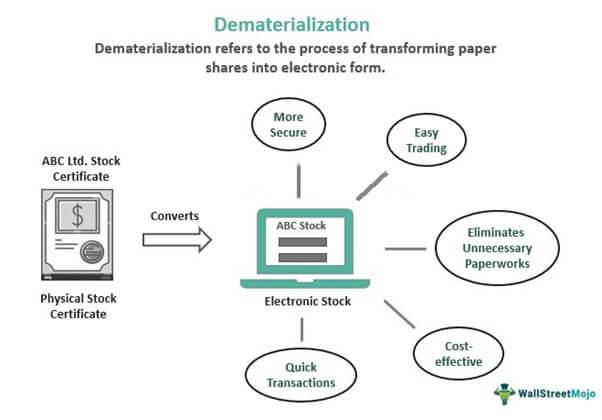

Understanding financial investments involves navigating a diverse landscape of instruments and strategies, including mutual funds, demat accounts, and sophisticated trading methodologies like algorithmic trading. Each of these components uniquely contributes to an investor's portfolio management, which can be significantly enhanced through informed decision-making and strategic resource allocation. This article aims to explore the roles and significance of demat accounts, mutual funds, and algorithmic trading, offering insights into how they may be integrated and leveraged to optimize investment strategies effectively.

A demat account, short for dematerialization account, serves as a digital repository where investors can securely hold securities such as stocks and mutual funds. It eliminates the need for physical share certificates, thereby reducing associated risks such as theft, loss, or damage. The ability to engage in electronic transactions simplifies the buying and selling process, allowing for increased efficiency and control over a diverse portfolio, making the demat account a critical component for any modern investor.



Mutual funds, on the other hand, provide an accessible avenue for diversification by pooling capital from multiple investors to invest in a range of securities. This financial vehicle grants investors the benefit of professional management and the opportunity to spread risk across a broader market spectrum without the necessity of engaging in individual security analysis. Mutual funds can be accessed directly or via a demat account, each approach offering its own advantages in terms of transaction convenience and portfolio integration.

Algorithmic trading represents an advancement in trading strategy execution by utilizing pre-programmed algorithms to perform trades at speeds beyond human capabilities. This method enables the execution of trades based on predefined strategies, enhancing precision and efficiency while minimizing the potential for human error. However, it also demands significant technological infrastructure and understanding to perform effectively and manage risks associated with algorithm malfunctions or market anomalies.

By examining the essential functions and interplay of demat accounts, mutual funds, and algorithmic trading, this article provides a comprehensive outlook on how these elements can be harmonized to forge a diversified, efficient, and adaptable investment approach. As the financial landscape continues to evolve, understanding these concepts and their interconnectedness becomes crucial in maximizing returns and cushioning against market volatilities. Explore the opportunities these financial instruments and strategies present, and equip yourself with the knowledge to pursue your investment aspirations confidently.

## Table of Contents

## What is a Demat Account?

A dematerialization (DEMAT) account is an electronic system designed for investors to hold and manage financial instruments, such as stocks and mutual funds, in a secure and dematerialized format. This system eradicates the need for physical share certificates, thereby reducing the risks associated with document loss, theft, or damage, and significantly streamlining the overall process of securities management.

DEMAT accounts enhance the efficiency and security of trading by facilitating easy electronic transfers of securities. By allowing for the quick buying and selling of securities through a digital platform, investors can react promptly to market changes, optimize transaction timing, and potentially improve investment returns. 

One of the standout advantages of DEMAT accounts is their ability to organize and access a diversified portfolio conveniently from a single interface. This consolidated approach simplifies the process of tracking and managing investments, supporting better-informed decision-making by providing a comprehensive view of one’s financial assets in real-time.

Opening a DEMAT account is considered a vital step for modern investors aiming for effective engagement in today’s financial markets. The digital nature of DEMAT accounts aligns with contemporary trading practices, enabling seamless integration with online trading platforms and other investment tools. This accessibility and ease of management are crucial in an era characterized by rapid technological advancements and evolving financial landscapes.

## Understanding Mutual Funds

Mutual funds are collective investment schemes designed to pool monetary contributions from a diverse group of investors, aiming to create a sizable fund for investment in various securities. These could include stocks, bonds, money market instruments, or a blend of these asset classes, depending on the fund's objectives.

By investing in mutual funds, individual investors gain access to a professionally managed portfolio. This professional management is a key advantage as fund managers possess the expertise and resources to make informed investment decisions, conduct comprehensive research, and continuously monitor the markets and individual securities. This level of management can be especially beneficial for investors who may not have the time or knowledge to manage their own portfolios effectively.

Investors have the option to purchase mutual funds directly from the fund company or via a DEMAT account. Direct purchases often involve transactions through an asset management company's portal or through financial advisors, which can provide personalized service. On the other hand, buying through a DEMAT account offers ease of transaction and oversight, as all investments are consolidated into a single electronic platform. This can be particularly useful for systematic investment plans (SIPs) or other recurring investment strategies, as the electronic nature of a DEMAT account facilitates regular and automated transactions.

While it is not mandatory to have a DEMAT account to invest in mutual funds, possessing one can significantly streamline the investment process. A DEMAT account ensures a paperless transaction environment, reducing the risk associated with maintaining physical documentation and facilitating quick processing of redemptions and fund transfers.

Selecting mutual funds that align with an individual's risk tolerance and financial goals requires an understanding of the diverse categories of mutual funds available. These categories can include equity funds, debt funds, hybrid funds, and sector-specific funds, each with varying levels of risk and potential returns. For instance:

- **Equity Funds**: Primarily invest in stocks and have the potential for high returns but come with higher risk.
- **Debt Funds**: Focus on generating consistent income with relatively lower risk by investing in bonds and other fixed-income instruments.
- **Hybrid Funds**: Offer a balance between equity and debt investments, aiming to benefit from both growth and income.
- **Sector or Thematic Funds**: Invest in specific sectors like technology or energy, or themes like social responsibility, and carry a higher risk due to concentration in a particular area.

Understanding these categories and evaluating factors such as past performance, expense ratio, and the fund manager's track record are critical steps in selecting the right mutual funds for an investment portfolio. By aligning mutual fund choices with one's risk profile and investment horizon, investors can strategize to meet their financial aspirations efficiently.

## The Role of Algorithmic Trading in Modern Investing

Algorithmic trading is a sophisticated approach to executing financial trades using pre-set computer algorithms, allowing for automated decision-making and precise transaction execution at high speed. This method of trading has transformed the financial markets by introducing efficiencies and reducing the reliance on human intervention.

One of the primary benefits of [algorithmic trading](/wiki/algorithmic-trading) is its ability to execute trades based on predetermined strategies with enhanced precision and efficiency. These strategies vary widely, catering to different trading objectives and market conditions. Common algorithmic trading strategies include:

1. **Trend-following Strategies**: These algorithms are designed to capitalize on market trends by identifying continuing price momentum. They automatically buy assets in uptrending markets or sell in downtrends, reducing the need for constant market monitoring.

2. **Arbitrage Strategies**: Arbitrage involves exploiting price differentials of the same asset in different markets. Algorithms can quickly identify and act on these opportunities, executing trades faster than human traders, ensuring profitability before the price discrepancy is corrected.

3. **Mean Reversion Strategies**: This approach is based on the statistical premise that prices and returns will eventually move back toward the mean or average. Algorithms programmed to recognize deviations from this average can exploit the temporary mispricing of assets.

4. **Event-driven Strategies**: These strategies rely on breaking news or events such as corporate earnings reports, economic announcements, or geopolitical events that influence market prices. Algorithms can process vast amounts of information and react instantaneously to capitalize on such opportunities.

Despite its advantages, algorithmic trading presents several challenges. One of the significant hurdles is the necessity for substantial technological infrastructure and investment. Establishing robust systems with minimal latency and high processing capabilities is crucial to gaining a competitive edge. Moreover, technical glitches and software bugs pose risks, potentially leading to significant financial losses if not managed properly.

The following Python example demonstrates a basic trend-following algorithm using a simple moving average:

```python
import pandas as pd
import numpy as np

# Load historical data
data = pd.read_csv('historical_stock_data.csv')
data['SMA_20'] = data['Close'].rolling(window=20).mean()
data['SMA_50'] = data['Close'].rolling(window=50).mean()

# Define trading signals
data['Signal'] = 0
data.loc[data['SMA_20'] > data['SMA_50'], 'Signal'] = 1  # Buy Signal
data.loc[data['SMA_20'] < data['SMA_50'], 'Signal'] = -1  # Sell Signal

# Execute trades
data['Position'] = data['Signal'].shift()

# Compute returns
data['Returns'] = data['Close'].pct_change()
data['Strategy'] = data['Position'].shift() * data['Returns']

# Calculate cumulative returns
cumulative_returns = (1 + data['Strategy']).cumprod() - 1
print(f"Cumulative strategy return: {cumulative_returns.iloc[-1]:.2%}")
```

This code snippet calculates simple moving averages and generates buy or sell signals based on their crossover. Although simplified, such strategies form the foundation of more complex algorithmic systems.

In conclusion, algorithmic trading has become an integral component of modern investing, offering unparalleled advantages in speed, accuracy, and [volume](/wiki/volume-trading-strategy) handling. As technology continues to advance, the potential for algorithmic trading to shape financial markets will only grow, requiring continuous adaptation and learning for those looking to leverage its full capabilities.

## Connecting DEMAT Accounts, Mutual Funds, and Algo Trading

DEMAT (Dematerialization) accounts, mutual funds, and algorithmic trading represent integral components of modern investment strategies, with each offering unique functionalities that when interconnected, enhance the efficiency and effectiveness of portfolio management.

DEMAT accounts, serving as electronic storage for securities, allow investors to manage their investments in a consolidated and efficient manner. By holding shares, bonds, and mutual funds electronically, DEMAT accounts eliminate the need for physical certificates, thereby streamlining the transaction process and reducing associated risks such as loss or damage. They offer investors a consolidated view of their holdings, facilitating better tracking, analysis, and decision-making in financial markets.

The integration of algorithmic trading with DEMAT accounts marks a significant advancement in investment technology. Algorithmic trading involves the use of pre-defined code to execute trades at remarkable speeds and precision, based on quantitative analysis and market conditions. When paired with a DEMAT account, this allows automated buying and selling of mutual funds, aligning trades with specific investment strategies and market trends. For instance, an algorithm can be programmed to allocate funds into equity mutual funds when market [volatility](/wiki/volatility-trading-strategies) is low or switch to debt funds during periods of high risk, optimizing return potential while managing risk exposure.

Here's a simple example of how algorithmic trading might interface with a DEMAT account using Python:

```python
def execute_trade(decision):
    if decision == "buy":
        print("Buying mutual funds...")
        # Logic to integrate with DEMAT account to buy mutual funds
    elif decision == "sell":
        print("Selling mutual funds...")
        # Logic to integrate with DEMAT account to sell mutual funds
    else:
        print("Holding position")

# Simulate a market condition analysis
market_condition = "low volatility"
if market_condition == "low volatility":
    execute_trade("buy")
elif market_condition == "high volatility":
    execute_trade("sell")
else:
    execute_trade("hold")
```

Utilizing this synergy between DEMAT accounts, mutual funds, and algorithmic trading furnishes investors with a robust investment strategy. It allows for dynamic adjustment of portfolios in response to market shifts, ensuring agility and optimization of returns. Furthermore, understanding and utilizing these interconnected elements can significantly enhance an investor's capacity to manage and mitigate risks effectively.

By intertwining these components, investors can craft an investment approach that not only maximizes financial gains but also provides the agility to navigate the ever-evolving market landscape. Such integration empowers investors with an improved framework for efficiency, security, and adaptability in financial investment.

## Benefits and Challenges

Benefits of utilizing a DEMAT account are primarily centered around enhanced security and the efficiency it brings to the management of securities. By digitizing the holding of securities, DEMAT accounts significantly reduce the risk of loss, theft, or physical damage which is often associated with traditional paper-based share certificates. The electronic format simplifies the transactional process, allowing investors to perform buying and selling operations with convenience and accuracy. This streamlined process not only saves time but also offers a centralized platform to manage a broad asset spectrum, providing investors with greater control and oversight of their investment portfolio.

Mutual funds are established as a robust investment vehicle due to their ability to offer diversification and professional fund management. By pooling money from multiple investors, mutual funds invest in varied securities, thereby mitigating the risk inherent in individual investments. This diversification can alleviate the potential impacts of volatility on any one security, providing a smoother trajectory for portfolio growth. Furthermore, mutual funds are managed by professional fund managers who leverage their expertise to make informed investment decisions tailored to specific financial goals. This management is reflected in the potential for consistent growth, often aligned with the investor's risk tolerance and financial objectives.

Algorithmic trading is recognized for its speed and precision, attributes which are critical in the fast-paced world of financial trading. The utilization of algorithms to execute trades ensures millisecond-level timing accuracy, which can be pivotal in high-frequency trading to exploit market inefficiencies. By reducing human intervention, algorithmic trading minimizes errors and the emotional factors that might adversely affect trading decisions. Moreover, it enables investors to handle large volumes of trades effortlessly, adhering to complex strategies that would be untenable through manual trading processes.

Despite these benefits, challenges persist, particularly concerning algorithmic trading and mutual fund selection. The former demands significant technological proficiency and infrastructure, as successful algorithmic systems require sophisticated programming skills and continuous monitoring and refinement to align with shifting market dynamics. There is a substantial initial investment and ongoing risk management that must be handled to prevent unexpected losses due to system glitches or market anomalies. In the case of mutual funds, selecting an appropriate fund necessitates a deep understanding of market conditions and fund performance metrics. Investors must evaluate their risk profiles and financial goals meticulously, a process that can be daunting given the multitude of funds available.

To achieve long-term financial success, investors are encouraged to balance these elements—DEMAT accounts, mutual funds, and algorithmic trading—strategically. Thoughtful alignment with one's investment goals is crucial. By harnessing the security and convenience of DEMAT accounts, the growth potential of mutual funds, and the precision of algorithmic trading, investors can construct a well-rounded strategy that maximizes returns while mitigating risks.

## Conclusion

Integrating DEMAT accounts, mutual funds, and algorithmic trading provides a holistic framework for investors aiming to manage their finances effectively. These components, when combined, enable the crafting of a diversified, efficient, and scalable investment strategy. The use of DEMAT accounts simplifies the management of securities by offering a secure and centralized platform for electronic transactions. This makes it easier for investors to keep track of their portfolios, adding efficiency to the process of buying and selling financial instruments.

Mutual funds offer the advantage of diversification along with professional management, enabling even novice investors to access a wide range of assets. They are integral in minimizing risks while providing consistent growth opportunities. Algorithmic trading, on the other hand, leverages technology to execute trades with speed and precision, allowing for the management of high-volume transactions under predefined rules. This not only reduces the potential for human error but also enhances the capability to respond swiftly to market fluctuations.

Understanding the intricacies of each component and how they complement each other is essential for maximizing returns while preparing for market volatilities. As the financial market landscape evolves, maintaining an up-to-date knowledge base and an adaptable strategy will be crucial. By aligning the nuances of DEMAT accounts, mutual funds, and algorithmic trading with individual financial goals, investors can fine-tune their portfolios to navigate uncertainties and capitalize on emerging opportunities.

Embarking on your investment journey with a thorough understanding of these tools is a decisive step toward achieving financial aspirations. The integration of these elements not only bridges the gap between traditional and modern investment practices but also equips investors to meet future financial challenges with confidence.

## References & Further Reading

[1]: Bergstra, J., Bardenet, R., Bengio, Y., & Kégl, B. (2011). ["Algorithms for Hyper-Parameter Optimization."](https://dl.acm.org/doi/10.5555/2986459.2986743) Advances in Neural Information Processing Systems 24.

[2]: ["Advances in Financial Machine Learning"](https://www.amazon.com/Advances-Financial-Machine-Learning-Marcos/dp/1119482089) by Marcos Lopez de Prado

[3]: ["Evidence-Based Technical Analysis: Applying the Scientific Method and Statistical Inference to Trading Signals"](https://www.amazon.com/Evidence-Based-Technical-Analysis-Scientific-Statistical/dp/0470008741) by David Aronson

[4]: ["Machine Learning for Algorithmic Trading"](https://github.com/stefan-jansen/machine-learning-for-trading) by Stefan Jansen

[5]: ["Quantitative Trading: How to Build Your Own Algorithmic Trading Business"](https://www.amazon.com/Quantitative-Trading-Build-Algorithmic-Business/dp/1119800064) by Ernest P. Chan