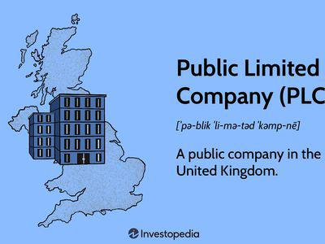

In the rapidly evolving landscape of global finance, a thorough comprehension of company structures and their implications for business operations is increasingly essential. As businesses continue to navigate dynamic markets, the efficiency and success of their operations often hinge on their foundational structure. This article examines the intricacies of public limited companies (PLCs), exploring how their corporate frameworks influence business strategies, particularly in the context of modern financial practices like algorithmic trading.

Public limited companies play a pivotal role in the global financial ecosystem. They offer a form of corporate organization where shares are available to the public through stock exchanges, providing significant fundraising opportunities. This structure not only affects how companies access capital but also impacts their governance, transparency, and market interactions. PLCs, distinguished by features such as limited liability and a distinct legal identity, are well-suited to industries that demand large-scale capital investment. Their operational and strategic flexibilities make them a popular choice for businesses aiming to scale quickly and enhance their competitive edge.



Algorithmic trading, which relies heavily on data, mathematical models, and technology, further demonstrates the importance of strategic corporate structuring. Automated trading systems utilize algorithms to make high-speed decisions, demanding considerable computational resources and investment in cutting-edge technology. The alignment of a corporation's structure with these technological demands is crucial. For PLCs in particular, their ability to raise capital through public markets can be leveraged to invest in these necessary technologies, thereby enhancing their trading efficiency and market responsiveness.

This comprehensive analysis seeks to illuminate the bridge between corporate structures and contemporary trading strategies. By understanding the nuances of PLCs and their business requirements, we can gain valuable insights into how these structures support and enhance the strategic objectives of algorithmic trading, ultimately driving progress in the financial sector.

## Table of Contents

## Understanding Public Limited Companies

Public limited companies (PLCs) represent a pivotal corporate entity designed to facilitate the raising of capital by allowing shares to be publicly traded on the stock exchange. This structure distinguishes itself from other corporate forms due to its unique features and implications for economic participation and governance.

### Characteristics of Public Limited Companies

One of the fundamental characteristics of a PLC is the concept of limited liability. This means that shareholders are only liable up to the amount of their investment in the company, thereby encouraging investment by minimizing personal financial risk. This feature is critical not only for attracting a broad base of investors but also for promoting economic stability and entrepreneurship.

Additionally, PLCs possess a distinct legal identity, separate from their owners. This means the company itself can own property, enter into contracts, and is liable for its actions independently of its shareholders. This legal separation provides additional security to investors, as their personal assets are protected from litigation against the company.

### Role in Economic Sectors

PLCs play significant roles across various sectors by enabling large-scale fundraising through public share offerings. This ability to attract substantial capital is essential for businesses that require significant investment in infrastructure, research and development, and global expansion initiatives. Sectors such as technology, pharmaceuticals, and manufacturing heavily rely on PLC structures to support their capital-intensive operations and innovation drives.

### Governance, Transparency, and Market Interactions

The governance structure of a PLC typically includes a board of directors responsible for making high-level managerial decisions, separate from day-to-day operations frequently handled by appointed managers. This separation ensures a system of checks and balances, designed to protect shareholders' interests and guide strategic direction. Shareholder meetings are a crucial component, providing a platform for investors to influence major business decisions through voting rights.

In terms of transparency, PLCs are subject to stringent regulatory requirements compared to private companies. They must adhere to financial reporting standards, disclose financial statements quarterly, and maintain open communication with shareholders via annual reports. This requirement for transparency is intended to build trust with investors and protect the integrity of financial markets.

### Key Differences with Private Companies

When comparing PLCs to private companies, several key differences emerge. While private companies often enjoy greater operational flexibility and fewer regulatory constraints, they lack the ability to raise capital through public markets. This can limit their growth potential and ability to scale operations swiftly.

Privacy is another distinct characteristic of private companies. They are not required to disclose detailed financial information to the public, which can be advantageous for maintaining competitive secrecy but may also deter potential investors wary of financial ambiguities.

Conversely, the public nature of PLCs provides easy visibility into the company's financial health and operational performance, often resulting in increased scrutiny and pressure to maintain consistent profitability and compliance with investor expectations. However, this transparency can enhance credibility and trustworthiness in the eyes of consumers and partners, potentially expanding market opportunities.

In summary, while PLCs demand rigorous governance and transparency, they offer unparalleled opportunities for capital acquisition and expansion, particularly in industries where substantial financial backing is crucial for sustained success. Understanding these nuances is essential for stakeholders aiming to navigate the complex dynamics of modern corporate finance effectively.

## Corporate Structure and Business Requirements

Public limited companies (PLCs) represent a pivotal corporate structure in global finance, primarily defined by their ability to offer company shares to the public through stock exchanges. Establishing a PLC involves meeting specific business prerequisites, including registration, setting up a shareholder structure, and adhering to regulatory compliance. These elements are crucial to ensure that the company's foundation is robust and capable of supporting large-scale operations and public trading.

### Registration and Compliance

The process of establishing a PLC begins with its registration, which typically includes submitting a memorandum of association and articles of association. The memorandum outlines the company's name, the purpose of its formation, and its capital division into shares. The articles of association set out internal management guidelines, shareholder rights, and the roles and responsibilities of directors.

Regulatory compliance for PLCs involves adhering to the legal requirements set by governmental and financial regulatory bodies. These regulations are designed to ensure transparency, protect shareholder interests, and maintain market integrity. Compliance includes regular submission of financial reports, auditing, and adhering to specific financial and operational standards that vary across jurisdictions.

### Shareholder Structures

The shareholder structure is a critical aspect of PLCs, allowing them to raise significant capital. Shareholders, ranging from individual investors to large institutions, provide financing by purchasing company shares. The structure dictates shareholder rights, such as voting on significant corporate matters, which influences company policy and performance.

The decision-making process within a PLC is greatly impacted by its shareholder base. Major shareholders often have considerable influence over strategic decisions, including mergers, acquisitions, and leadership changes. However, the PLC structure ensures that all shareholders, regardless of size, have a say in the company’s fate through annual general meetings and proxy voting.

### Roles of the Board of Directors and Shareholders

The board of directors plays a vital role in shaping the company's strategic direction and governance. They are elected by shareholders to oversee management and protect shareholder interests. Their responsibilities include setting corporate policies, ensuring regulatory compliance, and making high-level strategic decisions, such as entering new markets or launching major initiatives.

Shareholders, while not directly involved in day-to-day operations, hold substantial power through their voting rights. They can influence key decisions, such as director appointments, mergers, and changes in corporate strategy. This participatory role ensures a check-and-balance system, aligning the company’s objectives with shareholder interests.

### Influence on Agility and Financial Strategy

The corporate structure of a PLC provides a framework that balances operational agility with the stringent requirements of public accountability. This combination often influences a company’s financial strategies, such as capital allocation and risk management.

PLCs are generally well-positioned to scale operations due to their ability to access public capital markets. However, the need for transparency and regulatory compliance can sometimes slow decision-making processes, affecting agility. Balancing these dynamics requires strategic foresight, often placing a premium on leadership capable of managing complex stakeholder relationships and regulatory landscapes.

Ultimately, the structure of a PLC, shaped by its foundational requirements and governance mechanisms, plays a crucial role in determining its financial strategy and operational scalability. As companies navigate the competitive global landscape, understanding these interdependencies becomes essential for leveraging the full potential of a PLC framework.

## Algorithmic Trading and Its Intersection with Corporate Structures

Algorithmic trading is a sophisticated methodology that utilizes computer algorithms to execute trades at high speeds and frequencies that are impossible for human traders. This form of trading is characterized by the use of complex mathematical models and formulas to make decisions about the timing, price, and quantity of trades. Key concepts of [algorithmic trading](/wiki/algorithmic-trading) include automated execution strategies, order types, and various analytical models that interpret market data to capitalize on trading opportunities.

To successfully implement algorithmic trading, firms require several technological prerequisites. These include high-performance computing capabilities to process vast amounts of market data in real time, low-latency network infrastructure to ensure rapid trade execution, and robust data management systems to handle historical and streaming data. Additionally, sophisticated software platforms that incorporate [machine learning](/wiki/machine-learning) algorithms and predictive analytics are integral to developing and deploying effective trading strategies.

Public Limited Companies (PLCs) have unique advantages that enable them to effectively engage in algorithmic trading. One of the primary benefits is their ability to raise significant capital through public markets. This financial capability allows PLCs to invest heavily in the necessary technologies and infrastructure that support high-frequency trading. The ability to access public funding means that PLCs can allocate substantial resources towards developing innovative trading systems and integrating cutting-edge technologies.

Regulatory compliance is a critical concern for algorithmic trading operations, and it varies depending on the corporate structure and jurisdiction. For PLCs, compliance with financial regulations is mandatory, requiring adherence to standards such as the Markets in Financial Instruments Directive II (MiFID II) in the European Union or the Securities Exchange Act in the United States. These regulations dictate the transparency, reporting, and fair trading practices necessary to maintain market integrity. This compliance burden influences business operations by necessitating the implementation of risk management systems and internal controls to prevent market abuse and ensure data security.

In summary, the intersection of corporate structures and algorithmic trading reveals that PLCs are well-positioned to benefit from the technological advancements that drive modern trading strategies. Their ability to raise capital and navigate complex regulatory landscapes enables them to allocate resources effectively and maintain competitive advantage in the fast-paced world of financial markets.

## Aligning Corporate Structures with Trading Objectives

Public Limited Companies (PLCs) offer unique advantages when aligning corporate structures with trading objectives and capitalizing on market opportunities. The ability of PLCs to raise capital by issuing shares to the public enables the funding of sophisticated trading technologies, including algorithmic trading platforms. This strategic alignment allows for enhanced responsiveness to market dynamics and increased operational flexibility.

**Integration of Algorithmic Trading in PLCs**

Large, publicly traded companies like Goldman Sachs and Morgan Stanley integrate algorithmic trading strategies to increase their competitiveness. These companies utilize complex algorithms for trade execution, risk management, and market prediction, leveraging vast data sets to optimize trading performance. The public structure of these firms facilitates the acquisition of the technological infrastructure necessary for such operations, funded through equity and debt raised from public markets.

For example, Python has become a critical tool within this landscape due to its rich ecosystem of libraries for data analysis, machine learning, and financial modeling. A simplified implementation of a basic trading algorithm in Python may involve the use of pandas for data manipulation, NumPy for numerical calculations, and libraries such as TA-Lib for technical analysis:

```python
import pandas as pd
import numpy as np
import talib

# Load historical market data
data = pd.read_csv('market_data.csv')

# Calculate simple moving average
data['SMA'] = talib.SMA(data['Close'], timeperiod=20)

# Generate trading signals
data['Signal'] = np.where(data['Close'] > data['SMA'], 1, -1)

# Assume initial conditions and simulate trades
initial_capital = 10000
data['Portfolio Value'] = initial_capital + (data['Signal'].cumsum() * data['Close'].diff())
```

**Transition from Private to Public and Trading Impact**

The transition from a private to a public company can significantly influence trading capabilities and strategies. For instance, the initial public offerings (IPOs) of companies like Facebook and Alibaba marked a pivotal shift, enabling these firms to access capital they previously could not as private entities. This transition not only broadens the financial toolkit available but also increases scrutiny and regulatory requirements, which can impact trading strategies.

Increased capital allows these companies to invest in advanced algorithmic trading systems, granting them a competitive edge in speed, accuracy, and market insight. Consequently, shifting from a private to a publicly listed entity can reshape a company’s trading landscape, providing new avenues for growth and innovation in trading tactics.

In summary, aligning corporate structures, particularly PLCs, with trading objectives opens up significant opportunities for implementing algorithmic trading, fueled by broader access to capital resources. The strategic move from a private to a public corporate structure can transform a company’s ability to compete in high-frequency trading environments, positioning them advantageously within the global financial markets.

## Case Studies and Real-world Applications

Examining real-world applications of algorithmic trading underscores the significance of corporate structures in achieving operational effectiveness and market proficiency. This section analyzes the cases of NVIDIA and Apple, which exemplify how public limited companies (PLCs) leverage algorithmic trading strategies for enhanced market positioning and financial performance.

### NVIDIA

NVIDIA, a leader in graphics processing units (GPU) and [artificial intelligence](/wiki/ai-artificial-intelligence) (AI), utilizes its extensive technological infrastructure to drive innovations in algorithmic trading. As a PLC, NVIDIA's ability to raise capital through public markets allows the company to invest heavily in research and development. This capital influx supports the development of advanced trading algorithms powered by their own high-performance GPUs.

NVIDIA’s strategy demonstrates several key lessons:

1. **Investment in Technology**: By leveraging its cutting-edge GPUs, NVIDIA enhances the speed and efficiency of trading algorithms. This edge is crucial in high-frequency trading where nanoseconds can determine profitability.

2. **Market Adaptability**: As a PLC, NVIDIA benefits from a vast reserve of capital to swiftly adapt to market shifts, allowing the implementation of new trading strategies without the financial constraints often faced by private companies.

3. **Regulatory Compliance**: Operating as a PLC necessitates strict adherence to regulatory standards, fostering a culture of transparency and accountability. This compliance reduces the risk of legal repercussions from trading activities, providing a stable foundation for expanding algorithmic strategies.

### Apple

Apple, another example, utilizes algorithmic trading to manage its substantial financial portfolio. The company's approach integrates machine learning and data analytics to optimize trading decisions. Apple’s status as a PLC facilitates this through:

1. **Robust Data Utilization**: Access to global markets and substantial financial resources allows Apple to incorporate large datasets into its trading algorithms. This enables real-time analysis and decision-making, crucial for maintaining a competitive advantage in volatile markets.

2. **Strategic Flexibility**: Apple's public structure facilitates broader strategic options in its trading practices, benefiting from shareholder insights and the ability to attract strategic investments.

3. **Innovation and Risk Management**: With a large investment in R&D, Apple continuously innovates its algorithmic models to mitigate risks associated with market fluctuations and to capture emergent opportunities.

### Lessons Learned and Best Practices

From these case studies, several best practices emerge for companies looking to leverage their corporate structure for algorithmic trading:

- **Capital Investment**: Adequate capital investment in technology and infrastructure is vital for developing robust algorithmic systems capable of handling large volumes of data and executing complex trades.

- **Regulatory Adherence**: Maintaining rigorous compliance with trading regulations not only safeguards against legal issues but also enhances corporate credibility and investor confidence.

- **Continuous Innovation**: Investing in R&D for algorithmic models is essential to keep pace with technological advancements and market trends, ensuring sustained competitive edge.

- **Data Integration**: Effective use of data analytics is pivotal in refining algorithmic strategies and improving decision-making accuracy.

In conclusion, the strategic use of corporate structures like PLCs can enable large companies to effectively harness algorithmic trading to enhance their financial strategies and maintain market leadership.

## Conclusion

Public limited companies (PLCs) represent a versatile corporate structure crucial in today’s global financial landscape, notably for their ability to raise capital through public stock offerings. This characteristic positions PLCs advantageously when aligning with modern algorithmic trading strategies. Their distinct legal identity and limited liability contribute to their prominence in diverse economic sectors, allowing them to harness capital-raising capabilities to invest significantly in advanced trading technologies.

The establishment and operation of a PLC demand adherence to regulatory standards, diligent governance by boards of directors, and strategic shareholder engagement. This governance framework not only impacts strategic decision-making but also enhances agility and scalability in financial strategies, both of which are crucial for leveraging algorithmic trading’s full potential. Moreover, the intersection of corporate structures with algorithmic trading underscores the need for regulatory compliance, dictating how strategies are implemented and influencing overall business operations.

When selecting corporate structures conducive to trading activities, PLCs offer a strategic advantage through their ability to access vast capital resources required for heavy investments in technological infrastructure. This setup is essential for competitive algorithmic trading, where speed and data accessibility are paramount.

Looking forward, the integration of PLCs with algorithmic trading is expected to continue evolving, driven by increasing digitalization and stringent regulatory requirements. Companies will need to balance capital generation capabilities with compliance mandates, ensuring they remain at the forefront of technological advancements in trading. This evolving landscape necessitates strategic foresight to ensure that corporate governance and structure remain aligned with rapidly changing financial technologies and market opportunities.

## References & Further Reading

1. **Books and Texts:**
   - Brealey, R. A., Myers, S. C., & Allen, F. (2020). *Principles of Corporate Finance*. This text provides an extensive background on corporate finance principles, including the nuances of different corporate structures such as public limited companies.
   - Markowitz, H. (1952). *Portfolio Selection*. This landmark book in finance discusses strategies that are crucial for understanding the foundational frameworks behind algorithmic trading.

2. **Scholarly Articles:**
   - Hendershott, T., Jones, C. M., & Menkveld, A. J. (2011). *Does Algorithmic Trading Improve Liquidity?* An insightful investigation into how algorithmic trading affects market conditions, liquidity, and the broader trading environment.
   - Easley, D., López de Prado, M., & O'Hara, M. (2012). *The Microstructure of the “Flash Crash”: Flow Toxicity, Liquidity Crashes and the Probability of Informed Trading*. This article provides an in-depth look into market incidents influenced by algorithmic trading, with implications for corporate transparency and governance.

3. **Legal Documents and Regulatory Guidelines:**
   - The Financial Conduct Authority (FCA). *Regulatory Framework for Algorithmic Trading*. [FCA Official Website](https://www.fca.org.uk/). Essential for understanding the compliance requirements for PLCs in the context of algorithmic trading.
   - U.S. Securities and Exchange Commission (SEC). *Guidelines on Public Corporations and Trading Activities*. [SEC Official Website](https://www.sec.gov/). Offers comprehensive information on the legal landscape governing public corporations and their trading operations.

4. **Online Resources and Reports:**
   - World Federation of Exchanges (2020). *Trends in the Global Marketplace*. [WFE Website](https://www.world-exchanges.org/). This report provides updates on trends affecting public companies and trading strategies globally, with a focus on innovations and regulatory changes.
   - Clifford Chance. *Algorithmic Trading: A Guide to the New Frontier*. [Clifford Chance Website](https://www.cliffordchance.com/). A guide exploring both the legal and practical challenges associated with algorithmic trading for large corporations.

5. **Further Studies and Courses:**
   - Coursera offers several courses on algorithmic trading and corporate finance which can be valuable for those looking to expand their knowledge in these areas.
   - MIT OpenCourseWare provides free courses covering both corporate governance structures and applied econometric techniques relevant to algorithmic trading.

Readers are encouraged to use these resources to expand their understanding of the constantly shifting landscape of corporate structures and trading technologies, gaining insights into how they interplay to shape modern business operations.