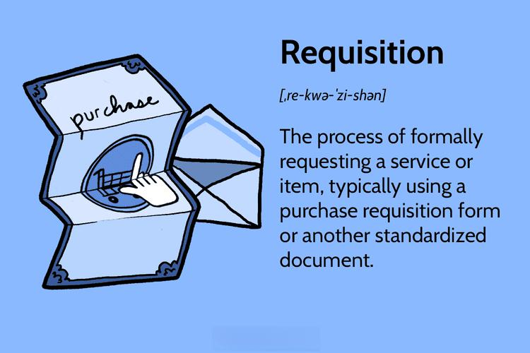

In the rapidly evolving world of business, procurement and trading processes are two areas where technological advancements have made a significant impact. Automation and algorithms are central to these advancements, transforming traditional methodologies into more efficient, data-driven approaches. This article will examine the intersection of requisition processes, business process improvement, procurement strategies, and algorithmic trading.

Understanding the integration of these components is essential for businesses seeking a competitive edge. By leveraging technology, companies can streamline operations, enhance decision-making capabilities, and ultimately improve overall performance. The focus will be to explain how modern procurement and trading methodologies are being shaped by automation and algorithms, highlighting processes that enhance efficiency and drive innovation.

Automation in procurement offers numerous benefits, such as increased speed and accuracy in the requisition process. Digital requisition systems have replaced manual methods, minimizing delays and ensuring timely acquisition of goods and services. Likewise, algorithmic trading employs computer algorithms to execute and manage trades at speeds and frequencies beyond human capability, promoting a more objective trading approach and revolutionizing financial markets.

Overall, the intersection of requisition, procurement, and algorithmic trading illustrates a transformative potential that businesses can harness to improve accuracy, reduce costs, and achieve strategic advantages. As we explore these areas, it becomes evident that staying informed of technological advancements is crucial for businesses aiming to navigate and thrive in this ever-evolving landscape.

## Table of Contents

## Understanding the Requisition Business Process

The requisition process serves as a foundational element in procurement, setting in motion the entire purchasing cycle. This process begins with the identification of needs, where organizations must clearly understand and define the goods or services they require to meet operational objectives. Once these needs are identified, authorization is the next critical step. It ensures that the requisition aligns with budgetary constraints and strategic priorities, involving stakeholders to validate and approve the requests.

Subsequently, the formal request for goods or services is made, marking the transition from need recognition to active procurement. Streamlining these steps within the requisition process can substantially enhance a company's overall efficiency. By reducing manual workloads and eliminating bottlenecks, streamlined processes ensure that requisitions are handled swiftly and effectively.

The incorporation of technological advancements, particularly digital requisition systems, has revolutionized how requisitions are managed. These systems enhance the speed and accuracy of the process by employing electronic forms, automated workflows, and centralized databases. Such tools minimize human error, facilitate real-time tracking, and provide stakeholders with clear insights into requisition statuses.

Optimizing the requisition process is crucial to minimizing delays in procurement, ensuring that goods and services are obtained precisely when needed. Delays can disrupt operations, leading to increased costs and missed opportunities. Therefore, organizations invest in modernizing their requisition systems to align with their strategic goals, leveraging technology to support timely decision-making and resource allocation.

## Procurement in the Modern Era

Procurement refers to the strategic approach of sourcing and acquiring goods and services necessary for an organization's operations. In the modern era, procurement has evolved beyond simple purchasing to become a complex, strategic function that emphasizes building robust relationships with suppliers and leveraging technology to enhance supply chain efficiency.

One of the key components of modern procurement is strategic sourcing, a systematic and comprehensive process aimed at maximizing the value of an organization's spend. This involves assessing and selecting suppliers based on factors such as cost, quality, and reliability, as well as aligning procurement strategies with overall organizational goals. Spend analysis plays a crucial role in this process by providing insights into spending patterns, which can guide the development of more effective sourcing strategies. By analyzing historical spend data, organizations can identify opportunities to consolidate spending, negotiate better terms, and eliminate inefficiencies.

Contract management is another vital aspect of effective procurement. It ensures that contractual agreements with suppliers are adhered to and that both parties fulfill their obligations. Effective contract management mitigates risks, assures quality and delivery, and helps avoid potential disputes. It requires maintaining detailed records of contract terms, monitoring supplier performance, and having a clear process for any necessary renegotiations.

The integration of [artificial intelligence](/wiki/ai-artificial-intelligence) (AI) and [machine learning](/wiki/machine-learning) into procurement processes is playing a transformative role in driving innovation and achieving cost savings. These technologies can automate routine tasks, such as purchase order approvals and invoice processing, significantly reducing manual workload and operational costs. Furthermore, AI can analyze large volumes of procurement data to predict market trends, optimize pricing strategies, and improve supplier selection, thereby enhancing decision-making capabilities.

Automated procurement solutions facilitate transparency by providing real-time data on procurement activities. This transparency is crucial not just for monitoring compliance with internal policies but also for adhering to external regulations. It also supports better collaboration with suppliers by enabling more accurate order tracking, delivery scheduling, and inventory management.

In conclusion, modern procurement is characterized by strategic, technology-driven practices that are essential for achieving organizational efficiency and competitive advantage. By focusing on supplier relationships, adopting advanced technologies, and emphasizing strategic sourcing and effective contract management, organizations can significantly enhance their procurement performance and derive greater value from their expenditure.

 to Algorithmic Trading

Algorithmic trading is the sophisticated practice of employing computer programs to execute trading strategies at high speed and frequency. These strategies are predefined and designed to maximize financial gains by leveraging the computing capabilities that best human efforts might fall short of. At their core, trading algorithms are based on a series of rules and mathematical models that account for market variables and exploit profitable trading opportunities in real-time.

In practice, [algorithmic trading](/wiki/algorithmic-trading) systems can efficiently analyze vast datasets to discern patterns, forecast trends, and execute trades accordingly. This capability allows for precise adjustments to trading orders and timely portfolio management, which are pivotal in ensuring optimal outcomes. For instance, algorithms can continuously scan market conditions, determining the best times to buy or sell assets based on real-time data inputs, which include historical price movements, trading [volume](/wiki/volume-trading-strategy), and even news sentiment analysis.

One of the key benefits of algorithmic trading is its ability to minimize the emotional biases and irrational decision-making that often plague human traders. By adhering to a systematic approach, algorithmic trading promotes objectivity, enhancing the likelihood of consistent returns. This reduction in emotional trading can be particularly advantageous in volatile markets, where fear and greed can lead to significant financial missteps.

High-frequency trading ([HFT](/wiki/high-frequency-trading-strategies)) represents a specialized subclass of algorithmic trading. HFT strategies involve executing a large number of orders at extremely rapid speeds, often within microseconds. This form of trading capitalizes on fleeting opportunities that yield minute profits, which can accumulate substantially across thousands or millions of trades. The edge in HFT lies in its technological infrastructure, which requires cutting-edge hardware and co-location services to minimize latency—ensuring that the algorithms can react to market changes faster than their competitors.

The precision and speed enabled by algorithmic trading have fundamentally transformed financial markets. This transformation is marked by increased [liquidity](/wiki/liquidity-risk-premium), reduced bid-ask spreads, and enhanced market efficiency. However, it also raises concerns about market stability and the unchecked influence of automated systems. Overall, as algorithmic trading continues to evolve, it stands as a testament to the profound impact of technology on modern finance, driving both opportunities and challenges in equal measure.

## Integration of Systems: From Requisition to Algo Trading

The integration of requisition and procurement processes with algorithmic trading stands at the forefront of modern business innovation, providing a seamless operational framework that significantly enhances decision-making capabilities. This integration leverages data-driven algorithms to optimize procurement schedules, thus allowing organizations to make more informed purchasing decisions based on current market trends and supplier performance metrics. By analyzing vast amounts of data, algorithms can identify patterns and predict the optimal timing for procurement activities, ensuring that organizations procure goods and services at the best possible prices and conditions.

Moreover, risk management within procurement can greatly benefit from algorithmic models designed to predict potential disruptions. These models use historical data and predictive analytics to anticipate events that may negatively impact supply chains, such as geopolitical issues, natural disasters, or market [volatility](/wiki/volatility-trading-strategies). By incorporating these predictions into their strategies, organizations can proactively develop contingency plans, thereby minimizing risks and maintaining operational continuity.

Automation plays a key role in this integrated system by enabling the automatic placement and monitoring of orders. This results in higher efficiency as it reduces the need for manual intervention and human errors, thereby lowering operational costs and increasing accuracy. For example, an automated system can instantly adjust order quantities based on real-time inventory levels and forecasted demand, ensuring the optimal allocation of resources.

Moreover, cross-industry collaboration fosters the adoption of best practices from both procurement and algorithmic trading domains. By sharing insights and technological advancements, industries can collectively advance their strategies and operations. For instance, lessons learned from the trading sector, where algorithms have long optimized transaction speeds and market analysis, can be adapted to enhance procurement strategies, leading to more agile and responsive supply chain management. 

In conclusion, the convergence of requisition, procurement, and algorithmic trading underpins a strategic shift towards more efficient, data-informed business processes. Organizations that leverage these systems can gain significant competitive advantages, propelling them towards sustained growth and innovation in a rapidly changing market landscape.

## Challenges and Considerations

The rapid integration of automation and algorithmic solutions in procurement and trading offers manifold benefits but also presents significant challenges. One primary concern revolves around data security. As companies transition to digital and algorithm-driven processes, the potential for data breaches and unauthorized access increases. Ensuring robust security measures to protect sensitive information in procurement and trading systems is fundamental.

Integration complexities also pose a noteworthy hurdle. Combining various systems, such as digital requisition tools with algorithmic trading platforms, requires seamless interoperability. This integration must account for the diverse data formats and software languages used across systems while ensuring that data remains accurate and synchronized.

Compliance with trading regulations and procurement policies is essential. Algorithmic trading, particularly, operates under strict regulatory scrutiny, with bodies such as the Securities and Exchange Commission (SEC) and the Commodity Futures Trading Commission (CFTC) in the United States enforcing rules to prevent market manipulation and ensure fairness. Likewise, procurement processes must adhere to corporate governance and ethical sourcing standards. Constant vigilance is required to align algorithmic strategies and procurement activities with these regulations to avoid legal repercussions.

The demand for skilled personnel who can manage and interpret algorithmic outputs is growing. These individuals must possess both technical proficiency and comprehensive domain knowledge to ensure the effective use of automated systems. Training and development programs should be prioritized to equip the workforce with the necessary skills to handle complex algorithms and optimize their potential.

Balancing automation with human intuition and expertise is crucial. While algorithms can process vast amounts of data and execute transactions rapidly, human oversight is necessary to manage exceptions, interpret nuanced market signals, and make strategic decisions that require contextual understanding. Organizations should aim for a synergy between automated processes and human judgment to harness the full advantages of both.

Finally, as technology continues to evolve, staying updated with the latest advancements in AI and machine learning is vital. Businesses must be proactive in adapting to new technologies, exploring innovative solutions, and refining existing systems to remain competitive. Continuous education, investment in research and development, and fostering a culture of innovation can help organizations navigate the ever-changing technological landscape effectively.

## Conclusion

The convergence of requisition business processes, procurement, and algorithmic trading represents a significant shift in how businesses can operate with greater efficiency and effectiveness. By harnessing advanced algorithmic solutions, organizations can dramatically enhance operational efficiency. These solutions streamline workflows, automate repetitive tasks, and allow for the precise analysis of vast datasets, thereby reducing human error and increasing the speed of decision-making processes.

Organizations that effectively integrate these disciplines can benefit from improved accuracy in forecasting and inventory management, leading to reduced costs. For instance, predictive algorithms can model supplier behaviors and market conditions to optimize procurement schedules, minimizing holding costs and ensuring timely stock replenishment. This level of precision offers strategic advantages by enabling businesses to respond swiftly to market changes and consumer demands, positioning them ahead of competitors who rely on traditional methods.

As technology continues to evolve, ongoing innovation and adaptation are crucial for organizations to fully leverage these advancements. Embracing a culture of agility and learning allows companies to remain at the forefront of technological developments, ensuring they maximize the potential of integrated systems. However, businesses must also prepare to navigate the complexities associated with these technological integrations. This includes addressing challenges such as data security, maintaining compliance with regulations, and managing the integration complexity of disparate systems.

In essence, the successful convergence of requisition, procurement, and algorithmic trading not only necessitates technological adaptation but also a strategic approach to change management and skill development within organizations. By prioritizing these areas, businesses can unlock new levels of operational excellence and long-term competitiveness.

## References & Further Reading

[1]: Bergstra, J., Bardenet, R., Bengio, Y., & Kégl, B. (2011). ["Algorithms for Hyper-Parameter Optimization."](https://papers.nips.cc/paper/4443-algorithms-for-hyper-parameter-optimization) Advances in Neural Information Processing Systems 24.

[2]: ["Advances in Financial Machine Learning"](https://www.amazon.com/Advances-Financial-Machine-Learning-Marcos/dp/1119482089) by Marcos Lopez de Prado

[3]: ["Evidence-Based Technical Analysis: Applying the Scientific Method and Statistical Inference to Trading Signals"](https://www.amazon.com/Evidence-Based-Technical-Analysis-Scientific-Statistical/dp/0470008741) by David Aronson

[4]: ["Machine Learning for Algorithmic Trading"](https://github.com/stefan-jansen/machine-learning-for-trading) by Stefan Jansen

[5]: ["Quantitative Trading: How to Build Your Own Algorithmic Trading Business"](https://www.amazon.com/Quantitative-Trading-Build-Algorithmic-Business/dp/1119800064) by Ernest P. Chan