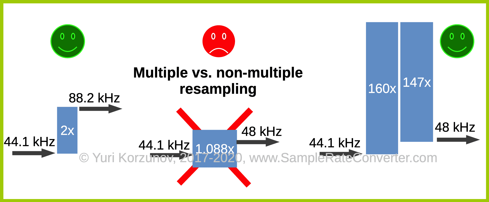

Algorithmic trading relies heavily on the efficiency and precision of data analysis. At the core of this domain is resampling tick data, a technique essential for converting high-frequency, granular data into formats that are more manageable and useful for traders. This practice transforms comprehensive tick-by-tick datasets into summarized data that can be represented in time frames such as one minute, hourly, or daily intervals, commonly referred to as OHLC (Open, High, Low, Close) data. Through this process, traders can better navigate market trends and adjustments, gaining insights that are crucial for making informed trading decisions.

In this analysis, we focus on how resampling can be implemented effectively, emphasizing its significance in algorithmic trading strategies. Being precise and reliable in resampling tick data is not only about managing data but about reformulating it in ways that make substantial impacts on decision-making processes and strategy development. C# is highlighted as a particularly effective programming language in trading applications due to its performance capabilities and access to robust financial libraries, making it suitable for managing complex resampling tasks.



The sophistication brought about by resampling influences the creation of trading strategies that are responsive to historical trends while ensuring streamlined, actionable insights. As the landscape of trading continues to evolve, traders who master resampling techniques are better equipped to refine and optimize their strategies, potentially gaining a competitive edge in dynamic financial markets.

## Table of Contents

## Understanding Resampling in Algorithmic Trading

Resampling in algorithmic trading refers to the conversion of raw tick data into various time frames, commonly represented using OHLC (Open, High, Low, Close) data. This conversion is essential for digesting the vast amount of high-frequency data generated in the financial markets. High-frequency data is known for its richness in detail, capturing every transaction at the moment it occurs, which results in a wealth of information for analysis. However, due to its exhaustive nature, this data can also be overwhelming and filled with noise, making it difficult for traders to extract meaningful insights.

By resampling tick data into longer time frames, such as minutes, hours, or days, traders can gain a panoramic view of market trends. This broader perspective is crucial for discerning trends and patterns that may not be apparent in raw data. For instance, resampled data helps traders identify price directions, volatility patterns, and potential entry and exit points, thus facilitating more informed decision-making.

The significance of resampling extends into the terrain of quantitative analysis within trading algorithms. By simplifying data sets, resampling enables algorithms to process information more efficiently, aiding in the development of robust trading strategies. This transformation involves aggregating tick data into OHLC values, where:

- **Open** is the first price of the time period,
- **High** is the maximum price,
- **Low** is the minimum price,
- **Close** is the last price of the time period.

Such aggregation compiles the data into comprehensible visual formats, such as candlestick charts, aiding traders and algorithms in interpreting market behavior over the selected periods.

Moreover, resampling facilitates the computation of various technical indicators used by traders to predict future price movements. Indicators like moving averages, Bollinger Bands, and Relative Strength Index (RSI) rely on processed time series data, making resampling indispensable for accurate quantitative analysis.

In conclusion, resampling transforms high-frequency tick data into a more manageable form, enabling traders to leverage historical trends and make decisions based on a clearer understanding of the market dynamics. It stands as a crucial component in the architecture of [algorithmic trading](/wiki/algorithmic-trading) by enhancing the quality and reliability of quantitative analyses.

## Technical Implementation Using C#

C# is a widely adopted language for developing trading applications due to its efficient performance capabilities and access to comprehensive financial libraries. To implement tick data resampling in C#, a structured approach that includes defining classes and methods is fundamental.

### Code Structure for Handling Tick Data

The primary step involves creating a class structure that efficiently stores tick data. A typical class, `TickData`, would include properties for time, price, and [volume](/wiki/volume-trading-strategy), represented as follows:

```csharp
public class TickData
{
    public DateTime Time { get; set; }
    public decimal Price { get; set; }
    public int Volume { get; set; }
}
```

### Resampling Operations

The core of resampling involves transforming this tick data into Open, High, Low, and Close (OHLC) values for specified time intervals, such as minutes or hours. Here is a simplified structure of a method performing the resampling operation:

```csharp
public class Resampler
{
    public List<OhlcData> ResampleToOhlc(List<TickData> ticks, TimeSpan interval)
    {
        var result = new List<OhlcData>();
        var groupedTicks = ticks.GroupBy(t => t.Time.Ticks / interval.Ticks);

        foreach (var group in groupedTicks)
        {
            var ohlcData = new OhlcData
            {
                Time = new DateTime(group.First().Time.Ticks / interval.Ticks * interval.Ticks),
                Open = group.First().Price,
                High = group.Max(t => t.Price),
                Low = group.Min(t => t.Price),
                Close = group.Last().Price
            };
            result.Add(ohlcData);
        }

        return result;
    }
}
```

### Calculating OHLC Values

The calculation of OHLC values within each time frame is critical for maintaining data accuracy, which directly impacts trading strategies. The code adopts a `groupBy` approach to aggregate tick data into defined intervals, calculating:

- **Open**: The first price in the interval
- **High**: The highest price reached in the interval
- **Low**: The lowest price
- **Close**: The last price in the interval

### Example Snippet

This C# code snippet demonstrates how the above classes and methods work together to resample and transform tick data:

```csharp
List<TickData> tickData = GetTickData();  // Assume this gets data from a source
TimeSpan interval = TimeSpan.FromMinutes(1);
Resampler resampler = new Resampler();

List<OhlcData> ohlcData = resampler.ResampleToOhlc(tickData, interval);

// OHLC data now contains the resampled data ready for strategy analysis
```

By implementing such a structure, trading firms can convert high-frequency tick data into actionable insights, ensuring that data-driven decisions are based on accurate and well-organized information. The careful execution of these techniques is a key aspect of maintaining a competitive edge in algorithmic trading.

## Advantages of Resampling

Trading firms utilize resampling to derive strategic insights from extensive volumes of financial data, thereby enhancing their decision-making processes and market positioning. The transformation of raw tick data into structured formats such as OHLC (Open, High, Low, Close) is the cornerstone of refined quantitative analysis. This process involves several advantages that bolster trading efficiency and effectiveness.

Firstly, resampling improves the accuracy of data analysis by consolidating high-frequency data into digestible segments. This consolidation reduces noise and allows for cleaner dataset interpretations. Traders can analyze market trends over customizable periods, such as minutes, hours, or days, aligning data representation with specific trading objectives. For instance, implementing customized periods can optimize short-term trading strategies by focusing on specific market sessions.

Secondly, resampling enhances risk management practices. By structuring data into a more manageable format, traders can identify potential risk factors more efficiently. The aggregation of data points over selected intervals simplifies the monitoring of price volatilities and market anomalies, key considerations in developing robust risk mitigation strategies.

Another significant advantage of resampling lies in the development of indicator-based trading strategies. By transforming granular data into actionable insights, resampling facilitates the calculation of technical indicators, such as moving averages and Bollinger Bands. This structuring allows traders to formulate and adapt strategies based on historical trends and predictive models. For example, a simple moving average (SMA) can be calculated over different time frames to smooth out price data and identify trends. The formula for SMA is:

$$
\text{SMA} = \frac{\sum_{i=1}^{N} P_i}{N}
$$

where $N$ is the number of periods and $P_i$ is the price at each period.

Additionally, successful case studies have demonstrated that firms employing advanced resampling techniques often secure competitive advantages in volatile markets. By tailoring data analysis to meet strategic goals, these firms can react to market changes with precision and agility. The correlation between sophisticated data handling and market success underscores the importance of resampling in modern algorithmic trading.

In conclusion, resampling serves as a pivotal process that transforms raw tick data into strategic assets for trading firms. Its application in accuracy enhancement, risk management, indicator development, and competitive positioning fosters an environment where data-driven strategies thrive.

## Challenges and Solutions

One of the primary challenges in resampling tick data lies in maintaining data integrity across different time frames. This issue stems from the need to accurately convert high-frequency tick data into aggregated data points, such as Open, High, Low, Close (OHLC) values for different periods, without losing critical market information.

A commonly used tool for resampling in Python is the Pandas library. While it is highly popular due to its data manipulation capabilities, Pandas has limitations when it comes to handling financial data resampling. These limitations often lead to potential inaccuracies, especially when dealing with irregular time intervals or financial markets data that require precise calculations.

To address these limitations, custom resampling functions are developed specifically for financial data, providing more robust solutions. These functions involve several key components:

1. **Precise Time Interval Calculations**: Accurate computation of intervals ensures that each tick is assigned to the correct resampled time frame. This involves handling leap seconds, various time zones, and other temporal adjustments.

2. **Handling Irregular Data**: Financial data often contains gaps due to non-trading hours or market holidays. Effective resampling must account for these irregularities to avoid skewed results. Techniques such as forward filling or interpolation can be employed to address missing data.

3. **Accurate OHLC Computations**: The computation of OHLC values needs to accurately reflect the market conditions within each resampled period. Custom algorithms often implement checks and balances to ensure the opening price is the first trade of the period, and similarly for closing, high, and low prices.

Below is a simplified example of a custom resampling strategy using Python:

```python
import pandas as pd
import numpy as np

def custom_resample(tick_data, period='1Min'):
    # Ensure data is sorted by time
    tick_data = tick_data.sort_index()

    # Resample and compute OHLC
    ohlc_dict = {
        'price': {
            'open': 'first',
            'high': 'max',
            'low': 'min',
            'close': 'last'
        },
        'volume': 'sum'
    }

    resampled = tick_data.resample(period).apply(ohlc_dict)

    # Handle missing data
    resampled.fillna(method='ffill', inplace=True)  # Forward fill NaN values if necessary

    return resampled

# Example tick data
tick_data = pd.DataFrame({
    'price': np.random.rand(100),
    'volume': np.random.randint(1, 100, size=100)
}, index=pd.date_range('2023-01-01', periods=100, freq='T'))

resampled_data = custom_resample(tick_data)
print(resampled_data.head())
```

This code demonstrates a basic approach to implementing a custom resampling function, focusing on maintaining data accuracy through precise aggregation logic.

Alternative solutions include adopting specialized financial libraries like Quantlib or higher-level frameworks tailored for trading applications that inherently handle the nuances of financial data. These libraries often feature built-in functions for more reliable [backtesting](/wiki/backtesting) and real-time trading data preparation, leveraging their advanced algorithms for highly dynamic financial environments.

Adhering to best practices in data management, such as continuously validating data integrity and ensuring that all resampling procedures are thoroughly tested, remains crucial for traders. By implementing these solutions, trading firms can significantly enhance their data accuracy and reliability, which are fundamental to successful algorithmic trading strategies.

## Conclusion

Resampling is a fundamental process that converts tick data into invaluable analytical tools for algorithmic trading. Understanding and mastering resampling techniques, particularly using C#, is critical for the development of robust trading algorithms. This proficiency enables traders and developers to accurately interpret market behaviors by structuring historical data into more manageable and insightful formats, thereby enhancing strategy formulation.

A significant strategic advantage emerges from the ability to restructure data accurately, allowing traders to derive precise insights from historical trends. The process aligns closely with contemporary market needs, where data-driven decision-making is pivotal. By tailoring resampling methods to reflect various market conditions, trading firms can refine their strategies to gain a competitive edge.

Adopting custom resampling solutions not only boosts the accuracy of trading models but also empowers traders to leverage high-frequency data effectively. Customized solutions address common challenges such as irregular data intervals and inaccuracies in standardised libraries, facilitating reliable backtesting and operational efficiency in real-time trading scenarios.

The dynamic nature of financial markets necessitates continuous innovation in resampling techniques. As trading technologies evolve, so does the demand for sophisticated data-processing methodologies that can handle extensive datasets with precision and agility. Ongoing advancements in this field promise new opportunities for traders and developers, pushing the boundaries of what's possible in algorithmic trading. By staying ahead of these innovations, traders can position themselves to excel in competitive financial markets, ultimately driving performance through superior data analysis capabilities.

## References & Further Reading

[1]: Lopez de Prado, M. (2018). ["Advances in Financial Machine Learning."](https://www.amazon.com/Advances-Financial-Machine-Learning-Marcos/dp/1119482089) Wiley.

[2]: Aronson, D. (2006). ["Evidence-Based Technical Analysis: Applying the Scientific Method and Statistical Inference to Trading Signals."](https://onlinelibrary.wiley.com/doi/book/10.1002/9781118268315) Wiley.

[3]: Jansen, S. (2020). ["Machine Learning for Algorithmic Trading."](https://github.com/stefan-jansen/machine-learning-for-trading) Packt Publishing.

[4]: Chan, E. P. (2008). ["Quantitative Trading: How to Build Your Own Algorithmic Trading Business."](https://github.com/ftvision/quant_trading_echan_book) Wiley.

[5]: Manketelow, R., & Hoyle, M. (2018). ["Algorithmic Trading: Winning Strategies and Their Rationale."](https://www.amazon.com/Algorithmic-Trading-Winning-Strategies-Rationale/dp/1118460146) Wiley.

[6]: ["C# for Financial Markets"](https://www.amazon.com/Financial-Markets-Daniel-J-Duffy/dp/0470030089) by Daniel Duffy and Leif Andersen