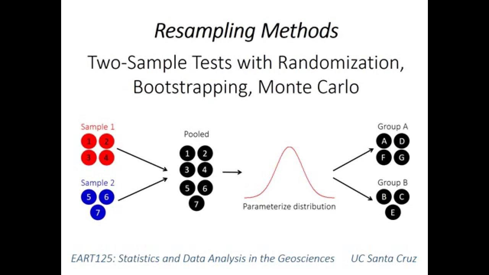

## Table of Contents

## What is resampling in data analysis?

Resampling in data analysis is a technique where we take samples from our data repeatedly to understand it better. Imagine you have a big jar of different colored candies and you want to know how many of each color are in there. Instead of counting all the candies at once, you could take a handful, count them, put them back, and then take another handful. By doing this many times, you can get a good idea of what's in the jar without counting everything at once.

This method helps us estimate how accurate our results are and make better decisions. For example, if we want to know if a new medicine works better than an old one, we can use resampling to see if the difference we see in our data is real or just by chance. By resampling, we can also test different ways to analyze our data and see which way gives us the best results. It's like trying different recipes to see which one makes the tastiest cake.

## Why is resampling important in statistical analysis?

Resampling is important in statistical analysis because it helps us understand how reliable our data is. Imagine you're trying to guess the average height of people in a city. You could measure a few people, but how do you know if those few represent everyone? By resampling, you take many small samples from your data over and over again. This way, you can see if the average height you calculated is likely to be true for the whole city or if it might change a lot with different samples.

Another reason resampling is crucial is that it allows us to test our methods without needing more data. Sometimes, we want to try a new way to analyze our information, but we can't collect new samples. Resampling lets us use the data we already have to see how well our new method works. It's like practicing a game with the same set of cards to see if a new strategy will win more often. This helps us make better decisions and improve our analysis without extra cost or time.

## What are the main types of resampling techniques?

There are two main types of resampling techniques: bootstrapping and cross-validation. Bootstrapping is like taking many handfuls of candies from a jar, counting them, and then putting them back each time. This helps us understand how much our results might change if we took different samples. It's useful when we want to estimate things like averages or confidence intervals without needing more data. For example, if we want to know the average height of people in a city, bootstrapping lets us see how much that average might vary if we measured different groups of people.

Cross-validation is another technique, and it's like splitting your data into different groups to test how well your method works. Imagine you're trying to predict the weather. You could use some of your past weather data to make a prediction model, and then use the rest of the data to see how accurate your model is. By doing this many times with different splits of the data, you can see if your method is good at predicting the weather or if it needs improvement. This is helpful when you want to make sure your analysis or prediction model works well with new data.

## How does bootstrapping work as a resampling method?

Bootstrapping is a resampling method where you take many samples from your data to understand it better. Imagine you have a jar of candies and you want to know the average size of the candies. Instead of measuring all the candies at once, you could take a handful, measure them, put them back, and then take another handful. By doing this many times, you can get a good idea of the average size without measuring every single candy. This is what bootstrapping does with data – it takes many small samples with replacement to estimate things like averages or confidence intervals.

The key to bootstrapping is that you're sampling with replacement. This means that after you take a sample, you put it back into the data set before taking the next sample. This way, the same piece of data can be chosen more than once in a single sample. By repeating this process many times, you create a lot of different samples from your original data. Then, you can calculate your statistic, like an average or a median, for each of these samples. By looking at all these calculations, you can see how much your statistic might change if you had different data, which helps you understand how reliable your results are.

## What is the difference between resampling with replacement and without replacement?

Resampling with replacement means that after you pick a piece of data, you put it back before picking the next piece. Imagine you have a bag of marbles and you want to see what colors you might get if you picked some out. If you pick a red marble, write it down, and then put it back in the bag, you could pick the same red marble again. This is like bootstrapping, where you keep the same total number of data points in each sample, but some might be picked more than once while others might not be picked at all.

Resampling without replacement is different because once you pick a piece of data, you don't put it back. Using the same marble example, if you pick a red marble and don't put it back, you can't pick that same red marble again until you start over. This method is often used in cross-validation, where you want to use all your data but in different ways. It helps make sure every piece of data is used exactly once in each sample, which can be important for getting a fair look at your data.

## Can you explain the jackknife resampling technique?

The jackknife resampling technique is a way to see how much our results might change if we leave out some of our data. Imagine you're making a cake and you want to know if one ingredient is really important. You could make the cake many times, each time leaving out a different ingredient, and see how the cake changes. In the same way, with jackknife resampling, you take your whole data set and leave out one piece at a time. You then calculate your result, like an average or a total, without that one piece. By doing this for every piece of data, you can see how much each piece affects your overall result.

This technique is useful because it helps us understand how reliable our results are. If leaving out any one piece of data changes your result a lot, then your result might not be very stable. But if leaving out different pieces doesn't change your result much, then you can be more confident that your result is solid. Jackknife resampling is simpler than some other methods like bootstrapping because it doesn't need to take samples with replacement. It's like checking the strength of a bridge by removing one part at a time to see if the bridge still holds up.

## How is cross-validation used in resampling?

Cross-validation is a resampling technique where you split your data into different parts to test how well your method works. Imagine you're learning to cook and you want to know if your recipe is good. You could use some of your past meals to make the recipe, and then use the rest of the meals to see if the recipe works well. By doing this many times with different splits of your meals, you can see if your recipe is good or if it needs to be changed. This helps you make sure your recipe, or your analysis method, works well with new data.

In cross-validation, you usually split your data into a training set and a testing set. The training set is like the meals you use to make your recipe, and the testing set is like the meals you use to see if the recipe works. You can do this in different ways, like leaving one part out at a time (called leave-one-out cross-validation) or splitting your data into equal parts (called k-fold cross-validation). By trying your method on different parts of the data, you can see if it's reliable and if it will work well when you use it on new data. This is really helpful when you want to make sure your analysis or prediction model is good and will work well in the future.

## What are the advantages of using resampling methods over traditional statistical methods?

Resampling methods like bootstrapping, jackknife, and cross-validation are great because they let you use your data in new ways without needing more data. Imagine you're trying to guess how many candies are in a jar. With traditional methods, you might only take one sample and make your guess. But with resampling, you can take many samples, put them back, and take more samples. This helps you see how much your guess might change if you had different samples, which makes your guess more reliable. Resampling also lets you test different ways to analyze your data without collecting new data, saving time and money.

Another advantage of resampling is that it's easier to understand and use, even if you're not a math expert. Traditional statistical methods can be hard to understand because they use complex formulas and assumptions about your data. Resampling doesn't need these assumptions, so it's more flexible and can work with different kinds of data. For example, if you want to know if a new medicine works better than an old one, resampling can help you see if the difference you see is real or just by chance. This makes it easier to make good decisions and understand your data better.

## In what scenarios should resampling techniques be applied?

Resampling techniques are great when you want to understand your data better without needing more data. Imagine you're trying to guess the average height of people in a city. You could measure a few people, but how do you know if those few represent everyone? By using resampling, you can take many small samples from your data over and over again. This way, you can see if the average height you calculated is likely to be true for the whole city or if it might change a lot with different samples. Resampling helps you see how reliable your results are and make better decisions without the need for extra data.

Another scenario where resampling is useful is when you want to test different ways to analyze your data. Sometimes, you might want to try a new method, but you can't collect new samples. Resampling lets you use the data you already have to see how well your new method works. It's like practicing a game with the same set of cards to see if a new strategy will win more often. This helps you improve your analysis without spending more time or money on collecting new data. Resampling is also easier to understand and use, even if you're not a math expert, because it doesn't need complex formulas and assumptions about your data.

## How can resampling help in estimating the accuracy of sample statistics?

Resampling helps in estimating the accuracy of sample statistics by taking many small samples from your data and looking at how much the results change. Imagine you're trying to guess the average height of people in a city. You could measure a few people, but how do you know if those few represent everyone? By using resampling, you take many small samples from your data over and over again. This way, you can see if the average height you calculated is likely to be true for the whole city or if it might change a lot with different samples. Resampling helps you see how reliable your results are by showing you how much your statistics might vary if you had different data.

Another way resampling helps is by letting you test different ways to analyze your data without needing more data. Sometimes, you might want to try a new method, but you can't collect new samples. Resampling lets you use the data you already have to see how well your new method works. It's like practicing a game with the same set of cards to see if a new strategy will win more often. By doing this, you can improve your analysis and get a better understanding of how accurate your sample statistics are without spending more time or money on collecting new data.

## What are the potential pitfalls or limitations of resampling methods?

Resampling methods can be really helpful, but they have some limitations. One big problem is that they can be slow and need a lot of computing power. Imagine you're trying to guess the average height of people in a city by taking many small samples over and over again. Doing this many times can take a long time, especially if you have a lot of data. Also, if your original data isn't a good sample of the whole population, resampling won't fix that. It's like trying to guess the average height of people in a city by only measuring people at a basketball game – no matter how many times you resample, you'll still get a biased result.

Another limitation is that resampling methods might not work well with small data sets. If you don't have enough data to start with, taking many small samples won't give you a good picture of your results. It's like trying to guess the average height of people in a city by only measuring a handful of people. Resampling can also be tricky to use correctly. If you don't know what you're doing, you might end up with results that are hard to understand or trust. It's important to use resampling methods carefully and understand how they work to get the best results.

## How can advanced resampling techniques be implemented in machine learning algorithms?

Advanced resampling techniques can be used in machine learning algorithms to make them work better and be more reliable. One way to do this is by using k-fold cross-validation. Imagine you're trying to teach a computer to recognize pictures of cats and dogs. You could split your pictures into different groups, use some groups to teach the computer, and then use the rest to see how well it learned. By doing this many times with different splits of the pictures, you can see if the computer is really good at recognizing cats and dogs or if it needs to learn more. This helps you make sure your machine learning model will work well with new pictures it hasn't seen before.

Another advanced resampling technique is bootstrapping, which can help you understand how reliable your machine learning model is. Imagine you're trying to guess how much people will like a new ice cream flavor based on some taste tests. You could take many small samples from your taste test data, put them back, and take more samples. By doing this many times, you can see how much your guess might change if you had different taste test data. This helps you see if your model's predictions are stable and trustworthy. Using these advanced resampling techniques in machine learning can help you improve your models and make better predictions.

## What are the advantages of resampling?

Trading firms utilize resampling to derive strategic insights from extensive volumes of financial data, thereby enhancing their decision-making processes and market positioning. The transformation of raw tick data into structured formats such as OHLC (Open, High, Low, Close) is the cornerstone of refined quantitative analysis. This process involves several advantages that bolster trading efficiency and effectiveness.

Firstly, resampling improves the accuracy of data analysis by consolidating high-frequency data into digestible segments. This consolidation reduces noise and allows for cleaner dataset interpretations. Traders can analyze market trends over customizable periods, such as minutes, hours, or days, aligning data representation with specific trading objectives. For instance, implementing customized periods can optimize short-term trading strategies by focusing on specific market sessions.

Secondly, resampling enhances risk management practices. By structuring data into a more manageable format, traders can identify potential risk factors more efficiently. The aggregation of data points over selected intervals simplifies the monitoring of price volatilities and market anomalies, key considerations in developing robust risk mitigation strategies.

Another significant advantage of resampling lies in the development of indicator-based trading strategies. By transforming granular data into actionable insights, resampling facilitates the calculation of technical indicators, such as moving averages and Bollinger Bands. This structuring allows traders to formulate and adapt strategies based on historical trends and predictive models. For example, a simple moving average (SMA) can be calculated over different time frames to smooth out price data and identify trends. The formula for SMA is:

$$
\text{SMA} = \frac{\sum_{i=1}^{N} P_i}{N}
$$

where $N$ is the number of periods and $P_i$ is the price at each period.

Additionally, successful case studies have demonstrated that firms employing advanced resampling techniques often secure competitive advantages in volatile markets. By tailoring data analysis to meet strategic goals, these firms can react to market changes with precision and agility. The correlation between sophisticated data handling and market success underscores the importance of resampling in modern algorithmic trading.

In conclusion, resampling serves as a pivotal process that transforms raw tick data into strategic assets for trading firms. Its application in accuracy enhancement, risk management, indicator development, and competitive positioning fosters an environment where data-driven strategies thrive.

## References & Further Reading

[1]: Lopez de Prado, M. (2018). ["Advances in Financial Machine Learning."](https://www.amazon.com/Advances-Financial-Machine-Learning-Marcos/dp/1119482089) Wiley.

[2]: Aronson, D. (2006). ["Evidence-Based Technical Analysis: Applying the Scientific Method and Statistical Inference to Trading Signals."](https://onlinelibrary.wiley.com/doi/book/10.1002/9781118268315) Wiley.

[3]: Jansen, S. (2020). ["Machine Learning for Algorithmic Trading."](https://github.com/stefan-jansen/machine-learning-for-trading) Packt Publishing.

[4]: Chan, E. P. (2008). ["Quantitative Trading: How to Build Your Own Algorithmic Trading Business."](https://github.com/ftvision/quant_trading_echan_book) Wiley.

[5]: Manketelow, R., & Hoyle, M. (2018). ["Algorithmic Trading: Winning Strategies and Their Rationale."](https://www.amazon.com/Algorithmic-Trading-Winning-Strategies-Rationale/dp/1118460146) Wiley.

[6]: ["C# for Financial Markets"](https://www.amazon.com/Financial-Markets-Daniel-J-Duffy/dp/0470030089) by Daniel Duffy and Leif Andersen