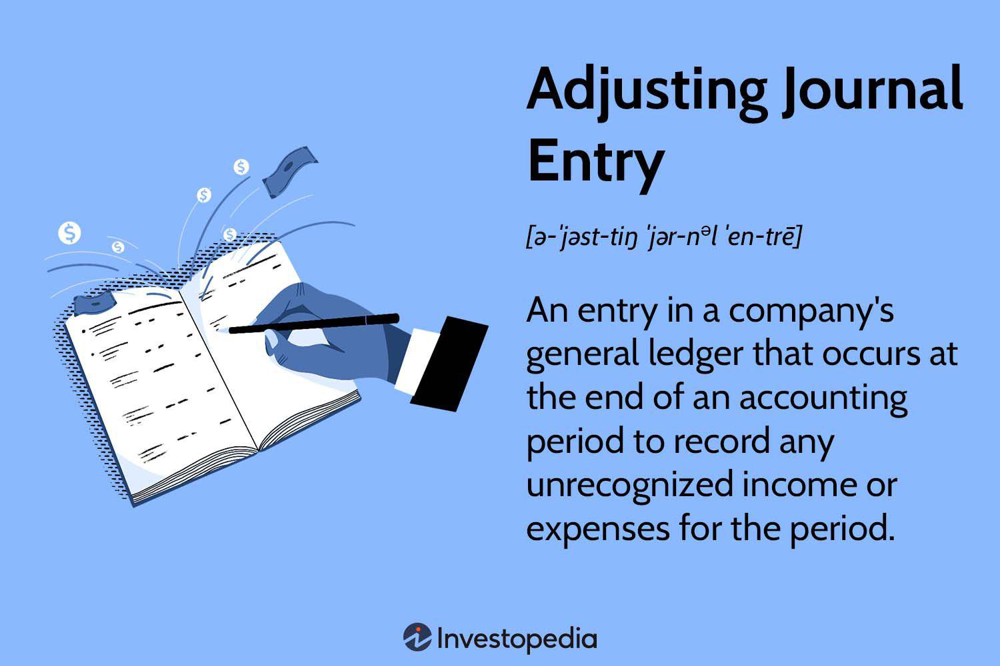

Algorithmic trading, commonly known as algo trading, represents a significant transformation in the operation of financial markets. By seamlessly integrating finance with cutting-edge technology, it automates trading processes through pre-defined strategies, which allows trades to be executed at a speed and frequency that a human trader cannot match. This technological advancement has led to increased efficiency, reduced transaction costs, and the capability to process vast volumes of data swiftly.

Within this automated trading environment, research notes hold a pivotal role. These notes provide traders and financial analysts with timely insights into market dynamics, detailed information about specific securities, and emerging industry trends. By synthesizing relevant data and delivering concise, actionable intelligence, research notes empower market participants to make informed decisions, enhance strategic planning, and anticipate shifts in market sentiment.

This article aims to explore how research notes function within the framework of algorithmic trading. It outlines their benefits, such as improving trade execution and precision, while also addressing challenges, including potential biases and the risk of over-reliance on these sources. Additionally, it examines the applications of research notes, illustrating their relevance and value in the continuously evolving landscape of algo trading. Through this comprehensive overview, traders and investors can better understand how to leverage research insights to maintain competitiveness and achieve financial objectives.

## Table of Contents

## Understanding Research Notes

A research note is a succinct, targeted document generated by investment firms aimed at providing critical insights into financial markets. These notes are invaluable to analysts, traders, and investors alike as they encapsulate essential information on market dynamics, concerning specific securities, industries, or macroeconomic events. The primary objective of research notes is to equip market participants with timely, actionable intelligence that can inform their investment decisions.

Traditionally, research notes were distributed in print form, limiting their reach and accessibility. However, with the advent of digital technology, these notes have transitioned to electronic formats such as blogs, emails, and online reports. This shift has significantly increased their accessibility, allowing market participants worldwide to access real-time updates and analyses. The digital nature of contemporary research notes facilitates rapid dissemination and integration into trading strategies and decision-making processes, enhancing market participants' agility. The evolution from print to digital also allows for the incorporation of multimedia elements, such as charts and interactive data, further enriching the information available to users.

The time-sensitive nature of research notes necessitates a rapid response from traders and investors, as market conditions can shift quickly. These documents are often written with brevity and clarity, focusing on pressing issues like earnings reports, geopolitical developments, or sudden market shifts that could impact investment portfolios. This immediacy ensures that market participants can adjust their strategies promptly in response to unfolding events.

In essence, research notes are a critical bridge between in-depth market analysis and the practical needs of market practitioners. They enable informed decision-making by providing distilled insights, trends, and forecasts that can significantly influence trading strategies and outcomes. By continually evolving and adapting to technological advancements, research notes remain a cornerstone of contemporary financial analysis and strategy formulation.

## The Function of Research Notes in Algo Trading

Algorithmic trading relies heavily on the integration of research notes to inform and enhance trading strategies. Research notes furnish traders with essential, timely information that can be incorporated into algorithmic models to improve decision-making. By offering insights into market dynamics, securities, and industry trends, these notes empower traders to adjust their strategies in response to new data. This flexibility enhances the effectiveness and responsiveness of the algorithms.

For example, when a research note highlights an upcoming macroeconomic event that could impact a specific sector, algorithmic traders can adjust their trading rules or parameters to account for potential market reactions. This proactive approach allows for more precision in executing trades, optimizing the timing and outcome based on predictive data.

Additionally, research notes serve as a communication tool within trading firms, conveying strategic shifts and tactical recommendations. This internal dissemination of knowledge ensures that all algorithmic models are aligned with the firm's current market perspective and strategic objectives. Integrating this intelligence allows algorithms to evolve in sync with the latest market conditions and firm strategies, maintaining or improving their competitive edge.

## Benefits of Integrating Research Notes with Algo Trading

Integrating research notes with [algorithmic trading](/wiki/algorithmic-trading) strategies can significantly improve market analysis, leading to more precise trading decisions. By providing the most current market insights, research notes allow algorithms to remain adaptable and responsive to the latest information. This synergy enhances the ability to identify trading opportunities, facilitating more accurate predictions regarding market movements.

Algorithmic trading benefits greatly from the real-time application of research note insights. With access to the latest data on specific securities or macroeconomic trends, algorithms can optimize trade timing and execution. For instance, if a research note indicates a potential rise in a security’s value due to favorable industry conditions, an algorithm can adjust strategies to take advantage of this information almost instantaneously. The capacity for swift response to new data can lead to improved financial outcomes.

Furthermore, the use of research notes aids in reducing human error by ensuring algorithms are continuously updated with the most relevant market context. Algorithms that incorporate these insights can be fine-tuned to reflect the most current data, minimizing the risk of outdated or erroneous trading decisions. This not only enhances the reliability of trading systems but also ensures that algorithms are aligned with the latest financial developments.

In summary, the integration of research notes with algorithmic trading mechanisms fortifies market analysis, improves trade efficiency, and reduces error margins. This collaboration between timely human analysis and automated trading processes paves the way for more robust and adaptable trading strategies.

## Challenges in Using Research Notes

One significant challenge associated with research notes is the potential bias that emerges due to conflicts of interest within financial advisory firms. These biases can lead to skewed data interpretation, which may mislead traders who rely heavily on these documents for decision-making. For example, if an advisory firm has a vested interest in a particular security, their analysis might be overly optimistic, compromising the quality and objectivity of the research note.

Ensuring the equitable distribution of information is another hurdle. Often, larger investors or high-frequency traders may gain access to critical insights sooner than smaller investors, providing them with an unfair advantage. This inequity can lead to market inefficiencies, where a subset of investors disproportionately benefits from timely data, undermining the principles of a fair and transparent market.

Additionally, there is a risk of over-reliance on research notes, which can stifle independent analysis. Traders who depend solely on these notes may overlook emerging trends or atypical market signals not covered in traditional reports. Such reliance can limit a trader's ability to innovate or identify unique opportunities. Encouraging a balanced approach that combines these notes with independent evaluation can mitigate these risks, fostering a more comprehensive trading strategy.

## Technological Advances and Future Trends

Advancements in [artificial intelligence](/wiki/ai-artificial-intelligence) (AI) and [machine learning](/wiki/machine-learning) are transforming algorithmic trading, offering promising avenues for integrating research insights into trading models. Machine learning algorithms can process vast amounts of financial data with unprecedented speed and precision, identifying patterns and correlations that are not immediately apparent to human traders. This capability enhances the decision-making process in algorithmic trading, allowing for more informed adjustments based on quantitative insights derived from research notes.

Real-time data analytics are crucial in this evolving landscape. Modern trading algorithms are increasingly leveraging high-frequency data streams, which enable them to react promptly to market changes. Technologies such as Apache Kafka and cloud-based platforms facilitate the efficient handling of real-time data, ensuring that insights from research notes can be rapidly incorporated into trading strategies. These tools allow traders to implement algorithms capable of adapting to incoming information, thereby enhancing the responsiveness and adaptability of trading systems.

Moreover, increased processing speeds play a significant role in executing trades swiftly and effectively. With advances in quantum computing on the horizon, trading algorithms may soon achieve even greater computational power, further optimizing the trade execution process.

As financial markets generate more data, maintaining a competitive edge requires effectively synthesizing this information. The synergy between research notes and algo trading becomes increasingly important, as these notes offer valuable qualitative insights that complement quantitative data analysis. This combination allows for a holistic approach to trading, where human insight is seamlessly integrated with algorithmic precision.

The future of algorithmic trading will likely be defined by systems that can autonomously learn and adapt. Machine learning models, especially those utilizing neural networks and natural language processing, will increasingly interpret unstructured data from research notes and other textual sources. Consequently, traders will be able to develop strategies that are not only reactive to numerical data but also proactive in considering broader market sentiments and events.

In summary, technological advancements are poised to significantly enhance the interplay between research notes and algorithmic trading. As AI and machine learning technologies continue to evolve, they will enable traders to develop more sophisticated, adaptive, and competitive trading strategies.

## Conclusion

The integration of research notes into algorithmic trading offers a substantial advantage in managing the complexities and rapid changes of modern financial markets. By combining detailed market insights with the computational power of algorithms, traders can make more informed and timely decisions. Despite existing challenges, such as potential biases and information distribution inequities, the collaboration between human expertise and machine precision can develop robust trading strategies. 

Research notes bring crucial context and foresight to quantitative models, allowing them to be more agile and responsive to current market conditions. This synergy facilitates better trade execution, as insights are rapidly utilized to adjust strategies, minimizing the latency between market developments and algorithmic responses. As a result, traders and investors can enhance their performance, reduce errors, and capitalize on emerging trends more effectively.

The continuously evolving landscape of algorithmic trading demands vigilance and adaptability. Investors and traders are encouraged to actively seek methods to leverage both research and technology to stay competitive. This process involves refining algorithms with cutting-edge research insights and utilizing technological advancements like artificial intelligence and real-time data analytics.

In summary, the effective incorporation of research notes into algorithmic strategies not only aids in achieving financial success but also ensures sustainable growth amidst the ever-changing dynamics of financial markets. By harnessing this combination, traders can secure a competitive advantage and strive for consistent long-term profitability.

## Frequently Asked Questions (FAQs)

### Frequently Asked Questions (FAQs)

**Is the use of research notes in algorithmic trading legal?**

Yes, the use of research notes in algorithmic trading is legal. Research notes serve as a source of information, providing insights into market dynamics and potential trading opportunities. Investment firms produce these notes to assist traders and investors by offering analysis on specific securities, industries, or market trends. As long as the creation and distribution of research notes adhere to financial regulations and do not involve insider trading or other illegal practices, their usage is legitimate.

**What are the risks of relying too heavily on research notes?**

Relying too heavily on research notes can pose several risks, including:

1. **Bias and Conflicts of Interest**: Research notes may reflect the biases of the analysts or the investment firm that produces them. These biases might be due to conflicts of interest, leading to skewed or overly optimistic analyses. Traders must consider the potential for bias when integrating these notes into their trading strategies.

2. **Lack of Independent Analysis**: Excessive reliance on research notes can stifle independent thinking and analysis. Traders may miss emerging trends or opportunities not covered in these notes, resulting in a narrowed perspective on market conditions.

3. **Information Asymmetry**: Not all investors may have equal access to the same quality or timeliness of information. This disparity can disadvantage smaller investors if larger firms act on new research insights more quickly.

**How can investors ensure the reliability and accuracy of research notes?**

To ensure the reliability and accuracy of research notes, investors can take several approaches:

1. **Evaluate the Source**: Consider the reputation and track record of the firm or analyst producing the research note. Established firms with a history of accurate analysis are more likely to provide reliable insights.

2. **Cross-Verification**: Cross-check the information in research notes with other independent sources. This process can help validate the analyses and conclusions presented.

3. **Understand the Methodology**: Reviewing the methodology used in the research can provide insights into the reliability of the findings. Clear and transparent methodologies are a positive indicator of quality research.

4. **Consider Multiple Perspectives**: Consulting multiple research notes on the same topic from different firms ensures a more comprehensive understanding of the market and reduces the risk of relying on biased information.

By taking these steps, investors can better assess the utility of research notes in shaping their algorithmic trading strategies.

## References & Further Reading

[1]: Bergstra, J., Bardenet, R., Bengio, Y., & Kégl, B. (2011). ["Algorithms for Hyper-Parameter Optimization."](https://dl.acm.org/doi/10.5555/2986459.2986743) Advances in Neural Information Processing Systems 24.

[2]: ["Advances in Financial Machine Learning"](https://www.amazon.com/Advances-Financial-Machine-Learning-Marcos/dp/1119482089) by Marcos Lopez de Prado

[3]: ["Evidence-Based Technical Analysis: Applying the Scientific Method and Statistical Inference to Trading Signals"](https://www.amazon.com/Evidence-Based-Technical-Analysis-Scientific-Statistical/dp/0470008741) by David Aronson

[4]: ["Machine Learning for Algorithmic Trading"](https://github.com/stefan-jansen/machine-learning-for-trading) by Stefan Jansen

[5]: ["Quantitative Trading: How to Build Your Own Algorithmic Trading Business"](https://www.amazon.com/Quantitative-Trading-Build-Algorithmic-Business/dp/1119800064) by Ernest P. Chan