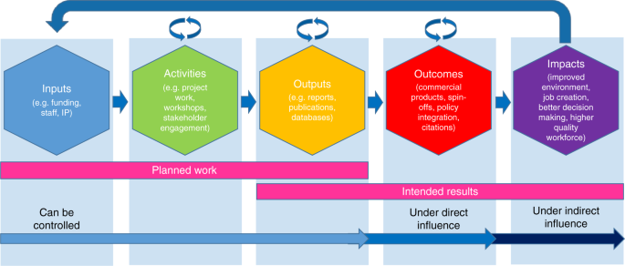

## Table of Contents

## What is a research report?

A research report is a document that shares the results of a study or investigation. It tells you what the research was about, how it was done, what was found, and what it means. It's like a story that helps people understand new information or solve problems.

Research reports are important in many fields like science, business, and education. They help people make decisions based on facts and evidence. By reading a research report, you can learn about new discoveries or ideas, and see if they can be used in real life.

## What are the main components of a research report?

A research report usually has a few main parts. The first part is the introduction. This tells you what the research is about and why it's important. It also has a question or a problem that the research wants to answer. After the introduction, there's a section on methods. This part explains how the research was done, like what tools were used or who was studied. It's like the recipe for the research.

The next part is the results section. This shows what the research found out. It can have numbers, graphs, or other ways to show the data. After the results, there's a discussion. This part talks about what the results mean and if they answer the question from the introduction. It might also talk about other things the results make us think about. Finally, there's a conclusion that sums up everything and might suggest what to do next or what other research could be done.

Sometimes, a research report also has other parts like an abstract at the beginning, which is a short summary of the whole report. There might also be a references section at the end, which lists all the other studies or books that were used in the research. These parts help make the report complete and easy to understand.

## How is a research report typically structured?

A research report usually starts with an abstract, which is a short summary of the whole report. This helps readers quickly understand what the research is about and what it found out. After the abstract, there's an introduction that explains the topic and why it's important. The introduction also has a research question or problem that the study wants to answer. This sets the stage for the rest of the report.

Next comes the methods section, which tells how the research was done. It explains the steps taken, the tools used, and who or what was studied. This part is like a recipe that others can follow if they want to do the same research. After the methods, the results section shows what the research found. It might use numbers, graphs, or other ways to present the data clearly.

The discussion section follows the results and talks about what they mean. It looks at whether the results answer the research question and might suggest new ideas or questions. The conclusion wraps everything up and might suggest what to do next or what other research could be done. Finally, there's often a references section that lists all the other studies or books used in the research. This helps readers see where the information came from and learn more if they want to.

## What is the purpose of producing a research report?

The main purpose of producing a research report is to share new information and findings with others. When researchers finish their studies, they write a report to tell everyone what they learned. This helps people in the same field or anyone interested to understand the new discoveries. By reading the report, others can use the information to make better decisions, solve problems, or even do more research.

Another important reason for writing a research report is to keep a record of the research process and results. This is useful for other researchers who might want to repeat the study or check the findings. A good report explains exactly how the research was done, so others can follow the same steps. It also helps to build on what is already known, as new research can add to or change what people thought before. In this way, research reports help move knowledge forward and keep everyone informed.

## Who are the primary audiences for research reports?

The primary audiences for research reports are other researchers and experts in the same field. These people want to learn about new discoveries and see if they can use the information in their own work. They might also want to check the research to see if it was done well and if the results make sense. By reading the report, they can decide if the new findings are important and how they fit with what is already known.

Another important audience is people who make decisions, like policymakers or business leaders. They use research reports to help them make choices based on facts and evidence. For example, a government might use a research report to decide on a new health policy, or a company might use one to plan a new product. These people need clear and reliable information to make the best decisions for their organizations or communities.

Students and educators are also key audiences for research reports. Students can learn about new topics and how research is done by reading these reports. Educators might use them to teach their students about the latest findings in their field. This helps keep education up-to-date and gives students a chance to learn from real research.

## What are the common methods used in producing a research report?

When making a research report, researchers often start by picking a topic and figuring out what they want to learn. They might do this by looking at what other people have already found out and seeing what questions are still unanswered. Once they have a clear question, they plan how to answer it. This could mean doing experiments, asking people questions in surveys, or watching how things happen in real life. They write down all the steps they take so others can follow along if they want to.

After gathering all the information, researchers put it together in the report. They start with an introduction to explain what the research is about and why it matters. Then, they describe the methods they used, like if they did experiments or surveys. Next, they show the results, using numbers, graphs, or pictures to make it clear. They talk about what the results mean in the discussion part and wrap everything up in the conclusion. They also list all the other studies they used in a references section. This way, anyone reading the report can see how the research was done and what was learned.

## How can the quality of a research report be assessed?

To check the quality of a research report, you first look at how clear and easy it is to understand. The report should have a good structure with an introduction, methods, results, discussion, and conclusion. Each part should be written in a way that anyone can follow. The introduction should clearly say what the research is about and why it matters. The methods section should explain how the research was done in enough detail so others can do the same thing if they want to. The results should be shown clearly, using numbers, graphs, or pictures. The discussion and conclusion should explain what the results mean and what could be done next.

Another important thing to check is how well the research was done. This means looking at if the methods used were good and if the results make sense. The report should show that the researchers thought about other possible explanations for their results and checked if their findings match with what other studies have found. The references section should list all the other studies used, so readers can see where the information came from. A good research report also tells the truth about what was found, even if it's not what the researchers expected. By checking these things, you can tell if the research report is high quality and worth using.

## What are the ethical considerations in producing research reports?

When making a research report, it's important to think about ethics. This means doing the right thing and being fair to everyone involved. One big part of this is making sure the people in the study are treated well. If you're asking people questions or doing experiments, you need to tell them what you're doing and why. They should know they can say no if they want to, and their information should be kept private. It's also wrong to trick people or make them do things they don't want to do. Researchers have to be honest and not change the results to make them look better.

Another part of ethics in research reports is being honest about the work. This means writing down exactly how the research was done, so others can check it. It's not right to copy other people's work without saying where it came from. Researchers should also think about how their work might affect people or the world. If the research could hurt someone or cause problems, they need to be careful and maybe not do it at all. Being ethical in research helps make sure the work is fair, honest, and good for everyone.

## How do research reports influence policy and decision-making?

Research reports are really important for people who make rules and decisions. They give these people facts and evidence to help them make good choices. For example, if a government wants to start a new health program, they might read a research report to see what works and what doesn't. This helps them make the program better and more likely to help people. Companies also use research reports to plan new products or ways of working. By using the information in these reports, decision-makers can make choices that are based on what really works, not just guesses.

Sometimes, research reports can change laws or how things are done. If a report shows that something is not working or is causing problems, it can lead to new rules to fix it. For example, if a study finds that a certain medicine is dangerous, the government might change the rules to make it safer. This way, research reports help keep people safe and make sure that rules and decisions are based on the best information available. By sharing what they find, researchers help make the world a better place.

## What are the challenges faced in the dissemination of research reports?

Sharing research reports with others can be hard because there are so many different ways to do it. Some people might use the internet to share their reports, but not everyone has good internet or knows how to find the reports online. Sometimes, reports are written in a way that is hard to understand, with big words and complicated ideas. This can make it tough for people who are not experts to read and use the information. Also, it can be expensive to print and send out reports, so not everyone can get a copy.

Another challenge is making sure the right people see the research reports. Even if a report is really important, it might not reach the people who need it most, like policymakers or business leaders. Sometimes, reports get lost in a sea of other information, and it's hard to stand out. Researchers also have to be careful about sharing their work in a way that is fair and honest. If they don't do this right, people might not trust the information in the report. All these things make it tricky to get research reports out to the world and make sure they are used to help make good decisions.

## How can the impact of a research report be measured?

Measuring the impact of a research report can be done in a few ways. One way is to look at how many people read or download the report. If a lot of people are interested in it, that can show it's having an impact. Another way is to see if other researchers are talking about the report or using its findings in their own work. When other studies mention or build on the report, it means the research is making a difference in the field. Also, if the report gets mentioned in the news or on social media, that can show it's reaching a wider audience and influencing public thinking.

Another important measure is how the report affects decisions and policies. If lawmakers or business leaders use the information from the report to make new rules or plans, that's a big sign of impact. For example, if a health report leads to a new public health program, the report has had a real-world effect. Surveys and feedback from people who use the report can also help measure its impact. If people say the report helped them make better choices or solve problems, that shows it's valuable. By looking at these different signs, we can get a good idea of how much a research report is making a difference.

## What are the advanced techniques for enhancing the impact of research reports?

To make research reports more impactful, researchers can use advanced techniques like making the reports easy to understand and share. One way to do this is by using plain language and simple words instead of complicated terms. This helps more people, not just experts, to read and use the information. Another technique is to use visuals like graphs, charts, and pictures. These can make the findings clearer and more interesting. Researchers can also break down the report into smaller parts or summaries that people can quickly read and share on social media or in newsletters. This way, the report can reach a bigger audience and have a bigger impact.

Another advanced technique is to work with people who can help spread the word about the research. This might mean talking to journalists, making videos or podcasts, or working with organizations that care about the same topics. By getting the report out through different channels, it can reach people who make decisions and influence policy. Researchers can also use feedback from readers to keep improving the report. By listening to what people say and making changes, the report can stay useful and relevant. These techniques help make sure the research report has the biggest impact possible.

## References & Further Reading

[1]: Bergstra, J., Bardenet, R., Bengio, Y., & Kégl, B. (2011). ["Algorithms for Hyper-Parameter Optimization."](https://dl.acm.org/doi/10.5555/2986459.2986743) Advances in Neural Information Processing Systems 24.

[2]: ["Advances in Financial Machine Learning"](https://www.amazon.com/Advances-Financial-Machine-Learning-Marcos/dp/1119482089) by Marcos Lopez de Prado

[3]: ["Evidence-Based Technical Analysis: Applying the Scientific Method and Statistical Inference to Trading Signals"](https://www.amazon.com/Evidence-Based-Technical-Analysis-Scientific-Statistical/dp/0470008741) by David Aronson

[4]: ["Machine Learning for Algorithmic Trading"](https://github.com/stefan-jansen/machine-learning-for-trading) by Stefan Jansen

[5]: ["Quantitative Trading: How to Build Your Own Algorithmic Trading Business"](https://www.amazon.com/Quantitative-Trading-Build-Algorithmic-Business/dp/1119800064) by Ernest P. Chan