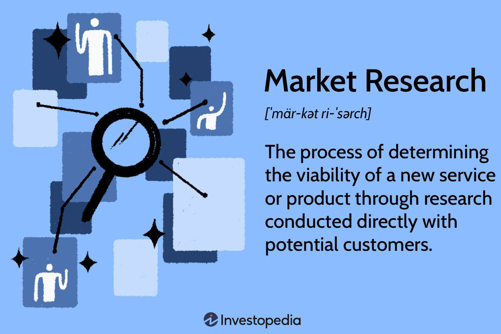

Algorithmic trading has fundamentally transformed financial markets by implementing computerized processes that enable rapid, precise, and efficient trade executions. This shift has allowed traders to manage large volumes of transactions at speeds far beyond human capabilities, often executing thousands of trades in fractions of a second. At its core, algorithmic trading relies on advanced mathematical models and software to make trading decisions, minimizing human intervention and exploiting market inefficiencies.

This article investigates the impact of research reports on the production process in algorithmic trading, focusing on how these analytical documents are integrated into trading strategies. Research reports, typically produced by financial analysts and institutions, provide insights into market trends, securities, and investment opportunities. By incorporating these insights, algorithmic strategies can enhance their accuracy and responsiveness to market conditions.



We will consider the benefits of using research reports in algorithmic trading, such as the potential for improved prediction accuracy and the ability to adjust strategies dynamically. However, the integration of these reports also presents challenges, such as the need for rapid data assimilation and the risk of reliance on potentially biased information. As algorithmic trading can significantly influence market behavior, understanding the interaction between these trading systems and the insights provided by research reports is critical.

By examining these factors, traders and investors can gain a more nuanced understanding of the modern trading landscape. This awareness can aid in making well-informed investment decisions and navigating the complex dynamics of today’s capital markets. Through a careful balance of quantitative analysis and the qualitative insights provided by research reports, algorithmic traders can optimize their strategies and enhance their market performance.

## Table of Contents

## What Is a Research Report?

A research report is an analytical document crafted by financial experts to deliver insights into specific market segments or securities. These reports play a pivotal role in shaping investor behavior, primarily by offering recommendations grounded in detailed market analysis. Typically, these reports are generated by analysts working in investment banks or brokerage firms. Commonly, their focus spans across sectors such as stocks, bonds, or commodities.

The process of creating a research report is methodical and involves a comprehensive examination of financial data, market conditions, and historical performance. Analysts employ a combination of quantitative and qualitative analyses to derive actionable insights. Quantitative analysis might include evaluating financial ratios, statistical modeling, or examining trading patterns. A simple example of such a method can be using regression analysis to predict future stock prices based on historical data. In Python, this can be done using libraries like `pandas` for data manipulation and `statsmodels` or `scikit-learn` for running the regression analysis:

```python
import pandas as pd
from sklearn.linear_model import LinearRegression

# Sample data
data = pd.DataFrame({
    'past_prices': [100, 102, 105, 107, 110],
    'future_prices': [102, 105, 107, 110, 115]
})

# Define the model
model = LinearRegression()

# Fit the model
model.fit(data[['past_prices']], data['future_prices'])

# Predict future prices
predicted_prices = model.predict(data[['past_prices']])
```

Qualitative analysis, on the other hand, might involve assessing management quality, industry trends, and macroeconomic factors.

Research reports are essential tools for investors as they provide detailed and often customized insights. These insights aid investors in making informed decisions regarding their portfolios. For example, a report might recommend buying a particular stock based on projected growth trends and favorable financial ratios, thus influencing investor behavior towards that security. The actionable recommendations offered in these reports can serve both as a guide for new investments and as a benchmark for evaluating the performance of existing holdings.

In summary, research reports are indispensable resources in the financial market landscape, offering expert analysis and guidance that help investors navigate complex market dynamics. By leveraging these reports, investors can achieve a more strategic approach to managing their investments.

## The Role of Research Reports in Algorithmic Trading

Algorithmic trading utilizes advanced quantitative models to execute trades at high speeds and with great precision. However, to refine these models and make more informed decisions, qualitative insights from research reports are essential. Research reports provide predictions and analyses that can enhance the accuracy of trading algorithms. For instance, these reports often include expert evaluations of market conditions, economic trends, and potential future movements of securities. By incorporating such qualitative data, traders can bolster the algorithms' ability to interpret market signals effectively.

The integration of research reports into [algorithmic trading](/wiki/algorithmic-trading) strategies allows for the dynamic adjustment of trading models. Market conditions are constantly evolving, and the data contained in research reports can signal impending changes. For example, if a report predicts a shift in central bank policies or a major geopolitical event, algorithms can be programmed to adjust trading parameters accordingly. This adaptive feature is critical for maintaining an edge in volatile markets.

Moreover, research reports can enrich the datasets used by algorithms through sentiment analysis. Natural language processing (NLP) techniques can be employed to extract sentiments and critical metrics from research reports. Python libraries such as `nltk` or `spaCy` can be used to perform these analyses, offering traders deeper insights into market sentiment that purely quantitative models might overlook.

```python
import nltk
from nltk.sentiment import SentimentIntensityAnalyzer

# Instantiate the sentiment analyzer
sia = SentimentIntensityAnalyzer()

# Example text from a research report
text = "The market outlook for Company XYZ is favorable due to increased demand in the tech sector."

# Analyze the sentiment of the text
sentiment = sia.polarity_scores(text)
print(sentiment)
```

Using such analyses, sentiment scores can be incorporated into trading algorithms to gauge market sentiment and adjust strategies preemptively.

Research reports, therefore, play a critical role in refining the decision-making process within algorithmic trading, enhancing the precision and adaptability of trading algorithms. By integrating predictions, qualitative assessments, and sentiment data, traders can develop sophisticated and responsive trading strategies.

## Impact of Research Reports on Market Behavior

Research reports wield a considerable influence on market behavior, particularly when they contain decisive buy or sell recommendations. These reports often encapsulate comprehensive analyses and forecasts about particular securities or market sectors, contributing to shaping investor perceptions and actions. Investors and traders, especially those using algorithmic solutions, turn to these reports for guidance, leveraging the insights to align their strategies with market expectations.

The immediate consequence of a research report with a strong recommendation is a ripple effect through the financial markets. When a report suggests a bullish outlook on a specific stock or sector, for example, it can lead to a surge in buying activity. Conversely, bearish advice can result in widespread selling. In algorithmic trading, where transactions can occur within milliseconds, the impact of these reports is significantly magnified. Algorithms designed to respond to new information can trigger large volumes of trades in fractional time periods, accentuating the movement and leading to swift changes in asset prices.

Algorithmic traders attempt to craft systems that can integrate sentiment analysis from these reports into their models. By evaluating the tone and content of research reports, such as whether they lean towards optimism or pessimism concerning future price movements, traders can adjust their strategies to exploit perceived trends before they become apparent in actual trading data. This process often involves natural language processing (NLP) techniques to extract sentiment scores and discern patterns.

In Python, an example approach to gauge sentiment from research reports might involve libraries such as `nltk` or `TextBlob` for text processing and sentiment analysis. Here's a simple illustration of how an algorithm might quantify sentiment from a report using TextBlob:

```python
from textblob import TextBlob

def analyze_sentiment(report_text):
    blob = TextBlob(report_text)
    sentiment_score = blob.sentiment.polarity
    return sentiment_score

report_text = "The forecast for Company XYZ appears promising, with expected growth in revenues and market share."
sentiment_score = analyze_sentiment(report_text)

if sentiment_score > 0:
    action = "buy"
elif sentiment_score < 0:
    action = "sell"
else:
    action = "hold"

print(f"The recommended action based on sentiment is to {action}.")
```

This code snippet provides a basic assessment of a report's tone, suggesting trading actions based on the sentiment score derived from the report's text. However, integrating such sentiment data into algorithmic trading models must account for execution lag, data integration challenges, and the need for robust [backtesting](/wiki/backtesting) to ensure reliability.

Despite the potential upside, traders must remain cautious of sudden market movements prompted by report releases. The rapid response mechanisms of algorithmic trading systems can sometimes lead to exaggerated market swings, driven more by automated reactions than fundamental changes. Effective algorithmic strategies, therefore, must strike a balance, incorporating both qualitative insights from research reports and quantitative data to enhance precision and mitigate risks.

## Challenges of Incorporating Reports in Algorithmic Models

Integrating research reports into algorithmic models presents notable challenges that must be adeptly managed to ensure robust trading performance. One significant challenge is the timely integration of report data due to the ultra-fast nature of trading in today's financial markets. Algorithms operate at high speeds, executing trades in milliseconds, requiring any external information, such as insights from research reports, to be incorporated swiftly and accurately. Latency in processing this information might result in missed trading opportunities or suboptimal decision-making, directly affecting profitability.

Another critical issue is the possibility of conflicts of interest if the data from reports are biased or skewed. Research reports are often produced by analysts within investment banks or brokerage firms, entities that may have vested interests in the financial products or markets they cover. This inherent bias can skew the information provided, potentially leading to inaccurate predictions or recommendations that, when fed into an algorithm, can distort trading outcomes. Recognizing and mitigating these biases is crucial for maintaining the integrity and effectiveness of algorithmic trading strategies.

A further challenge involves balancing reliance on qualitative insights from reports with rigorous quantitative analysis. While research reports provide valuable qualitative data, algorithms are primarily quantitative tools. Over-reliance on qualitative inputs can dilute the precision of algorithmic models, as they may introduce variables that are difficult to quantify within the algorithm's parameters. Effective algorithmic trading requires a harmonious integration of both qualitative and quantitative data, ensuring that the insights from reports complement rather than overshadow the algorithm's computational logic.

To address these challenges, algorithmic traders might benefit from implementing techniques that enhance data processing efficiency and incorporate bias detection mechanisms. For instance, employing [machine learning](/wiki/machine-learning) models that can rapidly adapt and integrate report data without causing delays could be beneficial. Moreover, deploying statistical methods to identify and correct bias within report data could safeguard against skewed trading strategies. By maintaining a balanced approach in integrating reports with quantitative analyses, traders can augment the precision and adaptability of their algorithmic models.

## Conclusion

Research reports play a crucial role in enhancing the decision-making processes involved in algorithmic trading. They provide strategic value by delivering insights and analyses that are pivotal for crafting accurate and responsive trading algorithms. These reports serve as an interface between fundamental market research and the quantitative frameworks that algorithmic strategies rely on. However, despite their value, traders must be cautious of potential biases inherent in these reports. Whether biased due to conflicts of interest or analytical oversights, these can skew trading outcomes. Therefore, traders need to integrate these insights with care and discernment.

To effectively integrate research report data into algorithmic trading strategies, traders must strike a balance between qualitative insights and traditional quantitative analysis. This balanced approach enables the creation of more nuanced trading strategies that are responsive to both standard market indicators and the incisive qualitative assessments provided by research reports. When reports indicate strong market sentiments or trends, algorithms can be programmed to adjust trading parameters accordingly, ensuring swift and informed decision-making.

A well-constructed algorithm might include code snippets that trigger trades based on report-generated sentiments. For example, a Python script could parse a research report for specific keywords and adjust trading signals based on detected sentiment:

```python
def analyze_report(report_text):
    sentiments = {"buy": 1, "sell": -1, "hold": 0}
    score = 0
    for word in report_text.split():
        if word in sentiments:
            score += sentiments[word]
    return score

def adjust_trading_strategy(sentiment_score):
    if sentiment_score > 0:
        # Increase buying signals
        print("Adjusting strategy to increase buy trades")
    elif sentiment_score < 0:
        # Increase selling signals
        print("Adjusting strategy to increase sell trades")
    else:
        # Maintain current strategy
        print("No change in strategy")

# Example usage:
report_text = "Strong buy recommendation with predicted market growth"
sentiment_score = analyze_report(report_text)
adjust_trading_strategy(sentiment_score)
```

Ultimately, by conscientiously incorporating insights from research reports, algorithmic traders can refine their strategies, potentially gaining an edge in the fast-evolving landscape of financial markets. This informed approach helps optimize performance by ensuring that trading algorithms are not solely reliant on raw data but are also attuned to the broader, qualitative narratives driving market behavior.

## References & Further Reading

[1]: Bergstra, J., Bardenet, R., Bengio, Y., & Kégl, B. (2011). ["Algorithms for Hyper-Parameter Optimization."](https://dl.acm.org/doi/10.5555/2986459.2986743) Advances in Neural Information Processing Systems 24.

[2]: ["Advances in Financial Machine Learning"](https://www.amazon.com/Advances-Financial-Machine-Learning-Marcos/dp/1119482089) by Marcos Lopez de Prado

[3]: ["Evidence-Based Technical Analysis: Applying the Scientific Method and Statistical Inference to Trading Signals"](https://www.amazon.com/Evidence-Based-Technical-Analysis-Scientific-Statistical/dp/0470008741) by David Aronson

[4]: ["Machine Learning for Algorithmic Trading"](https://github.com/stefan-jansen/machine-learning-for-trading) by Stefan Jansen

[5]: ["Quantitative Trading: How to Build Your Own Algorithmic Trading Business"](https://www.amazon.com/Quantitative-Trading-Build-Algorithmic-Business/dp/1119800064) by Ernest P. Chan