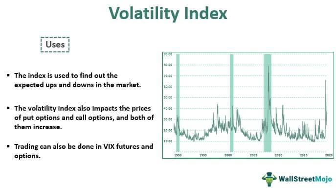

Stock research plays a pivotal role in making informed investment decisions and achieving financial success. Among the myriad aspects of stock research, identifying volatile stocks is of significant importance. Volatile stocks are characterized by substantial price swings over short periods. This volatility can present opportunities for high returns, but it also comes with increased risk. Therefore, understanding which stocks are prone to volatility is crucial for investors and traders who seek to capitalize on short-term market movements.

Financial analysis is a fundamental tool in evaluating stock performance. By examining financial statements, ratios, and metrics, analysts can assess a company's value, profitability, and potential growth. This analysis helps investors gauge the financial health of a company, which is crucial when considering investments in volatile stocks. Ratios such as the price-to-earnings (P/E) ratio, return on equity (ROE), and debt-to-equity ratio provide insights into a company's performance relative to its peers and the broader market.



Algorithmic trading has become increasingly relevant in modern financial markets. It involves using complex algorithms to execute trades based on pre-set conditions, enabling rapid decision-making and minimizing human error. Algorithmic trading is particularly beneficial in volatile markets, where speed and precision are essential. It allows traders to take advantage of price discrepancies and fluctuations efficiently, often within milliseconds.

The purpose of this article is to explore various methods and tools for analyzing volatile stocks, emphasizing the integration of financial analysis and algorithmic trading. By understanding the importance of stock volatility, the role of financial metrics, and the advantages of algorithmic systems, investors can better navigate the complexities of the stock market. This article aims to equip investors with the knowledge and tools necessary to successfully trade volatile stocks, leveraging both traditional and modern approaches for optimal results.

## Table of Contents

## Understanding Volatile Stocks

Stock volatility refers to the degree of variation in the price of a stock over a specific period of time and is a critical factor in trading decisions. High volatility indicates significant price swings, making a stock potentially more profitable but also riskier. Conversely, low volatility suggests stable price movements, generally perceived as safer but offering limited profit opportunities. Volatility is commonly measured by calculating the standard deviation or variance of returns.

Several factors contribute to stock volatility. Market news, such as changes in economic policies, geopolitical events, and mergers and acquisitions, can lead to abrupt price movements. Economic indicators like inflation rates, unemployment data, and interest rates also affect volatility by influencing investor expectations and economic stability. Company-specific factors, including earnings reports, product launches, and leadership changes, can cause fluctuations in a stock's price due to altered perceptions of a company's future performance.

Historical stock market events offer clear examples of [volatility](/wiki/volatility-trading-strategies). The 2008 financial crisis saw drastic volatility due to global economic instability and the collapse of major financial institutions, leading to significant stock price fluctuations. Similarly, during the onset of the COVID-19 pandemic in early 2020, markets experienced sharp declines followed by rapid recoveries as investor sentiment shifted in response to lockdowns and stimulus measures.

Investor sentiment and market speculation are pivotal in driving volatility. Positive rumors or negative sentiment can lead to irrational buying or selling, exacerbating price swings. Behavioral finance suggests that emotional reactions to market events often cause herd behavior, further amplifying volatility.

Overall, stock volatility is a multifaceted phenomenon influenced by a variety of external and internal factors. Understanding these influences is essential for traders and investors aiming to navigate the complexities of the stock market effectively.

## Financial Analysis for Volatile Stocks

Stock volatility refers to the degree of variation in the price of a stock over time. Understanding and analyzing volatile stocks requires a thorough application of financial analysis techniques to identify potential opportunities and mitigate risks. This involves employing key financial metrics, ratios, and analytical frameworks to evaluate and predict price movements effectively.

**Key Financial Metrics and Ratios**

Analyzing volatile stocks necessitates focusing on several financial metrics and ratios. Among these, beta is crucial; it measures a stock's sensitivity to market movements. A beta greater than one suggests higher volatility than the broader market. Other pertinent metrics include the price-to-earnings (P/E) ratio, which provides insights into a stock's valuation by comparing its current price to its per-share earnings. The debt-to-equity ratio is another vital measure, indicating a company's financial leverage and potential risk in volatile conditions.

Additionally, metrics like earnings per share (EPS) growth provide insights into company performance, influencing investor sentiment and stock volatility. The price-to-book (P/B) ratio can aid in determining a stock's intrinsic value compared to its market price, which is vital during volatile market conditions.

**Fundamental Analysis of Volatile Stocks**

Fundamental analysis assesses a stock's intrinsic value by examining financial statements, economic indicators, and company health metrics. This analysis is instrumental in evaluating volatile stocks by providing a long-term perspective beyond immediate price fluctuations. For instance, analyzing revenue growth, profit margins, and cash flow statements can highlight a company's operational efficiency and financial health, offering insights into whether volatility presents an investment opportunity or risk.

By assessing qualitative factors like management effectiveness, industry position, and competitive advantage, investors can better gauge a company's resilience to market turbulence. Understanding macroeconomic factors, such as interest rates and GDP growth, further enriches [fundamental analysis](/wiki/fundamental-analysis), enabling more informed evaluations of potential volatility impacts.

**Importance of Technical Analysis**

Technical analysis complements fundamental analysis by focusing on statistical trends from past stock prices and volumes. In volatile stock markets, technical analysis is particularly valuable for short-term trading strategies. Key techniques include chart patterns, such as head and shoulders or double tops, which help identify potential price reversals.

Indicators like moving averages, relative strength index (RSI), and Bollinger Bands offer insights into [momentum](/wiki/momentum) and trend strength. For example, the RSI indicates whether a stock is overbought or oversold, providing potential entry or [exit](/wiki/exit-strategy) points. Moving averages can smooth out price data to discern the underlying direction, which is crucial in volatile markets that exhibit rapid price changes.

**Case Studies**

Examining historical cases reveals how financial analysis principles apply to volatile stocks. Consider the case of Tesla Inc. (TSLA), known for its significant price fluctuations. Fundamental analysis of Tesla involved evaluating its innovation in the electric vehicle market, ambitious growth strategies, and financial metrics such as cash reserves and revenue growth. Simultaneously, technical analysis of Tesla's stock utilized patterns and indicators to capitalize on short-term price movements, despite its inherent volatility.

Another example is GameStop Corp. (GME), which experienced extreme volatility driven by social media and retail investor sentiment. In this case, fundamental analysis highlighted issues like market challenges and a shifting business model, while technical analysis identified the impact of trading volumes and momentum on stock prices during the volatile period.

In conclusion, financial analysis provides critical tools and insights to navigate the uncertainties of volatile stocks. By integrating key metrics, fundamental analysis, and technical indicators, investors can make informed decisions and develop strategies tailored to the dynamic nature of financial markets.

## Algorithmic Trading and Volatile Stocks

Algorithmic trading, also known as automated trading or algo trading, utilizes computer programs to execute trades based on predefined criteria, such as timing, price, and [volume](/wiki/volume-trading-strategy). This method relies on mathematical models and algorithms to optimize trading strategies and enhance efficiency. Algorithmic trading is essential for managing volatile stocks, as it can analyze vast datasets quickly and respond to fast market movements.

One key benefit of [algorithmic trading](/wiki/algorithmic-trading) in dealing with volatile stocks is its speed. Algorithms can execute trades in milliseconds, which is crucial when stock prices fluctuate rapidly. This speed enables traders to capitalize on short-term opportunities and manage risk more effectively. Additionally, algorithmic trading reduces emotional decision-making, as trades are conducted automatically based on data-driven strategies rather than human intuition or sentiment.

Various algorithms and strategies are popular in trading volatile stocks. One basic strategy is the Moving Average Crossover, where buy and sell signals are generated when short-term moving averages cross long-term moving averages. Another popular strategy is the Mean Reversion, which bets on the price of a volatile stock reverting to its historical average after significant deviations. High-frequency trading ([HFT](/wiki/high-frequency-trading-strategies)) strategies exploit small price discrepancies across different markets, conducting thousands or millions of trades in a single day.

Real-world applications of algorithmic trading in volatile markets are abundant. Hedge funds and investment banks use algorithmic trading to execute large orders with minimal market impact, optimizing execution prices. Retail investors also benefit from algorithmic trading platforms that offer [backtesting](/wiki/backtesting) and deployment of custom strategies. An example is Renaissance Technologies, a [hedge fund](/wiki/hedge-fund-trading-strategies) known for its use of quantitative models to earn substantial returns, even in volatile markets.

Algorithmic trading is a pivotal tool for modern investors and institutions managing volatile stocks. Its ability to process large volumes of data rapidly and execute trades with minimal latency allows traders to navigate volatile markets with precision and confidence.

## Tools and Resources for Tracking Volatility

Tracking stock volatility requires robust tools and resources that cater to both novice and experienced traders. Such tools can be categorized into free and paid options, each offering distinct features crucial for analyzing market dynamics.

### Free and Paid Tools for Tracking Stock Volatility

Free tools, such as Yahoo Finance and Google Finance, provide accessible platforms for traders to monitor stock performance. Yahoo Finance offers real-time stock quotes, news updates, historical data, and customizable watchlists. Google Finance, integrated into Google Search, enables users to track portfolios and receive alerts on specific stock movements and market news. These platforms are ideal for beginner traders seeking foundational data without incurring costs.

Paid tools, like Bloomberg Terminal, provide advanced analytics and in-depth financial data. Bloomberg Terminal is renowned for its comprehensive financial analytics, a vast repository of historical data, and real-time global market updates. It caters to professional investors requiring detailed market insights and sophisticated analytic tools. The high cost of subscribing to Bloomberg Terminal makes it suitable for institutional investors and experienced traders.

### Customizing Volatility Tracking Tools

Beyond standard functionalities, customizing volatility tracking tools can significantly enhance their utility. Coding and software development skills enable traders to automate data extraction, analysis, and visualization processes. For example, Python offers a versatile framework for developing custom scripts to scrape data from financial websites, perform technical analysis, and generate volatility indicators. Using libraries like `pandas` for data manipulation and `matplotlib` or `plotly` for visualization, traders can create tailored dashboards to meet specific trading needs.

A sample Python script to calculate and visualize a stock's historical volatility might involve:

```python
import pandas as pd
import numpy as np
import matplotlib.pyplot as plt

# Load stock prices (assuming DataFrame 'data' with a 'Close' column)
data = pd.read_csv('stock_prices.csv')
returns = data['Close'].pct_change()

# Calculate historical volatility
volatility = returns.rolling(window=30).std() * np.sqrt(252)  # Annualizing the volatility

# Plotting the volatility
plt.figure(figsize=(10, 5))
plt.plot(volatility, label='30-Day Historical Volatility')
plt.title('Stock Volatility Over Time')
plt.xlabel('Date')
plt.ylabel('Volatility')
plt.legend()
plt.show()
```

### Considerations for Selecting the Right Tools

When choosing tools for tracking stock volatility, traders should consider personal trading objectives, level of expertise, and resource availability. Novice traders might prioritize user-friendly platforms that offer essential market data without complexity, like Yahoo Finance or Google Finance. More advanced traders might require features such as advanced charting, algorithmic trading capabilities, and integration with other financial databases, guiding them towards platforms like Bloomberg Terminal or custom solutions.

Ultimately, the choice of tools should align with the trader's strategy, risk tolerance, and need for data granularity. As the trading landscape evolves, staying informed about new developments and leveraging technology effectively remains crucial for success in tracking volatile stocks.

## Building an Effective Strategy for Volatile Stocks

Creating an effective strategy for trading volatile stocks requires a blend of financial analysis, algorithmic trading techniques, and robust risk management. Below is a comprehensive approach to achieving a personalized strategy tailored to volatile stocks.

### Steps to Create a Personalized Trading Strategy

1. **Identify Volatile Stocks**: Begin by selecting a set of stocks known for their high volatility. Use historical data to calculate metrics such as the standard deviation and beta to measure price fluctuations. For example, use the formula for standard deviation to analyze past stock prices:
$$
   \sigma = \sqrt{\frac{1}{N}\sum_{i=1}^{N}(x_i - \mu)^2}

$$

   Where $\sigma$ is the standard deviation, $N$ is the number of data points, $x_i$ are individual stock prices, and $\mu$ is the mean stock price.

2. **Conduct Financial Analysis**: Utilize both fundamental and technical analysis to assess stock potential. Fundamental analysis focuses on evaluating a company's financial reports, P/E ratios, and earnings growth, while technical analysis uses historical price data and indicators like Moving Averages (MA) and Relative Strength Index (RSI) to predict future movements.

3. **Algorithmic Integration**: Enhance your strategy by implementing algorithmic trading. Write custom algorithms that can execute trades based on predefined criteria, such as price crossover or volatility thresholds. In Python, you might use libraries like `pandas` and `NumPy` to handle data analysis and `zipline` for backtesting:

   ```python
   import pandas as pd
   import numpy as np
   from zipline import run_algorithm

   def initialize(context):
       context.stock = symbol('AAPL')

   def handle_data(context, data):
       price_history = data.history(context.stock, 'price', 20, '1d')

       if price_history[-1] > price_history.mean():
           order_target_percent(context.stock, 1.0)
       else:
           order_target_percent(context.stock, 0.0)
   ```

### Combining Financial Analysis with Algorithmic Features
Financial analysis provides the foundational understanding of stock value, while algorithmic features allow for automated, rapid responses to market changes. Combining these elements improves efficiency and can maximize returns by executing trades precisely when opportunities arise or when risk thresholds are threatened.

### Risk Management Approaches
Volatile stocks require rigorous risk management to mitigate potential losses:

- **Position Sizing**: Allocate a portion of your portfolio to high-risk stocks based on volatility levels. Use the Kelly Criterion to determine optimal size:
$$
   f^* = \frac{bp - q}{b}

$$

  Where $f^*$ is the fraction of the capital to invest, $b$ is the net odds received on the wager, $p$ is the probability of winning, and $q$ is the probability of losing.

- **Stop-Loss and Take-Profit Levels**: Set automatic exit points to protect gains and limit losses. For instance, apply a stop-loss order at 5% below the purchase price and a take-profit level at 10% above.

### Adapting Strategies to Market Changes
Market conditions are fluid, often characterized by unexpected events and fluctuations. Regularly review and adapt your strategy to ensure it remains effective:

- **Monitor Economic Indicators**: Stay informed about macroeconomic indicators and news events that may impact volatility.
- **Continuous Backtesting**: Use historical data to test your strategy under different market conditions, refining rules and algorithms based on performance outcomes.
- **Feedback Loops**: Implement mechanisms for logging and analyzing trades to gather insights and improve your strategy over time.

Incorporating these elements into your trading strategy for volatile stocks can enhance performance and minimize risk, enabling informed, responsive trading decisions.

## The Role of AI in Algorithmic Trading

Artificial Intelligence (AI) plays a significant role in enhancing the capabilities of algorithmic trading by leveraging advanced computational techniques to analyze large datasets, predict market trends, and manage volatility. These datasets, often derived from diverse sources such as financial reports, news articles, and historical price movements, offer vast amounts of unstructured data. AI, particularly through [machine learning](/wiki/machine-learning) and [deep learning](/wiki/deep-learning) algorithms, can extract valuable insights from this data to make informed trading decisions.

AI technologies have introduced the ability to analyze large datasets efficiently. Machine learning models, such as decision trees and neural networks, are employed to identify patterns and correlations that are not readily apparent to human traders. Consider a [neural network](/wiki/neural-network) trained on historical stock prices, economic indicators, and company performance metrics. By continuously learning from new data, the model can forecast future price movements, offering traders a statistical edge in the market. 

Moreover, AI's predictive capabilities extend to sentiment analysis, where algorithms assess public sentiment from social media platforms, news headlines, and financial forums. Natural Language Processing (NLP) techniques enable these algorithms to gauge market sentiment, which significantly influences short-term market movements and contributes to volatility.

The future prospects of AI in revolutionizing stock market trading are vast. As computational power increases and data availability expands, AI systems will likely offer even more precise market predictions and automated trading strategies. Innovations in [reinforcement learning](/wiki/reinforcement-learning), where algorithms learn optimal trading strategies through trial and error in simulated environments, hold promise for further advancements in trading efficiency and efficacy.

AI-driven algorithmic trading platforms exemplify these advancements. For example, platforms like Alpaca and QuantConnect use machine learning to develop algorithms that adapt to changing market conditions. These platforms provide open-source resources and tools for traders to implement custom strategies leveraging AI. Another notable example is Kensho, part of S&P Global, which uses AI to analyze the effects of economic events on equities, allowing traders to make data-backed decisions with minimal lag time.

In conclusion, AI technologies continue to enhance algorithmic trading by providing sophisticated tools to analyze complex datasets and adapt to rapid market changes, thus paving the way for more efficient and informed trading strategies.

## Conclusion

Researching and analyzing volatile stocks plays a critical role in modern financial markets, as these stocks offer the potential for substantial gains. Understanding volatility is essential for investors seeking to capitalize on rapid price movements while managing associated risks. By meticulously analyzing financial metrics, ratios, and incorporating algorithmic trading strategies, investors can better navigate the complexities of volatile stocks.

The integration of financial analysis and algorithmic trading has revolutionized stock research. Financial analysis provides a foundation for assessing a stock's potential by evaluating fundamental factors such as earnings, revenue, and market conditions. On the other hand, algorithmic trading offers a tactical advantage, executing trades at speeds and efficiencies beyond human capability. Algorithms can be programmed to react to volatility signals, trends, and patterns, enabling investors to optimize their trading outcomes.

Investors are encouraged to leverage technological advancements to make informed decisions. The availability of data analytics tools and sophisticated trading platforms allows for greater insight into market dynamics. Using Python, investors can develop custom scripts to analyze historical data, forecast trends, and simulate trading strategies. A simple example of using Python for analyzing a stock's historical volatility might involve libraries such as Pandas and NumPy:

```python
import pandas as pd
import numpy as np

# Load historical stock price data
data = pd.read_csv('historical_prices.csv', parse_dates=True, index_col='Date')

# Calculate daily returns
data['Returns'] = data['Close'].pct_change()

# Compute annualized volatility
annual_volatility = np.std(data['Returns']) * np.sqrt(252)
print(f"Annualized Volatility: {annual_volatility}")
```

To remain competitive, traders must continuously learn and adapt to market changes. This involves understanding emerging technologies, staying updated with market trends, and refining strategies in response to evolving volatility profiles. The dynamic nature of financial markets dictates that traders who prioritize education and adaptability are better positioned to succeed.

In conclusion, the effective combination of financial analysis and algorithmic trading empowers investors to harness the opportunities presented by volatile stocks. As the financial landscape continues to evolve, embracing technology and maintaining an agile learning mindset are essential for navigating market uncertainties and achieving long-term investment goals.

## References & Further Reading

[1]: Bergstra, J., Bardenet, R., Bengio, Y., & Kégl, B. (2011). ["Algorithms for Hyper-Parameter Optimization."](https://dl.acm.org/doi/10.5555/2986459.2986743) Advances in Neural Information Processing Systems 24.

[2]: ["Advances in Financial Machine Learning"](https://www.amazon.com/Advances-Financial-Machine-Learning-Marcos/dp/1119482089) by Marcos Lopez de Prado

[3]: ["Evidence-Based Technical Analysis: Applying the Scientific Method and Statistical Inference to Trading Signals"](https://books.google.com/books/about/Evidence_Based_Technical_Analysis.html?id=MeoJAQAAMAAJ) by David Aronson

[4]: ["Machine Learning for Algorithmic Trading"](https://github.com/stefan-jansen/machine-learning-for-trading) by Stefan Jansen

[5]: ["Quantitative Trading: How to Build Your Own Algorithmic Trading Business"](https://github.com/LucindaYa/quant-resources/blob/master/Quantitative%20Trading%20How%20to%20Build%20Your%20Own%20Algorithmic%20Trading%20Business.pdf) by Ernest P. Chan