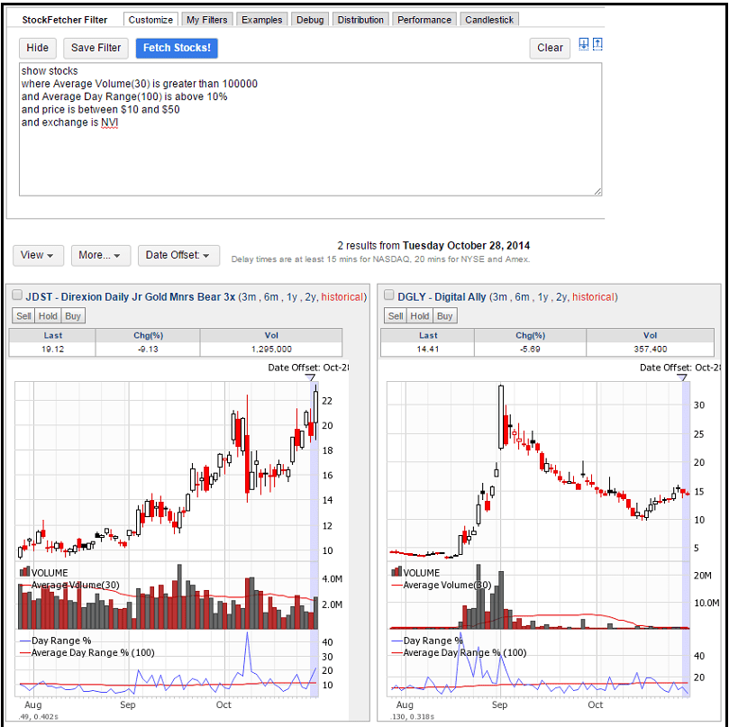

## Table of Contents

## What are volatile stocks and why are they important?

Volatile stocks are stocks that go up and down in price a lot in a short time. They can be exciting but also risky. People who like to take risks might want to buy these stocks because they can make a lot of money quickly if the stock price goes up. But, if the stock price goes down, they can lose a lot of money too.

These stocks are important because they show how the market can change quickly. They can help traders and investors see what is happening in the market and make quick decisions. Also, some people use volatile stocks to try to make money fast, even though it is risky. Understanding volatile stocks can help people learn more about how the stock market works and how to manage risk.

## How can beginners identify volatile stocks?

Beginners can identify volatile stocks by looking at how much the stock's price changes over time. One way to do this is by checking the stock's beta. Beta is a number that shows how much a stock moves compared to the whole market. If a stock has a high beta, it means it moves a lot and is more volatile. Another way is to look at the stock's historical price chart. If the price goes up and down a lot, it's a sign that the stock is volatile.

Another thing beginners can do is use tools like the Average True Range (ATR). The ATR measures how much a stock's price moves on average over a certain time. A higher ATR means the stock is more volatile. Also, watching financial news and reading about the company can help. If a company is often in the news for big changes or events, its stock might be more volatile. By using these methods, beginners can start to spot which stocks are likely to be volatile.

## What are the key indicators to look for when researching volatile stocks?

When researching volatile stocks, one key indicator to look at is the stock's beta. Beta tells you how much the stock's price moves compared to the overall market. A high beta means the stock is more volatile. For example, if a stock has a beta of 2, it moves twice as much as the market. This can help you see which stocks might go up and down a lot.

Another important indicator is the Average True Range (ATR). The ATR shows how much a stock's price usually changes over a certain time. A bigger ATR means the stock is more volatile. You can also look at the stock's price chart to see if it goes up and down a lot. If the price is all over the place, that's a sign of a volatile stock. 

Lastly, keep an eye on the news about the company. If the company is often in the news for big changes or events, its stock might be more volatile. Reading about the company can give you clues about why the stock might be moving a lot. By using these indicators, you can get a better idea of which stocks are likely to be volatile.

## How does market volatility affect stock prices?

Market volatility can make stock prices go up and down a lot. When the market is volatile, it means that the prices of stocks can change quickly and by a lot. This happens because investors might feel more unsure about the future, so they buy and sell stocks more often. When lots of people are buying and selling, it can make the prices move around a lot. If everyone is scared and selling, the prices can go down fast. If everyone is excited and buying, the prices can go up fast.

This can be good or bad for people who own stocks. If you own a stock and its price goes up because of market volatility, you can make money if you sell it at the right time. But, if the price goes down, you can lose money. It's important to remember that market volatility can make things unpredictable. That's why some people who like to take risks might try to make money from these big price changes, while others might try to avoid them.

## What are the common strategies for trading volatile stocks?

One common strategy for trading volatile stocks is called day trading. This means buying and selling stocks within the same day to make money from the quick price changes. Day traders watch the stock prices closely and try to buy low and sell high. They use tools like charts and news to help them decide when to buy and sell. This strategy can be exciting but also risky because the prices can move a lot in a short time.

Another strategy is swing trading. Swing traders hold onto stocks for a few days or weeks, trying to make money from the bigger price swings. They look for patterns in the stock's price chart to help them decide when to buy and sell. Swing trading can be less stressful than day trading because you don't have to watch the prices all the time, but it still involves risk because the stock prices can change a lot.

Some people also use a strategy called options trading. Options are like bets on whether a stock's price will go up or down. With volatile stocks, options can be very risky but can also lead to big profits if you guess right. People who trade options often use them to try to make money from the big price changes in volatile stocks. This strategy needs a good understanding of how options work and can be very risky.

## How can one use technical analysis to predict movements in volatile stocks?

Technical analysis can help predict movements in volatile stocks by looking at past price patterns and using special tools. One tool is called moving averages. These are lines on a chart that show the average price of a stock over a certain time. If the stock's price goes above the moving average, it might be a sign that the price will keep going up. If it goes below, it might be a sign that the price will go down. Another tool is the Relative Strength Index (RSI). The RSI tells you if a stock is overbought or oversold. If the RSI is high, it might mean the stock's price will go down soon. If it's low, it might mean the price will go up.

Another way to use technical analysis is by looking at chart patterns. For example, if you see a pattern that looks like a head and shoulders, it might mean the stock's price will go down. If you see a pattern that looks like a cup and handle, it might mean the price will go up. These patterns can help you guess what the stock's price might do next. By using these tools and patterns, you can try to predict when a volatile stock's price might go up or down. But remember, predicting stock prices is never certain, and it's important to be careful when trading volatile stocks.

## What role does fundamental analysis play in researching volatile stocks?

Fundamental analysis helps you understand why a stock might be moving a lot by looking at the company's basics. This means checking things like how much money the company is making, how much debt it has, and what people think about its future. For volatile stocks, knowing these details can help you see if the big price changes make sense. If a company is doing well but its stock is going up and down a lot, it might be because of things happening in the whole market, not just the company itself.

Using fundamental analysis can also help you decide if a volatile stock is a good buy or not. If the company looks strong and has good numbers, you might feel more comfortable buying its stock, even if it's moving a lot. But if the company's numbers are bad, the big price changes might be a warning sign. By looking at the company's fundamentals, you can get a better idea of what's causing the stock's volatility and make smarter choices about whether to buy, sell, or hold onto it.

## How do economic reports and news events impact volatile stocks?

Economic reports and news events can make volatile stocks go up and down a lot. When there's big news, like a report about jobs or interest rates, it can make investors feel excited or worried. If the news is good, like more people getting jobs, investors might buy more stocks, pushing the prices up. But if the news is bad, like higher interest rates, investors might sell their stocks, making the prices go down. Since volatile stocks move a lot, they can react even more strongly to these news events.

These big price changes can happen very quickly. For example, if a company in the news is doing something important, like launching a new product or getting into trouble, its stock can jump up or drop down fast. People who trade volatile stocks often watch the news closely to try to guess what will happen next. But it's hard to predict, and sometimes the stock can move in ways that surprise everyone. So, it's important to be careful and understand that news can shake things up a lot for volatile stocks.

## What are the risks associated with investing in volatile stocks?

Investing in volatile stocks can be risky because their prices can change a lot in a short time. If you buy a stock and its price goes down quickly, you might lose a lot of money. This can happen if there's bad news about the company or if the whole market is feeling unsure. Volatile stocks can be exciting, but they can also make you feel stressed because you never know what will happen next. If you're not ready for big changes, these stocks might not be a good choice for you.

Another risk is that it's hard to predict what volatile stocks will do. Even if you do a lot of research, the stock's price can still surprise you. This means you might make a decision to buy or sell at the wrong time. If you're not careful, you could end up losing more money than you planned. It's important to think about how much risk you're okay with before you start investing in these kinds of stocks.

## How can advanced traders use options and derivatives to manage risks in volatile stocks?

Advanced traders can use options and derivatives to manage risks in volatile stocks by using strategies like buying put options. A put option gives you the right to sell a stock at a certain price, even if the stock's price drops a lot. This can help protect your money if the stock goes down. For example, if you own a volatile stock and you're worried about its price falling, you can buy a put option. If the stock's price does go down, the put option can help you sell it at a higher price than it's worth now, reducing your loss.

Another way to manage risk is by using options to create a hedge. This means you can buy or sell options to balance out the risk of owning the stock. For instance, if you own a volatile stock, you might sell call options on it. Selling a call option means someone else can buy your stock at a set price, and you get money for selling the option. If the stock's price stays the same or goes down, you keep the money from selling the option, which can help cover any losses from the stock. Using these strategies can help advanced traders handle the ups and downs of volatile stocks better.

## What are some case studies of successful volatile stock investments?

One famous case of a successful volatile stock investment is Tesla. A few years ago, Tesla's stock was very up and down. But people who believed in the company and its future kept buying the stock, even when it was going through wild price swings. Over time, Tesla's stock price went way up, making a lot of money for those who held onto it. The key was understanding that Tesla was leading the way in electric cars and technology, so the big price changes were worth the risk for some investors.

Another example is Netflix. Back in 2011, Netflix's stock dropped a lot after they made a big change to their pricing. It went from around $300 to under $70 in just a few months. But people who saw that Netflix was still growing and changing with the times kept their stock or bought more when it was cheap. Over the next few years, Netflix's stock price went back up and kept going higher. Those who took the risk during the volatile time ended up making a lot of money as the company became a leader in streaming.

## How can one develop a long-term strategy for investing in volatile stocks?

Developing a long-term strategy for investing in volatile stocks starts with understanding the company behind the stock. You should look at the company's financial health, its growth potential, and how it fits into the bigger market. This means doing a lot of research using fundamental analysis to see if the company is strong enough to handle the ups and downs of its stock price. If you believe in the company's future, you might decide to hold onto the stock even when it's going through wild price swings. This is called a buy-and-hold strategy, where you keep the stock for a long time, hoping its value will grow over the years.

Another part of a long-term strategy is to manage risk carefully. You can do this by not putting all your money into one stock, even if you think it's a good one. Instead, spread your money across different stocks and other types of investments. This is called diversification, and it can help protect you if one stock goes down a lot. Also, think about using options or other tools to hedge your bets. For example, buying put options can give you a safety net if the stock's price falls. By combining a strong belief in the company with smart risk management, you can build a strategy that helps you handle the volatility of the stock market over the long term.

## How can one build an effective strategy for volatile stocks?

Creating an effective strategy for trading volatile stocks requires a blend of financial analysis, algorithmic trading techniques, and robust risk management. Below is a comprehensive approach to achieving a personalized strategy tailored to volatile stocks.

### Steps to Create a Personalized Trading Strategy

1. **Identify Volatile Stocks**: Begin by selecting a set of stocks known for their high volatility. Use historical data to calculate metrics such as the standard deviation and beta to measure price fluctuations. For example, use the formula for standard deviation to analyze past stock prices:
$$
   \sigma = \sqrt{\frac{1}{N}\sum_{i=1}^{N}(x_i - \mu)^2}

$$

   Where $\sigma$ is the standard deviation, $N$ is the number of data points, $x_i$ are individual stock prices, and $\mu$ is the mean stock price.

2. **Conduct Financial Analysis**: Utilize both fundamental and technical analysis to assess stock potential. Fundamental analysis focuses on evaluating a company's financial reports, P/E ratios, and earnings growth, while technical analysis uses historical price data and indicators like Moving Averages (MA) and Relative Strength Index (RSI) to predict future movements.

3. **Algorithmic Integration**: Enhance your strategy by implementing algorithmic trading. Write custom algorithms that can execute trades based on predefined criteria, such as price crossover or volatility thresholds. In Python, you might use libraries like `pandas` and `NumPy` to handle data analysis and `zipline` for backtesting:

   ```python
   import pandas as pd
   import numpy as np
   from zipline import run_algorithm

   def initialize(context):
       context.stock = symbol('AAPL')

   def handle_data(context, data):
       price_history = data.history(context.stock, 'price', 20, '1d')

       if price_history[-1] > price_history.mean():
           order_target_percent(context.stock, 1.0)
       else:
           order_target_percent(context.stock, 0.0)
   ```

### Combining Financial Analysis with Algorithmic Features
Financial analysis provides the foundational understanding of stock value, while algorithmic features allow for automated, rapid responses to market changes. Combining these elements improves efficiency and can maximize returns by executing trades precisely when opportunities arise or when risk thresholds are threatened.

### Risk Management Approaches
Volatile stocks require rigorous risk management to mitigate potential losses:

- **Position Sizing**: Allocate a portion of your portfolio to high-risk stocks based on volatility levels. Use the Kelly Criterion to determine optimal size:
$$
   f^* = \frac{bp - q}{b}

$$

  Where $f^*$ is the fraction of the capital to invest, $b$ is the net odds received on the wager, $p$ is the probability of winning, and $q$ is the probability of losing.

- **Stop-Loss and Take-Profit Levels**: Set automatic exit points to protect gains and limit losses. For instance, apply a stop-loss order at 5% below the purchase price and a take-profit level at 10% above.

### Adapting Strategies to Market Changes
Market conditions are fluid, often characterized by unexpected events and fluctuations. Regularly review and adapt your strategy to ensure it remains effective:

- **Monitor Economic Indicators**: Stay informed about macroeconomic indicators and news events that may impact volatility.
- **Continuous Backtesting**: Use historical data to test your strategy under different market conditions, refining rules and algorithms based on performance outcomes.
- **Feedback Loops**: Implement mechanisms for logging and analyzing trades to gather insights and improve your strategy over time.

Incorporating these elements into your trading strategy for volatile stocks can enhance performance and minimize risk, enabling informed, responsive trading decisions.

## References & Further Reading

[1]: Bergstra, J., Bardenet, R., Bengio, Y., & Kégl, B. (2011). ["Algorithms for Hyper-Parameter Optimization."](https://dl.acm.org/doi/10.5555/2986459.2986743) Advances in Neural Information Processing Systems 24.

[2]: ["Advances in Financial Machine Learning"](https://www.amazon.com/Advances-Financial-Machine-Learning-Marcos/dp/1119482089) by Marcos Lopez de Prado

[3]: ["Evidence-Based Technical Analysis: Applying the Scientific Method and Statistical Inference to Trading Signals"](https://books.google.com/books/about/Evidence_Based_Technical_Analysis.html?id=MeoJAQAAMAAJ) by David Aronson

[4]: ["Machine Learning for Algorithmic Trading"](https://github.com/stefan-jansen/machine-learning-for-trading) by Stefan Jansen

[5]: ["Quantitative Trading: How to Build Your Own Algorithmic Trading Business"](https://github.com/LucindaYa/quant-resources/blob/master/Quantitative%20Trading%20How%20to%20Build%20Your%20Own%20Algorithmic%20Trading%20Business.pdf) by Ernest P. Chan