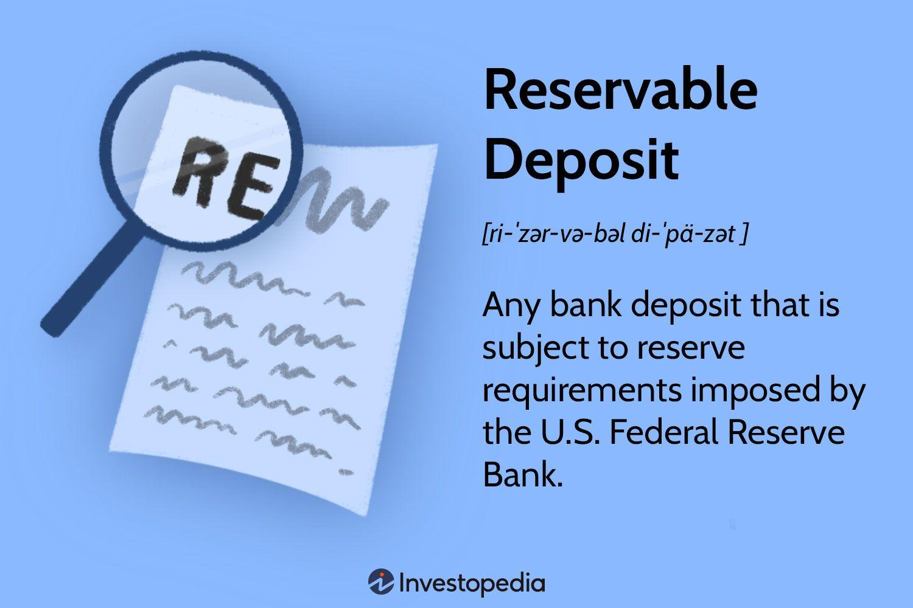

## Table of Contents

## What is a reservable deposit?

A reservable deposit is money that banks and other financial institutions keep in reserve. This money is not used for loans or investments. Instead, it is kept to make sure the bank can meet its obligations, like giving money back to customers when they want it.

The amount of money that needs to be kept in reserve is set by the central bank. This rule helps keep the financial system stable. If too many people want their money back at the same time, the bank can use the reservable deposit to give it to them. This helps prevent the bank from running out of money.

## How does a reservable deposit work?

A reservable deposit is like a safety net for banks. When people put money into a bank, the bank doesn't use all of that money for loans or investments. Instead, it keeps some of it in a special account called a reservable deposit. This money is set aside and not used for anything else. The central bank, which is like the boss of all banks, decides how much money needs to be kept in this special account.

The reason for having a reservable deposit is to make sure the bank can give money back to people when they want it. Imagine if everyone wanted their money back at the same time. If the bank had used all the money for loans, it wouldn't have enough to give back to everyone. But with the reservable deposit, the bank has some money ready to use. This helps keep the bank safe and makes sure it can handle its responsibilities.

## What are the benefits of using reservable deposits?

Reservable deposits help keep banks safe. They act like a backup plan. If lots of people want their money back at the same time, the bank can use the reservable deposit to give it to them. This stops the bank from running out of money and helps it stay stable. It's like having a safety net that catches the bank if things go wrong.

Another benefit is that reservable deposits help keep the whole money system stable. When all banks keep some money in reserve, it makes sure that money keeps moving smoothly. This helps stop big problems in the economy. It's like making sure there's always enough water in a river to keep things flowing, even when it doesn't rain.

## Who typically uses reservable deposits?

Banks and other financial institutions typically use reservable deposits. These are places where people keep their money, like savings and checking accounts. The banks have to follow rules set by the central bank, which is like the main boss of all the banks. The central bank says how much money the banks need to keep in reserve.

Reservable deposits are important for banks because they help them stay safe and ready. If lots of people want their money back at the same time, the bank can use the reservable deposit to give it to them. This stops the bank from running out of money and helps it keep working smoothly. It's like having a backup plan that makes sure the bank can always do its job.

## What are the common types of reservable deposits?

There are two main types of reservable deposits: demand deposits and time deposits. Demand deposits are the money people keep in their checking accounts. This money can be taken out anytime the person wants it. Banks have to keep some of this money in reserve because people might want it back quickly. Time deposits are different. This is the money people put into savings accounts or certificates of deposit (CDs). This money is supposed to stay in the bank for a certain time, like a few months or years. Banks still have to keep some of this money in reserve, but not as much as for demand deposits.

Both types of reservable deposits help banks stay safe and stable. They make sure the bank has enough money to give back to people when they need it. This is important because it stops the bank from running out of money if lots of people want their money back at the same time. By keeping some money in reserve, banks can keep working smoothly and help keep the whole money system stable.

## How are reservable deposits regulated?

Reservable deposits are regulated by the central bank, which is like the boss of all banks. The central bank makes rules about how much money banks need to keep in reserve. This amount can change depending on what the central bank thinks is best for the economy. If the central bank wants more money to be kept in reserve, it might raise the reserve requirement. If it wants banks to have more money to lend, it might lower the reserve requirement.

The central bank keeps an eye on banks to make sure they are following the rules. Banks have to report how much money they are keeping in reserve. If a bank doesn't keep enough money in reserve, it can get in trouble. The central bank might fine the bank or make it do other things to fix the problem. By making sure banks keep enough money in reserve, the central bank helps keep the whole money system safe and stable.

## What are the key challenges faced by financial institutions in managing reservable deposits?

Managing reservable deposits can be tricky for financial institutions because they have to balance keeping enough money in reserve with making money through loans and investments. If a bank keeps too much money in reserve, it might not have enough left to lend out. This can make it hard for the bank to make a profit. On the other hand, if a bank keeps too little money in reserve, it might not have enough to give back to customers who want their money. This can cause big problems and even lead to the bank failing.

Another challenge is that the rules about reservable deposits can change. The central bank can decide to raise or lower the amount of money that needs to be kept in reserve. This means banks have to be ready to change how they manage their money quickly. It can be hard to predict these changes and plan for them. Banks need to be careful and keep a close eye on the rules to make sure they are always following them.

## How do reservable deposits impact monetary policy?

Reservable deposits play a big role in how the central bank controls the money supply, which is called monetary policy. When the central bank changes the rules about how much money banks need to keep in reserve, it can affect how much money is available for people to borrow and spend. If the central bank makes banks keep more money in reserve, banks will have less money to lend out. This can slow down the economy because there's less money for people to use. On the other hand, if the central bank lets banks keep less money in reserve, banks can lend out more money. This can help the economy grow because there's more money for people to borrow and spend.

The central bank uses reservable deposits as one tool to keep the economy stable. By changing the reserve requirements, the central bank can help control inflation, which is when prices go up too fast. If the economy is growing too quickly and prices are rising, the central bank might make banks keep more money in reserve to slow things down. If the economy is not doing well and needs a boost, the central bank might let banks keep less money in reserve to help get more money moving. This way, reservable deposits help the central bank guide the economy in the right direction.

## What technological solutions are available to manage reservable deposits more efficiently?

Banks use special computer programs to help them keep track of their reservable deposits. These programs can quickly count how much money the bank has and make sure it is following the rules set by the central bank. They can also send alerts if the bank is getting close to not having enough money in reserve. This helps the bank fix the problem before it gets too big. By using these programs, banks can manage their money more easily and make sure they always have enough in reserve.

Another helpful tool is something called a treasury management system. This system helps banks plan how to use their money better. It can show the bank how much money it needs to keep in reserve and how much it can use for loans and investments. It can also help the bank predict how much money it will need in the future. By using these systems, banks can make smart decisions about their money and keep everything running smoothly.

## How do reservable deposits affect liquidity management for banks?

Reservable deposits are important for banks because they help with something called [liquidity](/wiki/liquidity-risk-premium) management. Liquidity means having enough money ready to give to people who want it. Banks need to keep some money in reserve so they can give it back to customers when they ask for it. If a bank doesn't have enough money in reserve, it might not be able to give money back to everyone who wants it. This can cause big problems for the bank and even make it fail. So, managing reservable deposits helps banks make sure they always have enough money ready to use.

Balancing reservable deposits is tricky because banks also need to make money by lending it out. If a bank keeps too much money in reserve, it won't have enough left to lend out and make a profit. But if it keeps too little money in reserve, it might run out of money when people want it back. Banks use special computer programs to help them keep track of their reservable deposits and make sure they have enough money in reserve. These programs can quickly count the money and send alerts if the bank is getting close to not having enough. This helps the bank stay safe and manage its money well.

## What are the international standards and practices for reservable deposits?

International standards for reservable deposits are set by organizations like the Bank for International Settlements (BIS) and the Basel Committee on Banking Supervision. These groups help make rules that countries can follow to keep their banks safe and stable. Different countries might have different rules, but many of them follow the guidelines from these international groups. The rules usually say how much money banks need to keep in reserve, and this can change depending on what's happening in the world's economy. The idea is to make sure banks around the world are managing their money in a way that keeps the whole money system safe.

Countries also work together to make sure their banks are following these rules. They share information and sometimes do checks to see if banks are keeping enough money in reserve. This helps stop problems in one country from causing trouble in other countries. By following international standards, banks can help keep the world's money system stable. This is important because it helps people and businesses trust that their money is safe, no matter where they are.

## What future trends might influence the use and management of reservable deposits?

In the future, technology will play a bigger role in how banks manage reservable deposits. New computer programs and tools will make it easier for banks to keep track of their money and make sure they are following the rules. These tools can quickly count how much money the bank has and send alerts if the bank is getting close to not having enough in reserve. This will help banks stay safe and manage their money better. Also, as more people use digital banking, banks might need to change how they handle reservable deposits to keep up with the new ways people are using money.

Another trend that might affect reservable deposits is changes in the world's economy. If there are big changes, like a new financial crisis or new rules from the central bank, banks might need to keep more or less money in reserve. This can make it harder for banks to plan how to use their money. But if banks use the new technology and work together with other countries, they can handle these changes better. By keeping an eye on what's happening around the world, banks can make sure they are always ready to keep their money safe and help the economy stay stable.

## What are Reservable Deposits and How Can They Be Understood?

Reservable deposits are fundamentally bank deposits that fall under the remit of reserve requirements set by the Federal Reserve. These deposits primarily consist of transaction accounts, such as checking accounts; savings accounts; and non-personal time deposits. The purpose of these reserve requirements is to ensure banks maintain a specific fraction of the deposit liabilities as reserves, thereby providing a foundational stability to the banking sector.

Fractional reserve banking is the system through which these dynamics operate. Under fractional reserve banking, banks are permitted to use a portion of depositor funds for lending purposes, while a mandated percentage must remain accessible to fulfill potential withdrawal requests. This arrangement not only facilitates the expansion of the bank's lending capabilities but also plays a crucial role in bolstering the broader economic activity.

The fundamental principle behind reservable deposits ensures that banks retain enough liquid assets to accommodate regular withdrawals, thus reducing the risk of bank runs—situations where a large number of depositors withdraw their money simultaneously due to concerns about the bank's solvency. Such events, if uncontrolled, can severely disrupt the banking system and the wider economy. Hence, the reserve requirements act as a safety net providing confidence in the financial system’s stability.

The concept is governed by specific regulations such as the Reserve Requirement Ratio, which varies depending on the institution's size and the type of deposits held. This ratio dictates the percentage of total deposits that must be held in reserve, influencing the bank's capacity to generate new loans.

Mathematically, if $R$ is the reserve requirement ratio and $D$ is the total deposits, the reserves $R_e$ required by the bank can be calculated as:

$$
R_e = R \times D
$$

where $R$ is usually between 0 and 1, reflecting a percentage of the total deposits.

In practical terms, reservable deposits are essential in ensuring that banks operate with a blend of conservatism and efficiency, balancing the need to remain liquid enough to meet depositors' demands while also allocating funds towards productive lending activities that drive economic growth.

## References & Further Reading

[1]: ["Regulation D and Reserve Requirements"](https://www.ecfr.gov/current/title-12/chapter-II/subchapter-A/part-204) by the Board of Governors of the Federal Reserve System

[2]: Lopez de Prado, M. (2018). ["Advances in Financial Machine Learning"](https://www.amazon.com/Advances-Financial-Machine-Learning-Marcos/dp/1119482089). Wiley.

[3]: Aronson, D. R. (2011). ["Evidence-Based Technical Analysis: Applying the Scientific Method and Statistical Inference to Trading Signals"](https://www.amazon.com/Evidence-Based-Technical-Analysis-Scientific-Statistical/dp/0470008741). Wiley.

[4]: Jansen, S. (2020). ["Machine Learning for Algorithmic Trading: Predictive models to extract signals from market and alternative data for systematic trading strategies with Python"](https://github.com/stefan-jansen/machine-learning-for-trading). Packt Publishing.

[5]: Chan, E. P. (2008). ["Quantitative Trading: How to Build Your Own Algorithmic Trading Business"](https://github.com/ftvision/quant_trading_echan_book). Wiley.

[6]: Duffie, D., & Krishnamurthy, A. (2016). ["Passthrough Efficiency in the Fed's New Monetary Policy Setting."](https://www.kansascityfed.org/documents/7030/Duffie_JH2016.pdf) Stanford University. 

[7]: U.S. Securities and Exchange Commission. ["Algorithmic Trading"](https://www.sec.gov/files/Algo_Trading_Report_2020.pdf)