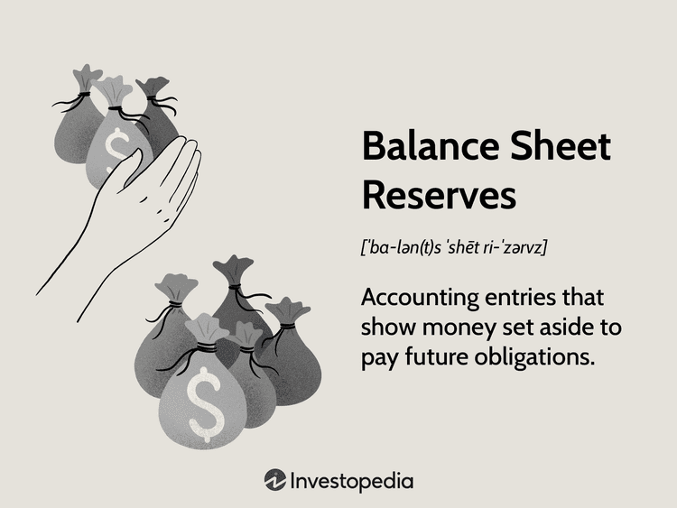

Understanding the intricate relationship between monetary reserves, financial management, reserve assets, and algorithmic trading is crucial in the modern economic environment. These components collectively influence the stability and efficiency of financial markets and economies worldwide. Monetary reserves, particularly through central banks, play a pivotal role in maintaining economic stability and facilitating international trade. They consist of foreign currency holdings and other liquid assets used to manage currency exchange rates, ensure liquidity, and support governmental fiscal policies.

In the contemporary financial landscape, the role of monetary reserves extends far beyond their traditional use as emergency buffers. They are integral to national and international financial strategies, affecting everything from inflation control to national security. Reserve assets must be managed with precision, incorporating sophisticated financial management techniques and tools to optimize their value and functionality. This involves balancing several key objectives: ensuring adequate liquidity for unforeseen financial pressures, managing risks associated with foreign exchange exposure, and achieving competitive returns on investments.



The influence of algorithmic trading on financial reserve management represents a significant evolution in how these objectives are met. Algorithmic trading leverages advanced computational models and real-time data analytics to execute trades swiftly and efficiently, enabling more responsive and dynamic asset allocation. This is particularly beneficial in managing large portfolios of reserve assets, where even minor adjustments can have significant repercussions on national economies.

In a globalized economy, the concept of reserve assets extends beyond mere currency holdings. It encompasses a broad array of financial instruments and interplays intricately with factors such as international trade dynamics and geopolitical developments. Central banks and financial institutions are at the forefront of managing these assets, employing cutting-edge technology to enhance governance and operational efficiency. Technological advancements, including artificial intelligence and blockchain, are increasingly shaping how reserve assets are utilized and monitored, providing new frontiers for enhancing economic policies and practices.

As the global financial landscape becomes increasingly interconnected, understanding these dynamics is vital for policymakers, financial managers, and investors alike. By recognizing the intricate relationships and leveraging technological innovations, stakeholders can navigate the complexities of financial reserves management to foster economic stability and growth.

## Table of Contents

## Understanding Reserve Assets

Reserve assets are critical financial instruments managed by central banks to facilitate international trade and ensure the stability of financial markets. These assets primarily include foreign currency reserves, precious metals like gold, and financial instruments such as Special Drawing Rights (SDRs) provided by the International Monetary Fund (IMF). By holding reserve assets, nations can effectively navigate economic uncertainties and maintain monetary stability.

Foreign currency reserves typically include robust and stable currencies such as the United States Dollar (USD), the Euro (EUR), and the Japanese Yen (JPY). These currencies are preferred due to their wide acceptance and stability in international markets. Holding such currencies enables a central bank to manage the exchange rate of its national currency, thereby influencing economic conditions within the country.

Gold is another essential component of reserve assets. Its intrinsic value and historical role as a universal medium of exchange enhance its desirability as a reserve asset. Gold reserves act as a safeguard against inflation and currency devaluation, providing a stable store of value across turbulent economic cycles.

Special Drawing Rights (SDRs) from the IMF are an artificial currency instrument used in international finance. SDRs are allocated to IMF member countries and can be exchanged among governments to settle international debts. They offer additional [liquidity](/wiki/liquidity-risk-premium) and act as a supplemental reserve asset that can be utilized during economic crises.

The historical significance of reserve assets is rooted in the Bretton Woods Agreement of 1944, which established a system of fixed exchange rates and pegged various currencies to the US dollar, with the dollar itself fixed to gold. This system underscored the importance of maintaining adequate reserve assets to support currency values and enable international monetary cooperation. Although the Bretton Woods system ended in the early 1970s, the foundational principles remain relevant as countries continue to stockpile reserves to influence their economic policies.

Understanding the utilization of reserve assets elucidates their impact on both national and global economic strategies. By managing these assets effectively, countries can ensure currency stability, facilitate trade, and hedge against financial crises. Consequently, reserve assets are vital components in crafting comprehensive economic policies and fostering international economic stability.

## Financial Management of Reserve Assets

Financial management of reserve assets plays a pivotal role in maintaining economic stability and optimizing financial systems. Strategic allocation of these assets and a comprehensive understanding of market risks are essential for effective management. Central banks utilize reserve assets to influence currency values and mitigate trade imbalances, contributing to broader economic objectives.

With the advancement of technology, the practices surrounding reserve management have become increasingly sophisticated. Technological tools now afford central banks enhanced capabilities in risk assessment and portfolio management. These innovations allow institutions to better navigate the complexities of international finance, providing them with more accurate and timely data to inform decision-making processes. For instance, high-frequency trading algorithms enable real-time analysis and adjustments, enhancing the adaptability and responsiveness of reserve management strategies.

Financial management strategies for reserve assets are grounded in ensuring liquidity, maintaining currency stability, and maximizing returns on investments. Liquidity is vital because it enables financial institutions to meet their short-term obligations without incurring substantial losses. Currency stability is equally crucial as fluctuations can impact not only the domestic economy but also international trade relations. Maximizing returns on investments in reserve assets, such as foreign currencies and government securities, is pursued without compromising on the other two aspects of liquidity and stability.

Reserve assets hold further significance in the context of national debts and fiscal policies. By funding national debts, these assets act as a financial buffer that can stabilize economies during periods of fiscal imbalance. This role underscores their importance in informing fiscal policies, enabling governments to manage public finances more efficiently. The relationship between reserve management and fiscal policy highlights the strategic importance of maintaining robust reserve assets, allowing for a calibrated response to both anticipated and unanticipated economic developments.

The strategic management of reserve assets, underpinned by technological innovation, allows central banks to pursue economic stability and growth. This integration of sophisticated financial tools and strategies supports a nation's ability to respond effectively to the dynamic nature of global financial markets.

## Algo Trading and Reserve Management

Algorithmic trading, often referred to as algo trading, has fundamentally transformed the landscape of reserve management by leveraging advanced mathematical models and automated trading systems. These systems execute trades at high speeds, significantly enhancing both the efficiency and transparency of financial transactions involving reserve assets. Through the use of complex algorithms, central banks and financial institutions can make real-time adjustments in resource allocation, thereby optimizing their reserve asset portfolios in response to market fluctuations.

Algorithmic trading systems are designed to process vast amounts of market data and execute orders at speeds that are impossible for human traders. This capability is particularly beneficial for reserve management, where instantaneous decision-making can lead to more effective resource distribution. For instance, algorithms can be programmed to track specific economic indicators and market trends, automatically shifting holdings from one type of reserve asset to another to maximize returns while minimizing risk.

However, the integration of algo trading into reserve management is not without its challenges. One significant concern is the potential for increased market [volatility](/wiki/volatility-trading-strategies). Rapid trades executed by algorithms can lead to sudden market movements, which, if unchecked, might destabilize financial systems. Moreover, the reliance on automated systems necessitates stringent compliance with regulatory frameworks to mitigate risks associated with erroneous trades or market manipulation. Regulatory bodies such as the Commodity Futures Trading Commission (CFTC) and the Securities and Exchange Commission (SEC) provide oversight to ensure that [algorithmic trading](/wiki/algorithmic-trading) practices adhere to existing laws and regulations.

Despite these challenges, successful integration of algorithmic trading into reserve management holds the promise of more robust and dynamic economic policies. By harnessing the power of algo trading, financial managers can better navigate the complexities of global markets, efficiently managing reserve assets to support national economic objectives. This integration supports the development of adaptive financial strategies capable of fostering economic stability and growth.

To illustrate the effectiveness of algo trading in reserve management, consider a scenario where an algorithm is designed to optimize a reserve portfolio based on real-time [interest rate](/wiki/interest-rate-trading-strategies) data. Here is a simple Python example illustrating how such an algorithm might function:

```python
def optimize_reserve_portfolio(reserve_assets, market_data):
    """
    Adjusts reserve asset portfolio based on real-time market data.

    Parameters:
    reserve_assets (dict): Current allocation of reserve assets
    market_data (dict): Real-time market data for asset classes

    Returns:
    dict: Optimized reserve asset allocation
    """
    optimized_allocation = {}
    total_value = sum(reserve_assets.values())

    # Example logic: redistribute assets based on interest rate changes
    for asset, value in reserve_assets.items():
        if market_data[asset]['interest_rate'] > threshold:
            # Increase allocation to high-interest assets
            optimized_allocation[asset] = value * (1 + allocation_factor)
        else:
            # Decrease allocation to low-interest assets
            optimized_allocation[asset] = value * (1 - allocation_factor)

    # Normalize optimized allocation to maintain total portfolio value
    total_optimized_value = sum(optimized_allocation.values())
    for asset in optimized_allocation:
        optimized_allocation[asset] *= total_value / total_optimized_value

    return optimized_allocation
```

This code snippet represents a basic framework for portfolio optimization in response to market interest rates. Such adaptive algorithms are central to modern reserve management, driving strategic adjustments that enhance the financial resilience of institutions against economic disruptions.

## Strategies for Optimization

Optimization in reserve management is key for achieving a balanced approach that accounts for risk, return, and liquidity, ultimately aligning with broader strategic objectives. Efficient optimization can strengthen a nation's economic frameworks and enhance its ability to respond to financial challenges. 

Incorporating forecasting and predictive analytics plays a pivotal role in reserve management by offering anticipatory insights. This approach involves utilizing statistical models and [machine learning](/wiki/machine-learning) algorithms to project future market trends, interest rates, and other economic indicators. These tools enable decision-makers to anticipate shifts in the financial landscape, leading to informed and proactive strategies in reserve management.

Combining financial modelling with algorithmic strategies enhances the effectiveness of scenario analysis and stress testing of reserve positions. Financial models simulate various economic conditions to forecast potential risks and outcomes. When intertwined with algorithmic strategies, these models enable real-time adjustments and prompt responses to market movements. For example, Monte Carlo simulations can be used to assess the impact of changes in market conditions on reserve asset portfolios. The integration of algorithms facilitates a comprehensive evaluation of potential scenarios, supporting decision-makers in safeguarding national financial interests.

Innovations in financial technology, including blockchain and [artificial intelligence](/wiki/ai-artificial-intelligence) (AI), have introduced novel solutions for optimizing reserve management. Blockchain technology offers transparent and secure transaction processing, ensuring more reliable management of reserve assets. AI, meanwhile, enhances decision-making by analyzing vast amounts of data to identify patterns and predictions. It also assists in automating tasks such as trade execution and risk assessment, thus improving efficiency and accuracy in reserve management.

Examining case studies where optimization strategies have yielded positive financial outcomes is instrumental in guiding future applications. For instance, several central banks have successfully implemented predictive analytics and algorithmic trading to enhance reserve allocation and risk management. By learning from such experiences, financial institutions can refine their approaches, applying proven methodologies to new challenges.

In conclusion, optimizing reserve management through a combination of forecasting, financial modelling, and fintech innovations is crucial for sustaining economic stability. By adopting these strategies, financial managers can better align reserve management practices with strategic goals, effectively navigating an increasingly complex financial environment.

## Conclusion

The intersection of monetary reserves, financial management, reserve assets, and algorithmic trading plays a pivotal role in shaping contemporary financial systems. Technological advancements, particularly in algorithmic trading and financial analytics, continue to transform the management and exchange of reserve assets, thereby amplifying their influence on global economies. As central banks and financial institutions leverage these technologies, their capacity to manage monetary reserves becomes more dynamic and effective.

Understanding these multifaceted dynamics equips policymakers, financial managers, and investors with essential tools to navigate the increasingly complex financial landscapes. This enhanced understanding facilitates the design and implementation of strategic policies that promote economic stability and growth. For instance, algorithmic trading enables rapid, data-driven decision-making, optimizing portfolio allocations, and providing real-time market-responsive strategies.

The strategic application of algorithmic trading and optimization techniques offers significant potential for economic advancement. By minimizing risks and maximizing returns, these approaches contribute to more robust financial systems. Integration of predictive analytics and machine learning models further enhances forecasting accuracy, enabling proactive fiscal management.

Looking ahead, the future of reserve asset management is poised for even greater integration of AI and data analytics. These technologies promise to streamline financial operations, improve transparency, and foster a more interconnected global financial ecosystem. By embracing these innovations, financial institutions can reinforce both local and global economic stability, adapting to rapidly changing market conditions with heightened agility and precision.

## References & Further Reading

[1]: Dedola, L., & Lombardo, G. (2012). ["Reserve Currencies in an Evolving International Monetary System."](https://www.imf.org/en/Publications/Departmental-Papers-Policy-Papers/Issues/2020/11/17/Reserve-Currencies-in-an-Evolving-International-Monetary-System-49864) European Central Bank Working Paper Series.

[2]: ["Principles for the Management of FX Reserves"](https://www.imf.org/external/np/mae/ferm/eng/index.htm) by the Bank for International Settlements (BIS)

[3]: Chaboud, A. P., Chiquoine, B., Hjalmarsson, E., & Vega, C. (2014). ["Rise of the Machines: Algorithmic Trading in the Foreign Exchange Market."](https://www.jstor.org/stable/43612951) Journal of Finance, 69(5), 2045-2084.

[4]: IMF (2001). ["Guidelines for Foreign Exchange Reserve Management."](https://www.imf.org/external/np/mae/ferm/eng/index.htm) International Monetary Fund.

[5]: Malkiel, B. G. (2015). ["A Random Walk Down Wall Street: The Time-tested Strategy for Successful Investing."](https://www.tandfonline.com/doi/full/10.1080/14697688.2016.1256598) W. W. Norton & Company.