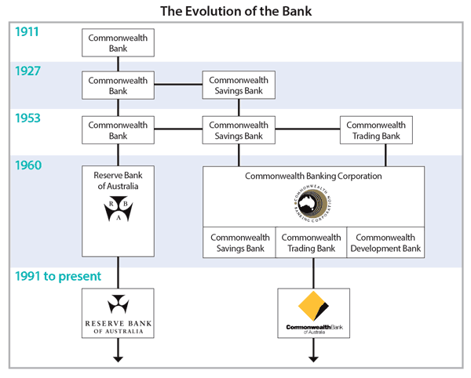

## Table of Contents

## What is the Reserve Bank of Australia (RBA)?

The Reserve Bank of Australia (RBA) is Australia's central bank. It was created in 1960 and its main job is to make sure the country's money and banking system works well. The RBA controls the amount of money in the economy and sets the official interest rate, which is the cost of borrowing money. This helps keep prices stable and supports economic growth.

The RBA also looks after Australia's money, called the Australian dollar. It makes sure there is enough money available and that it is safe to use. Another important job of the RBA is to help the government manage its money, like collecting taxes and paying for services. By doing all these things, the RBA helps make sure the economy stays strong and people can trust the money they use every day.

## When was the Reserve Bank of Australia established?

The Reserve Bank of Australia, or RBA, was set up in 1960. Before that, another bank called the Commonwealth Bank did the job of a central bank. But in 1960, the government decided to create a new, separate bank just for this important work.

The RBA's main job is to keep the economy stable. It does this by controlling how much money is in the economy and setting interest rates. This helps make sure prices don't go up too fast and that businesses and people can borrow money when they need to.

## What are the primary functions of the RBA?

The Reserve Bank of Australia, or RBA, has several important jobs. One of its main roles is to manage the country's money supply. This means the RBA decides how much money should be circulating in the economy. By doing this, it can help control inflation, which is when prices go up too fast. The RBA also sets the official [interest rate](/wiki/interest-rate-trading-strategies). This rate affects how much it costs for banks to borrow money from the RBA, which in turn influences the rates banks charge their customers. By adjusting this rate, the RBA can encourage or discourage spending and borrowing, helping to keep the economy stable.

Another key function of the RBA is to issue and manage Australia's currency, the Australian dollar. This includes making sure there are enough banknotes and coins in circulation and that they are secure against counterfeiting. The RBA also works with the government to handle its financial transactions, like collecting taxes and making payments. This helps the government manage its money effectively. Overall, the RBA's work is crucial for maintaining a stable and trustworthy financial system in Australia.

## How does the RBA influence the Australian economy?

The RBA helps guide the Australian economy mainly by controlling the amount of money in circulation and setting interest rates. When the RBA decides to increase the money supply, it makes borrowing cheaper, which can encourage people and businesses to spend more. This can help boost the economy, especially during tough times. On the other hand, if the RBA thinks the economy is growing too fast and prices are going up too much, it might reduce the money supply or raise interest rates. This makes borrowing more expensive, which can slow down spending and help keep inflation in check.

Another way the RBA influences the economy is by managing Australia's currency, the Australian dollar. By ensuring there are enough banknotes and coins and that they are safe from fakes, the RBA helps keep the currency trustworthy. This is important because people need to trust their money for the economy to work well. The RBA also works closely with the government, handling its money matters like collecting taxes and making payments. This helps the government manage its finances smoothly, which in turn supports the overall health of the economy.

## Who governs the Reserve Bank of Australia?

The Reserve Bank of Australia (RBA) is governed by a group called the Reserve Bank Board. This board is made up of nine members. Six of these members, including the Governor and the Deputy Governor, are appointed by the Treasurer. The other three members are chosen from outside the RBA and are usually experts in areas like economics or finance. The Governor is the most important person on the board and leads the meetings.

The Reserve Bank Board meets 11 times a year to make important decisions about the economy. They decide things like the official interest rate, which affects how much it costs to borrow money. The board's goal is to keep the economy stable and make sure prices don't go up too fast. By making these decisions, the RBA helps guide the country's economic health and supports the government in managing its money.

## What is the role of the Governor of the RBA?

The Governor of the Reserve Bank of Australia (RBA) is the top leader of the bank. They are in charge of making sure the RBA does its job well. The Governor leads the Reserve Bank Board, which is a group of people who make important decisions about the economy. They meet 11 times a year to talk about things like the official interest rate, which affects how much it costs to borrow money. The Governor's main job is to help keep the economy stable and make sure prices don't go up too fast.

The Governor also represents the RBA in public and talks to the government and other important people about the economy. They give speeches and write reports to explain what the RBA is doing and why. This helps people understand the economy better and trust the RBA's decisions. The Governor works with the Deputy Governor and other board members to make sure the RBA's plans are carried out correctly and that the Australian economy stays strong and healthy.

## How does the RBA set interest rates?

The Reserve Bank of Australia (RBA) sets interest rates by meeting 11 times a year with a group called the Reserve Bank Board. The board looks at a lot of information about the economy, like how fast prices are going up, how many people have jobs, and how much people are spending. They want to make sure the economy is growing in a healthy way and that prices don't go up too fast. If the board thinks the economy needs a boost, they might lower the interest rate to make borrowing cheaper. If they think prices are going up too fast, they might raise the interest rate to slow things down.

After looking at all the information, the board votes on what to do with the interest rate. The Governor of the RBA, who leads the board, then tells everyone what they decided. This decision affects the official interest rate, which is the rate banks pay to borrow money from the RBA. When this rate changes, it can make other interest rates, like the ones for home loans and credit cards, go up or down too. By setting the interest rate, the RBA helps guide the economy to keep it stable and growing in a good way.

## What is the significance of the RBA's monetary policy?

The Reserve Bank of Australia's monetary policy is really important because it helps keep the economy stable. The RBA does this by controlling the amount of money in the economy and setting interest rates. When the RBA thinks the economy needs a boost, it might lower interest rates to make borrowing cheaper. This encourages people and businesses to spend more, which can help the economy grow. On the other hand, if the RBA sees that prices are going up too fast, it might raise interest rates to slow things down and keep inflation in check.

Monetary policy also affects everyday life for Australians. When interest rates go down, it can be cheaper to borrow money for things like buying a house or starting a business. But when rates go up, borrowing becomes more expensive, which might make people think twice before taking out a loan. By carefully managing these rates, the RBA helps make sure that the economy stays strong and that people can trust the money they use every day.

## How has the role of the RBA evolved over time?

The Reserve Bank of Australia (RBA) was created in 1960 to take over the role of the central bank from the Commonwealth Bank. At first, the RBA's main job was to keep the economy stable by controlling the amount of money in circulation and setting interest rates. Over the years, the RBA has become more important in managing the economy. It started using more tools and ways to control inflation and help the economy grow in a healthy way. For example, the RBA began to focus more on setting the official interest rate to influence how much people borrow and spend.

As time went on, the RBA's role grew to include managing Australia's currency, the Australian dollar. This means making sure there are enough banknotes and coins and that they are safe from fakes. The RBA also started working more closely with the government to handle its money matters, like collecting taxes and making payments. This helps the government manage its finances better. Today, the RBA uses a lot of information about the economy to make decisions that keep prices stable and support economic growth, making it a key part of Australia's financial system.

## Can you describe a significant historical event that impacted the RBA?

One big event that affected the Reserve Bank of Australia (RBA) was the global financial crisis that started in 2007 and got really bad in 2008. During this time, banks around the world were in trouble because they had lent out too much money and people couldn't pay it back. The RBA had to work hard to keep Australia's economy from getting too bad. They did this by lowering interest rates a lot, which made borrowing money cheaper. This helped people and businesses keep spending and helped the economy stay stable.

Another important thing the RBA did during the crisis was to give extra money to the banks. This was called "quantitative easing" in other countries, but in Australia, it was called "unconventional monetary policy." The RBA made sure that banks had enough money to lend out, which helped keep the economy going. Because of these actions, Australia didn't go into a deep recession like some other countries did. The RBA's quick thinking and actions during the global financial crisis showed how important it is for keeping the economy strong and stable.

## What are some of the major challenges faced by the RBA in recent years?

In recent years, the RBA has faced several big challenges. One big challenge has been keeping inflation under control. Sometimes prices go up too fast, which can make life harder for people. The RBA tries to keep inflation at around 2-3% each year. But it's not always easy. For example, things like global oil prices or natural disasters can make prices go up. The RBA has to be careful and smart about when to change interest rates to keep inflation in check without slowing down the economy too much.

Another challenge has been dealing with low interest rates. For a long time, the RBA has kept interest rates very low to help the economy grow. But low rates can cause other problems. For example, it can make it harder for people saving money to earn much interest. It can also make people borrow too much money, which can be risky. The RBA has to find a balance between keeping rates low enough to help the economy and not so low that it causes other problems. It's a tricky job, but the RBA works hard to get it right.

## How does the RBA coordinate with other global central banks?

The Reserve Bank of Australia (RBA) works with other central banks around the world to keep the global economy stable. They talk to each other a lot, sharing information about what's happening in their countries and what they're doing to help their economies. For example, the RBA might talk to the U.S. Federal Reserve or the European Central Bank about things like interest rates or how to handle big problems like a financial crisis. By working together, they can make better decisions that help everyone.

One way the RBA coordinates with other central banks is through meetings and groups like the Bank for International Settlements (BIS). At these meetings, central bankers from different countries come together to discuss big issues and plan how to work together. They might agree on things like how to help each other out if there's a big problem, or how to make sure their actions don't cause trouble for other countries. This teamwork helps make the world's financial system stronger and more stable.

## References & Further Reading

[1]: Hughes, L. (2000). ["The Australian Banking System: Structure, Trends, and Turn of the Millennium Observations."](https://www.researchgate.net/publication/24120693_Trends_in_the_Australian_Banking_System_Implications_for_Financial_System_Stability_and_Monetary_Policy_Reserve_Bank_of_Australia_Discussion_Paper_9905) Reserve Bank of Australia Research Discussion Paper.

[2]: Lowe, P. (2018). ["Inflation Targeting and Economic Welfare."](https://www.rba.gov.au/speeches/2019/sp-gov-2019-07-25.html) Reserve Bank of Australia Bulletin.

[3]: ["Algorithmic Trading: A Practitioner's Guide"](https://www.amazon.com/Algorithmic-Trading-Practitioners-Jeffrey-Bacidore/dp/0578715236) by Irene Aldridge

[4]: Harris, L. (2003). ["Trading and Exchanges: Market Microstructure for Practitioners."](https://www.amazon.com/Trading-Exchanges-Market-Microstructure-Practitioners/dp/0195144708) Oxford University Press.

[5]: ["High-Frequency Trading: Background, Concerns, and Regulatory Developments"](https://sgp.fas.org/crs/misc/R43608.pdf) Congressional Research Service Report.