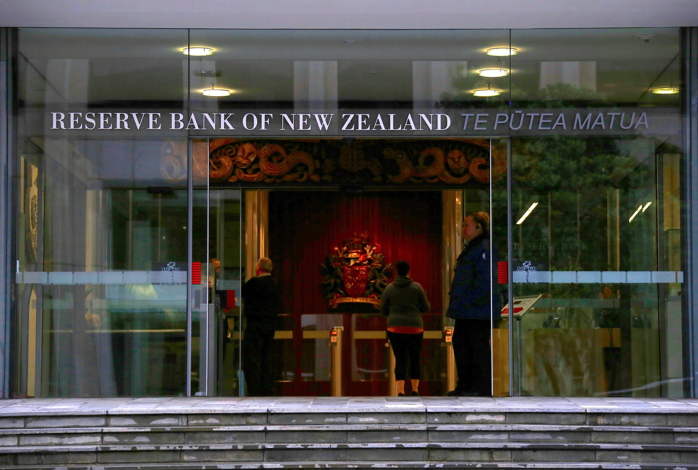

## Table of Contents

## What is the Reserve Bank of New Zealand?

The Reserve Bank of New Zealand is the central bank of New Zealand. It was set up in 1934 and its main job is to make sure the country's money and banking system works well. The bank controls the supply of money in New Zealand and works to keep the value of the New Zealand dollar stable. It does this by setting interest rates and using other tools to manage the economy.

One important thing the Reserve Bank does is try to keep inflation low and steady. Inflation is when prices go up over time. The bank aims to keep inflation between 1% and 3% each year. They also look after the financial system to make sure banks and other financial institutions are safe and sound. This helps to keep people's money secure and the economy running smoothly.

The Reserve Bank is led by a Governor, who is chosen by the government. The bank works independently, which means it makes its own decisions without being told what to do by the government. This helps to keep the bank's actions fair and focused on what's best for the economy. The Reserve Bank also gives advice to the government on economic matters and helps to make and carry out the country's financial policies.

## When was the Reserve Bank of New Zealand established?

The Reserve Bank of New Zealand was established in 1934. It is the central bank of New Zealand, which means it is in charge of the country's money and banking system. The main goal of the bank is to make sure the economy works well by controlling the amount of money in the country and keeping the value of the New Zealand dollar stable.

The Reserve Bank does this by setting interest rates and using other tools to manage the economy. One important thing they do is try to keep inflation low and steady. Inflation is when prices go up over time, and the bank aims to keep it between 1% and 3% each year. They also make sure that banks and other financial institutions are safe and sound, which helps to keep people's money secure and the economy running smoothly.

## What are the main functions of the Reserve Bank of New Zealand?

The Reserve Bank of New Zealand is like a big boss for the country's money and banking system. It was set up in 1934 and its main job is to make sure the economy works well. The bank does this by controlling how much money is in the country and keeping the value of the New Zealand dollar stable. They do this by setting interest rates, which is like the price people pay to borrow money, and using other tools to manage the economy. This helps to keep things balanced and working smoothly.

Another big job of the Reserve Bank is to keep inflation low and steady. Inflation is when the prices of things go up over time, and the bank tries to keep it between 1% and 3% each year. They do this because if prices go up too fast, it can make life harder for people. The bank also looks after the financial system to make sure banks and other places where people keep their money are safe and sound. This helps to keep people's money secure and the economy running well.

## Who governs the Reserve Bank of New Zealand?

The Reserve Bank of New Zealand is led by a Governor. The Governor is chosen by the government, but once appointed, they work independently. This means the Governor makes decisions without being told what to do by the government. This helps to keep the bank's actions fair and focused on what's best for the economy.

The Governor is in charge of making sure the bank does its job well. This includes controlling the amount of money in the country, setting interest rates, and keeping inflation low and steady. They also give advice to the government on economic matters and help to make and [carry](/wiki/carry-trading) out the country's financial policies.

## How does the Reserve Bank of New Zealand manage monetary policy?

The Reserve Bank of New Zealand manages monetary policy by controlling how much money is in the country and setting interest rates. They do this to keep the economy stable and the value of the New Zealand dollar steady. The main tool they use is the Official Cash Rate (OCR), which is the [interest rate](/wiki/interest-rate-trading-strategies) they set for banks to borrow money from each other overnight. When the OCR goes up, it usually means borrowing money becomes more expensive, which can slow down spending and help control inflation. When the OCR goes down, borrowing becomes cheaper, which can encourage spending and help boost the economy.

Another way the Reserve Bank manages monetary policy is by keeping inflation low and steady. They aim to keep inflation between 1% and 3% each year. Inflation is when prices go up over time, and if it gets too high, it can make life harder for people. The bank uses the OCR and other tools to manage inflation. They also keep an eye on the economy to make sure their policies are working well. By doing all this, the Reserve Bank helps to keep the economy running smoothly and makes sure people's money stays safe.

## What role does the Reserve Bank of New Zealand play in financial stability?

The Reserve Bank of New Zealand plays a big role in keeping the financial system stable. They do this by making sure banks and other financial institutions are safe and sound. The bank keeps a close watch on these institutions to make sure they are following the rules and are strong enough to handle any problems that might come up. This helps to keep people's money safe and makes sure the economy keeps running smoothly.

The Reserve Bank also has tools to help if there are big problems in the financial system. They can step in to provide money or support to banks if they need it. This helps to stop small problems from turning into big ones that could hurt the whole economy. By doing all this, the Reserve Bank helps to keep the financial system strong and stable, which is important for everyone in New Zealand.

## How does the Reserve Bank of New Zealand regulate and supervise banks?

The Reserve Bank of New Zealand keeps an eye on banks to make sure they are safe and sound. They do this by checking that banks follow the rules and have enough money to handle any problems that might come up. This is important because it helps to keep people's money safe and makes sure the economy keeps running smoothly. The bank looks at things like how much money banks have, how they manage risks, and how well they are doing overall.

If the Reserve Bank sees that a bank is not doing well, they can step in to help fix the problem. They might tell the bank to change the way it does things or to hold more money in reserve. This helps to stop small problems from turning into big ones that could hurt the whole economy. By keeping a close watch on banks and making sure they are strong, the Reserve Bank helps to keep the financial system stable and protects people's savings.

## What is the Official Cash Rate and how does it influence the economy?

The Official Cash Rate (OCR) is the interest rate set by the Reserve Bank of New Zealand. It's the rate that banks use when they borrow money from each other overnight. When the Reserve Bank changes the OCR, it affects other interest rates in the economy, like the rates people pay on loans and the rates they get on their savings. If the OCR goes up, borrowing money becomes more expensive, which can slow down spending and help control inflation. If the OCR goes down, borrowing becomes cheaper, which can encourage people to spend more and help boost the economy.

The OCR influences the economy by helping to keep things balanced. When the Reserve Bank sees that prices are going up too fast (inflation), they might raise the OCR to make borrowing more expensive. This can slow down spending and help keep prices from rising too quickly. On the other hand, if the economy is not doing well and people are not spending enough, the Reserve Bank might lower the OCR to make borrowing cheaper. This can encourage people to spend more, which can help the economy grow. By adjusting the OCR, the Reserve Bank tries to keep the economy stable and the value of the New Zealand dollar steady.

## How does the Reserve Bank of New Zealand handle foreign reserves?

The Reserve Bank of New Zealand keeps foreign reserves to help manage the country's money and make sure the economy stays stable. Foreign reserves are like savings in other countries' money, like US dollars or Euros. The bank uses these reserves to buy and sell foreign currency when they need to. This helps them keep the New Zealand dollar's value steady and makes it easier for businesses and people to trade with other countries.

When the Reserve Bank sees that the New Zealand dollar is getting too strong or too weak, they might use their foreign reserves to help balance it out. For example, if the dollar is too weak, they might sell some of their foreign reserves to buy New Zealand dollars. This can help make the dollar stronger. On the other hand, if the dollar is too strong, they might buy foreign currency with their reserves, which can help make the New Zealand dollar weaker. By doing this, the Reserve Bank helps keep the economy running smoothly and makes sure people can trust the value of their money.

## What are some key historical events that have impacted the Reserve Bank of New Zealand?

One big event that changed things for the Reserve Bank of New Zealand was in 1989 when they made a new law called the Reserve Bank of New Zealand Act. This law said that the bank's main job was to keep inflation low and steady. Before this, the bank had lots of different jobs, but now they focused on inflation. This made the bank more independent, which means they could make their own decisions without the government telling them what to do. This change helped make the economy more stable because people could trust that the bank would keep prices from going up too fast.

Another important time was during the global financial crisis in 2008. This was a big problem all around the world, and it affected New Zealand too. The Reserve Bank had to work hard to keep the banks safe and make sure people's money was okay. They did things like lowering interest rates to help the economy and making sure banks had enough money to handle the crisis. This showed how important the Reserve Bank is for keeping the financial system strong, even when things get tough.

## How does the Reserve Bank of New Zealand contribute to the development of financial technology?

The Reserve Bank of New Zealand helps with the growth of financial technology, or fintech, by making rules that keep the financial system safe while also letting new ideas grow. They work with fintech companies to make sure their new ways of doing things, like using apps for banking or using digital money, follow the rules. This helps keep people's money safe and makes sure the economy stays strong. The bank also looks at new fintech ideas to see if they can make banking better for everyone. By doing this, they help new technology grow in a way that is good for New Zealand.

Another way the Reserve Bank helps fintech is by doing research and giving advice. They study new financial technologies to understand how they might change the economy. This helps them make good rules that support new ideas but also keep things safe. The bank also talks to the government and other groups about fintech, which helps everyone work together to make the financial system better. By doing all this, the Reserve Bank makes sure that new financial technology can grow and help people in New Zealand.

## What are the current challenges and future directions for the Reserve Bank of New Zealand?

The Reserve Bank of New Zealand faces several challenges right now. One big challenge is keeping the economy stable while dealing with things like climate change and new technology. Climate change can cause big problems for the economy, like storms that damage businesses and homes. New technology, like digital money and online banking, can change how people use money and how banks work. The bank needs to make rules that keep the financial system safe but also let these new ideas grow. Another challenge is making sure that everyone in New Zealand can use banking services easily, no matter where they live or how much money they have.

Looking to the future, the Reserve Bank of New Zealand wants to keep the economy strong and help it grow. They plan to keep working on keeping inflation low and steady, which means making sure prices don't go up too fast. They also want to make sure banks and other financial places are safe and sound. The bank will keep an eye on new technology and work with fintech companies to help new ideas grow in a safe way. They will also focus on making sure everyone can use banking services and that the economy can handle big changes like climate change. By doing all this, the Reserve Bank hopes to keep New Zealand's economy stable and strong for the future.

## References & Further Reading

[1]: Bollard, A. (2012). ["Crisis: One Central Bank Governor & the Global Financial Collapse"](https://books.google.com/books/about/Crisis.html?id=WUPlAQAAQBAJ) by Alan Bollard.

[2]: Plantier, C. (2012). ["An Overview of the New Zealand Foreign Exchange Market: Results from the 2013 BIS Foreign Exchange Survey"](https://www.bis.org/publ/work1094.htm) Reserve Bank of New Zealand Bulletin, 77(2).

[3]: Hunt, C. (2004). ["A small economy in a globalised world: The particular challenges faced by New Zealand"](https://www.24hourcampfire.com/ubbthreads/ubbthreads.php/topics/20061021/will-1in-9-rot-stablize-bullet) Reserve Bank of New Zealand Bulletin, 67(2).

[4]: Nolan, C., & Lees, K. (2007). ["Modelling the business cycle in a small open economy: the Reserve Bank of New Zealand's new DSGE model."](https://www.gettextbooks.co.uk/search/?isbn=F+W+Nolan) Reserve Bank of New Zealand Discussion Paper Series.

[5]: Greenwood, J., Hsia, M., & Stewart, O. (1995). ["The Monetary Transmission Mechanism: Evidence from New Zealand."](https://www.sciencedirect.com/science/article/pii/S0014292103001569) Reserve Bank of New Zealand Discussion Paper Series.

[6]: Narayan, P. K., & Prasad, A. (2006). ["Modelling exchange rate volatility in a small open economy: The case of New Zealand."](https://scholar.google.com/citations?user=825pqB0AAAAJ&hl=en) Empirical Economics, 31(3).