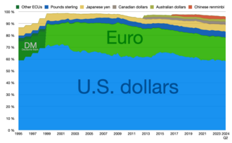

## Table of Contents

## What is a reserve currency?

A reserve currency is a type of money that many countries hold in large amounts. It is used by governments and central banks to do international trade and to keep their own money stable. The most common reserve currency right now is the US dollar. This means that when countries buy and sell things from other countries, they often use US dollars to do it.

Having a reserve currency helps make global trade easier. It gives countries a common way to pay for things and to save money. For the country whose currency is the reserve, it can be good because other countries need to use their money. But it can also be hard because they have to make sure their money stays strong and trusted by everyone.

## Why are reserve currencies important for global trade?

Reserve currencies are important for global trade because they help countries buy and sell things from each other easily. When many countries use the same currency, like the US dollar, it makes trading simpler. They don't have to change their money into different kinds of money all the time. This saves time and money, and makes it easier for businesses to work together across the world.

Also, reserve currencies help keep the world's money stable. When countries hold a lot of a certain currency, like the US dollar, it means they trust that currency. This trust helps keep the value of money steady, which is good for everyone. If the value of money goes up and down a lot, it can make trading harder and riskier. So, having a strong reserve currency helps make the whole world's trade smoother and safer.

## Which countries currently have reserve currencies?

The main reserve currency right now is the US dollar. This means that many countries keep a lot of US dollars in their banks. They use these dollars to buy and sell things with other countries. The US dollar is trusted by many people around the world, which is why it is used so much in global trade.

Besides the US dollar, the euro, which is used by countries in the European Union, is also a reserve currency. It is not used as much as the US dollar, but it is still important. Some countries also keep their money in euros to use in international trade. 

A few other currencies, like the Japanese yen and the British pound, are also used as reserve currencies but on a smaller scale. These currencies are not as common as the US dollar or the euro, but they still play a role in global trade.

## How does a currency become a reserve currency?

A currency becomes a reserve currency when many countries start to trust and use it a lot for buying and selling things across borders. This usually happens because the country with the currency has a strong and stable economy. Other countries feel safe keeping their money in this currency because they believe it will keep its value. Also, if a country is a big trader and does business with many other countries, its currency can become more popular and used more often in global trade.

Sometimes, it can also happen because of history and tradition. For example, the US dollar became a reserve currency after World War II when the US had a very strong economy and helped rebuild the world. Over time, more and more countries started using the US dollar for their international trade. So, a mix of economic strength, trust, and being used a lot in trade helps a currency become a reserve currency.

## What are the benefits of having a reserve currency?

Having a reserve currency gives a country a lot of power and benefits. When other countries use your currency for their trade, it means they need to have a lot of it. This can make your country's money more important and valuable. It also means that other countries trust your economy, which can make your country more respected and influential in the world. Plus, it can help your country's businesses because they can do trade more easily with other countries without having to change their money into different currencies.

Another big benefit is that it can help keep your country's economy stable. When other countries hold a lot of your currency, it can help keep its value steady. This is good because it means people and businesses in your country can plan better and feel more secure. Also, having a reserve currency can mean your country can borrow money more easily and at lower interest rates because other countries see it as a safe investment. So, having a reserve currency can bring a lot of advantages to the country that has it.

## What are the potential drawbacks for a country with a reserve currency?

Having a reserve currency can be tough for a country. One big problem is that it can make their money go up and down a lot. When other countries use their currency, they can sell it if they think the country's economy is not doing well. This can make the currency's value drop fast, which can hurt the country's businesses and people. It can also make it harder for the country to control its own money and economy because what other countries do with the currency matters a lot.

Another issue is that the country might have to keep its interest rates high to keep its currency strong. This can slow down their economy because it makes borrowing money more expensive. It can also make the country's exports more expensive, which can hurt their businesses that sell things to other countries. So, while having a reserve currency has many benefits, it also comes with some big challenges that the country has to manage carefully.

## How has the role of the US dollar as a reserve currency evolved over time?

The US dollar became a big deal as a reserve currency after World War II. Back then, the world was rebuilding, and the US had a strong economy. Many countries started using the US dollar because they trusted it. In 1944, at the Bretton Woods Conference, countries agreed to use the US dollar as the main currency for international trade. This made the US dollar even more important because it was linked to gold, and other countries could exchange their dollars for gold if they needed to.

Over time, the role of the US dollar has changed but stayed very important. In 1971, the US stopped linking the dollar to gold, but the dollar kept being used as a reserve currency. This was because the US economy was still strong, and other countries kept trusting the dollar. Today, the US dollar is still the most used reserve currency in the world. It is used in a lot of trade and is kept by many countries in their banks. But other currencies, like the euro, have become more important too, so the US dollar is not the only reserve currency anymore, even though it is still the biggest one.

## What impact does the status of a reserve currency have on a country's economy?

When a country's currency is a reserve currency, it can help the country's economy in big ways. Other countries need to have a lot of this currency to do trade, so they trust and value it. This can make the country's businesses do well because they can sell things to other countries easily without changing money. It also means the country can borrow money more easily and at lower interest rates because other countries see it as a safe investment. This can help the country's economy grow and be more stable.

But being a reserve currency can also bring some problems. If other countries start to think the country's economy is not doing well, they might sell the currency, which can make its value drop fast. This can hurt the country's businesses and people. Also, the country might have to keep interest rates high to keep the currency strong, which can slow down the economy because borrowing money becomes more expensive. So, while being a reserve currency can help a country's economy, it also means the country has to be careful and manage things well.

## Can a reserve currency lose its status, and if so, how?

Yes, a reserve currency can lose its status. It happens when other countries start to trust it less. If a country's economy starts to do badly, other countries might sell the currency because they think it will not be worth as much in the future. Also, if another country's economy becomes stronger and more trusted, other countries might start using that country's currency more instead. This can slowly make the old reserve currency less important in global trade.

For example, if the US dollar were to lose its status as a reserve currency, it might happen because other countries see the US economy as weak or risky. They might then start using other currencies, like the euro or the Chinese yuan, more for their trade. Over time, if enough countries switch to using these other currencies, the US dollar would no longer be the main reserve currency. This would be a big change and could take a long time, but it shows how a reserve currency can lose its status.

## What role do international organizations like the IMF play in reserve currencies?

The International Monetary Fund (IMF) plays a big role in how reserve currencies work. The IMF helps countries manage their money and trade. It does this by giving advice and sometimes lending money to countries that need help. The IMF also keeps track of how much of different currencies countries hold as reserves. This helps everyone understand which currencies are trusted and used the most around the world.

One important thing the IMF does is create something called Special Drawing Rights (SDRs). SDRs are like a special kind of money that the IMF uses to help countries. SDRs are made up of a mix of major currencies like the US dollar, the euro, the Chinese yuan, the Japanese yen, and the British pound. By using SDRs, the IMF can help countries that might not have enough of one kind of currency. This way, the IMF helps make global trade smoother and helps keep reserve currencies important.

## How do reserve currencies influence global financial stability?

Reserve currencies help keep the world's money stable. When many countries use the same currency, like the US dollar, it makes it easier for them to trade with each other. They don't have to change their money into different currencies all the time, which saves time and money. This trust in a reserve currency helps keep its value steady, which is good for everyone. If the value of money goes up and down a lot, it can make trading harder and riskier. So, having a strong reserve currency helps make the whole world's trade smoother and safer.

But if a reserve currency starts to lose trust, it can cause problems. If countries think a reserve currency is not safe anymore, they might sell it, which can make its value drop fast. This can hurt the world's economy because it makes trading harder and can lead to big changes in money values. So, the country with the reserve currency has to be careful and manage things well to keep the world's money stable. If they do a good job, it helps everyone, but if they don't, it can cause big problems for global financial stability.

## What are the future prospects for the current reserve currencies and potential new ones?

The US dollar is still the biggest reserve currency, but its role might change in the future. Other countries are starting to use different currencies more, like the euro and the Chinese yuan. If the US economy does not do well, other countries might trust the US dollar less. This could make other currencies more important for global trade. But the US dollar has been a reserve currency for a long time, and it will likely stay important for a while because many countries still trust it a lot.

The euro is the second most used reserve currency, and it could become even more important if Europe's economy keeps doing well. The Chinese yuan is also growing in importance because China's economy is big and getting bigger. If more countries start using the yuan for trade, it could become a big reserve currency too. But changing the main reserve currency is a big deal and takes a long time. So, while things might change in the future, the US dollar, euro, and maybe the Chinese yuan will likely be important for global trade for many years to come.

## References & Further Reading

[1]: Bergstra, J., Bardenet, R., Bengio, Y., & Kégl, B. (2011). ["Algorithms for Hyper-Parameter Optimization."](https://dl.acm.org/doi/10.5555/2986459.2986743) Advances in Neural Information Processing Systems 24.

[2]: ["Advances in Financial Machine Learning"](https://www.amazon.com/Advances-Financial-Machine-Learning-Marcos/dp/1119482089) by Marcos Lopez de Prado

[3]: ["Evidence-Based Technical Analysis: Applying the Scientific Method and Statistical Inference to Trading Signals"](https://www.amazon.com/Evidence-Based-Technical-Analysis-Scientific-Statistical/dp/0470008741) by David Aronson

[4]: ["Machine Learning for Algorithmic Trading"](https://github.com/stefan-jansen/machine-learning-for-trading) by Stefan Jansen

[5]: ["Quantitative Trading: How to Build Your Own Algorithmic Trading Business"](https://www.amazon.com/Quantitative-Trading-Build-Algorithmic-Business/dp/1119800064) by Ernest P. Chan

[6]: Eichengreen, B. (2011). ["Exorbitant Privilege: The Rise and Fall of the Dollar and the Future of the International Monetary System."](https://archive.org/details/exorbitantprivil0000eich) Oxford University Press.

[7]: Bank for International Settlements (2021). ["Central Bank Digital Currencies: Drivers, Approaches and Technologies."](https://www.bis.org/publ/work880.htm) 

[8]: International Monetary Fund. (2020). ["Annual Report on Exchange Arrangements and Exchange Restrictions 2020."](https://www.imf.org/en/Publications/Annual-Report-on-Exchange-Arrangements-and-Exchange-Restrictions/Issues/2021/08/25/Annual-Report-on-Exchange-Arrangements-and-Exchange-Restrictions-2020-49738) 

[9]: O'Hara, M. (2015). ["High Frequency Trading and Its Impact on Markets."](https://statmath.wu.ac.at/~hauser/LVs/FinEtricsQF/References/oHara2015JFinEco_HighFrequ_Market_MiicroStruct.pdf) Annual Review of Financial Economics.