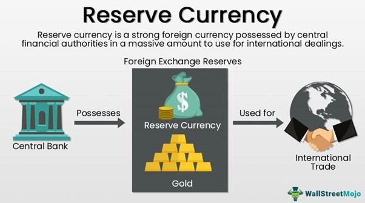

Global finance has evolved considerably, influenced by the dynamic interplay between reserve currencies, currency management, and algorithmic trading. This complex interaction forms the backbone of international trade and bears substantial implications for economic stability worldwide. Reserve currencies, such as the U.S. dollar and the Euro, have historically been instrumental in facilitating global commerce by providing a stable and reliable medium for international transactions. Their dominant position yields significant advantages, including reduced exchange rate risk and lower borrowing costs for issuer countries. These currencies' roles are vital in underpinning economic confidence and stability.

Simultaneously, currency management strategies employed by central banks are crucial for safeguarding economic stability and promoting competitive trade positions. Central banks meticulously manage foreign exchange reserves to buffer against economic shocks and maintain financial equilibrium. The allocation and prudent management of these reserves are essential to ensure liquidity while optimizing returns, a process increasingly shaped by emerging technologies that offer enhanced tools for reserve optimization.



Algorithmic trading, a hallmark of modern financial markets, represents a significant shift in how trades are executed. Leveraging sophisticated computer algorithms, this technology allows trades to be conducted with unprecedented speed and accuracy. While it brings considerable benefits like increased market efficiency and liquidity, it also introduces challenges, such as potential spikes in market volatility and systemic risks. Consequently, evolving regulatory frameworks seek to manage these risks and uphold fair trading practices.

This article provides a comprehensive overview of the interconnected roles of reserve currencies, currency management practices, and algorithmic trading, offering insights into their contemporary implications and exploring future trends and challenges. Understanding how these elements converge is crucial for navigating today's complex and interconnected financial environment.

## Table of Contents

## Understanding Reserve Currencies

Reserve currencies are integral to the global financial system, serving as the backbone for international commerce and enhancing financial stability. A reserve currency is held in significant quantities by governments and institutions as part of their foreign exchange reserves. Its primary roles include facilitating international trade, acting as a benchmark for exchange rates, and providing a measure of stability during economic uncertainties.

Historically, the U.S. dollar has commanded supremacy as the predominant reserve currency, a status that has afforded the United States several economic advantages. This prominence is largely attributed to the size and strength of the U.S. economy, the depth, and liquidity of its financial markets, and the widespread confidence in its political and economic institutions. The U.S. dollar's dominance in global trade and finance is reflected in statistics from the International Monetary Fund (IMF), which indicates that approximately 59% of the world's foreign exchange reserves were held in U.S. dollars as of recent years.

However, the landscape of reserve currencies is gradually evolving. The Euro, introduced at the turn of the millennium, has steadily gained traction as a major reserve currency. The Eurozone's collective economic power, combined with the currency's wide acceptance and use in global transactions, has allowed the Euro to secure its position as the second most widely held reserve currency. According to the European Central Bank, approximately 20% of global reserves are held in euros.

Issuers of reserve currencies benefit from various economic privileges. Notably, they experience lower borrowing costs, as global demand for these currencies often leads to lower interest rates on government bonds. Moreover, because these currencies are widely accepted and trusted, countries holding them in reserves face reduced exchange rate risks when engaging in international trade.

The criteria for a currency to achieve and maintain reserve status are multifaceted and include several key factors:

1. **Economic Stability**: The issuing country must possess a stable and resilient economy. Economic turmoil or severe fluctuations can undermine confidence in the currency.

2. **Deep Financial Markets**: Reserve currencies are typically supported by liquid, well-developed financial markets. This ensures that reserve holders can easily buy or sell large quantities of the currency without affecting its value.

3. **Trust and Reliability**: Confidence in the currency's long-term viability and the political and financial systems of the issuing country is paramount. This trust is often built over decades of stable policy and governance.

4. **Widespread Global Use**: To be considered a reserve currency, it must be widely used in international trade and finance, serving as a common medium for cross-border transactions.

In summary, reserve currencies play a crucial role in facilitating global trade and underpinning financial stability. While the U.S. dollar remains dominant, other currencies like the Euro continue to assert their influence. The path to reserve status involves meeting rigorous criteria related to economic health, financial market development, and international trust. Understanding these dynamics is essential for grasping the complexities of the modern financial system.

## Currency Management Strategies

Effective currency management is a cornerstone for countries aiming to sustain economic stability and maintain competitive trade positions globally. Central banks are at the forefront of this endeavor, tasked with the strategic management of foreign exchange reserves. These reserves serve as crucial buffers against economic shocks, enabling countries to mitigate currency crises, balance of payments imbalances, and other macroeconomic vulnerabilities.

1. **Role of Central Banks**: Central banks, such as the Federal Reserve and the European Central Bank, are responsible for maintaining the balance and liquidity of these reserves. By holding reserves in foreign currencies, governments can bridge gaps in foreign exchange to ensure smooth import and export operations, stabilize their own currencies, and build confidence in international markets. The quantity and composition of these reserves are structured to optimize financial readiness, accommodating potential fluctuations in national and international economic conditions.

2. **Strategic Allocation and Balance**: Effective reserve management requires a keen understanding of strategic allocation and balance. Central banks must decide the optimal mix of assets to hold within their reserves, typically including a variety of currencies, government bonds, and sometimes gold. The goals are to preserve capital, ensure liquidity, and achieve returns that outpace inflation. This involves assessing the creditworthiness of foreign denominated assets and adhering to policy frameworks that prioritize sustainable debt issuance and circulation patterns.

3. **Emerging Technologies**: The advent of emerging technologies is catalyzing a transformation in reserve management strategies. Digital tools are being integrated to optimize forecast models and risk assessment methodologies. Techniques such as financial predictive analytics and machine learning algorithms allow central banks to simulate economic scenarios and refine their strategies. Additionally, automation in trading and reserve rebalancing processes enhances the efficiency and effectiveness of currency management.

For example, leveraging a Python-based approach, central banks can employ quantitative models to determine optimal allocations for their reserves. Consider the following simplistic Python code to simulate asset allocation optimization using historical data:

```python
import numpy as np
import pandas as pd
from scipy.optimize import minimize

# Example return data for currencies
returns = pd.DataFrame({
    'USD': np.random.normal(0.05, 0.1, 100),
    'EUR': np.random.normal(0.04, 0.08, 100),
    'YEN': np.random.normal(0.03, 0.07, 100)
})

# Define portfolio variance
def portfolio_variance(weights, cov_matrix):
    return weights.T @ cov_matrix @ weights

# Covariance matrix from return data
cov_matrix = returns.cov()

# Initial weights
initial_weights = np.array([1/3, 1/3, 1/3])

# Constraints and bounds
constraints = ({'type': 'eq', 'fun': lambda weights: np.sum(weights) - 1})
bounds = ((0, 1), (0, 1), (0, 1))

# Optimize for minimum variance
optimal_portfolio = minimize(portfolio_variance, initial_weights, args=(cov_matrix,), method='SLSQP', bounds=bounds, constraints=constraints)

# Optimal weights
print("Optimal asset weights: ", optimal_portfolio.x)
```

The above model could be significantly more complex in practice to include risk factors and return expectations, reflecting the sophistication with which reserves must be managed.

In conclusion, strategic currency management remains a multifaceted domain requiring keen economic insight and modern technological frameworks to effectively navigate the global financial ecosystem.

## The Role and Impact of Algorithmic Trading

Algorithmic trading, often referred to as algo trading, leverages the computational power of algorithms to conduct trading activities at unprecedented speeds and scales. This approach offers significant advantages in terms of efficiency and precision. By utilizing well-defined parameters and executing trades based on detailed mathematical and statistical models, [algorithmic trading](/wiki/algorithmic-trading) minimizes human error and optimizes opportunities for profit by capitalizing on minute price discrepancies.

The implementation of algorithmic trading has transformed the financial trading landscape. Algorithms typically execute trades by evaluating multiple market variables at once, making decisions within milliseconds and thereby increasing the [liquidity](/wiki/liquidity-risk-premium) in financial markets. This rapid execution is aligned with strategies that can include high-frequency trading, [arbitrage](/wiki/arbitrage) opportunities, and [market making](/wiki/market-making), enabling traders to stay ahead in highly competitive markets.

However, the rapid execution capability that algorithms provide is a double-edged sword. One of the primary concerns associated with algorithmic trading is the potential for increased market [volatility](/wiki/volatility-trading-strategies). Instances exist where algorithmic trading has contributed to "flash crashes," sudden and severe market downturns followed by quick recoveries. Such events are indicative of the potential systemic disruptions that broad-scale algorithmic trading can cause, particularly when algorithms react to each other's trading signals in unforeseen ways.

Given these risks, regulatory frameworks are continually evolving to address the challenges algorithmic trading presents. Regulations aim to ensure transparency, prevent market manipulation, and protect against systemic risks. For instance, circuit breaker mechanisms have been implemented in various equity markets as a precaution against severe price fluctuations. Furthermore, regulations often require that algorithmic trading firms provide detailed documentation and testing of their algorithms to prevent errors that could destabilize markets.

In conclusion, while algorithmic trading has brought about greater efficiency and liquidity to the markets, it also necessitates the implementation of robust risk management practices and regulatory oversight to mitigate its associated risks. The evolving landscape of algorithmic trading is thus characterized by a balance between harnessing technological advancements for trading efficiency while ensuring the stability and integrity of financial markets.

## Intersection of Economic Stability and Algorithmic Trading

The fusion of algorithmic trading and economic stability initiatives represents a significant development in financial markets, offering both challenges and opportunities for enhancing economic resilience. Algorithmic trading, characterized by the use of computer algorithms to execute trades at high frequencies and volumes, contributes to the stability of currency markets by providing liquidity and absorbing market shocks. 

The ability of algorithms to process vast amounts of data and execute orders with precision enables them to react swiftly to market fluctuations. This rapid response capability is crucial in stabilizing markets during periods of high volatility, as algorithms can quickly adjust trading strategies to reflect current conditions. For instance, during sudden economic announcements or geopolitical events, algorithmic trading systems can swiftly adjust their positions, mitigating potential disruptions and contributing to smoother market functioning.

Countries are increasingly leveraging algorithmic strategies to bolster economic resilience by integrating these technologies into national financial infrastructures. Central banks and financial institutions utilize algorithms to manage foreign exchange reserves and optimize currency allocations. By employing these strategies, they enhance their ability to respond to economic shocks, maintain competitive trade positions, and guard against excessive currency fluctuations.

Algorithmic trading also supports economic stability initiatives through its impact on price discovery and market efficiency. By executing trades rapidly and at competitive prices, algorithms enhance the transparency and reliability of financial markets, leading to more accurate pricing of assets. This improved price discovery process is vital for investors and policymakers who rely on accurate market signals to make informed decisions.

However, the integration of algorithmic trading into economic stability strategies is not without risks. The potential for algorithms to exacerbate volatility during extreme market conditions necessitates robust regulatory frameworks. Policymakers are working to balance the benefits of algorithmic trading with the need to mitigate systemic risks, ensuring that technological advancements contribute positively to economic stability.

In conclusion, the intersection of algorithmic trading and economic stability initiatives marks a pivotal evolution in financial markets. By leveraging the capabilities of algorithms, countries can enhance their economic resilience, improve market efficiency, and better manage financial risks. As financial technologies continue to evolve, their integration into economic stability strategies will play a crucial role in shaping the future of global finance.

## Future Trends and Challenges

The financial landscape is experiencing a paradigm shift as nontraditional reserve currencies gain prominence, leading to significant challenges in reserve management. Traditionally dominated by currencies such as the U.S. dollar and the euro, the reserve currency sphere is now seeing potential entrants like China's renminbi and even digital currencies. These developments are reshaping global finance, necessitating a reevaluation of existing strategies.

Digital currencies, particularly cryptocurrencies, have emerged as potential alternatives to traditional reserve currencies. Blockchain technology, which underlies most digital currencies, offers enhanced security, transparency, and efficiency in transactions. The decentralized nature of blockchain can reduce counterparty risk and offer real-time settlement options, which are attractive features for financial institutions looking to optimize reserve management strategies. According to the Bank for International Settlements, while central bank digital currencies (CBDCs) are still in experimental phases in many countries, they hold the potential to transform currency management at the core of financial systems (Bank for International Settlements, 2021).

Artificial intelligence (AI) is also playing a transformative role in the management and trading of currencies. AI-driven analytics enhance decision-making processes by forecasting macroeconomic indicators and identifying optimal currency allocation strategies. Machine learning algorithms analyze large datasets to identify patterns and trends that human analysts might miss, thus providing a competitive edge in the fast-paced global markets. The application of AI in currency management is expected to enhance the precision and efficiency of reserve allocation, though it requires substantial investments in technology and human capital.

Central banks are finding themselves at a crossroads. To effectively adapt to these rapid advancements, they must invest in developing robust infrastructure and a skilled workforce capable of handling the complexities of next-generation financial technologies. This includes upgrading legacy systems to accommodate blockchain transactions and incorporating AI systems into day-to-day operations.

Moreover, regulatory considerations present additional challenges. As digital currencies disrupt traditional banking structures, ensuring regulatory compliance while fostering innovation is a delicate balance. Central banks must craft policies that mitigate risks associated with these technologies without stifling their potential benefits. 

Therefore, to navigate the future landscape successfully, central banks and financial institutions need a proactive approach, embracing technological advancements while being vigilant of potential pitfalls. This evolving dynamic between traditional financial mechanisms and emerging technologies will shape the future of global economic stability.

## Conclusion

The interplay between reserve currencies, currency management, and algorithmic trading is driving fundamental transformations in global finance. These elements are integral to the stability and growth of the international economic system. Reserve currencies, such as the U.S. dollar and the Euro, serve as the backbone of global trade and finance, allowing countries to transact with reduced currency risk and at lower borrowing costs. This position is crucial for maintaining liquidity and ensuring economic stability.

Effective currency management is indispensable for countries aiming to preserve economic equilibrium and safeguard competitive trading stances. Central banks, by managing foreign exchange reserves, play a pivotal role in cushioning economies against shocks. Strategic management of these reserves aids in achieving a delicate balance between liquidity and maximizing returns.

Algorithmic trading has introduced unprecedented efficiency and precision to the financial markets, allowing for faster and more informed trading decisions. It has the potential to stabilize currency markets by providing liquidity and absorbing market shocks. However, it also presents challenges, such as increased market volatility and systemic risks, which demand robust regulatory frameworks to ensure fair and stable trading environments.

The ongoing evolution of financial technologies, including digital currencies, blockchain, and [artificial intelligence](/wiki/ai-artificial-intelligence), is set to reshape currency management and trading practices further. As the financial landscape shifts towards nontraditional reserve currencies, the need for adaptive strategies becomes more pressing. Central banks and financial institutions must invest in expertise and infrastructure to navigate these complex dynamics effectively.

In summary, the dynamic interaction between reserve currencies, currency management, and algorithmic trading is crucial for sustaining economic stability and fostering growth. To stay competitive and resilient, the financial sector must continuously adapt to technological advancements and market changes, ensuring a stable and prosperous global economy in the future.

## References & Further Reading

[1]: Bergstra, J., Bardenet, R., Bengio, Y., & Kégl, B. (2011). ["Algorithms for Hyper-Parameter Optimization."](https://dl.acm.org/doi/10.5555/2986459.2986743) Advances in Neural Information Processing Systems 24.

[2]: ["Advances in Financial Machine Learning"](https://www.amazon.com/Advances-Financial-Machine-Learning-Marcos/dp/1119482089) by Marcos Lopez de Prado

[3]: ["Evidence-Based Technical Analysis: Applying the Scientific Method and Statistical Inference to Trading Signals"](https://www.amazon.com/Evidence-Based-Technical-Analysis-Scientific-Statistical/dp/0470008741) by David Aronson

[4]: ["Machine Learning for Algorithmic Trading"](https://github.com/stefan-jansen/machine-learning-for-trading) by Stefan Jansen

[5]: ["Quantitative Trading: How to Build Your Own Algorithmic Trading Business"](https://www.amazon.com/Quantitative-Trading-Build-Algorithmic-Business/dp/1119800064) by Ernest P. Chan

[6]: Eichengreen, B. (2011). ["Exorbitant Privilege: The Rise and Fall of the Dollar and the Future of the International Monetary System."](https://archive.org/details/exorbitantprivil0000eich) Oxford University Press.

[7]: Bank for International Settlements (2021). ["Central Bank Digital Currencies: Drivers, Approaches and Technologies."](https://www.bis.org/publ/work880.htm) 

[8]: International Monetary Fund. (2020). ["Annual Report on Exchange Arrangements and Exchange Restrictions 2020."](https://www.imf.org/en/Publications/Annual-Report-on-Exchange-Arrangements-and-Exchange-Restrictions/Issues/2021/08/25/Annual-Report-on-Exchange-Arrangements-and-Exchange-Restrictions-2020-49738) 

[9]: O'Hara, M. (2015). ["High Frequency Trading and Its Impact on Markets."](https://statmath.wu.ac.at/~hauser/LVs/FinEtricsQF/References/oHara2015JFinEco_HighFrequ_Market_MiicroStruct.pdf) Annual Review of Financial Economics.