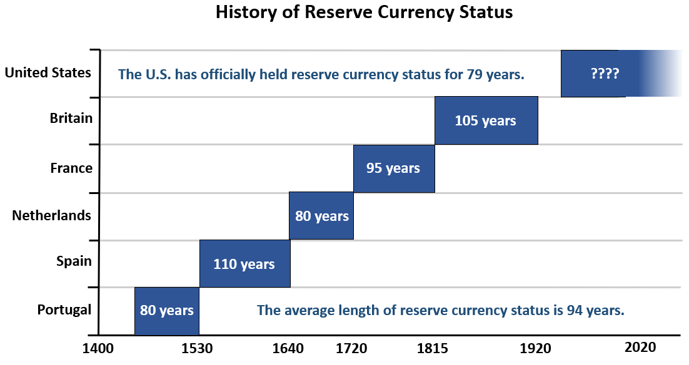

## Table of Contents

## What is a reserve currency?

A reserve currency is a type of money that many countries around the world hold in large amounts. It's often used for international trade and as a way to store value. The U.S. dollar, for example, is a reserve currency because many countries keep dollars in their reserves and use them to buy and sell goods with other countries.

Having a reserve currency can be very important for a country. It means that other countries trust and rely on that currency. This can make the country's economy stronger and more stable. For example, if the U.S. dollar is the reserve currency, it helps the United States because other countries need dollars to do business, which increases the demand for the dollar.

## How did the U.S. dollar become a reserve currency?

The U.S. dollar became a reserve currency mainly after World War II. During the war, many countries' economies were damaged, but the United States' economy stayed strong. In 1944, countries met at the Bretton Woods Conference and decided to use the U.S. dollar as the main currency for international trade. They tied their own currencies to the dollar, which was tied to gold. This made the dollar very important and trusted around the world.

Over time, the U.S. dollar kept its position as a reserve currency because the U.S. economy remained strong and stable. Many countries continued to use the dollar for trade and to keep in their reserves. Even after the U.S. stopped tying the dollar to gold in 1971, the dollar stayed important because of the size and strength of the U.S. economy. Today, the U.S. dollar is still the most widely used reserve currency in the world.

## What are the historical precedents of reserve currencies before the U.S. dollar?

Before the U.S. dollar, the British pound was the main reserve currency. This happened during the 19th and early 20th centuries when the British Empire was very powerful. Many countries around the world used the pound for trade and kept it in their reserves. The pound was tied to gold, which helped make it stable and trusted. But after World War I and World War II, the British economy got weaker, and the pound lost its position as the top reserve currency.

Before the British pound, the Spanish dollar was used as a reserve currency in the 16th to 19th centuries. The Spanish dollar was a silver coin that was widely used in trade, especially in the Americas and Asia. It was trusted because it had a lot of silver in it and was easy to use in trade. As the Spanish Empire grew, so did the use of the Spanish dollar. But when Spain's power started to decline, the Spanish dollar was used less and less as a reserve currency.

## What role does the U.S. dollar play in global trade?

The U.S. dollar plays a big role in global trade. Many countries use the dollar to buy and sell things with other countries. For example, when a country in Europe wants to buy oil from a country in the Middle East, they often use U.S. dollars to pay for it. This happens because the dollar is trusted and accepted everywhere. It makes trading easier because everyone can use the same currency.

The U.S. dollar also helps keep the world's economy stable. Because so many countries use the dollar, it helps them to work together and trust each other's money. If a country's own currency is weak, they can use dollars to make sure their trade keeps going smoothly. This is important for keeping the global economy running well.

## How does the status of the U.S. dollar as a reserve currency benefit the United States?

The status of the U.S. dollar as a reserve currency gives the United States a lot of benefits. One big benefit is that it makes the U.S. economy stronger. Because other countries need dollars for trade, they have to buy dollars. This increases the demand for the dollar, which can make it more valuable. When the dollar is strong, it can help the U.S. buy things from other countries for less money.

Another benefit is that it helps the U.S. government borrow money more easily. Because the dollar is trusted around the world, other countries and investors are more willing to lend money to the U.S. government. This means the U.S. can borrow at lower interest rates. It's like getting a better deal on a loan because everyone trusts you to pay it back. This helps the U.S. government spend money on things like roads, schools, and defense without having to worry as much about the cost of borrowing.

## What are the potential drawbacks for the U.S. in maintaining the dollar as a reserve currency?

One potential drawback for the U.S. in keeping the dollar as a reserve currency is that it can make the U.S. economy less stable. Because other countries use the dollar a lot, what happens in the U.S. can affect the whole world. If the U.S. has a big problem with its economy, like a financial crisis, it can cause problems for other countries too. This can make other countries less happy about using the dollar and might make them look for other currencies to use instead.

Another drawback is that the U.S. might feel pressure to keep the dollar strong. A strong dollar can make it harder for U.S. companies to sell things to other countries because their products become more expensive. This can hurt U.S. businesses and make it harder for them to grow. Also, if the U.S. wants to borrow money, a strong dollar might mean they have to pay more back to other countries and investors. This can put a strain on the U.S. economy and make it harder to manage.

## How has the role of the U.S. dollar as a reserve currency evolved since World War II?

Since World War II, the U.S. dollar has been very important in the world. Right after the war, countries decided at the Bretton Woods Conference to use the dollar as the main currency for trade. They tied their own money to the dollar, which was tied to gold. This made the dollar strong and trusted around the world. Even when the U.S. stopped tying the dollar to gold in 1971, the dollar stayed important because the U.S. economy was still strong and stable. Many countries kept using the dollar for trade and kept it in their reserves.

Over time, the role of the dollar has changed a bit. More countries started using other currencies like the euro and the Chinese yuan for trade. But the dollar is still the most used reserve currency. This means the U.S. has a lot of power in the world economy. The dollar helps the U.S. economy stay strong because other countries need dollars to do business. But it also means the U.S. has to be careful because if its economy has problems, it can affect the whole world.

## What are the key international agreements that have supported the U.S. dollar's status as a reserve currency?

The most important agreement that helped the U.S. dollar become a reserve currency was the Bretton Woods Conference in 1944. After World War II, many countries' economies were weak, but the U.S. economy was strong. At the conference, countries agreed to use the U.S. dollar as the main currency for international trade. They tied their own money to the dollar, and the dollar was tied to gold. This made the dollar trusted and important around the world.

Another key agreement that supported the dollar's status is the creation of the International Monetary Fund (IMF) and the World Bank at the same Bretton Woods Conference. These organizations helped to keep the world's economy stable and made it easier for countries to use the dollar. Even after the U.S. stopped tying the dollar to gold in 1971, the dollar stayed important because of these organizations and the strong U.S. economy.

## How do fluctuations in the value of the U.S. dollar affect global economies?

Fluctuations in the value of the U.S. dollar can have a big impact on global economies. When the dollar goes up in value, it can make things more expensive for other countries. For example, if a country in Europe wants to buy oil from the Middle East, they might need more of their own money to buy the same amount of dollars. This can make their economy weaker because they have to spend more money on things they need. On the other hand, a stronger dollar can help U.S. companies buy things from other countries for less money, which can be good for the U.S. economy.

When the dollar goes down in value, it can have the opposite effect. Other countries might find it cheaper to buy things from the U.S., which can help their economies grow. But it can make things more expensive for people in the U.S. because they need more dollars to buy things from other countries. This can cause problems for the U.S. economy. Overall, changes in the value of the dollar can make economies around the world go up and down, and countries have to be ready to handle these changes.

## What challenges does the U.S. dollar face in maintaining its status as the world's primary reserve currency?

The U.S. dollar faces several challenges in keeping its spot as the world's main reserve currency. One big challenge is the growing use of other currencies like the euro and the Chinese yuan. More countries are starting to use these currencies for trade and keeping them in their reserves. This means the U.S. dollar might not be as important as it used to be. Also, if the U.S. economy has problems, like a big debt or a financial crisis, it can make other countries less confident in using the dollar. They might start looking for other currencies to use instead.

Another challenge is that the U.S. government might make decisions that make other countries unhappy. For example, if the U.S. puts sanctions on other countries, it can make them want to use different currencies. Also, if the U.S. keeps borrowing a lot of money, it might make the dollar less valuable over time. This can make other countries less willing to use the dollar for trade. Keeping the dollar strong and trusted is important, but it's not easy, and the U.S. has to work hard to make sure it stays the world's main reserve currency.

## What alternative currencies are being considered or have the potential to become future reserve currencies?

One currency that people are looking at as a possible future reserve currency is the euro. The euro is used by many countries in Europe, and it's already the second most used reserve currency after the U.S. dollar. Because the European Union is a big and strong group of countries, the euro could become even more important in the future. If more countries start using the euro for trade and keeping it in their reserves, it could challenge the dollar's position.

Another currency that might become a reserve currency is the Chinese yuan. China's economy is growing fast and becoming more important in the world. More countries are starting to use the yuan for trade, especially with China. If China keeps getting stronger and more countries trust the yuan, it could become a big reserve currency. But right now, the yuan is not used as much as the dollar or the euro, so it would take time for it to become a main reserve currency.

There are also new kinds of money, like digital currencies, that could change things. Some people think that cryptocurrencies like Bitcoin could become important in the future. But right now, they are not used much for big trade or kept in reserves by countries. They are still too new and not trusted enough by most countries. So while they could be important someday, it's hard to say if they will become reserve currencies anytime soon.

## How might geopolitical shifts influence the future role of the U.S. dollar as a reserve currency?

Geopolitical shifts can change how countries see and use the U.S. dollar. If the U.S. gets into fights with other countries or puts sanctions on them, those countries might not want to use the dollar as much. They might start using other currencies like the euro or the Chinese yuan instead. Also, if other big countries like China or the European Union get more powerful, they might want their own currencies to be used more around the world. This could make the dollar less important over time.

Another way geopolitical shifts could affect the dollar is if countries start working together more to use different currencies. For example, if countries in Asia start using the yuan more for trade with each other, it could make the yuan stronger and the dollar weaker. Also, if the U.S. has big problems with its economy or its politics, other countries might lose trust in the dollar. They might then look for other currencies that seem safer and more stable. So, the future of the dollar as a reserve currency depends a lot on what happens in the world.

## References & Further Reading

International Monetary Fund. "Currency Composition of Official Foreign Exchange Reserves." This document provides comprehensive data on how global reserves are distributed across different currencies, underlining the critical role of the U.S. Dollar in international finance.

Bordo, M. D., & Eichengreen, B. "The Rise and Fall of a Barbarous Relic: The Role of Gold in the International Monetary System." This paper discusses the historical context of the gold standard and its influence on modern monetary policies, offering insights into the transition to fiat currencies such as the U.S. Dollar.

Bank for International Settlements. "Triennial Central Bank Survey: Foreign Exchange Turnover in April 2019." This survey delivers key [statistics](/wiki/bayesian-statistics) on the forex market, including currency trading volumes, which highlight the dominance of the U.S. Dollar and the impact of algorithmic trading strategies on market liquidity.

Murphy, C. "Algorithmic Trading in the Foreign Exchange Market." Journal of International Financial Markets, Institutions, and Money. Murphy's work examines the methodologies and implications of algorithmic trading in forex markets, with a focus on efficiency, risks, and the regulatory landscape that governs these activities.

