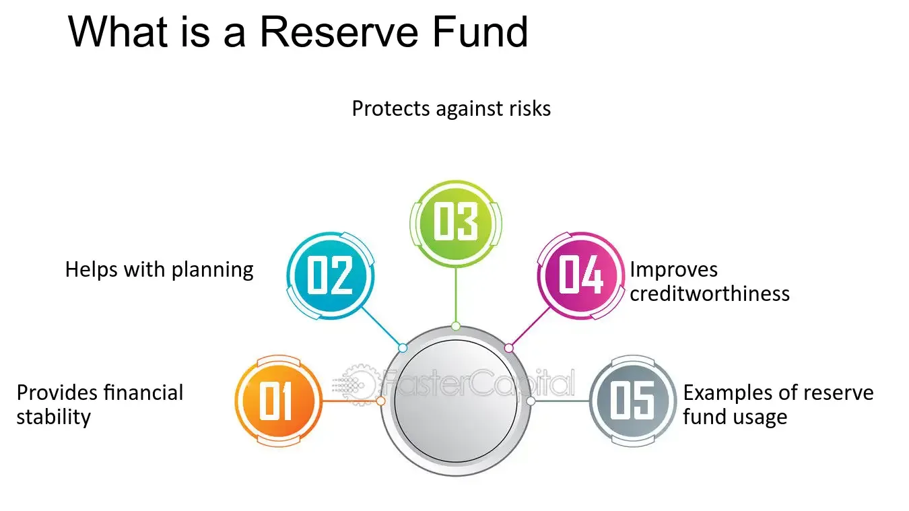

## Table of Contents

## What is a reserve fund?

A reserve fund is like a savings account that a group or organization keeps for emergencies or unexpected costs. It's money set aside to make sure there's enough cash to cover things like sudden repairs, unexpected bills, or other surprises that might come up. For example, a condo association might use its reserve fund to fix a broken elevator or replace a roof that got damaged in a storm.

Having a reserve fund is important because it helps keep things running smoothly without needing to borrow money or raise fees suddenly. It's a way to plan ahead and be ready for the future. By saving a little bit regularly, the reserve fund grows over time, which means the group can handle bigger problems without too much stress or financial strain.

## Why is a reserve fund important for financial stability?

A reserve fund is important for financial stability because it acts like a safety net for unexpected expenses. Imagine if something big and costly breaks, like a heating system in a building. Without a reserve fund, the people in charge might have to borrow money or raise fees quickly, which can be stressful and hard on everyone. But with a reserve fund, they can use the saved money to fix the problem without causing a financial panic.

Having a reserve fund also helps to keep things running smoothly over the long term. It's like putting money away in a piggy bank little by little. Over time, the fund grows, and it can cover bigger costs without needing to scramble for money. This means the group or organization can plan better for the future, knowing they have a cushion to fall back on if something goes wrong. It's all about being prepared and avoiding big financial surprises.

## How does a reserve fund differ from an emergency fund?

A reserve fund and an emergency fund are similar because they both save money for unexpected costs. But they are used by different groups. A reserve fund is usually for organizations, like a condo association or a business. They use it to pay for big repairs or unexpected bills that affect everyone in the group. An emergency fund, on the other hand, is for individuals or families. They use it to cover personal emergencies, like losing a job or needing to fix a car.

The main difference is who uses them and what they are for. A reserve fund helps keep an organization running smoothly by covering costs that could affect a lot of people. It's like a group safety net. An emergency fund is more personal. It's there to help one person or a family get through tough times without going into debt. Both are important for financial stability, but they serve different needs.

## What are the common sources of funding for a reserve fund?

A reserve fund usually gets money from regular contributions. For example, if you live in a condo, you might pay a monthly fee that includes a little bit for the reserve fund. This way, everyone in the group helps add money to the fund over time. Sometimes, the organization might also set aside extra money from its budget to put into the reserve fund, especially if they have a good year and make more money than expected.

Another way to add money to a reserve fund is through special assessments. This means everyone in the group might have to pay a one-time extra fee if there's a big need for money. For instance, if the roof needs to be replaced and the reserve fund isn't enough, the group might ask everyone to pay a bit more to cover the cost. Interest earned on the money in the reserve fund can also help it grow, making it a bit bigger over time without needing to add more money directly.

## How should a reserve fund be managed and invested?

Managing a reserve fund means keeping an eye on it and making sure it's used the right way. The people in charge should look at the fund often to see how much money is in it and if it's enough for what they might need. They should also plan how much money to put into the fund each year, so it grows over time. It's important to have clear rules about when and how to use the money, so everyone knows what to expect. That way, the fund can be there when it's really needed, like for big repairs or unexpected costs.

Investing a reserve fund is a bit trickier because the main goal is to keep the money safe and ready to use. Usually, the money is put into safe places like savings accounts or money market funds, where it can earn a little bit of interest without much risk. Sometimes, if the group is okay with a bit more risk, they might invest some of the money in bonds or other low-risk investments. But the key is to balance [earning](/wiki/earning-announcement) a bit of extra money with keeping the fund safe and available for when it's needed.

## What are the legal requirements for maintaining a reserve fund in different jurisdictions?

The rules for keeping a reserve fund can be different in different places. In the United States, for example, some states have laws that say condo associations and homeowner associations must have a reserve fund. These laws might say how much money should be in the fund and what it can be used for. In other countries, like Canada or Australia, there might be similar rules, but they can vary from one province or state to another. It's important for the people in charge to know the local laws and follow them, so they don't get into trouble.

In some places, the law might say that the group needs to do a study to figure out how much money to save in the reserve fund. This study looks at things like how old the building is and what repairs might be needed in the future. The group then has to follow the study's advice and put away enough money. If they don't, they could face fines or other problems. So, it's really important to understand and follow the rules where you live.

## How can a reserve fund be used during economic downturns?

During tough economic times, a reserve fund can be a big help. If people are losing their jobs or businesses are making less money, the reserve fund can be used to cover costs that the group might not be able to pay otherwise. For example, if a condo association can't collect enough fees from residents because they're struggling financially, the reserve fund can help pay for things like repairs or utilities. This way, the group can keep going without having to borrow money or raise fees suddenly, which could make things even harder for everyone.

Using the reserve fund wisely during an economic downturn can also help the group plan for the future. Instead of spending all the money right away, the people in charge might decide to use just enough to get through the tough times. This means they can still have some money left over for when things get better. By being careful and smart with the reserve fund, the group can make it through hard times without too much stress and be ready for whatever comes next.

## What are the best practices for determining the adequate size of a reserve fund?

Figuring out how big a reserve fund should be is important for keeping things stable. One good way to do this is by doing a reserve study. This study looks at things like how old the building or equipment is, what might need to be fixed or replaced soon, and how much that might cost. By doing this study, the group can see how much money they need to save each year to be ready for these costs. It's like making a plan for the future, so they're not surprised by big bills.

Another important thing is to think about how much risk the group is okay with. If they want to be really safe, they might decide to save more money in the reserve fund. This means they'll have enough money for almost any problem that comes up. But if they're okay with taking a bit more risk, they might save a little less. It's all about finding a balance that works for everyone in the group. By talking about it and agreeing on what feels right, they can make sure the reserve fund is the right size for their needs.

## How do organizations report and disclose information about their reserve funds?

Organizations usually share information about their reserve funds in their financial reports. These reports show how much money is in the reserve fund, where the money comes from, and what it's used for. They might also explain any big changes to the fund, like if they added a lot of money or used it for a big repair. This helps everyone in the group know what's going on with the reserve fund and feel confident that it's being managed well.

Sometimes, the law says that organizations have to tell everyone about their reserve funds in a certain way. For example, they might need to send out a yearly report or post the information on their website. This is important because it makes sure the group is being open and honest about their money. By sharing this information clearly and regularly, the organization can keep everyone informed and avoid any surprises or misunderstandings.

## What are the potential risks and challenges associated with managing a reserve fund?

Managing a reserve fund can be tricky because there are some risks and challenges. One big risk is not having enough money in the fund when something big and expensive happens. If the group doesn't save enough money, they might have to borrow money or raise fees quickly, which can be stressful. Another challenge is figuring out how much money to save. It's hard to predict the future and know exactly what repairs or costs might come up, so the group has to guess and plan the best they can.

Another risk is that the money in the reserve fund might lose value over time if it's not invested wisely. If the group puts the money in a place where it doesn't earn much interest, or if they take too much risk and lose money, the fund might not grow enough to cover future costs. It's a balance between keeping the money safe and making sure it grows a little bit. Plus, there's always the challenge of making sure everyone in the group agrees on how to use the reserve fund. If people have different ideas about what's important, it can be hard to make decisions that everyone is happy with.

## How does the purpose of a reserve fund vary across different types of organizations?

The purpose of a reserve fund can be different depending on the type of organization. For a condo association, the reserve fund is there to pay for big repairs or replacements, like fixing the roof or replacing the elevator. This helps keep the building in good shape without having to ask residents for a lot of money all at once. For a non-profit group, the reserve fund might be used to cover unexpected costs or to keep programs running if donations go down. It's like a safety net that helps the group keep doing its important work even when things get tough.

In a business, the reserve fund might be used to handle unexpected costs or to take advantage of new opportunities. For example, if a machine breaks down, the business can use the reserve fund to fix it without losing money. Or, if a good chance to grow the business comes up, the reserve fund can help pay for it. Each type of organization uses the reserve fund in a way that fits their needs, but the main idea is the same: to be ready for surprises and keep things running smoothly.

## What advanced strategies can be employed to optimize the performance of a reserve fund?

One advanced strategy to optimize the performance of a reserve fund is to use a tiered investment approach. This means putting some of the money in safe places like savings accounts or money market funds, where it's easy to get to and doesn't lose value. But you can also put some of the money in slightly riskier investments, like bonds, that might earn more interest over time. By spreading the money out like this, the reserve fund can grow a bit more without taking too much risk. It's like having a mix of safe and growing parts, so the fund can be ready for emergencies but also get bigger over time.

Another strategy is to regularly review and update the reserve fund plan. This means looking at the reserve study every year or so to see if things have changed. Maybe the building is getting older faster than expected, or maybe costs for repairs are going up. By keeping the plan up to date, the group can make sure they're saving the right amount of money. They can also talk about how to use the money wisely, like setting rules for when to use it and when to save it for later. This way, the reserve fund stays strong and ready to help when it's needed most.

## What are Fund Allocation Strategies?

Fund allocation is integral to achieving financial aspirations and managing risks. It involves the distribution of assets across various investment avenues to meet both immediate financial needs and optimize long-term returns. At its core, effective fund allocation seeks to balance the tradeoff between risk and reward by diversifying investments. This approach helps to mitigate risks associated with market [volatility](/wiki/volatility-trading-strategies) and economic uncertainties.

Diversification remains a cornerstone of strategic allocation, aimed at spreading investments across different asset classes such as equities, bonds, and real estate. This method reduces the exposure to any single asset, thus lowering the risk of significant losses. A well-diversified portfolio might be structured as follows:

$$
\text{Total Portfolio Value} = \sum_{i=1}^{n} w_i \cdot r_i
$$

where $w_i$ represents the weight of each asset $i$ in the portfolio, and $r_i$ is the return of asset $i$. By adjusting the weights $w_i$, investors can tailor the portfolio to specific risk tolerances and financial goals.

In addition to diversification, a regular assessment of market conditions is vital. This involves analyzing macroeconomic factors, market trends, and geopolitical events that could influence investment outcomes. Adapting to these dynamics allows for proactive adjustments in asset allocations, ensuring alignment with changing economic landscapes and investor objectives. Tools such as rolling forecasts and scenario analyses are often employed to simulate various market conditions and their potential impact on portfolios.

Proper allocation strategies also focus on seizing investment opportunities as they arise. This might involve reallocating resources from underperforming assets to those with higher growth potential or reinvesting dividends and interest payments to enhance compounding returns. By doing so, investors can optimize the cash flows and enhance the overall yield of the portfolio.

Avoiding [liquidity](/wiki/liquidity-risk-premium) shortfalls is another critical aspect of fund allocation, ensuring that there are sufficient liquid assets to meet short-term obligations and unexpected expenses. This can involve maintaining a portion of the portfolio in cash or near-cash instruments, providing quick access to funds when needed.

Lastly, ensuring compliance with financial objectives enforces discipline in investment strategies. This requires setting clear, measurable goals and establishing policies that dictate investment choices, risk limits, and performance benchmarks. Regular monitoring and performance reviews ensure these benchmarks are met, providing accountability and guiding necessary adjustments towards financial targets.

Strategic fund allocation, therefore, is a dynamic and disciplined approach, balancing immediate needs, long-term objectives, and risk management principles to achieve sustainable financial success.

## What is the Role of Algorithmic Trading?

Algorithmic trading transforms trading processes through the application of automation and data analytics, optimizing the execution of trades in financial markets. This technology-driven approach capitalizes on speed and computational efficiency by utilizing pre-set rules coded into algorithms. These rules are designed to execute transactions with precision, minimizing the risk of human errors and emotional biases that can adversely influence trading decisions.

One of the key benefits of [algorithmic trading](/wiki/algorithmic-trading) is its capability to process and analyze vast amounts of data much quicker than a human could. Algorithms can evaluate multiple market conditions simultaneously, identifying profitable trading opportunities and executing trades within milliseconds. This speed advantage allows traders to capitalize on even the smallest market inefficiencies before they disappear.

Popular strategies employed in algorithmic trading include statistical [arbitrage](/wiki/arbitrage) and [trend following](/wiki/trend-following). Statistical arbitrage relies on the identification of pricing inefficiencies between related securities. This involves complex mathematical models and statistical techniques to forecast returns and adjust positions in real-time as arbitrage opportunities arise. A simplified example of such a strategy could be represented as:

$$
\text{Expected Return} = \alpha + \beta \times \text{Market Risk} + \epsilon
$$

where $\alpha$ represents excess return, $\beta$ measures the sensitivity to market risk, and $\epsilon$ is the error term. Trend following, on the other hand, is based on the analysis of market data to identify and follow market trends. It utilizes historical price data, moving averages, and other technical indicators to make informed trading decisions that align with the prevailing trends.

The implementation of these strategies necessitates a robust technical infrastructure capable of maintaining real-time data availability and executing orders in highly liquid markets. This includes high-performance computing systems and low-latency network connections to ensure that trades are executed at the best possible prices.

Regulatory compliance is a significant aspect of algorithmic trading. As trading algorithms can influence market dynamics, they must adhere to legal standards and guidelines that safeguard market integrity. Regulations often mandate risk management protocols and require transparency in trading activities, ensuring that algorithmic trading does not result in market manipulation or undue risk.

In conclusion, algorithmic trading is a pivotal component of modern trading practices, offering enhanced precision, efficiency, and risk management. Its success hinges on the seamless integration of advanced technological infrastructure and adherence to regulatory frameworks, thereby ensuring that it remains a reliable and effective tool in the financial markets.

## References & Further Reading

Bergstra, J., Bardenet, R., Bengio, Y., & Kégl, B. (2011). 'Algorithms for Hyper-Parameter Optimization.' This paper discusses methods to optimize hyper-parameters in [machine learning](/wiki/machine-learning) models, which can be crucial for enhancing algorithmic trading strategies by ensuring models are fine-tuned for performance.

Lopez de Prado, M. 'Advances in Financial Machine Learning.' This book introduces cutting-edge techniques in machine learning tailored for finance, focusing on the application of these methods in algorithmic trading. It covers topics such as the use of big data, the design of execution strategies, and the handling of financial data's unique challenges.

Aronson, D. 'Evidence-Based Technical Analysis.' Aronson provides a scientific approach to technical analysis, emphasizing the importance of evidence and data in formulating trading strategies. This resource is valuable for developing robust trading algorithms that rely on data-driven insights.

Jansen, S. 'Machine Learning for Algorithmic Trading.' This book serves as a practical guide on how machine learning techniques can be applied to develop trading algorithms. It covers the entire lifecycle of a trading model, from idea generation and feature engineering to [backtesting](/wiki/backtesting) and performance evaluation, providing valuable insights for integrating machine learning in trading operations.

Chan, E. P. 'Quantitative Trading.' Chan's work explores quantitative methods for developing trading strategies. It offers a comprehensive overview of statistical techniques, risk management, and strategy implementation, making it an essential reference for algorithmic traders seeking to optimize their trading systems.

