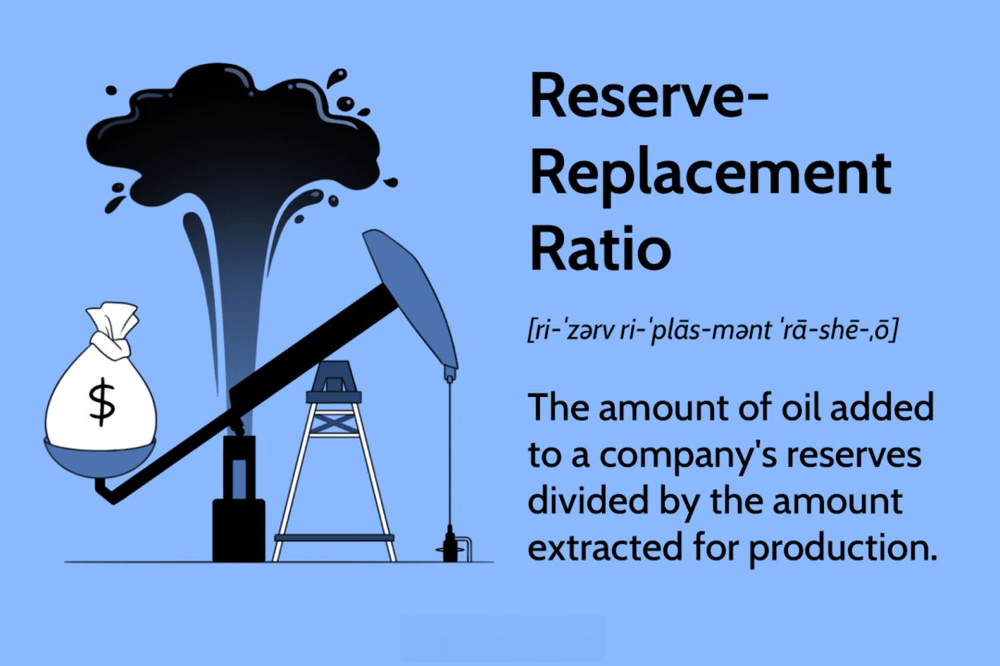

The energy industry is undergoing a significant transformation as it integrates traditional oil reserves with cutting-edge technological advancements. This convergence is reshaping the landscape, where the reserve-replacement ratio in oil exploration and the increasing application of algorithmic trading are pivotal. Reserve-replacement — which measures the enhancement or depletion of oil reserves against current production — is crucial for evaluating an energy firm's long-term viability and the overall stability of the energy market. With major oil-producing nations like Saudi Arabia and Venezuela holding substantial sway, these reserves play an indispensable role in global economic stability and energy security.

Moreover, the emergence of algorithmic trading has dramatically altered how energy markets operate. Through the use of complex algorithms, traders can navigate the market with increased efficiency, making swift decisions amidst fluctuating prices. This technological intervention not only enhances trading precision but also introduces new challenges, such as the need for robust risk management and the potential for regulatory changes. 



These dynamics demand a deep understanding from stakeholders, who must seize the opportunities that arise while addressing the inherent challenges. Balancing the management of traditional oil reserves with the utilization of sophisticated trading strategies will be a determining factor in the sustainable development of the energy industry. By comprehending these evolving components, stakeholders can strategically position themselves to thrive in this rapidly changing environment.

## Table of Contents

## Understanding Oil Reserves and Reserve-Replacement Ratio

Oil reserves are foundational to global economic stability, playing a significant role in the dynamics of the energy sector. Countries with substantial oil reserves, such as Saudi Arabia and Venezuela, wield considerable influence over the global oil market, affecting supply, pricing, and geopolitical strategies. Oil reserves are essentially known quantities of oil that can be economically extracted at current prices and with existing technology. These reserves are a key asset for nations, determining their energy security and economic power.

The Reserve-Replacement Ratio (RRR) is a critical metric in assessing the sustainability of a country or company's oil production levels. It is calculated as the ratio of the [volume](/wiki/volume-trading-strategy) of oil added to reserves (through discoveries, improved recovery, or purchases) to the volume of oil extracted and produced over a given period. Mathematically, it is expressed as:

$$
\text{RRR} = \frac{\text{Additions to reserves}}{\text{Oil extracted and produced}}
$$

An RRR of 100% or more is desirable as it indicates that the entity is maintaining or increasing its reserves at a rate equal to or greater than its production. This suggests that the entity can sustain its production levels without depleting its reserve base, ensuring a steady supply to meet future demand. An RRR exceeding 100% indicates potential for growth, as reserves are being replenished at a rate that exceeds consumption, allowing for potential increases in future production.

The economic implications of maintaining a favorable RRR are vast. A high RRR can reduce reliance on foreign oil, stabilize or improve energy security, and strengthen the economic position of oil-producing nations within global markets. It also impacts investment strategies, as companies demonstrating strong reserve replacement are often viewed as more sustainable and thus more attractive to investors. Conversely, a low RRR can signal declining future production capabilities and increased vulnerability to market [volatility](/wiki/volatility-trading-strategies).

Maintaining an adequate RRR is challenged by factors such as the depletion of easily accessible reserves, geopolitical tensions affecting exploration access, and market price fluctuations that influence the economic viability of reserve addition activities. For example, developments in technological solutions that enable enhanced oil recovery can improve reserve addition rates, while geopolitical instability can impede access to potential reserve sites.

Overall, understanding and optimizing the Reserve-Replacement Ratio is of paramount importance for stakeholders in the energy sector. It ensures they can meet production needs without jeopardizing future potential, maintaining economic stability and strategic advantage in the global energy landscape.

## Challenges in Maintaining Reserve Levels

The energy industry is currently grappling with a significant challenge as oil reserves are being depleted faster than they are being replenished. This discrepancy poses a substantial threat to global energy stability. With the world's energy demand forecasted to increase, largely due to population growth and industrialization, there is an urgent need to address this imbalance. However, advancements in lower-carbon energy alternatives are progressing at a relatively slow pace, exacerbating the pressure on existing oil reserves.

Several strategies are being employed to maintain reserve levels and ensure sustainability. Among these, infrastructure-led exploration is a key approach. This strategy involves the development and utilization of advanced technologies and infrastructure to efficiently identify and extract new oil resources. Enhanced seismic imaging, for example, allows for better visualization of subsurface resources, leading to more accurate location and estimation of oil reserves. Additionally, digital technologies are being harnessed to enhance data interpretation and decision-making processes, thereby improving the success rates of exploration activities.

Proactive interventions are also vital in addressing the reserve-replacement challenge. These interventions include policies and initiatives aimed at increasing exploratory activities, encouraging investment in new oil fields, and optimizing existing extraction processes to maximize output. Governments and private entities are incentivizing research and development in innovative extraction techniques such as hydraulic fracturing and horizontal drilling. These methods have the potential to access previously unreachable reserves, thereby extending the lifespan of existing oil fields.

The challenges of maintaining reserve levels are compounded by the need for sustainable practices. While increasing oil reserves is critical, it must be balanced with environmental considerations and the ongoing transition to a low-carbon economy. As such, maintaining reserve levels is not solely about increased production but also about integrating sustainable practices into exploration and extraction processes. This includes minimizing environmental footprints, adhering to regulatory standards, and incorporating renewable energy solutions where feasible.

In summary, the maintenance of reserve levels is a multifaceted challenge requiring a combination of cutting-edge technology, strategic interventions, and a commitment to sustainable practices. As the energy industry continues to evolve, these efforts will be crucial in ensuring energy security and stability in the face of rising global demand.

## Algorithmic Trading in the Energy Sector

Algorithmic trading has become a transformative force in the energy sector, enabling market participants to execute trades with unprecedented speed and precision. This form of trading employs sophisticated algorithms to automate the decision-making process and execution of trades, thereby reducing human error and increasing efficiency.

One of the primary advantages of [algorithmic trading](/wiki/algorithmic-trading) in energy markets is its ability to handle large volumes of data swiftly. Energy markets are characterized by volatility due to factors such as geopolitical events, supply chain disruptions, and fluctuating demands. Algorithms can process this complex web of information at speeds unattainable by human traders. For instance, algorithms analyze historical data, market trends, and even weather patterns to make highly informed predictions about market movements. This rapid data processing capability allows traders to capitalize on opportunities that might be missed with traditional trading methods.

In addition, algorithmic trading strategies can adapt to market conditions in real time. They can be programmed to follow specific trading rules such as [arbitrage](/wiki/arbitrage), [market making](/wiki/market-making), and [trend following](/wiki/trend-following). These strategies help traders to minimize risk and maximize profits in environments where prices may change within milliseconds. By automating these processes, traders can execute high-frequency trades that would not be feasible manually.

For example, consider a simple moving average crossover strategy, where a buy signal is generated when a short-term average crosses above a long-term average, and a sell signal is triggered when it crosses below. In Python, such a strategy can be implemented as follows:

```python
import pandas as pd

def moving_average_strategy(prices, short_window, long_window):
    signals = pd.DataFrame(index=prices.index)
    signals['price'] = prices
    signals['short_mavg'] = prices.rolling(window=short_window, min_periods=1, center=False).mean()
    signals['long_mavg'] = prices.rolling(window=long_window, min_periods=1, center=False).mean()
    signals['signal'] = 0.0

    # Create buy signals
    signals['signal'][short_window:] = np.where(signals['short_mavg'][short_window:] 
                                                > signals['long_mavg'][short_window:], 1.0, 0.0)   

    # Generate sell signals
    signals['positions'] = signals['signal'].diff()

    return signals
```

While algorithmic trading brings numerous advantages to energy markets, it also introduces challenges. The speed and autonomy of algorithms can lead to potential market manipulation risks if not properly regulated. As such, regulatory frameworks like the European Union's MiFID II have been established to ensure fair and transparent trading practices. These regulations necessitate robust risk management systems to monitor and control algorithmic trading operations, safeguarding market integrity.

In summary, algorithmic trading is increasingly integral to the energy sector, providing efficiencies that enhance competitiveness. As the market continues to evolve, the role of these algorithms will likely expand, necessitating ongoing technological advancements and regulatory oversight.

## Impact and Trends of Algo Trading in Energy Markets

Algorithmic trading, often referred to as algo trading, is increasingly shaping the energy markets. This sophisticated trading strategy employs complex algorithms to process and analyze large datasets swiftly, providing traders with significant competitive advantages. By leveraging these algorithms, traders can manage risks more effectively amidst the volatile nature of energy prices, offering an edge in making informed trading decisions.

### Benefits and Efficiency

At its core, algo trading automates processes which traditionally required manual intervention. This automation allows for rapid execution of trades, precise timing, and the ability to capitalize on market inefficiencies that might be fleeting. The algorithms can assess historical data, real-time market feeds, and execute trades at a speed and efficiency unattainable by human traders alone. This computational power enables traders to detect patterns and trends, optimizing their strategy portfolios and improving their risk-return profiles.

### Risks and Concerns

Despite its advantages, algo trading raises significant concerns regarding market manipulation. The use of high-frequency trading ([HFT](/wiki/high-frequency-trading-strategies)) strategies can exacerbate market volatility and create situations where the price paths are predictable in the short term, encouraging manipulative tactics like spoofing or layering. These activities can undermine market confidence and [liquidity](/wiki/liquidity-risk-premium), leading industry stakeholders to call for a stricter regulatory framework.

### Regulatory Environment

To address the potential risks posed by algorithmic trading, regulatory bodies have implemented measures aimed at ensuring market integrity and transparency. In the European Union, the Markets in Financial Instruments Directive II (MiFID II) serves as a comprehensive regulatory framework designed to oversee trading activities, including algorithmic trading practices. MiFID II mandates that firms engaging in algorithmic trading must adhere to stringent requirements for risk management, transparency, and monitoring to prevent market disturbances.

MiFID II necessitates investment firms to identify trading algorithms, maintain robust testing environments, and ensure their algorithms are capable of handling extreme market conditions. Risk controls must be comprehensive, encompassing pre-trade controls, post-trade analytics, and emergency procedures to address potential algorithm failures swiftly.

### Conclusion

The trajectory of algo trading in energy markets reflects both its transformative potential and the inherent challenges it presents. While it significantly enhances trading efficiency and market adaptability, it simultaneously necessitates careful oversight to mitigate associated risks. Ensuring a balanced approach through regulatory frameworks such as MiFID II is crucial to harnessing the benefits of algorithmic trading while safeguarding market stability.

## Adapting to Technological and Regulatory Changes

The integration of Artificial Intelligence (AI) within algorithmic trading systems significantly enhances operational efficiency and decision-making accuracy within the energy sector. AI-driven algorithms are capable of processing vast amounts of data, identifying market patterns, and executing trades with unprecedented speed. These advancements have allowed energy traders to maintain a competitive edge by adapting swiftly to market dynamics and obtaining insights that were previously unattainable through traditional methods.

However, the incorporation of AI also introduces complexities, primarily related to the constantly evolving technological landscape and regulatory frameworks. Participants in the energy sector must remain vigilant and informed about the latest technological innovations to leverage these tools effectively. Failure to do so could result in missed opportunities or compliance challenges.

Regulatory bodies worldwide are continually adapting to the rapid pace of technological change, implementing policies to ensure market integrity and prevent potential abuses, such as market manipulation or algorithmic malfunctions. In the European Union, for instance, the Markets in Financial Instruments Directive II (MiFID II) aims to enhance transparency and strengthen investor protection by imposing stringent requirements on algorithmic trading systems.

Energy sector participants must ensure that their trading systems meet these regulatory standards to avoid penalties and maintain trust with stakeholders. Compliance involves not only adhering to current regulations but also anticipating and preparing for future changes. This requires a proactive approach in upgrading systems and processes, regular engagement with regulatory developments, and substantial investment in compliance infrastructure.

Moreover, the complexity of AI systems calls for a multidisciplinary approach, combining expertise in data science, market analysis, and regulatory law. Teams responsible for developing and deploying AI algorithms must collaborate closely with compliance officers and legal experts to navigate regulatory landscapes effectively.

In conclusion, while AI integration offers substantial benefits, it also demands a robust strategy to manage the associated challenges. By remaining informed and adaptive, energy sector participants can harness the power of AI to achieve operational excellence and maintain a competitive edge in an ever-evolving market.

## Conclusion

The energy industry's future is intricately tied to the effective management of traditional oil reserves and the strategic implementation of algorithmic trading. As the global demand for energy continues to rise, maintaining a balance between these two critical components becomes more vital. Traditional oil reserves remain the backbone of global energy supply, yet their sustainability is challenged by the increasing consumption and the slow pace of developing alternative energy solutions. A robust reserve-replacement strategy is indispensable for ensuring the continuation of supply and economic stability.

Meanwhile, the advent of algorithmic trading offers an unprecedented opportunity to enhance market efficiency and mitigate risks associated with price volatility. The ability to process vast datasets with speed and precision allows for informed decision-making, enabling stakeholders to capitalize on market fluctuations. However, this technological advancement also necessitates a vigilant approach to regulatory compliance to prevent market manipulation and ensure fairness.

Therefore, a comprehensive understanding and integration of reserve management with advanced trading strategies are essential for stakeholders in the energy sector. By effectively harnessing these elements, they can ensure not only stability but also gain a competitive advantage in a rapidly evolving market landscape.

## References & Further Reading

**References & Further Reading**

A comprehensive understanding of the dynamics in the energy sector necessitates reviewing various authoritative sources. Key data can be gleaned from the BP Statistical Review of World Energy[1], which regularly updates on global energy [statistics](/wiki/bayesian-statistics), including supply, demand, and trade insights. This publication offers details essential for analyzing trends in reserve-replacement ratios and energy production stability.

For insights into future energy scenarios, the World Energy Outlook reports by the International Energy Agency (IEA)[2] offer critical analyses. These documents project future energy consumption patterns and technological advancements affecting reserves and trading practices. They evaluate the potential impact of policy shifts on the energy market, underlining the importance of strategic planning.

The integration of algorithmic trading within energy markets is another vital topic backed by extensive literature. Articles like "Algorithmic Trading in Energy Markets" by Robert Kissell provide practical insights into how algorithms are reshaping trading dynamics with improved data processing capabilities[3]. These works also address the inherent challenges and risks, including market volatility and manipulation concerns.

Statistical and [machine learning](/wiki/machine-learning) advancements are detailed in texts like "Advances in Financial Machine Learning" by Marcos López de Prado[4]. This book explores sophisticated techniques applicable in algorithmic trading, offering readers an overview of deploying machine learning models to gain a competitive edge.

Regulatory frameworks impacting trading practices are another crucial aspect covered extensively in scholarly articles. For European markets, the implementation of the Markets in Financial Instruments Directive II (MiFID II) is a pivotal transformation in the legal landscape affecting market practices. Studies on these regulations provide a framework for understanding compliance requirements and their implications on market integrity[5].

For further exploration, research papers available through platforms like JSTOR and ScienceDirect offer a wealth of peer-reviewed articles. Topics range from traditional reserve management strategies to the latest technological integrations into energy trading. Additionally, industry reports from consulting firms such as McKinsey & Company and Deloitte provide strategic perspectives on managing energy reserves and emerging trading technologies.

**References:**

[1] BP Statistical Review of World Energy. [Available online](https://www.bp.com/en/global/corporate/energy-economics/statistical-review-of-world-energy.html).

[2] International Energy Agency, World Energy Outlook Reports. [Available online](https://www.iea.org/reports/world-energy-outlook-2021).

[3] Kissell, R. (2013). Algorithmic Trading in Energy Markets. Elsevier.

[4] López de Prado, M. (2018). Advances in Financial Machine Learning. Wiley.

[5] ESMA (2018). Markets in Financial Instruments Directive II (MiFID II). [Available online](https://www.esma.europa.eu/policy-rules/mifid-ii).

