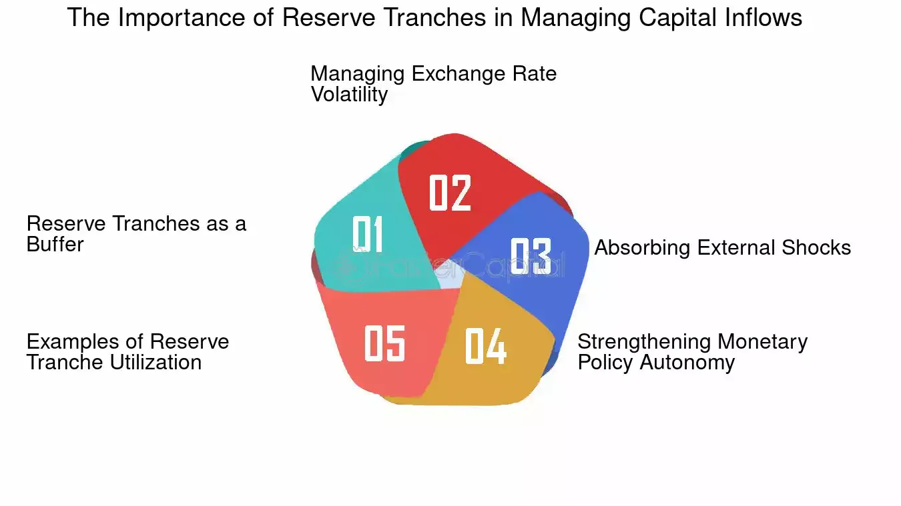

## Table of Contents

## What is the Reserve Tranche?

The Reserve Tranche is a portion of a country's International Monetary Fund (IMF) quota that can be accessed without any conditions. When a country joins the IMF, it is assigned a quota, which is essentially a financial contribution based on its economic size and position. The Reserve Tranche represents the part of this quota that the country can use as needed, much like a savings account that can be withdrawn from freely.

This feature is important because it provides countries with a safety net during times of financial difficulty. They can use the Reserve Tranche to stabilize their economy without having to meet the strict conditions usually attached to IMF loans. Essentially, it acts as an emergency fund that countries can rely on to manage short-term balance of payments problems without the burden of additional debt or policy reforms.

## How does the Reserve Tranche relate to the International Monetary Fund (IMF)?

The Reserve Tranche is a part of a country's quota in the International Monetary Fund (IMF). When a country joins the IMF, it pays a certain amount of money called a quota. This quota is based on the size and strength of the country's economy. The Reserve Tranche is the portion of this quota that the country can use whenever it needs to, without any special conditions or requirements from the IMF.

This makes the Reserve Tranche very important for countries facing financial troubles. It acts like an emergency savings account that a country can use to help stabilize its economy. Unlike other IMF loans, which often come with strict rules and reforms that the country must follow, the Reserve Tranche can be accessed freely. This helps countries manage short-term money problems without adding more debt or having to change their policies right away.

## What is the purpose of the Reserve Tranche in IMF funding?

The Reserve Tranche is a part of a country's quota in the International Monetary Fund (IMF). It's like a savings account that countries can use whenever they need money. The purpose of the Reserve Tranche is to help countries in times of financial trouble without any strict rules or conditions. This means that a country can use this money to help its economy without having to follow special requirements from the IMF.

This is very helpful because it acts as an emergency fund. If a country is facing short-term money problems, it can use the Reserve Tranche to stabilize its economy. Unlike other IMF loans, which can come with lots of conditions and reforms, the Reserve Tranche is easy to access. This makes it a useful tool for countries to manage their finances without adding more debt or making big policy changes right away.

## How is the Reserve Tranche calculated for member countries?

The Reserve Tranche is calculated based on a country's quota in the International Monetary Fund (IMF). When a country joins the IMF, it is given a quota, which is like a membership fee. This quota is decided by looking at the size and strength of the country's economy. The Reserve Tranche is 25% of this quota. So, if a country's quota is $100 million, its Reserve Tranche would be $25 million.

This means that the bigger and stronger a country's economy, the larger its quota and Reserve Tranche will be. The Reserve Tranche is important because it acts like an emergency savings account. Countries can use this money whenever they need it, without any special rules or conditions from the IMF. This helps countries manage short-term money problems without adding more debt or having to change their policies right away.

## What are the benefits of having a Reserve Tranche for a country?

Having a Reserve Tranche gives a country a safety net during tough financial times. It's like having an emergency savings account that the country can use whenever it needs to. This money can help the country pay for things it needs without having to borrow more money or ask for loans with strict rules. Because the Reserve Tranche can be used freely, the country doesn't have to worry about meeting special conditions set by the IMF.

This flexibility is really helpful for managing short-term money problems. If a country is having trouble paying for imports or dealing with a sudden drop in its currency value, it can use the Reserve Tranche to stabilize its economy. This can prevent bigger financial problems from happening and give the country time to fix things without rushing into big policy changes or taking on more debt.

## Can countries access their Reserve Tranche at any time, and if so, how?

Yes, countries can access their Reserve Tranche at any time. It's like having a savings account at the IMF. Whenever a country needs money, it can ask the IMF to use its Reserve Tranche. There are no special rules or conditions to follow, so it's quick and easy to get the money.

This is helpful for countries facing money problems. They can use the Reserve Tranche to pay for things they need without borrowing more money or making big changes right away. It gives them time to fix their financial issues without rushing into strict loans or policy reforms.

## What are the conditions under which a country might use its Reserve Tranche?

A country might use its Reserve Tranche when it's facing money problems. This could happen if the country is having trouble paying for things it needs to import or if its currency is losing value quickly. The Reserve Tranche acts like an emergency savings account, so the country can use this money to help fix these problems without having to borrow more money or follow strict rules.

Using the Reserve Tranche can give a country time to sort out its financial issues without rushing into big changes. It's helpful because the country doesn't need to meet any special conditions from the IMF to get the money. This means they can focus on stabilizing their economy without the added pressure of new loans or policy reforms.

## How does the use of the Reserve Tranche affect a country's IMF quota?

When a country uses its Reserve Tranche, it doesn't change the size of its IMF quota. The quota is like a membership fee that stays the same, no matter how much of the Reserve Tranche the country uses. The Reserve Tranche is just 25% of the quota, and using it is like taking money out of a savings account. The country can use this money whenever it needs to, without any special rules or conditions.

Using the Reserve Tranche doesn't add to the country's debt because it's not a loan. It's more like using money that the country already paid into the IMF. This means the country can fix its money problems without worrying about owing more money or having to follow strict rules from the IMF. It's a helpful way for countries to manage short-term financial issues without making big changes right away.

## What is the difference between the Reserve Tranche and other IMF financing facilities?

The Reserve Tranche is different from other IMF financing facilities because it can be used by a country without any special conditions or rules. It's like a savings account that a country can use whenever it needs money. Other IMF financing facilities, like loans or credit lines, often come with strict rules that the country must follow. These rules might include making big changes to the country's economy or policies.

Using the Reserve Tranche doesn't add to a country's debt because it's not a loan. It's just using money that the country already paid into the IMF. On the other hand, other IMF financing facilities usually involve borrowing money, which means the country has to pay it back with interest. This can add more financial pressure on the country, especially if it's already facing money problems.

## How has the role of the Reserve Tranche evolved over time within the IMF's framework?

The Reserve Tranche has been a part of the IMF's framework since the organization was created after World War II. At first, it was just a small part of a country's quota that they could use freely. Over time, as countries faced more financial troubles, the Reserve Tranche became more important. It started to be seen as a key tool for countries to use in emergencies without having to follow strict rules.

In recent years, the role of the Reserve Tranche has grown even more. With global economic problems happening more often, like financial crises and sudden drops in currency values, countries have used the Reserve Tranche to help stabilize their economies. The IMF has kept the Reserve Tranche as a no-conditions tool, making it a quick and easy way for countries to get help when they need it most. This has made the Reserve Tranche a very important part of the IMF's efforts to help countries manage short-term money problems without adding more debt or making big policy changes right away.

## What are some historical examples of countries using their Reserve Tranche?

One historical example of a country using its Reserve Tranche is during the Asian Financial Crisis in the late 1990s. Countries like Thailand and South Korea faced big money problems when their currencies lost value quickly. They used their Reserve Tranche to help pay for things they needed without having to follow strict rules from the IMF. This helped them stabilize their economies and gave them time to fix their financial issues without rushing into big changes.

Another example is during the global financial crisis in 2008. Many countries around the world, including Iceland, used their Reserve Tranche to deal with the sudden money problems. Iceland's banks were in trouble, and the country used its Reserve Tranche to help keep its economy stable. This was important because it allowed Iceland to manage the crisis without adding more debt or making quick policy changes that might have made things worse.

## How do economic analysts view the effectiveness of the Reserve Tranche in global financial stability?

Economic analysts generally see the Reserve Tranche as an important tool for global financial stability. They think it's helpful because it gives countries a way to deal with money problems without having to follow strict rules. When a country can use its Reserve Tranche, it doesn't have to worry about adding more debt or making big changes right away. This can help stop small money problems from turning into big financial crises. Analysts believe that having this safety net makes the world's economy more stable because countries can fix their issues without causing more trouble.

However, some analysts also point out that the Reserve Tranche might not be enough to solve really big financial problems. They say that while it's good for short-term issues, countries might still need other kinds of help if their money problems are very serious. The Reserve Tranche is just a small part of a country's IMF quota, so it might not be enough money to fix everything. Still, most analysts agree that the Reserve Tranche is a useful part of the IMF's efforts to keep the global economy stable.

## What are the special considerations in reserve tranches?

A reserve tranche in the International Monetary Fund (IMF) context can significantly impact a member country's financial standing. By utilizing their reserve tranche, countries can enhance their financial profiles. This is primarily because access to the reserve tranche is generally devoid of the economic conditions or fees associated with other IMF borrowing facilities. Consequently, making use of a reserve tranche can send positive signals to international credit markets and improve a country's creditworthiness. This improvement in financial stature can facilitate further access to international credit markets, enabling countries to secure the necessary funds for economic development or to manage financial shortfalls effectively.

Reserve tranche positions are dynamic and can fluctuate based on the IMF's utilization of a member's national currency. The IMF's transaction activities involving a particular currency can affect the available quota of the reserve tranche. For instance, if the IMF utilizes a member nation's currency extensively in its financial operations, the member's reserve tranche position might be adjusted, effectively altering the member's access to its reserve tranche.

Moreover, countries with currencies that the IMF frequently uses can gain an advantageous creditor position within the organization. This privileged position allows these countries to not only recover the initial capital outlaid in support of the IMF's operations but also to earn additional compensation. This compensation often comes in the form of interest payments or other financial benefits, recognizing their critical role in facilitating the IMF's international monetary transactions.

To quantify this advantage, consider the following hypothetical scenario: If a country provides $100 million worth of its currency, and the IMF compensates providers with an annual [interest rate](/wiki/interest-rate-trading-strategies) of 2%, the nation would earn $2 million annually. The formula to calculate such earnings $E$ can be denoted as:

$$
E = P \times r
$$

Where $P$ is the principal amount provided by the country, and $r$ is the annual interest rate.

Engagement in the IMF's financial operations in such a manner not only signifies a strong economic relationship with the organization but also provides tangible economic returns, potentially aiding in stabilizing the national economy.

## References & Further Reading

[1]: ["International Monetary Fund (IMF) Factsheet."](https://www.imf.org/en/About/Factsheets/IMF-Lending) International Monetary Fund.   

[2]: Fischer, S. (1999). ["On the Need for an International Lender of Last Resort."](https://www.jstor.org/stable/2647014) Journal of Economic Perspectives.

[3]: Mariano, R. S. & Villanueva, D. (2005). ["The Reserve Tranche Position in the IMF and the Financial Health of a Nation."](https://www.elibrary.imf.org/view/book/9781589066250/C3.xml) Washington University Journal of Law & Policy.

[4]: Lopez de Prado, M. (2018). ["Advances in Financial Machine Learning"](https://www.amazon.com/Advances-Financial-Machine-Learning-Marcos/dp/1119482089). Wiley Finance.

[5]: BBC News. (2010). ["IMF offers global economic outlook and policy recommendations."](https://www.bbc.co.uk/news/business-42776549) BBC News Business Section.

[6]: ["Algorithmic and High-Frequency Trading"](https://www.cambridge.org/us/universitypress/subjects/mathematics/mathematical-finance/algorithmic-and-high-frequency-trading) by Álvaro Cartea, Sebastian Jaimungal, and José Penalva.