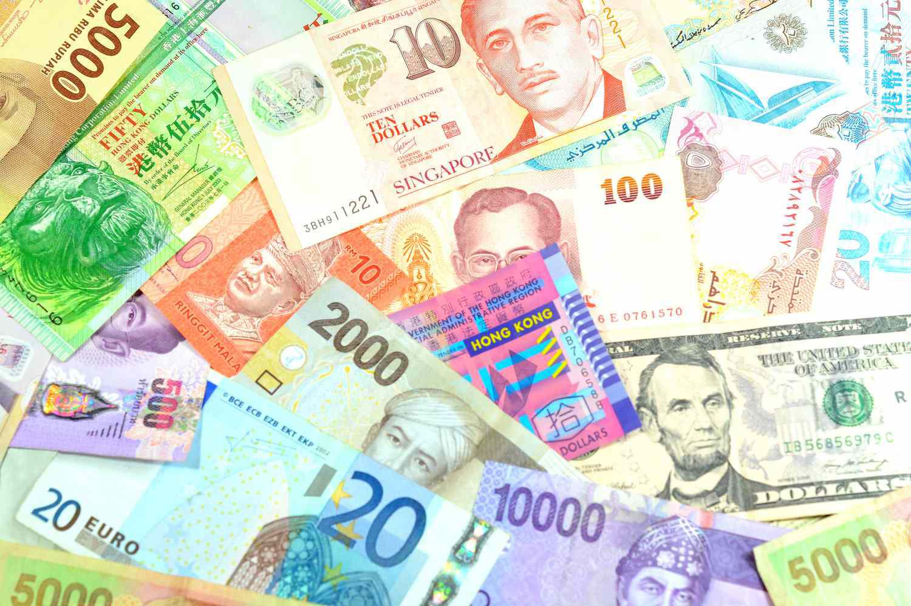

Reserve tranches and the International Monetary Fund (IMF) are integral components of the global financial architecture, ensuring international finance and economic stability. In today's rapidly evolving financial landscape, characterized by the proliferation of algorithmic trading, understanding these foundational mechanisms becomes essential. Algorithmic trading relies heavily on data and market predictability, which are profoundly influenced by the stability provided by institutions like the IMF.

This article explores reserve tranches, portions of currency quotas that IMF members can access without stringent conditions, as well as broader IMF funding mechanisms. These elements are crucial for maintaining liquidity and managing economic emergencies, thus impacting global financial markets. As algorithmic trading continues to reshape market dynamics, the interplay between these financial instruments and trading strategies offers valuable insights for investors and trading professionals. 



Understanding how reserve tranches and the IMF's financial support mechanisms interact with global economic forces provides critical knowledge for formulating effective trading strategies. This knowledge is increasingly important as financial markets become more interconnected and influenced by real-time data and algorithmic processes. In this discussion, we aim to provide a comprehensive understanding of these financial dynamics to assist investors and trading professionals in navigating the complexities of international finance. As we explore these topics, we also address the broader implications for algorithmic trading strategies and the potential for optimizing trading performance in light of IMF policies and global financial trends.

## Table of Contents

## What is a Reserve Tranche?

A reserve tranche is a critical financial concept within the framework of the International Monetary Fund (IMF), serving as an important mechanism for member countries to access liquidity without the imposition of fees or strict economic conditions. This component of the IMF's financial structure is part of the required currency quota that each member nation is obligated to provide upon joining the organization.

The underlying principle of a reserve tranche is to allow IMF member countries to draw a specific portion of their allocated quota without the need for negotiations or traditional financial program requirements. Generally, the reserve tranche constitutes approximately 25% of a member's total quota. However, this percentage can fluctuate based on the IMF's lending activities and a nation's economic situation. 

Initially linked to gold, the modern reserve tranche is expressed in Special Drawing Rights (SDRs). SDRs are an international type of monetary reserve currency created by the IMF, which are composed of a basket of major global currencies. This system reflects a more diversified and stable representation of international monetary balances than reliance on gold alone.

The significance of reserve tranches extends beyond merely accessing funds. They are instrumental in helping countries manage economic emergencies and [liquidity](/wiki/liquidity-risk-premium) requirements efficiently. In times of balance of payments crises or immediate financial needs, a reserve tranche provides a crucial lifeline for countries to stabilize their economies.

Understanding the dynamics of reserve tranches is essential for comprehending how nations navigate through financial challenges and maintain economic stability. They provide not only financial resources but also enhance the credibility and reliability of a country's economic policies on the global stage.

## Understanding the Role of the IMF

The International Monetary Fund (IMF) plays an essential role in promoting international monetary cooperation and ensuring the stability of the global financial system. Established in 1944 and headquartered in Washington, D.C., the IMF provides a platform for dialogue and collaboration among its 190 member countries. Its mission focuses on fostering global economic stability by providing financial aid, advice, and endorsement of economic reforms.

A cornerstone of the IMF's operations is its oversight and facilitation of sound global financial practices. The organization conducts regular assessments of global economic trends and national macroeconomic policies, identifying potential vulnerabilities that could impact financial stability. Through its surveillance mechanism, the IMF monitors the economic and financial developments of member countries and provides policy advice aimed at sustaining growth and reducing vulnerabilities. This advisory role is critical in preempting financial crises and promoting sustainable economic policies.

Financial support to its member countries is a defining feature of the IMF's role. The IMF provides financial assistance to countries facing balance of payments problems, drawing on a variety of funding mechanisms to do so. One of the principal instruments is the reserve tranche, which allows members to access a portion of their required currency contribution to the IMF without the imposition of fees or strict economic conditions. This mechanism is designed to provide rapid liquidity support when countries encounter difficulties in meeting international financial obligations, thereby helping to restore confidence and stability.

The reserve tranche arrangement exemplifies the IMF's capacity to stabilize global markets through immediate financial support, mitigating the impact of economic shocks. By permitting countries to draw on their reserve positions, the IMF aids in averting deeper financial crises and facilitates the return to economic health. Furthermore, the flexibility of this financial mechanism enables nations to implement necessary structural adjustments and fiscal policies without exposing them to undue financial strain.

Beyond financial assistance, the IMF also extends technical support and training to its members. This assistance enhances the members' capacity to design and implement effective economic policies, thereby fostering conditions conducive to stability and growth. By providing expertise in areas such as public finance management, monetary policy, and financial regulation, the IMF contributes to the development of robust economic institutions and practices.

Through a combination of surveillance, financial aid, and technical assistance, the IMF fosters an environment of economic stability and growth across its member countries. Its pivotal function in providing monetary cooperation and ensuring financial stability underscores its significance in the architecture of the global economic system.

## Special Considerations in Reserve Tranches

A reserve tranche in the International Monetary Fund (IMF) context can significantly impact a member country's financial standing. By utilizing their reserve tranche, countries can enhance their financial profiles. This is primarily because access to the reserve tranche is generally devoid of the economic conditions or fees associated with other IMF borrowing facilities. Consequently, making use of a reserve tranche can send positive signals to international credit markets and improve a country's creditworthiness. This improvement in financial stature can facilitate further access to international credit markets, enabling countries to secure the necessary funds for economic development or to manage financial shortfalls effectively.

Reserve tranche positions are dynamic and can fluctuate based on the IMF's utilization of a member's national currency. The IMF's transaction activities involving a particular currency can affect the available quota of the reserve tranche. For instance, if the IMF utilizes a member nation's currency extensively in its financial operations, the member's reserve tranche position might be adjusted, effectively altering the member's access to its reserve tranche.

Moreover, countries with currencies that the IMF frequently uses can gain an advantageous creditor position within the organization. This privileged position allows these countries to not only recover the initial capital outlaid in support of the IMF's operations but also to earn additional compensation. This compensation often comes in the form of interest payments or other financial benefits, recognizing their critical role in facilitating the IMF's international monetary transactions.

To quantify this advantage, consider the following hypothetical scenario: If a country provides $100 million worth of its currency, and the IMF compensates providers with an annual [interest rate](/wiki/interest-rate-trading-strategies) of 2%, the nation would earn $2 million annually. The formula to calculate such earnings $E$ can be denoted as:

$$
E = P \times r
$$

Where $P$ is the principal amount provided by the country, and $r$ is the annual interest rate.

Engagement in the IMF's financial operations in such a manner not only signifies a strong economic relationship with the organization but also provides tangible economic returns, potentially aiding in stabilizing the national economy.

## Implications for Algo Trading

Algorithmic trading, leveraging cutting-edge technologies and data analysis, is critically dependent on aspects of financial stability and predictable economic conditions, areas heavily influenced by International Monetary Fund (IMF) activities. The IMF's financial interventions, particularly through mechanisms like reserve tranches, play a substantial role in maintaining global monetary stability, which in turn affects trading markets and investment strategies.

Understanding reserve tranches is key for traders aiming to anticipate and navigate global economic shifts. Reserve tranches represent a portion of a member country's quota with the IMF that they can access without the usual stipulations associated with IMF loans, providing a liquidity buffer during periods of financial stress. This access can stabilize a country’s economy during balance of payments crises, in turn affecting global financial markets. For algorithmic traders, the availability and use of reserve tranches by a nation can signal impending economic adjustments, thus influencing currency valuations and market trends.

In [algorithmic trading](/wiki/algorithmic-trading), the ability to predict and respond to these shifts is paramount. By incorporating data on IMF interventions, such as a country's reserve tranche drawdowns, algorithmic models can be enhanced to identify potential market opportunities or risks. For instance, a sudden increase in a country's use of its reserve tranche might indicate mounting economic pressures, possibly suggesting future currency devaluation. Algorithms can be designed to [factor](/wiki/factor-investing) in these conditions, optimizing trading strategies and potentially mitigating risk exposure.

As Artificial Intelligence (AI) and complex algorithms continue to push the boundaries of trading innovation, the incorporation of global financial data becomes increasingly essential. Algorithms need to be adaptive, incorporating macroeconomic indicators, such as IMF policies, in real-time. This necessitates a comprehensive understanding of financial mechanisms like reserve tranches, which provide insights into the health and stability of national and global economies.

In practice, traders implementing algorithmic strategies can benefit from the integration of IMF data into their decision-making processes. Consider a Python code snippet leveraging IMF data:

```python
import requests
import pandas as pd

# Fetch IMF data
def fetch_imf_data(country_code):
    url = f"https://api.imf.org/data/{country_code}/reserve_tranche"
    response = requests.get(url)
    data = response.json()
    return pd.DataFrame(data)

# Analyze reserve tranche utilization
def analyze_reserve_usage(df):
    df['change'] = df['reserve_tranche'].pct_change()
    anomalies = df[df['change'].abs() > 0.05] # Identify large changes
    return anomalies

# Example usage
data = fetch_imf_data('USA')
anomalies = analyze_reserve_usage(data)
print(anomalies)
```

This script fetches reserve tranche data for a specified nation, calculates the percentage change, and identifies significant anomalies that could indicate underlying economic issues. By integrating such analyses into trading algorithms, traders enhance their ability to anticipate market movements driven by shifts in national financial stability.

Ultimately, a comprehensive understanding of reserve tranches and IMF dynamics is indispensable for algorithmic traders seeking to enhance strategy formulation, maintain a competitive edge, and ensure robust risk management in an ever-evolving financial landscape.

## The Connection Between IMF Policies and Trading Strategies

IMF policies, particularly those overseeing reserve tranches, wield significant influence over currency valuations and market trends. This influence stems from the IMF's capacity to manage international monetary cooperation and enforce financial stability, which are critical factors for currency markets. When the IMF intervenes in a member country to address issues such as balance of payments deficits through the deployment of reserve tranches, it can lead to adjustments in currency supply and demand dynamics. This, in turn, can impact exchange rates, causing traders and investors to reassess their positions in affected currencies.

Traders who deploy algorithmic strategies must integrate these macroeconomic indicators, including IMF interventions, into their analytical frameworks. Macroeconomic changes driven by IMF actions can provide opportunities for generating alpha, given that these interventions often lead to significant market movements. For instance, an IMF program aimed at stabilizing a struggling economy could enhance market confidence, bolstering the affected currency and related financial instruments.

Algorithmic trading systems can harness this information by incorporating economic data releases, IMF policy announcements, and geopolitical developments into their decision-making processes. These systems typically use [machine learning](/wiki/machine-learning) models or rule-based methods to predict and react to market changes. To optimize performance, a trading algorithm might include a module that ingests and processes data such as IMF communiqués or intervention histories, assessing their potential impact on the financial markets.

For example, consider a Python-based algorithmic trading strategy:

```python
import pandas as pd

# Load IMF data and market data
imf_data = pd.read_csv('imf_announcements.csv')
market_data = pd.read_csv('currency_exchange_rates.csv')

# Function to assess impact of IMF interventions
def assess_imf_impact(imf_event, market_data):
    impact_matrix = {
        'currency_stabilization': 0.8,
        'economic_support': 0.5,
        'structural_adjustment': 0.6
    }
    market_change = market_data['exchange_rate'].pct_change()
    impact_score = impact_matrix.get(imf_event, 0) * market_change.mean()
    return impact_score

# Identify IMF events and calculate their impact on markets
for index, event in imf_data.iterrows():
    impact_score = assess_imf_impact(event['type'], market_data)
    if impact_score > 0.5:
        # Execute trade strategy based on high impact
        print("Execute trade: Buy currency X")
```

Incorporating geopolitical and economic signals from entities like the IMF allows traders to anticipate market shifts, thus enabling them to position themselves advantageously. For instance, understanding the nuanced ramifications of an IMF lending package on a country's fiscal health can guide strategies on currency pairs associated with that country's economy. Considerations of such breadth ensure that algorithmic traders are leveraging comprehensive insights for enhanced strategic outcomes.

## Conclusion

Reserve tranches and IMF funding mechanisms are integral to the global financial system, providing essential liquidity and economic stability. These components not only support nations during economic distress but also foster a stable backdrop for global markets, which is particularly crucial for algorithmic trading systems that rely on financial predictability and stability.

Algorithmic trading, characterized by high-frequency transactions and data-driven decision-making, is uniquely impacted by the liquidity and stability IMF-provided mechanisms offer. Reserve tranches, as immediate resources that member nations can access without incurring additional fees, help stabilize national economies during balance of payments crises. This stabilization has cascading effects on global financial markets, which algorithmic traders must account for in their strategies.

A comprehensive understanding of these financial instruments is paramount for navigating the complex international financial landscape. For algorithmic traders, the ability to anticipate shifts in economic policies or market conditions resulting from IMF interventions—such as changes in reserve tranche positions—enhances strategy development and risk management.

As the financial environment continues to evolve, both due to technological advances and geopolitical developments, staying informed about IMF policies and funding mechanisms will be increasingly vital. For traders and policymakers, awareness of these elements will not only aid in crafting effective trading and economic strategies but also in maintaining competitive and resilient operations in the global market. Adapting to these changes with a well-informed approach will be essential for continued success in the intersecting domains of international finance and trading technologies.

## References & Further Reading

[1]: ["International Monetary Fund (IMF) Factsheet."](https://www.imf.org/en/About/Factsheets/IMF-Lending) International Monetary Fund.   

[2]: Fischer, S. (1999). ["On the Need for an International Lender of Last Resort."](https://www.jstor.org/stable/2647014) Journal of Economic Perspectives.

[3]: Mariano, R. S. & Villanueva, D. (2005). ["The Reserve Tranche Position in the IMF and the Financial Health of a Nation."](https://www.elibrary.imf.org/view/book/9781589066250/C3.xml) Washington University Journal of Law & Policy.

[4]: Lopez de Prado, M. (2018). ["Advances in Financial Machine Learning"](https://www.amazon.com/Advances-Financial-Machine-Learning-Marcos/dp/1119482089). Wiley Finance.

[5]: BBC News. (2010). ["IMF offers global economic outlook and policy recommendations."](https://www.bbc.co.uk/news/business-42776549) BBC News Business Section.

[6]: ["Algorithmic and High-Frequency Trading"](https://www.cambridge.org/us/universitypress/subjects/mathematics/mathematical-finance/algorithmic-and-high-frequency-trading) by Álvaro Cartea, Sebastian Jaimungal, and José Penalva.