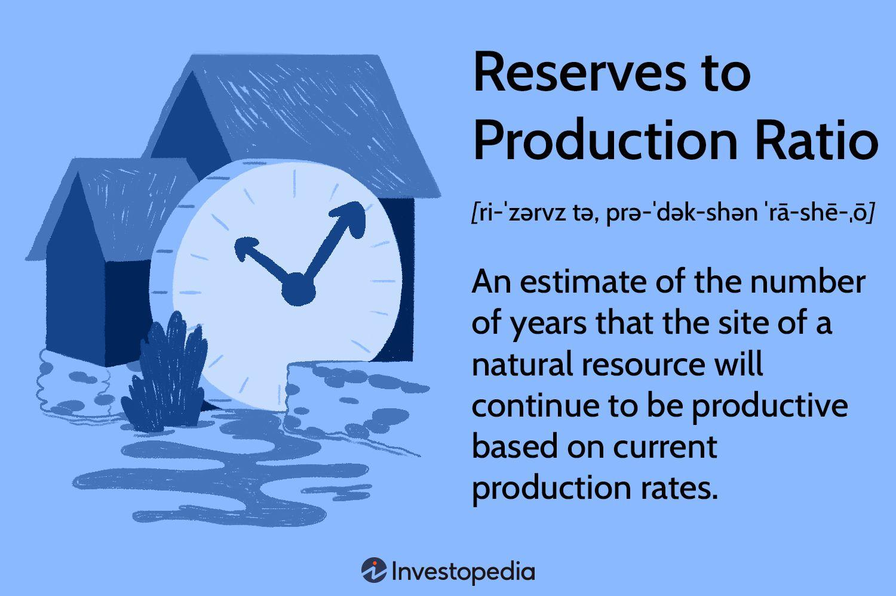

The energy sector remains a cornerstone of the global economy, with metrics such as the Reserves-to-Production (R/P) Ratio playing a crucial role in resource planning and management. At the heart of this sector's stability and sustainability is the R/P Ratio, a pivotal tool that helps predict how long current reserves of a particular resource can sustain ongoing production levels. As the global community faces the challenges of finite natural resources and escalating consumption, a thorough understanding of the R/P Ratio becomes vital for making informed decisions regarding energy security and strategic reserve utilization.

This article aims to provide an in-depth exploration of the Reserves-to-Production (R/P) Ratio, examining its significance within the energy sector. We will discuss how this metric is calculated and identify its applications in energy reserve management, emphasizing its critical role in providing insights that drive decisions in both public and private sectors. Furthermore, as technology progresses and consumption patterns evolve, the implications of these changes on R/P Ratio predictions will be considered, highlighting their impact on projections for businesses and economies worldwide.



Recent technological advancements and the integration of big data have revolutionized predictive accuracy and efficiency within this domain. Additionally, we explore how algorithmic trading can harness R/P data to improve accuracy in forecasting market trends. By employing algorithmic strategies, traders can optimize investment decisions and maximize returns in energy markets. Through an analysis of these components, our discussion underscores the R/P Ratio's invaluable contribution to the sustainable management of energy resources and highlights its relevance in enhancing financial outcomes in energy trading arenas.

## Table of Contents

## Understanding the Reserves-to-Production Ratio

The Reserves-to-Production (R/P) Ratio is a key metric in the energy sector, providing a mathematical estimate of the duration a natural resource will endure if produced at the current rate. The formula for calculating the R/P Ratio is straightforward:

$$
R/P = \frac{\text{Total Known Reserves}}{\text{Annual Production Rate}}
$$

This ratio provides critical insights into the longevity and sustainability of resource production. By assessing the total known reserves against the annual production rate, the R/P Ratio informs stakeholders about how many years the existing reserves will last if production continues at the current pace. It is extensively utilized in the oil and gas industry, where it assists in estimating the remaining lifespan of these finite resources. However, its application is not limited to these sectors alone, as it can be applied to any finite resource, thereby offering significant insights into inventory management and strategic planning for businesses dependent on these resources.

Understanding the R/P Ratio is crucial for guiding exploration efforts. Companies in resource-dependent industries rely on this ratio to prioritize areas for exploration and development. By identifying the ratio's implications, such as signalling potential depletion risks, businesses can adapt their strategies accordingly, ensuring that they maintain a balance between current production and future supply needs.

Furthermore, the R/P Ratio serves as a tool for inventory management. It helps in determining optimal inventory levels to ensure sustained supply without over or underestimating the required production volumes. This is vital in the context of energy resources, as strategic reserve management can have significant economic implications.

In summary, the R/P Ratio is an indispensable element in resource-dependent industries for long-term planning and operational efficiency. Its ability to provide a clear perspective on the sustainability of resources makes it an essential metric for guiding exploration, inventory management, and forming future business strategies.

## Advanced Calculation Techniques and Uncertainties

The Reserves-to-Production (R/P) Ratio, while instrumental in assessing the longevity of resources, is subject to several uncertainties arising from assumptions inherent in its calculation. The ratio is calculated as: 

$$
R/P = \frac{\text{Total Known Reserves}}{\text{Annual Production Rate}}
$$

This calculation presumes stable reserves and production rates, yet in reality, these parameters are often influenced by a range of dynamic factors. For one, undiscovered reserves, which are geologically plausible but not yet confirmed, can alter the numerator significantly upon discovery. Advanced technologies in geoscience and engineering continue to unlock new reserves, traditionally inaccessible or uneconomical, impacting R/P estimates over time.

Economic conditions play a pivotal role as well. Price fluctuations in the global market can make certain reserves economically viable while rendering others too expensive to extract. For example, a surge in oil prices can lead to accelerated production rates as companies rush to capitalize on high revenues, therefore modifying the denominator in the R/P equation and potentially shortening the perceived life of the resource.

Sophisticated modeling techniques are necessary to accommodate these variables. Monte Carlo simulations and probabilistic models provide a more nuanced approach to R/P Ratio analysis by incorporating a range of probable outcomes and uncertainties. These models adjust the R/P calculations based on varying production scenarios, reserve additions, and technological enhancements. For instance, Python can be utilized to run Monte Carlo simulations to predict various R/P outcomes, as shown in a simplified example:

```python
import numpy as np

# Defining possible reserve additions and production rates
reserve_additions = np.random.normal(loc=1000, scale=100, size=10000)
production_rates = np.random.normal(loc=100, scale=10, size=10000)

# Calculating R/P ratios across simulations
rp_ratios = reserve_additions / production_rates

# Estimating the mean R/P ratio from simulations
mean_rp_ratio = np.mean(rp_ratios)
print(f"Estimated Mean R/P Ratio: {mean_rp_ratio}")
```

Incorporating external factors is crucial. Geopolitical situations can disrupt supply chains, restrict access to reserves, and drive changes in policy regarding resource extraction. Environmental regulations, increasingly stringent due to global sustainability agendas, can impose limits on production or even ban it in ecologically sensitive areas, thus affecting both current and projected production rates.

In summary, calculating the R/P Ratio requires an understanding that it is a dynamic figure, sensitive to numerous internal and external influences. Accurate estimations depend on advanced computational methods and keen insights into economic, technological, and geopolitical landscapes. Investors and policymakers must adopt a flexible approach to accommodate potential fluctuations and ensure strategic resource management.

## Algorithmic Trading and the R/P Ratio

Algorithmic trading, a method of executing orders using pre-defined automated strategies, has transformed commodity markets by enabling rapid and precise trading. Its application in energy commodities, particularly through the Reserves-to-Production (R/P) Ratio, represents a sophisticated intersection of finance and resource management. The incorporation of R/P Ratio analyses into algorithmic strategies allows for insightful predictions about market trends and fluctuations.

Predictive algorithms utilize the R/P Ratio to anticipate shifts in the market by assessing reserve levels and production rates. These insights are crucial for evaluating risks and optimizing investment portfolios in the energy sector. For instance, a declining R/P Ratio could indicate diminishing resource availability, prompting algorithms to trigger sell orders to avert losses or to diversify portfolios by investing in alternative energy resources.

The rise of advanced computing power has amplified the capabilities of traders to simulate various market scenarios, significantly enhancing their ability to forecast future market conditions. By inputting R/P data into these computing systems, traders can model complex scenarios to predict future supply constraints or surges, thus positioning themselves advantageously within volatile markets.

Machine learning, an essential component of [algorithmic trading](/wiki/algorithmic-trading), further augments these predictions. By training models on historical R/P data and correlating market responses, [machine learning](/wiki/machine-learning) systems can detect patterns and anomalies that may signal imminent price movements. For instance, should there be a sudden increase in production without a corresponding increase in reserves, the model might predict a potential decrease in commodity prices due to oversupply.

The integration of R/P Ratio data into such models provides traders with a significantly enhanced strategic edge, as it allows them to respond promptly to changes in the market landscape. Hence, the synergy between algorithmic trading and the R/P Ratio not only optimizes returns but also contributes to a more efficient and responsive market. This strategic use of data and technology underscores the importance of the R/P Ratio in the financial strategies of energy markets.

## Challenges and Future Perspectives

The Reserves-to-Production (R/P) Ratio, while invaluable for assessing the longevity of natural resources, faces several challenges due to technological advances and the unpredictability of resource discoveries. Accurate estimation of the R/P Ratio requires a comprehensive understanding of current reserves and production capabilities. However, the discovery of new reserves and the development of more efficient extraction technologies can rapidly shift these baselines, rendering previous R/P estimates less reliable. This level of uncertainty underscores the need for flexible models that can adapt to changing data inputs.

Ongoing improvements in data collection methods and analytical tools offer pathways to enhance the accuracy of R/P calculations. Advanced geospatial analysis, for instance, allows for more precise mapping of resource deposits, while big data analytics enable the integration of diverse data sources, thus enriching the data available for R/P computations. Technologies such as remote sensing and machine learning are increasingly being deployed to refine these estimates. By evaluating large datasets more effectively, these technologies can provide deeper insights into resource availability and extraction potential.

The future landscape of energy dependence is poised to shift as alternative energy sources gain traction. The development of renewable energy technologies could significantly disrupt traditional fossil fuel markets, influencing their R/P Ratios. These alternatives not only offer a sustainable pathway but can also impact how reserves are valued and developed. The transition towards greener energy options necessitates reevaluating how R/P Ratios are calculated for fossil fuels, potentially integrating assessments of renewable capacity and efficiency improvements in energy production and storage.

Growing environmental awareness and sustainability goals are catalysts for change in resource management approaches. Companies and governments are under increasing pressure to incorporate sustainability into their consumption and extraction practices. This trend is likely to foster innovations that prioritize the efficient use of resources and minimize environmental impacts. These developments could lead to more accurate predictive models that [factor](/wiki/factor-investing) in regulatory shifts and ecological considerations, ultimately leading to more sustainable consumption patterns.

In conclusion, while the inherent uncertainties in resource discoveries and technological advancements present challenges to maintaining accurate R/P estimations, the continuous evolution of data collection and analysis methods offers promising solutions. Furthermore, the rise of alternative energy sources and sustainability trends will play a crucial role in reshaping the future of natural resource management, demanding ongoing adaptation and innovation in R/P Ratio calculations.

## Conclusion

The Reserves-to-Production (R/P) Ratio serves as a fundamental metric for assessing the longevity of natural resources, which is vital for resource management and strategic investment decisions. By providing an estimate of how long current reserves will last under existing production conditions, the R/P Ratio helps organizations and policymakers to gauge resource sustainability and strategize accordingly.

In recent years, the integration of R/P Ratio data into algorithmic trading has emerged as a sophisticated approach to harness market dynamics and resource trends. Algorithms equipped with R/P insights can anticipate market fluctuations, assess investment risks, and optimize portfolios within energy commodity markets. This application exemplifies the forward-thinking nature of using data-driven strategies to achieve better financial outcomes.

Given the increasing global reliance on natural resources, developing advanced methodologies for accurate R/P estimations is crucial for effective economic planning. Precise R/P calculations depend on a multitude of variables, including technological advancements in extraction processes, undiscovered reserve estimates, and shifts in consumption patterns. Therefore, ongoing refinement of these methodologies is essential for producing reliable predictions that support both resource management and economic strategies.

Continual research and technological development play pivotal roles in enhancing the reliability of R/P Ratio calculations. Innovations in data analytics, predictive modeling, and machine learning are contributing to more accurate assessments of reserves and production capacities. As these technologies evolve, they promise to refine the reliability and precision of R/P Ratio analyses, ensuring that stakeholders make informed, strategic decisions regarding natural resource utilization.

## References & Further Reading

[1]: Adelman, M. A. (1990). ["Mineral Depletion, with Special Reference to Petroleum."](https://dspace.mit.edu/handle/1721.1/27208) Journal of Environmental Economics and Management, 13(2), 197-208.

[2]: Cuddington, J. T., & Moss, D. L. (2001). ["Technological Change, Depletion and the U.S. Petroleum Industry: A New Approach to Measurement."](https://en.wikipedia.org/wiki/Winsford) The Review of Economics and Statistics, 83(2), 323-332.

[3]: Stevens, P. (2008). ["The Coming Oil Supply Crunch."](https://vdoc.pub/documents/stevens-paul-the-coming-oil-supply-crunch-5b02j14gs150) Chatham House Report.

[4]: Yergin, D. (2008). ["The Prize: The Epic Quest for Oil, Money & Power."](https://www.amazon.com/Prize-Epic-Quest-Money-Power/dp/1439110123) Free Press.

[5]: Pickard, J. C., Jansen, S., & Jansen, S. (2020). ["Machine Learning for Asset Managers."](https://www.cambridge.org/core/books/machine-learning-for-asset-managers/6D9211305EA2E425D33A9F38D0AE3545) Cambridge University Press.