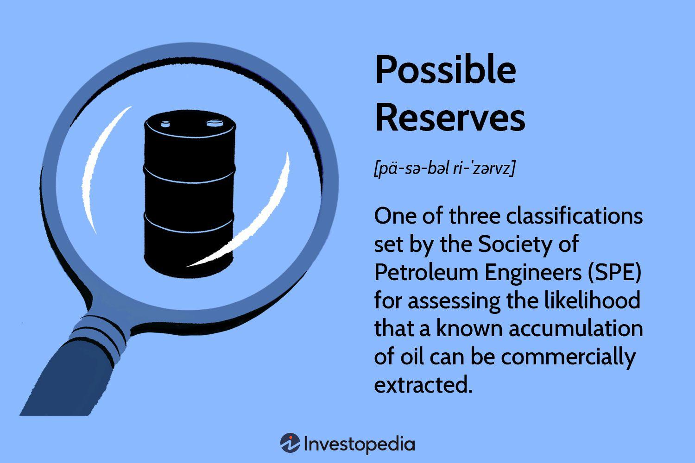

## Table of Contents

## What are reserves in the context of economics and finance?

In economics and finance, reserves refer to the funds or assets that are set aside by banks, governments, or other institutions to meet future needs or emergencies. For banks, reserves are the portion of depositors' money that they keep on hand, either in their vaults or on deposit with the central bank, to ensure they can meet withdrawal demands from customers. This helps maintain trust and stability in the financial system. Governments also hold reserves, often in the form of foreign currencies or gold, to support their own currency's value and to handle international trade and debt obligations.

Reserves are important because they act as a safety net. For example, if many people suddenly want to withdraw their money from a bank, the bank uses its reserves to pay them. Without enough reserves, the bank might not be able to give everyone their money back, which could lead to a crisis. Similarly, if a country faces an economic shock, like a sudden drop in exports, it can use its foreign currency reserves to stabilize its economy. By having reserves, both banks and governments can better manage unexpected events and maintain financial stability.

## How do reserves differ from other types of assets?

Reserves are different from other types of assets because they are kept aside specifically for emergencies or to meet certain obligations. For example, a bank might keep cash in its vault or with the central bank as reserves to make sure it can give money back to customers who want to withdraw it. This is different from other assets like loans that the bank gives out to people or businesses, which are meant to earn interest and make money for the bank. Reserves are not used to make money; they are there to keep the bank safe and stable.

Similarly, a country's government might hold reserves in the form of foreign currencies or gold. These reserves are not like other government assets, such as public buildings or infrastructure, which are used to provide services to citizens. Instead, these reserves are kept to help the country's economy during tough times, like if the value of its own currency drops or if it needs to pay back debts to other countries. So, while other assets are used to generate income or provide services, reserves are there to act as a safety net.

## What are the main types of reserves and their purposes?

Reserves can be divided into different types depending on who is holding them and what they are used for. For banks, there are two main types of reserves: cash reserves and required reserves. Cash reserves are the money banks keep in their vaults or ATMs. Required reserves are the money banks must keep with the central bank, like the Federal Reserve in the U.S. Both types of reserves help banks make sure they have enough money to give to customers when they want to take their money out. This helps keep the bank stable and trusted by its customers.

For countries, there are foreign exchange reserves and gold reserves. Foreign exchange reserves are money in different currencies that a country keeps to help its own currency stay strong and to pay for things from other countries. Gold reserves are gold that a country keeps as a backup, because gold is seen as a safe and valuable asset. Both types of reserves help a country's economy stay stable, especially during tough times like a financial crisis. By having these reserves, a country can handle unexpected problems and keep its economy running smoothly.

## How are reserves managed by central banks?

Central banks manage reserves to make sure the financial system stays stable. They set rules for how much money banks need to keep as reserves. This is called the reserve requirement. By changing this requirement, central banks can control how much money banks have to lend out. If the central bank wants more money to be available for loans, it might lower the reserve requirement. If it wants less money to be available, it might raise the requirement. This helps the central bank control the amount of money in the economy and keep things balanced.

Central banks also use reserves to help banks when they need it. For example, if a bank is running low on cash and can't meet the demands of its customers, it can borrow money from the central bank using its reserves as a guarantee. This is called the discount window. By doing this, central banks can prevent bank runs and keep the financial system from falling apart. They also keep an eye on the overall level of reserves in the system to make sure there's enough money to keep everything running smoothly.

## What role do reserves play in monetary policy?

Reserves play a big role in monetary policy, which is how central banks control the amount of money in the economy. One way they do this is by setting a reserve requirement, which is the amount of money banks must keep on hand or with the central bank. By changing this requirement, central banks can influence how much money banks have to lend out. If they want more money to be available for loans, they might lower the reserve requirement. This lets banks lend out more money, which can help the economy grow. If they want to slow down the economy, they might raise the reserve requirement, making banks keep more money as reserves and lend out less.

Another way reserves help with monetary policy is through the central bank's ability to lend money to banks. If a bank is short on cash and needs help, it can borrow money from the central bank using its reserves as a guarantee. This is called the discount window. By providing this support, central banks can prevent banks from running out of money, which could cause panic and hurt the economy. This way, reserves act as a safety net, helping to keep the financial system stable and allowing central banks to manage the flow of money effectively.

## How do foreign exchange reserves affect a country's economy?

Foreign exchange reserves are important for a country's economy because they help keep the country's own money strong and stable. Imagine a country's money is like a big ship, and foreign exchange reserves are like the anchors that keep it steady. When the value of a country's money goes down too fast, the government can use its foreign exchange reserves to buy its own money. This makes the value of the country's money go up again. If a country doesn't have enough foreign exchange reserves, its money might keep losing value, which can make everything in the country more expensive and cause problems.

Foreign exchange reserves also help a country pay for things it buys from other countries. For example, if a country needs to buy oil or medicine from another country, it can use its foreign exchange reserves to pay for these things. This is especially important during tough times, like a financial crisis, when it might be hard to get money from other places. By having enough foreign exchange reserves, a country can keep buying what it needs and keep its economy running smoothly. This helps the country stay strong and stable, even when things get tough.

## What are the implications of reserve requirements for commercial banks?

Reserve requirements are rules set by the central bank that tell commercial banks how much money they need to keep in reserve. This means banks have to hold onto a certain amount of the money people deposit with them, instead of lending it all out or using it for other things. If the central bank decides to increase the reserve requirement, banks have to keep more money in reserve. This can make it harder for banks to lend money to people and businesses because they have less money available to loan out. On the other hand, if the central bank lowers the reserve requirement, banks can lend out more money because they don't have to keep as much in reserve.

The level of reserve requirements can affect how much money is circulating in the economy. When reserve requirements are high, there's less money available for loans, which can slow down spending and economic growth. This might be useful if the economy is growing too fast and the central bank wants to cool things down. But if reserve requirements are low, banks can lend more, which can help the economy grow by making more money available for people and businesses to spend and invest. So, reserve requirements are an important tool for the central bank to help manage the economy and keep it stable.

## How can reserves be used as a tool for financial stability?

Reserves are really important for keeping the financial system stable. Think of reserves like an emergency fund. Banks keep some money in reserves so they can give it back to people when they want to take their money out. If a lot of people suddenly want their money back at the same time, the bank can use its reserves to pay them. This helps stop people from panicking and keeps the bank from going broke. The central bank also keeps an eye on these reserves and can lend money to banks if they need it, which helps make sure the whole banking system stays strong and doesn't fall apart.

Countries also use reserves to keep their economies stable. They keep foreign money and gold as reserves. If the value of their own money starts to drop, they can use these reserves to buy their own money and make its value go up again. This helps keep prices from going up too fast. Also, if a country needs to buy things from other countries and can't get money easily, it can use its foreign money reserves to pay for these things. This way, the country can keep its economy running smoothly even during tough times. By having enough reserves, both banks and countries can handle unexpected problems and keep things stable.

## What are the challenges associated with maintaining adequate reserve levels?

Keeping enough reserves can be tough for banks and countries. For banks, having too much money in reserves means they can't lend it out to make more money. Banks make money by lending money and getting interest, so if they have to keep a lot in reserves, it can hurt their profits. Also, if the central bank changes the rules about how much money banks need to keep in reserves, it can be hard for banks to adjust quickly. They might have to borrow money or sell assets to meet the new requirements, which can be tricky and stressful.

For countries, having enough foreign money and gold reserves is important, but it's not easy. If a country doesn't have enough reserves, its own money might lose value, and prices could go up too fast. But having too many reserves can also be a problem. It's like saving too much money instead of spending it on things that could help the economy grow, like building roads or schools. Plus, keeping a lot of reserves means the country might miss out on chances to invest that money in other ways that could bring in more money. So, finding the right balance is a big challenge.

## How do international reserve standards and agreements influence national policies?

International reserve standards and agreements help countries decide how much money they should keep in reserves. These standards are like rules set by groups like the International Monetary Fund (IMF). They tell countries how much foreign money and gold they should have to keep their economy stable. If a country doesn't follow these standards, it might have trouble getting help from other countries or international organizations during tough times. So, countries often try to meet these standards to make sure they can get support when they need it.

These international agreements can also affect what a country's government does at home. For example, if the IMF says a country needs more reserves, the government might have to change its spending plans. It might need to save more money or borrow less, which can be hard if people in the country need help with things like healthcare or education. But following these rules can make the country's money more stable and trusted by other countries, which is good for its economy in the long run. So, while it can be challenging, following international reserve standards often helps a country stay strong and stable.

## What advanced strategies can be employed to optimize reserve management?

One advanced strategy for optimizing reserve management is called dynamic reserve management. This means banks and countries change how much money they keep in reserves based on what's happening in the economy. If the economy is doing well and people are borrowing more, banks might keep less money in reserves so they can lend out more. But if things start to look risky, like if there's a chance of a financial crisis, they might quickly increase their reserves to be safe. This helps them balance making money with staying safe. Countries can do something similar by using their foreign money and gold reserves to buy or sell their own money, depending on whether its value is going up or down too fast.

Another strategy is using technology and data analysis to predict what might happen next. Banks and countries can use computers to look at a lot of information, like how people are spending money or what's happening in other countries' economies. This helps them guess what might happen and adjust their reserves accordingly. For example, if the data shows that a lot of people might want to take their money out of the bank soon, the bank can prepare by keeping more money in reserves. Countries can also use this data to decide when to buy or sell their own money to keep its value stable. By using these smart tools, banks and countries can manage their reserves better and keep their financial systems strong.

## How do geopolitical factors impact the management and utilization of reserves?

Geopolitical factors can really change how countries manage and use their reserves. If a country is having problems with another country, like a trade war or political disagreements, it might need to use its foreign money reserves to keep its own money strong. For example, if other countries stop buying things from it, the country might use its reserves to buy its own money and keep its value from dropping too much. Also, if there's a lot of uncertainty in the world, like wars or big changes in government, countries might want to keep more money in reserves to be safe. This way, they can handle unexpected problems and keep their economy stable.

Another way geopolitical factors affect reserves is through international agreements and alliances. If a country is part of a group like the European Union or has a strong relationship with another country, it might feel safer and not need to keep as much money in reserves. But if it's not part of these groups or has bad relationships with other countries, it might need to keep more reserves to protect itself. Also, if there are big changes in the world, like new trade deals or sanctions, countries might need to change how they manage their reserves to adapt to these new situations. By keeping an eye on what's happening around the world, countries can make smart choices about their reserves and keep their economies strong.

## References & Further Reading

[1]: Bergstra, J., Bardenet, R., Bengio, Y., & Kégl, B. (2011). ["Algorithms for Hyper-Parameter Optimization."](https://papers.nips.cc/paper/4443-algorithms-for-hyper-parameter-optimization) Advances in Neural Information Processing Systems 24.

[2]: ["Advances in Financial Machine Learning"](https://www.amazon.com/Advances-Financial-Machine-Learning-Marcos/dp/1119482089) by Marcos Lopez de Prado

[3]: ["Evidence-Based Technical Analysis: Applying the Scientific Method and Statistical Inference to Trading Signals"](https://www.amazon.com/Evidence-Based-Technical-Analysis-Scientific-Statistical/dp/0470008741) by David Aronson

[4]: ["Machine Learning for Algorithmic Trading"](https://github.com/stefan-jansen/machine-learning-for-trading) by Stefan Jansen

[5]: ["Quantitative Trading: How to Build Your Own Algorithmic Trading Business"](https://books.google.com/books/about/Quantitative_Trading.html?id=j70yEAAAQBAJ) by Ernest P. Chan