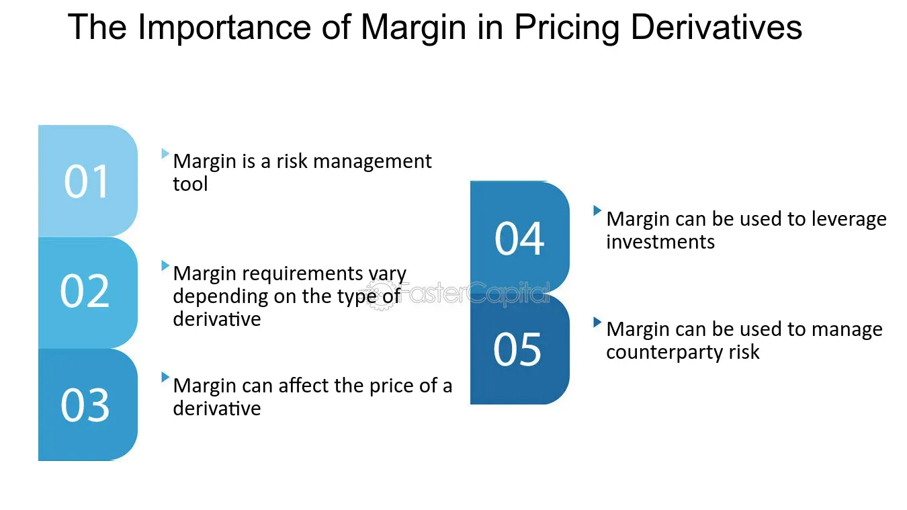

## Table of Contents

## What is the Reset Margin Concept?

The Reset Margin Concept is a way to help people manage their money better. It's about setting aside a certain amount of money each month as a "reset margin." This money is not spent on regular bills or daily expenses. Instead, it's kept safe to use when unexpected costs come up, like a car repair or a medical bill.

Having a reset margin can make people feel more secure. If something unexpected happens, they don't have to worry as much because they have this extra money saved up. It's like having a safety net. By planning ahead and saving a little each month, people can avoid getting into debt when emergencies happen.

## Why is the Reset Margin Concept important in financial planning?

The Reset Margin Concept is important in financial planning because it helps people prepare for unexpected expenses. Life can be unpredictable, and sometimes things happen that we didn't plan for, like a broken washing machine or a sudden trip to the doctor. If we don't have money set aside for these surprises, we might have to borrow money or use credit cards, which can lead to debt. By saving a small amount each month as a reset margin, we can cover these costs without stress.

Having a reset margin also makes people feel more secure and in control of their finances. When we know we have a safety net, it's easier to make good financial decisions and stick to our budgets. This can lead to less worry and more peace of mind. Over time, the habit of saving a reset margin can help build a strong financial foundation, making it easier to reach bigger goals like buying a home or saving for retirement.

## How does the Reset Margin Concept differ from traditional budgeting methods?

The Reset Margin Concept is different from traditional budgeting methods because it focuses on setting aside money specifically for unexpected expenses. In traditional budgeting, people usually plan for their regular monthly costs like rent, groceries, and bills. They might also set some money aside for savings or fun things. But, they often don't plan for surprises. The Reset Margin Concept makes sure there's always money ready for those surprise costs, so people don't have to scramble or go into debt when something unexpected happens.

Another way the Reset Margin Concept differs is that it encourages a mindset of preparedness and security. Traditional budgeting is mostly about managing what you spend and save each month. It can be strict and might not leave room for life's unexpected events. The Reset Margin Concept, on the other hand, helps people feel more in control and less stressed about money. By saving a little each month just for emergencies, people can handle surprises better and keep their financial plans on track.

## Can you explain the basic steps to implement the Reset Margin Concept?

To start using the Reset Margin Concept, first figure out how much money you can save each month for unexpected costs. Look at your income and all your regular bills like rent, food, and utilities. After you know what's left, decide on a small amount to set aside as your reset margin. It doesn't have to be a lot, even a little bit can help. Put this money into a separate savings account where it's safe and you won't be tempted to spend it on other things.

Once you have your reset margin set up, make it a habit to add to it every month. Treat it like any other important bill. If something unexpected happens, like your car needs a new tire or you need to see a doctor, use the money from your reset margin to pay for it. This way, you won't have to worry about how to cover these costs. Over time, keeping up with your reset margin will help you feel more secure and ready for whatever surprises come your way.

## What are some common misconceptions about the Reset Margin Concept?

Some people think that the Reset Margin Concept is just another way of saving money, but it's more than that. It's about setting aside money specifically for unexpected costs, not just saving for the future. People might think it's the same as an emergency fund, but while they're similar, the reset margin is about having a monthly habit of saving a small amount, making it easier to handle surprises without feeling overwhelmed.

Another common misconception is that you need to save a lot of money each month to make the Reset Margin Concept work. But that's not true. Even saving a small amount, like $10 or $20 a month, can add up over time and be really helpful when you need it. The key is to be consistent and make it a regular part of your financial plan.

## How can the Reset Margin Concept be adapted for personal versus business finances?

For personal finances, the Reset Margin Concept means setting aside a small amount of money each month just for unexpected costs. This could be things like a broken phone, a sudden car repair, or a medical bill. By saving a little bit every month, people can feel more secure and avoid going into debt when surprises happen. It's about making a habit of saving for emergencies, so when something unexpected comes up, there's money ready to use without messing up the regular budget.

For business finances, the Reset Margin Concept works a bit differently but follows the same idea. Businesses can set aside a portion of their monthly earnings as a reset margin to cover unexpected business expenses, like equipment breakdowns or urgent repairs. This helps businesses keep running smoothly without having to dip into their main funds or take out loans. By planning ahead and saving a small amount each month, businesses can handle surprises better and stay financially stable.

## What are the potential risks and benefits of using the Reset Margin Concept?

Using the Reset Margin Concept has many benefits. It helps people feel more secure because they know they have money saved for unexpected costs. This can make a big difference when something like a car repair or a medical bill comes up. By saving a little each month, people can avoid going into debt and keep their financial plans on track. For businesses, having a reset margin means they can handle surprise expenses without messing up their budget or taking out loans. This can help them stay stable and keep running smoothly.

There are also some risks to think about. One risk is that people might be tempted to use the reset margin money for things that aren't really emergencies, like a big sale or a vacation. If they do this too often, the reset margin won't be there when they really need it. Another risk is that people might think the reset margin is enough and stop saving for other important things, like retirement or a down payment on a house. It's important to keep the reset margin separate and use it only for unexpected costs, while still saving for other goals.

## How does the Reset Margin Concept integrate with other financial management tools?

The Reset Margin Concept can work well with other financial management tools like budgeting apps and savings plans. It's like having a special part of your budget just for surprises. You can use budgeting apps to keep track of your regular spending and savings, and then set aside a small amount each month for your reset margin. This way, you know exactly how much money you have for unexpected costs without messing up your regular budget. It's all about being prepared and feeling more in control of your money.

For example, if you use a savings plan to save for big goals like buying a house or going on a trip, you can still use the Reset Margin Concept. You just need to make sure you're saving a little bit each month for your reset margin, too. This way, you can keep saving for your big goals while also having money ready for surprises. It's like having different pots of money for different things, and the reset margin is there to help you when life throws something unexpected your way.

## Can you provide a case study where the Reset Margin Concept significantly impacted financial outcomes?

Sarah is a single mom who works hard to support her family. She used to worry a lot about money because unexpected costs like a broken washing machine or a sick kid always seemed to pop up. But then she learned about the Reset Margin Concept and started saving a small amount of money each month just for surprises. At first, it was hard to save that extra bit, but she made it a habit. One day, her car broke down, and she needed to fix it quickly to get to work. Thanks to her reset margin, she had the money ready and didn't have to stress about how to pay for the repair. This made a big difference for Sarah. She felt more secure and could focus on her family without worrying so much about money.

Another example is Mike, who owns a small bakery. He started using the Reset Margin Concept to set aside a small portion of his monthly earnings for unexpected business costs. One month, his oven stopped working, and he needed to fix it fast to keep his bakery running. Because he had been saving his reset margin, he could pay for the repair without taking out a loan or using money meant for other things. This saved him a lot of stress and helped his business stay stable. Mike realized that the Reset Margin Concept was a simple but powerful way to manage his money better and keep his business on track.

## What are the advanced strategies for optimizing the Reset Margin Concept?

One way to make the Reset Margin Concept even better is by looking at your past spending to see how much you usually need for surprises. You can go through your bank statements from the last year and add up all the unexpected costs. This will help you figure out a good amount to save each month for your reset margin. If you see that you often need around $100 for surprises, you can aim to save that much or a bit more each month. This way, you're more likely to have enough money ready when you need it.

Another strategy is to use technology to help you save. You can set up automatic transfers from your checking account to your reset margin account each month. This makes saving easier because you don't have to remember to do it yourself. Some apps can even round up your purchases to the nearest dollar and put the extra change into your reset margin. Over time, these small amounts can add up and help you build a bigger safety net. By using these advanced strategies, you can make sure your reset margin is always ready for any surprises that come your way.

## How do regulatory environments affect the application of the Reset Margin Concept?

Regulatory environments can impact how people and businesses use the Reset Margin Concept. In some places, there are rules about how much money you can save or how you can use it. For example, if a country has strict banking laws, it might be harder to open a separate account just for your reset margin. Also, if there are limits on how much money you can withdraw at once, it could affect how quickly you can use your reset margin when you need it.

On the other hand, some regulations can help make the Reset Margin Concept easier to use. For instance, if the government offers tax breaks for saving money in certain types of accounts, it could be a good idea to use one of those accounts for your reset margin. This way, you could save money on taxes while also preparing for unexpected costs. It's important to know the rules in your area so you can make the most of the Reset Margin Concept and keep your money safe and ready for surprises.

## What future trends might influence the evolution of the Reset Margin Concept?

In the future, technology might change the way people use the Reset Margin Concept. More and more, people are using apps and online tools to manage their money. These tools can help make saving for a reset margin easier by setting up automatic savings or even rounding up purchases and putting the extra change into a reset margin account. As technology keeps getting better, it could become even simpler to save a little bit each month for unexpected costs. This could make more people feel secure and ready for surprises.

Another trend that might affect the Reset Margin Concept is how people think about money and saving. As more people learn about the importance of being ready for unexpected costs, the idea of having a reset margin could become more popular. Also, if there are more financial education programs in schools and communities, people might start using the Reset Margin Concept more. This could lead to better money habits and less stress about unexpected expenses. Over time, these trends could help more people feel in control of their finances and prepared for whatever comes their way.

## What is Understanding Reset Margin?

Reset margins represent the difference between a loan's interest rate and its associated index, serving as a critical component for floating interest rate products. These margins are typically expressed in basis points, with one basis point equating to 0.01%. The reset margin allows the interest rate on a loan or security to be periodically adjusted based on prevailing market conditions.

Instruments such as adjustable-rate mortgages (ARMs) and floating rate notes frequently utilize reset margins. For ARMs, the interest rate comprises the benchmark index rate plus the reset margin. This structure helps lenders account for changes in the broader interest rate environment, thus aligning the loan's interest with current economic conditions. Similarly, floating rate notes, which are debt securities with variable interest payments, adjust their interest rates through reset margins applied to specified reference rates like the London Interbank Offered Rate (LIBOR) or the Secured Overnight Financing Rate (SOFR).

Understanding reset margins is vital for investors in navigating the [interest rate](/wiki/interest-rate-trading-strategies) fluctuations inherent in these financial products. As market conditions change, the adjustment in the reset margin impacts the overall yield of an investment or the cost of a borrowing product. This ability to reflect current market trends enhances the adaptability and risk management of financing instruments.

The formula for a floating interest rate could be expressed as:

$$
\text{Floating Interest Rate} = \text{Index Rate} + \text{Reset Margin}
$$

Market [volatility](/wiki/volatility-trading-strategies) can influence the index rate, while the reset margin remains a predetermined spread based on creditworthiness and market competition at loan origination. Therefore, investors seeking to optimize their strategy within variable rate environments must thoroughly understand how reset margins affect their financial obligations or income streams. For instance, an increase in the benchmark rate without a change in the reset margin directly raises the cost of loans or lowers the income from investments linked to floating rates.

The strategic comprehension of reset margins thus empowers investors to anticipate and mitigate risks associated with interest rate changes, allowing them to devise more effective and informed strategies in fluctuating market landscapes.

## References & Further Reading

[1]: ["Advances in Financial Machine Learning"](https://www.amazon.com/Advances-Financial-Machine-Learning-Marcos/dp/1119482089) by Marcos Lopez de Prado

[2]: Hull, J. C. (2018). ["Options, Futures, and Other Derivatives"](https://www.semanticscholar.org/paper/Options%2C-Futures%2C-and-Other-Derivatives-Hull/89bdee500c8623864fc9eb7a471546aa713acc44) (10th ed.). Pearson. This book provides a comprehensive understanding of the derivatives market, including the use and calculation of reset margins tied to interest rate derivatives.

[3]: ["Evidence-Based Technical Analysis: Applying the Scientific Method and Statistical Inference to Trading Signals"](https://www.amazon.com/Evidence-Based-Technical-Analysis-Scientific-Statistical/dp/0470008741) by David Aronson

[4]: ["Machine Learning for Algorithmic Trading"](https://github.com/stefan-jansen/machine-learning-for-trading) by Stefan Jansen

[5]: ["Quantitative Trading: How to Build Your Own Algorithmic Trading Business"](https://www.amazon.com/Quantitative-Trading-Build-Algorithmic-Business/dp/1119800064) by Ernest P. Chan