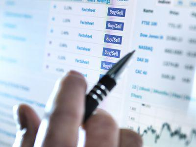

In the rapidly evolving world of finance, understanding key concepts such as reset margins, interest rates, and algorithmic trading is essential. These components are not only fundamental in shaping financial strategies but are also interconnected in complex ways that impact trading outcomes. Reset margins, a significant element in floating interest rate products, serve as a buffer between a loan's interest rate and its index, adjusting periodically to reflect current market conditions. This mechanism ensures that lenders and borrowers can manage their risk exposure effectively.

Interest rates are a core driver of economic activity, influencing everything from consumer spending to corporate investment decisions. They serve as a critical benchmark for various financial products and are pivotal in determining the cost of borrowing. Reset margins are closely tied to these rates, as they are often calculated based on prevalent interest rate benchmarks such as the London Interbank Offered Rate (LIBOR) or the federal funds rate. Consequently, fluctuations in interest rates can significantly alter the financial landscape for borrowers and investors alike.



Algorithmic trading represents the cutting-edge intersection of technology and finance, employing sophisticated algorithms to execute trades based on predetermined criteria. The efficiency and speed of algorithmic trading systems allow traders to capitalize on market movements that would be impossible to exploit manually. However, the efficacy of these systems is profoundly affected by changes in financial metrics such as interest rates and reset margins. By incorporating these factors into trading algorithms, investors can enhance their strategic advantage.

This article explores the intersections of these financial elements and their influence on modern trading strategies. By examining these components, investors can gain insights into optimizing their trading approaches to maximize returns while minimizing risks. The goal is to demystify these complex topics, providing a comprehensive guide for both novice and experienced traders. We begin with an overview of reset margins and their role in financial markets. Understanding these dynamics is crucial for anyone looking to navigate the intricate world of finance with confidence and efficacy.

## Table of Contents

## Understanding Reset Margin

Reset margins represent the difference between a loan's interest rate and its associated index, serving as a critical component for floating interest rate products. These margins are typically expressed in basis points, with one basis point equating to 0.01%. The reset margin allows the interest rate on a loan or security to be periodically adjusted based on prevailing market conditions.

Instruments such as adjustable-rate mortgages (ARMs) and floating rate notes frequently utilize reset margins. For ARMs, the interest rate comprises the benchmark index rate plus the reset margin. This structure helps lenders account for changes in the broader interest rate environment, thus aligning the loan's interest with current economic conditions. Similarly, floating rate notes, which are debt securities with variable interest payments, adjust their interest rates through reset margins applied to specified reference rates like the London Interbank Offered Rate (LIBOR) or the Secured Overnight Financing Rate (SOFR).

Understanding reset margins is vital for investors in navigating the [interest rate](/wiki/interest-rate-trading-strategies) fluctuations inherent in these financial products. As market conditions change, the adjustment in the reset margin impacts the overall yield of an investment or the cost of a borrowing product. This ability to reflect current market trends enhances the adaptability and risk management of financing instruments.

The formula for a floating interest rate could be expressed as:

$$
\text{Floating Interest Rate} = \text{Index Rate} + \text{Reset Margin}
$$

Market [volatility](/wiki/volatility-trading-strategies) can influence the index rate, while the reset margin remains a predetermined spread based on creditworthiness and market competition at loan origination. Therefore, investors seeking to optimize their strategy within variable rate environments must thoroughly understand how reset margins affect their financial obligations or income streams. For instance, an increase in the benchmark rate without a change in the reset margin directly raises the cost of loans or lowers the income from investments linked to floating rates.

The strategic comprehension of reset margins thus empowers investors to anticipate and mitigate risks associated with interest rate changes, allowing them to devise more effective and informed strategies in fluctuating market landscapes.

## Interest Rates: Core Financial Drivers

Interest rates are pivotal in shaping economic policy and guiding investment strategies, exerting a profound influence on both borrowing costs and investment returns. As one of the primary levers used by central banks, interest rates can control inflation, stabilize the currency, and promote economic growth. They serve as a benchmark for financial instruments, including loans, bonds, and mortgages, playing a crucial role in the broader financial ecosystem.

Reset margins are a fundamental aspect of floating interest rate products, and they are intrinsically tied to prevalent interest rate benchmarks such as the London Interbank Offered Rate (LIBOR) or the federal funds rate. These benchmarks provide a reference point for determining the interest rate of variable-rate financial instruments, making the relationship between reset margins and interest rates of paramount importance.

Market volatility, coupled with shifts in economic policies, can significantly affect interest rate levels. Sudden changes in inflation rates, monetary policies, or geopolitical events can cause fluctuations in these benchmarks. Such fluctuations, in turn, impact the calculations of reset margins, which are typically expressed in basis points above the benchmark rate. For example, considering a floating rate note with a reset margin of 150 basis points above LIBOR, an increase in LIBOR directly elevates the interest owed on the note.

Understanding the dynamics of interest rates is essential for investors involved with adjustable-rate instruments. These instruments, such as adjustable-rate mortgages (ARMs) and floating rate notes, directly expose investors to the fluctuations of market interest rates. An increase or decrease in rates not only impacts the returns on investments but also the cost of borrowing. For example, a sharp increase in interest rates can lead to higher monthly payments for an ARM borrower, emphasizing the need for strategic financial planning.

Investors and financial professionals often employ various tools and methodologies to analyze interest rate trends and anticipate future movements. These include econometric models and software applications designed to forecast interest rate changes based on historical data and economic indicators. 

In summary, interest rates are core financial drivers that dictate the conditions and outcomes of financial strategies. A firm grasp of how these rates interact with reset margins is crucial for managing investments effectively, particularly in an environment characterized by economic fluctuation and policy changes.

## Algo Trading: The New Frontier

Algorithmic trading, commonly known as algo trading, involves the use of computer programs to execute trades according to a set of predefined criteria. This approach harnesses advanced technology to enhance the efficiency, speed, and accuracy of trading operations. By automating the trading process, algo trading minimizes human intervention, allowing for precise execution of complex trading strategies.

One of the fundamental ways algo trading optimizes trading efficiency is through the rapid analysis and processing of large datasets. Algorithms assess various financial indicators, including price trends, [volume](/wiki/volume-trading-strategy) patterns, and economic data, enabling traders to make informed decisions at speeds unattainable by manual trading. This speed advantage is crucial in markets where prices can shift in milliseconds.

Algo trading's effectiveness is significantly influenced by fluctuations in key financial metrics, such as interest rates and reset margins. Interest rate changes can alter the valuation of financial instruments, impacting trading strategies that involve interest rate derivatives or fixed-income securities. Reset margins, which represent the difference between a loan's interest rate and its reference index, also play a pivotal role. Algorithms that account for reset margin variations can provide strategic advantages by optimizing the timing and selection of trades.

Traders can design sophisticated algorithms incorporating rules based on reset margins for strategic advantages. Here is an example in Python of a simple algorithm that evaluates financial data to make trading decisions:

```python
def evaluate_market_data(interest_rate, reset_margin, stock_price):
    threshold = 100  # Define an arbitrary threshold for decision making
    score = (interest_rate * reset_margin) - stock_price
    if score > threshold:
        return "Buy"
    elif score < -threshold:
        return "Sell"
    else:
        return "Hold"

current_interest_rate = 0.025  # Example interest rate
current_reset_margin = 0.005  # Example reset margin
current_stock_price = 150  # Example stock price

decision = evaluate_market_data(current_interest_rate, current_reset_margin, current_stock_price)
print(f"Trading Decision: {decision}")
```

In this example, the algorithm evaluates market data by considering the current interest rate and reset margin in relation to the stock price, thereby generating a simplistic buy, sell, or hold decision based on predefined criteria. While this particular algorithm is basic, more complex versions can integrate [machine learning](/wiki/machine-learning) techniques to adapt to changing market conditions and predictive analytics for anticipatory trading.

Overall, algo trading represents a critical evolution in modern financial markets. By incorporating financial metrics like interest rates and reset margins into algorithmic strategies, traders can enhance their ability to predict and capitalize on market movements.

## Integrating Finance Components

Incorporating an understanding of reset margins, interest rates, and [algorithmic trading](/wiki/algorithmic-trading) into a unified trading strategy offers significant benefits to investors. Traders can achieve advanced strategic planning by analyzing these interdependent financial components together, allowing for more accurate anticipation of market movements and volatility.

Reset margins, defined as the spread between a loan's interest rate and its reference index, are crucial for managing financial instruments with variable interest rates. These margins, expressed in basis points, are susceptible to periodic adjustments in response to changing market conditions. Understanding these changes is imperative for the effective management of instruments like adjustable-rate mortgages and floating rate notes, where profitability can be significantly influenced by interest rate benchmarks such as the London Interbank Offered Rate (LIBOR) or the federal funds rate.

Interest rates dictate the cost of borrowing and investment returns, functioning as a cornerstone of both economic policy and investment strategy. Fluctuations in these rates can lead to shifts in reset margins, posing potential risks and opportunities for investors. Consequently, a sound comprehension of interest rate dynamics is critical for optimizing trading returns, especially for those engaged in instruments with variable rates.

Algorithmic trading introduces an innovative dimension to managing these complexities. By utilizing computer programs to execute trades based on predefined rules, traders can process large volumes of data with speed and precision, surpassing human capabilities. Algorithms can be programmed to incorporate real-time changes in interest rates and reset margins, enabling dynamic response to financial markets' inherent volatility.

Below is a simple Python code snippet illustrating how an algorithm could adjust trading activity based on reset margin changes:

```python
def trade_decision(current_rate, benchmark_rate, margin_threshold):
    reset_margin = current_rate - benchmark_rate
    if reset_margin > margin_threshold:
        return "Sell"
    elif reset_margin < -margin_threshold:
        return "Buy"
    else:
        return "Hold"

# Example usage
current_interest_rate = 2.5
benchmark_interest_rate = 2.0
margin_threshold = 0.3

decision = trade_decision(current_interest_rate, benchmark_interest_rate, margin_threshold)
print(f"Trading decision based on reset margin: {decision}")
```

By tailoring such algorithms to integrate both present and historical data, traders can better position themselves against adverse economic conditions. This approach not only enhances the resilience of trading portfolios but also enables investors to capitalize on favorable conditions swiftly.

In summary, a holistic integration of reset margins, interest rates, and algorithmic trading can significantly enrich an investor's strategy. Strategic algorithm design and implementation can react to real-time changes in rates and margins, providing an adaptive framework for navigating the ever-changing financial landscape efficiently and effectively.

## Managing Risks in Changing Markets

Risk management is essential for navigating the complexities of volatile markets, especially for investors utilizing leverage. Volatility can amplify both potential returns and risks, making it crucial for traders to have a comprehensive strategy to safeguard against adverse market movements. Understanding reset margins and interest rate risks plays a key role in mitigating financial exposures faced by investors.

Reset margins, which reflect the spread between a loan's interest rate and its index, are subject to periodic adjustments that can significantly influence the cost of borrowing. These fluctuations, driven by changing market conditions and economic policies, can lead to increased financial burdens if not properly managed. Investors should be vigilant about these changes and recalibrate their trading strategies accordingly. This involves staying informed about macroeconomic indicators that influence interest rate benchmarks such as the London Interbank Offered Rate (LIBOR) or the federal funds rate, as these are directly connected to reset margin calculations.

Algorithmic trading, widely used for its efficiency and effectiveness, requires continual adjustment to accommodate shifts in financial metrics like interest rates and reset margins. Traders should regularly analyze and adjust their algorithmic strategies to reflect real-time market conditions. This dynamic approach allows for more responsive and adaptive trading strategies, potentially reducing exposure to risk. Python, with its extensive libraries for data analysis and algorithmic trading, can be useful in building tools to monitor and respond to such changes. For example, a basic Python script might be used to track interest rate movements and adjust positions accordingly:

```python
import requests
import pandas as pd

# Function to fetch current interest rates
def fetch_interest_rate(api_url):
    response = requests.get(api_url)
    data = response.json()
    return pd.DataFrame(data)

# Hypothetical API call to retrieve current interest rates
interest_rates = fetch_interest_rate("https://api.interestrates.com/latest")

# Adjust algorithm parameters based on fetched data
def adjust_trading_strategy(interest_rates):
    if interest_rates['rate'].iloc[-1] > interest_rates['rate'].mean():
        print("Consider reducing leveraged positions")
    else:
        print("Current rates support maintaining positions")

adjust_trading_strategy(interest_rates)
```

This script is a simplified representation, but it underscores the importance of real-time data integration in managing trading strategies and risks effectively. Traders must also consider diversification to cushion against sector-specific volatility and incorporate stress tests into their algorithms to evaluate potential outcomes under extreme scenarios. 

Effective risk management extends beyond single metrics and encompasses a holistic understanding of interconnected financial dynamics. By continuously analyzing and adapting to these elements, investors can enhance portfolio resilience and optimize performance amidst changing market landscapes.

## Conclusion and Future Outlook

The interplay between reset margins, interest rates, and algorithmic trading is fundamental to the structure of modern financial markets. Reset margins, which adjust the spread between a loan’s interest rate and its index, are influenced by economic policies and are pivotal in determining the cost of borrowing. Meanwhile, interest rates serve as vital indicators of economic health, influencing investment returns and the broader economic environment.

In conjunction, algorithmic trading utilizes these financial components to execute trades with enhanced efficiency, speed, and precision. As financial markets continue to transform, staying informed about reset margins and interest rate trends empowers traders and investors to design robust trading strategies that maximize profitability while minimizing risk.

Ongoing advances in technology and shifts in the economic landscape necessitate continuous learning and adaptability. Traders who embrace these changes and understand the dynamic relationships between these financial elements are better positioned to adjust their strategies to take advantage of emerging opportunities and manage potential risks.

Investors must remain vigilant, keeping abreast of regulatory changes, technological advancements, and market conditions. By actively aligning their trading strategies with new developments, traders can enhance their resilience and maintain a competitive edge in the ever-evolving financial markets. This proactive approach enables investors to capitalize on the synergies between reset margins, interest rates, and algorithmic trading, ensuring the alignment of their portfolios with future market trends.

## References & Further Reading

[1]: ["Advances in Financial Machine Learning"](https://www.amazon.com/Advances-Financial-Machine-Learning-Marcos/dp/1119482089) by Marcos Lopez de Prado

[2]: Hull, J. C. (2018). ["Options, Futures, and Other Derivatives"](https://www.semanticscholar.org/paper/Options%2C-Futures%2C-and-Other-Derivatives-Hull/89bdee500c8623864fc9eb7a471546aa713acc44) (10th ed.). Pearson. This book provides a comprehensive understanding of the derivatives market, including the use and calculation of reset margins tied to interest rate derivatives.

[3]: ["Evidence-Based Technical Analysis: Applying the Scientific Method and Statistical Inference to Trading Signals"](https://www.amazon.com/Evidence-Based-Technical-Analysis-Scientific-Statistical/dp/0470008741) by David Aronson

[4]: ["Machine Learning for Algorithmic Trading"](https://github.com/stefan-jansen/machine-learning-for-trading) by Stefan Jansen

[5]: ["Quantitative Trading: How to Build Your Own Algorithmic Trading Business"](https://www.amazon.com/Quantitative-Trading-Build-Algorithmic-Business/dp/1119800064) by Ernest P. Chan