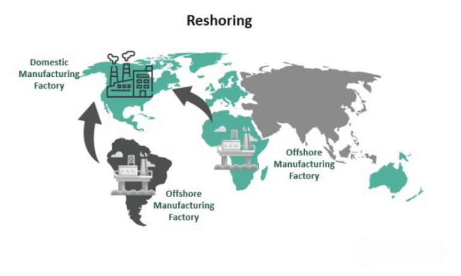

In recent years, reshoring has gained prominence as a crucial strategy in the manufacturing supply chain landscape. This trend marks a reversal of offshoring practices that dominated the previous decades, as companies increasingly prioritize bringing their manufacturing operations back to their original countries. Such reshoring efforts are driven by a myriad of factors, including evolving government policies, rising geopolitical tensions, and an overarching need for greater supply chain resilience. 

From tariff adjustments to incentives for domestic production, governments have implemented policies to encourage companies to reconsider their offshoring strategies. As geopolitical tensions create uncertainties in global trade, companies recognize that proximity between production sites and their primary markets can mitigate risks and increase supply chain reliability. This aspect of reshoring helps firms to reduce lead times and cushion against disruptions experienced in complex international supply chains.



Concurrently, the financial world is undergoing its own transformation, with algorithmic trading emerging as a pivotal innovation that redefines market interactions. Algorithmic trading leverages advanced computer programs to execute trades at speeds and efficiencies unattainable by human traders, profoundly affecting how investors participate in financial markets. By automating the trading process, algorithmic trading ensures precise execution and, thus, appeals to both institutional and retail investors aiming for optimized trading strategies.

This article examines the relationship between reshoring initiatives in manufacturing supply chains and the impact of algorithmic trading within financial markets. Through analyzing how these two significant trends interconnect, the discussion will uncover the broader implications for businesses navigating an evolving economic landscape.

## Table of Contents

## Understanding Reshoring and Its Economic Impact

Reshoring refers to the process of bringing the production and manufacturing activities of goods back to a company's home country. This trend has gained [momentum](/wiki/momentum) owing to a blend of economic, strategic, and geopolitical factors. Primarily, reshoring is driven by the imperative to create local jobs, which is a direct response to domestic unemployment concerns and the socio-economic benefits of a thriving job market. The potential to reduce trade deficits is another compelling reason; by producing goods domestically, countries can rely less on imports, thus positively affecting the balance of trade.

Improved supply chain reliability is also a crucial factor. Over-reliance on extensive, international supply chains can expose companies to risks such as disruptions from geopolitical tensions, pandemics, or natural disasters. Reshoring allows for a more controlled and predictable supply chain, reducing such vulnerabilities. The benefits extend to enhancing supply chain resilience, which is increasingly important in the face of global uncertainties.

Economically, reshoring can significantly bolster a domestic economy. By generating employment, it provides a stronger economic base and can stimulate growth in supportive sectors such as logistics, transport, and ancillary manufacturing services. A robust manufacturing sector can enhance a country's industrial capabilities and competitiveness, providing a foundation for sustainable economic growth.

However, the decision to reshore production is not without its challenges. Companies often face increased costs due to higher domestic labor wages compared to those in offshored locations. Additionally, the logistics involved in re-establishing manufacturing facilities, including potential capital investments in technology and infrastructure, can be substantial. Firms may need to invest in training and skill development to ensure the availability of a qualified workforce, which adds to the overall cost structure.

In summary, while reshoring has the potential to strengthen local economies and improve supply chain dynamics, companies must carefully assess the financial implications and logistics to ensure a smooth transition from offshored to reshored operations.

## The Role of Government and Policies

Government incentives are critically shaping the landscape of reshoring, significantly influencing the decisions of companies considering returning their manufacturing operations to their home countries. These incentives, which include tariffs, tax breaks, and subsidies, are designed to make domestic manufacturing an appealing prospect despite the associated challenges such as increased labor costs.

Tariffs serve as a pivotal tool by imposing taxes on imported goods, thereby making foreign products less competitive compared to locally manufactured ones. By strategically applying tariffs, governments can protect emerging domestic industries and encourage companies to shift their production facilities back home. This measure not only curtails the dependency on imports but also strengthens local economies by boosting domestic consumption and investment.

Tax breaks and subsidies further contribute by reducing the financial burden on companies that choose to reshore. Tax incentives provide significant cost savings which, in return, can be reinvested in technology and workforce development. Subsidies, on the other hand, offer direct financial support, enabling companies to offset the initial high costs of transitioning their operations from abroad to domestic soil.

In the United States, programs such as SelectUSA play a substantial role in promoting reshoring. Established to facilitate business investment, SelectUSA provides a platform for companies to explore opportunities and access resources necessary for reshoring efforts. This initiative underscores the strategic importance placed on reshoring as a means to enhance national economic growth.

The impact of supportive government policies on a firm's reshoring decision-making process is considerable. Firms evaluate these incentives against the backdrop of their operational needs and strategic objectives. A favorable policy environment not only aids in the financial feasibility of reshoring but also fosters an ecosystem that supports innovation and sustainable growth.

Ultimately, the alignment of government policies with the industrial strategies of companies emerges as a critical [factor](/wiki/factor-investing) in reshoring. By effectively leveraging these policies, firms can mitigate the complexities associated with reshoring and achieve a competitive advantage in the global marketplace.

## Challenges and Opportunities in Reshoring

Reshoring, the process of bringing manufacturing back to a company's home country from overseas, presents several challenges as well as opportunities. 

One of the primary challenges is the increased labor cost associated with manufacturing domestically. Labor costs in many Western countries, including the United States and parts of Europe, are significantly higher compared to low-cost manufacturing hubs such as China or Vietnam. For instance, the average hourly compensation for manufacturing workers in the U.S. can be several times higher than that in developing economies. This discrepancy can impact the overall cost structure of companies that choose to reshore their operations. Additionally, the need for skilled workers poses another hurdle. As manufacturing processes have become more technologically advanced, the demand for a workforce skilled in operating complex machinery and understanding robotics and automation has surged. However, the availability of such skilled labor can be limited, necessitating investment in training and education.

Conversely, reshoring offers several opportunities that can offset these challenges. One significant advantage is the reduction in supply chain length and complexity. By producing goods closer to their end markets, companies can significantly decrease lead times and transportation costs. Shorter supply chains also contribute to reduced carbon emissions, aligning with global sustainability goals and meeting increasing consumer demand for environmentally friendly practices. This local production can lead to a reduced carbon footprint due to lower transportation emissions, supporting corporate social responsibility and environmental initiatives.

Moreover, deploying [artificial intelligence](/wiki/ai-artificial-intelligence) (AI) and digital technologies can be pivotal in overcoming reshoring challenges. These technologies can optimize production processes, enhancing efficiency and compensating for higher labor costs. For example, predictive maintenance powered by AI can prevent downtime, while automation can increase production speeds and accuracy. Below is a simple example of how Python can be used to predict maintenance needs using [machine learning](/wiki/machine-learning):

```python
# Importing necessary libraries
import pandas as pd
from sklearn.model_selection import train_test_split
from sklearn.ensemble import RandomForestClassifier
from sklearn.metrics import classification_report

# Load and prepare data
data = pd.read_csv('machine_maintenance_data.csv')
X = data.drop('maintenance_needed', axis=1)
y = data['maintenance_needed']

# Split the data
X_train, X_test, y_train, y_test = train_test_split(X, y, test_size=0.3, random_state=42)

# Train the model
model = RandomForestClassifier()
model.fit(X_train, y_train)

# Predict and evaluate
predictions = model.predict(X_test)
print(classification_report(y_test, predictions))
```

In this script, machine learning is used to predict when maintenance is needed, preventing unexpected breakdowns and optimizing operational uptime. 

The adoption of such advanced technological solutions, coupled with strategic planning and government incentives, can turn the challenges of reshoring into substantial opportunities, enabling companies to benefit from more resilient, efficient, and sustainable manufacturing operations.

## Algorithmic Trading: Revolutionizing Financial Markets

Algorithmic trading employs sophisticated computer algorithms to execute trades with remarkable speed and precision, fundamentally reshaping financial markets. By automating trading processes, [algorithmic trading](/wiki/algorithmic-trading) enhances market efficiency and [liquidity](/wiki/liquidity-risk-premium), enabling millions of transactions to occur in mere fractions of a second. This automation reduces transaction costs and minimizes the market impact of large trades, thereby leveling the playing field for market participants.

The integration of algorithmic trading into financial markets is fueled by its ability to capitalize on short-lived market opportunities that are imperceptible to human traders. Algorithms can process vast amounts of market data, identify patterns, and execute trades based on pre-set criteria without human intervention. For example, algorithms can be programmed to execute trades when certain conditions are met, such as when a stock's moving average crosses a specific threshold.

An algorithm might be designed in Python as follows:

```python
def moving_average_strategy(prices, short_window, long_window):
    """
    Execute a simple moving average trading strategy.

    :param prices: List of stock prices.
    :param short_window: Period for short moving average.
    :param long_window: Period for long moving average.
    :return: Buy/sell signals based on crossover strategy.
    """
    if len(prices) < long_window:
        return "Insufficient data"

    short_mavg = sum(prices[-short_window:]) / short_window
    long_mavg = sum(prices[-long_window:]) / long_window

    if short_mavg > long_mavg:
        return "Buy"
    elif short_mavg < long_mavg:
        return "Sell"
    else:
        return "Hold"
```

The rapid adoption of algorithmic trading strategies is evident in both institutional and retail sectors. Institutional investors leverage algorithmic trading to manage large portfolios, executing block trades efficiently and minimizing market impact. Retail investors are increasingly using algorithm-driven platforms that offer user-friendly interfaces, enabling them to automate trades based on personalized investment criteria.

Furthermore, the proliferation of machine learning and artificial intelligence (AI) is amplifying the capabilities of algorithmic trading. By harnessing AI, traders can develop algorithms that learn from historical and real-time data to predict market trends, adapt strategies dynamically, and improve decision-making processes.

Despite its advantages, algorithmic trading poses risks, such as the potential for algorithmic errors and market anomalies. "Flash crashes" can occur when algorithms react too quickly to market events, causing extreme [volatility](/wiki/volatility-trading-strategies). To mitigate such risks, regulatory bodies have imposed guidelines to ensure market stability and transparency.

Overall, algorithmic trading's impact on financial markets is profound, providing traders with tools to increase speed, accuracy, and profitability while shaping the future landscape of trading practices.

## The Intersection of Reshoring and Algorithmic Trading

Reshoring, the process of bringing manufacturing operations back to a company’s home country, has significant implications for financial markets. As these changes in domestic manufacturing occur, they have the potential to influence various economic indicators such as employment rates, gross domestic product (GDP), and trade balances. These shifts in economic indicators can, in turn, impact stock markets and other financial instruments. Algorithmic trading, which involves the use of computer programs to execute trades with high speed and precision, can be strategically utilized to take advantage of market movements driven by reshoring announcements.

Algorithmic trading systems can be programmed to analyze news feeds and other data sources to detect reshoring activities. For example, a sudden announcement from a major manufacturing firm about reshoring its operations can lead to fluctuations in the stock prices of not only the announcing company but also its competitors and suppliers. An algorithmic trading system equipped with natural language processing (NLP) capabilities can quickly interpret the news and execute trades that capitalize on these movements. The speed of execution is crucial as it allows traders to enter and [exit](/wiki/exit-strategy) positions before the broader market fully absorbs the information, thereby optimizing potential profits or minimizing losses.

Moreover, companies engaged in reshoring activities can harness data analytics to synchronize their reshoring strategies with their trading strategies. By building predictive models, firms can forecast the market's response to reshoring announcements and adjust their positions accordingly. For instance, they might identify patterns where certain economic sectors react more positively to reshoring activities, allowing them to overweight their portfolios in these areas.

Python libraries such as `pandas` and `scikit-learn` can be employed to develop such predictive models. A basic framework could involve the following steps:

1. **Data Collection**: Gather historical data on reshoring announcements, stock prices, and relevant economic indicators.
2. **Feature Engineering**: Identify key features such as announcement date, size of the reshoring effort, industry sector, and initial market response.
3. **Model Training**: Use machine learning algorithms to train a model on the historical data, seeking correlations between reshoring activities and market movements.
4. **Prediction**: Apply the trained model to forecast future market responses to reshoring announcements.

Here is an example of how a simple predictive model could be coded in Python:

```python
import pandas as pd
from sklearn.model_selection import train_test_split
from sklearn.ensemble import RandomForestRegressor
from sklearn.metrics import mean_squared_error

# Load data
data = pd.read_csv('reshoring_data.csv')

# Feature selection
features = ['announcement_size', 'sector', 'initial_market_reaction']
X = data[features]
y = data['subsequent_market_movement']

# Split data
X_train, X_test, y_train, y_test = train_test_split(X, y, test_size=0.2, random_state=42)

# Train model
model = RandomForestRegressor()
model.fit(X_train, y_train)

# Evaluate model
predictions = model.predict(X_test)
mse = mean_squared_error(y_test, predictions)
print(f'Mean Squared Error: {mse}')
```

This intersection of reshoring and algorithmic trading highlights how companies can not only influence but also anticipate and respond to financial markets through strategic planning and the innovative use of technology and data analytics.

## Case Studies and Examples

Several U.S. companies have achieved notable success in reshoring operations, thereby enhancing domestic employment and strengthening local economies. A prominent example is General Motors (GM), which announced significant reshoring efforts by investing in domestic manufacturing facilities. This strategic move not only boosted job creation but also improved supply chain agility and reduced transportation costs. Similarly, Caterpillar Inc. has shifted some of its manufacturing operations back to the U.S., focusing on components where the cost advantage of manufacturing abroad has diminished due to rising labor costs in other countries and increased tariffs. These efforts have created hundreds of jobs and have positioned the companies to respond more effectively to market demands.

Algorithmic trading has seen firms capitalize on reshoring-driven market shifts. For instance, trading companies have employed sophisticated computer algorithms to analyze announcements of reshoring activities by companies, leveraging these insights to predict market responses and optimize trading strategies. This involves utilizing historical data and machine learning models to assess patterns in stock price movements following reshoring announcements. A Python-based approach is often implemented in such trading strategies, utilizing libraries like pandas for data manipulation and scikit-learn for predictive analytics.

```python
import pandas as pd
from sklearn.linear_model import LinearRegression

# Example: Predicting stock price movement based on reshoring announcements
# Data: A simplified dataset of reshoring announcements and stock prices
data = {'Days_After_Announcement': [1, 2, 3, 4, 5],
        'Stock_Price_Change': [0.5, 1.2, -0.3, 0.7, 1.0]}

df = pd.DataFrame(data)

# Linear regression model
X = df[['Days_After_Announcement']]
y = df['Stock_Price_Change']

model = LinearRegression()
model.fit(X, y)

# Predicting the stock price change for the next day
predicted_change = model.predict([[6]])
print(f"Predicted Stock Price Change for Day 6: {predicted_change[0]:.2f}")
```

Through these strategies, trading firms can preemptively adjust their portfolios, taking advantage of the increased volatility that often accompanies reshoring news. By integrating algorithmic trading with insights from manufacturing trends, firms can effectively navigate the delicate balance between production relocation and market speculation.

Lessons learned from these case studies underscore the importance of integrating effective data analysis and algorithmic models in interpreting reshoring dynamics. For companies considering reshoring, leveraging algorithmic trading strategies can mitigate financial risks associated with market unpredictability. Furthermore, building robust analytical capabilities allows firms to align logistical planning with market opportunities, thereby gaining a competitive edge in an increasingly globalized economy.

## Conclusion

Reshoring and algorithmic trading are pivotal developments that redefine the landscapes of manufacturing and finance. By understanding these trends, companies can optimize supply chain strategies and trading practices. Reshoring not only strengthens domestic economies through job creation and improved supply chain resilience but also offers environmental benefits such as reduced carbon footprints. On the other hand, algorithmic trading is revolutionizing the financial markets, providing unparalleled speed and precision in trade execution.

The synergy between these trends enables companies to respond swiftly to market shifts, providing a strategic advantage. Firms can leverage data analytics and advanced technologies to align their reshoring decisions with precise algorithmic trading strategies, thus capitalizing on new economic indicators influenced by reshoring activities.

To flourish in this dynamic environment, continuous adaptation and strategic planning are imperative. Companies must invest in technology and skill development to fully realize the benefits of reshoring. Similarly, refining algorithmic trading models with comprehensive data analyses ensures responsiveness to economic changes. Embracing these transformative forces positions companies at the forefront of innovation and efficiency in their respective domains.

## References

1. Bailey, D. & De Propris, L. (2014). Reshoring: Opportunities and limits for manufacturing investment in the UK, Revue d'économie industrielle, 148(none), 45-61. DOI:10.4000/rei.6258

2. Ellram, L. M., Tate, W. L., & Petersen, K. J. (2013). Offshoring and reshoring: An update on the manufacturing location decision, Journal of Supply Chain Management, 49(2), 14-22. DOI:10.1111/jscm.12019

3. Gray, J. V., Skowronski, K., Esenduran, G., & Rungtusanatham, M. J. (2013). The reshoring phenomenon: What supply chain academics ought to know and should do, Journal of Supply Chain Management, 49(2), 27-33. DOI:10.1111/jscm.12012

4. Kearney, A. T. (2020). The Reshoring Index - COVID-19 Tests the Limits of Diversified Supply Chains. Retrieved from https://www.kearney.com

5. Lacity, M. C., & Willcocks, L. P. (2014). Business process outsourcing and resourcing in China: The evidence on returns and risks. Journal of Strategic Information Systems, 23(3), 226-245. DOI:10.1016/j.jsis.2014.07.001

6. O’Leary, D. E. (2015). The impact of big data on finance and accounting: The case of predictive analytics, Intelligent Systems in Accounting, Finance & Management, 22(1), 53-65. DOI:10.1002/isaf.1359

7. The White House (2021). Executive Order on America’s Supply Chains. Retrieved from https://www.whitehouse.gov

8. U.S. Department of Commerce, SelectUSA. (2021). The Benefits of Reshoring: Restoring American Competitiveness. Retrieved from https://www.selectusa.gov

9. Valero, J., & Van Reenen, J. (2019). The economic impact of digital technologies, and their reshoring potential. Journal of Economic Geography, 19(5), 903-935. DOI:10.1093/jeg/lbz014

## References & Further Reading

[1]: Bailey, D., & De Propris, L. (2014). ["Reshoring: Opportunities and limits for manufacturing investment in the UK"](https://academic.oup.com/cjres/article/7/3/379/2864041). Revue d'économie industrielle, 148, 45-61. DOI:10.4000/rei.6258.

[2]: Ellram, L. M., Tate, W. L., & Petersen, K. J. (2013). ["Offshoring and reshoring: An update on the manufacturing location decision."](https://onlinelibrary.wiley.com/doi/abs/10.1111/jscm.12019) Journal of Supply Chain Management, 49(2), 14-22. DOI:10.1111/jscm.12019.

[3]: Gray, J. V., Skowronski, K., Esenduran, G., & Rungtusanatham, M. J. (2013). ["The reshoring phenomenon: What supply chain academics ought to know and should do."](https://www.academia.edu/17525193/The_Reshoring_Phenomenon_What_Supply_Chain_Academics_Ought_to_know_and_Should_Do) Journal of Supply Chain Management, 49(2), 27-33. DOI:10.1111/jscm.12012.

[4]: Kearney, A. T. (2020). ["The Reshoring Index - COVID-19 Tests the Limits of Diversified Supply Chains."](https://epsnews.com/2021/06/07/reshoring-2020-a-wild-ride-but-u-s-is-poised-for-change/) Retrieved from Kearney.com.

[5]: O’Leary, D. E. (2015). ["The impact of big data on finance and accounting: The case of predictive analytics."](https://scholar.google.com/citations?user=DVk7EKAAAAAJ) Intelligent Systems in Accounting, Finance & Management, 22(1), 53-65. DOI:10.1002/isaf.1359.

[6]: The White House (2021). ["Executive Order on America’s Supply Chains."](https://www.whitehouse.gov/briefing-room/presidential-actions/2021/02/24/executive-order-on-americas-supply-chains/) Retrieved from Whitehouse.gov.

[7]: U.S. Department of Commerce, SelectUSA. (2021). ["The Benefits of Reshoring: Restoring American Competitiveness."](https://www.trade.gov/selectusa-home) Retrieved from SelectUSA.gov.

[8]: Valero, J., & Van Reenen, J. (2019). ["The economic impact of digital technologies, and their reshoring potential."](https://www.nber.org/papers/w22501) Journal of Economic Geography, 19(5), 903-935. DOI:10.1093/jeg/lbz014.