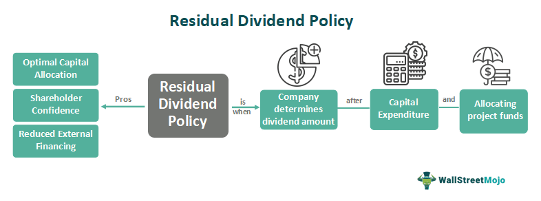

## Table of Contents

## What is a residual dividend?

A residual dividend is the money a company pays to its shareholders after it has used its profits to pay for all its expenses and investments. When a company makes money, it first uses that money to cover things like operating costs, debts, and any projects or equipment it needs to grow. Whatever money is left over after these expenses is called the residual, and the company can choose to give this money to its shareholders as a dividend.

Companies might choose to use a residual dividend policy because it helps them balance their need to invest in the business with their desire to reward shareholders. By only paying out dividends from the leftover profits, the company makes sure it has enough money to keep running and growing. This approach can be good for the company's long-term health, but it can also mean that the dividends shareholders receive might change from year to year, depending on how much profit the company makes and how much it needs to spend.

## How does the residual dividend policy work?

A residual dividend policy is a way for a company to decide how much money to give back to its shareholders as dividends. The company first figures out how much money it needs to spend on things like running the business, paying off debts, and buying new equipment or starting new projects. After it has set aside enough money for all these needs, any leftover profit is what's called the residual. The company then gives this residual money to its shareholders as dividends.

This policy helps the company make sure it has enough money to keep growing and stay healthy. It's like saving up for important things before spending on extras. But, it also means that the amount of money shareholders get can change a lot from year to year. If the company has a good year and doesn't need to spend much on new projects, shareholders might get a big dividend. But if the company needs to spend a lot on growth, there might be little or no money left for dividends.

## What is the purpose of using a residual dividend policy?

The main purpose of using a residual dividend policy is to make sure a company has enough money to grow and stay healthy. When a company makes money, it needs to spend on things like running the business, paying debts, and buying new equipment or starting new projects. By setting aside money for these important things first, the company can make sure it has what it needs to keep going and get bigger. This helps the company stay strong and successful in the long run.

Another purpose is to share any extra money with shareholders in a fair way. After the company has taken care of all its needs, any leftover money, called the residual, is given to shareholders as dividends. This way, shareholders only get money when the company can afford it, which means the dividends might change from year to year. But it's a good way to make sure the company is looking after its own health before sharing profits, which can be good for everyone in the long run.

## Can you explain the formula for calculating residual dividends?

The formula for calculating residual dividends is pretty simple. You start with the company's net income, which is how much money the company made after all its expenses. Then, you subtract the money the company needs to keep running and growing, like money for new projects or equipment. This is called capital expenditures. What's left after you subtract the capital expenditures from the net income is the residual, and that's the money the company can use to pay dividends to shareholders.

For example, if a company made $100,000 in net income and it needs to spend $60,000 on new projects, you would subtract $60,000 from $100,000. That leaves $40,000 as the residual. The company can then choose to give this $40,000 to its shareholders as dividends. This way, the company makes sure it has enough money to grow and stay healthy before sharing any extra money with shareholders.

## What are the advantages of a residual dividend policy for a company?

A residual dividend policy helps a company make sure it has enough money to grow and stay healthy. By setting aside money for things like new projects and equipment first, the company can keep running smoothly and get bigger over time. This is really important because it means the company can take care of its own needs before sharing money with shareholders. This approach helps the company stay strong and successful in the long run.

Another advantage is that it's a fair way to share money with shareholders. The company only gives out dividends when it can afford to, after taking care of all its needs. This means shareholders get money when the company is doing well, but they might get less or no money if the company needs to spend more on growth. This can help keep shareholders happy because they know the company is looking after its health before sharing profits.

## What are the potential disadvantages of using a residual dividend policy?

One big disadvantage of using a residual dividend policy is that it can make it hard for shareholders to know how much money they will get. Because the amount of dividends can change a lot from year to year, it can be tough for people who depend on that money to plan their finances. If the company has to spend a lot on new projects one year, there might be little or no money left for dividends, which can be a problem for shareholders.

Another downside is that it might make the company less attractive to investors who want steady income. Some people invest in stocks because they want to get regular dividends. If a company uses a residual dividend policy, it might not be able to offer those regular payments. This can make it harder for the company to attract and keep investors who are looking for a reliable source of income.

## How does a residual dividend policy affect a company's stock price?

A residual dividend policy can affect a company's stock price in different ways. If investors like the idea that the company is focusing on growth and health first, they might see the stock as a good long-term investment. This can make the stock price go up because more people want to buy the stock. But if the company doesn't pay out steady dividends, some investors who want regular income might not want to buy the stock. This can make the stock price go down because fewer people are interested.

On the other hand, if the company has a good year and can pay out big dividends, the stock price might go up. Investors might see the big dividends as a sign that the company is doing well and has extra money to share. But if the company has a bad year and can't pay out any dividends, the stock price might go down. Investors might worry that the company is struggling and not making enough money, which can make them less interested in buying the stock.

## In what types of companies is a residual dividend policy most commonly used?

A residual dividend policy is often used by companies that are growing quickly and need a lot of money for new projects and equipment. These companies want to make sure they have enough money to keep growing and getting bigger. They might be in industries like technology or manufacturing, where they need to spend a lot on research and development or new machines. By using a residual dividend policy, these companies can focus on their growth first and only pay dividends if they have extra money left over.

This policy is also common in companies that want to be careful with their money. They might be in industries where it's hard to predict how much money they will make each year, like in energy or farming. These companies want to make sure they can cover all their costs and still have money for unexpected things. By setting aside money for their needs first, they can keep their business stable and only give out dividends when they can afford it.

## How does a residual dividend policy differ from other dividend policies?

A residual dividend policy is different from other dividend policies because it puts the company's needs first. With a residual dividend policy, a company figures out how much money it needs for things like running the business, paying debts, and buying new stuff. After setting aside money for these things, any leftover money, or the residual, is given to shareholders as dividends. This means the amount of dividends can change a lot from year to year, depending on how much money the company makes and how much it needs to spend.

Other dividend policies might focus more on giving shareholders a steady amount of money. For example, a stable dividend policy tries to pay the same amount of dividends every year, even if the company's profits go up or down. This can make shareholders happy because they know how much money they will get. Another type is a target payout ratio policy, where the company tries to pay out a certain percentage of its profits as dividends. This can also be good for shareholders who want a predictable amount of money, but it might mean the company has less money to spend on growing.

## Can you provide a real-world example of a company using a residual dividend policy?

A good example of a company using a residual dividend policy is Google's parent company, Alphabet Inc. Alphabet focuses a lot on growing and spending money on new projects and research. They want to make sure they have enough money to keep their business running and to start new things. So, they use a residual dividend policy where they first set aside money for all their needs. Whatever money is left over, they might give to shareholders as dividends. This means the dividends can change a lot from year to year, depending on how much money Alphabet makes and how much they need to spend.

For example, in years when Alphabet makes a lot of money and doesn't need to spend much on new projects, they might have more money left over to give to shareholders. But in years when they need to spend a lot on growing their business, there might be little or no money left for dividends. This approach helps Alphabet stay strong and keep growing, but it also means shareholders might not always get the same amount of money each year.

## What are the tax implications of receiving residual dividends for investors?

When investors get residual dividends, they have to pay taxes on that money. In the United States, dividends are usually taxed at a special rate called the qualified dividend rate, which can be lower than the regular income tax rate. But to get this lower rate, the dividends have to meet certain rules, like the company paying the dividends has to be based in the U.S. or a country that has a tax treaty with the U.S., and the investor has to hold onto the stock for a certain amount of time. If the dividends don't meet these rules, they are taxed at the regular income tax rate, which can be higher.

Because the amount of residual dividends can change a lot from year to year, it can make it hard for investors to plan for taxes. One year, they might get a big dividend and have to pay more in taxes. Another year, they might get a small dividend or no dividend at all, and pay less in taxes. This can make it tricky for investors to know how much money they will have left after taxes, especially if they rely on dividends for income.

## How can a company's management effectively communicate changes in residual dividend policy to shareholders?

When a company's management wants to tell shareholders about changes in their residual dividend policy, they should use clear and simple language. They can do this by sending out a letter or an email to all shareholders explaining the changes. In this message, they should say why the changes are happening, like if the company needs to spend more money on new projects or if they made more money than expected. They should also talk about how these changes might affect the dividends shareholders get. By being open and honest, management can help shareholders understand the reasons behind the changes and feel more comfortable with them.

Another good way to communicate changes in the residual dividend policy is through meetings or calls with shareholders. Management can hold a meeting, either in person or online, where they talk about the changes and answer any questions shareholders might have. This gives shareholders a chance to hear directly from the people making the decisions and understand the company's plans better. By being available and willing to talk, management can build trust with shareholders and make sure everyone is on the same page about the company's future and how it might affect their dividends.

## What is the corporate finance perspective on understanding dividend policy?

Dividend policy is a fundamental component of corporate finance, influencing how a company distributes its profits to shareholders. This distribution process is integral to shaping investor confidence and maintaining the financial health of the company. The approach to dividend policy that a company selects can vary widely, ranging from stable and predictable payouts to more flexible schemes like the residual dividend policy, which focuses on prioritizing business growth.

One of the primary aims of a dividend policy is to strike a balance between distributing profits and retaining earnings for reinvestment. To evaluate and develop an effective dividend policy, several key metrics are utilized:

1. **Dividend Yield**: This ratio, calculated as the annual dividend per share divided by the share price, provides an immediate sense of the income generated from an investment in the company's stock. It is a critical indicator for income-focused investors.
$$
   \text{Dividend Yield} = \frac{\text{Annual Dividends per Share}}{\text{Price per Share}}

$$

2. **Payout Ratio**: This metric is defined as the proportion of earnings paid out as dividends to shareholders, expressed as a percentage of total earnings or net income.
$$
   \text{Payout Ratio} = \frac{\text{Total Dividends Paid}}{\text{Net Income}}

$$

A high payout ratio may signal a lack of reinvestment in the company, potentially leading to slower growth, while a low payout ratio often indicates that a company is reinvesting a significant portion of earnings into the business for growth initiatives.

Dividend policies also serve as a significant signal to the market regarding a company's stability and growth prospects. Companies with well-articulated dividend policies tend to attract a diverse set of investors, as these policies provide transparency regarding the company's financial strategy and profitability intentions. Stable dividend payouts are often perceived as indicative of steady cash flows and robust financial health, attracting risk-averse or income-seeking investors. Conversely, companies employing a residual dividend approach might appeal to growth-oriented investors who prioritize long-term capital appreciation over immediate returns.

Ultimately, the decision-making process concerning dividend policy involves a careful evaluation of the company's financial position and strategic goals. It necessitates balancing immediate shareholder gratification with sustainable corporate growth. Adopting a well-considered dividend policy, therefore, not only fosters favorable investor perception but also enhances the company's ability to attract and retain a comprehensive investor base, contributing to its overall market strength and longevity.

## What is the mechanism and what are the implications of the Residual Dividend Policy?

Residual dividend policy represents a strategic approach where a company prioritizes the reinvestment of its earnings into high-potential investment opportunities before distributing any surplus as dividends to shareholders. This policy is fundamentally focused on maximizing long-term growth, supporting the view that reinvesting in growth initiatives can yield higher returns over time compared to immediate distribution of profits.

#### Mechanism

Under a residual dividend policy, dividends are only paid after all profitable investment opportunities have been funded. The process involves several key steps:

1. **Identify Profitable Investments**: The company first identifies potential projects or investments where the expected return exceeds the required rate of return. These investments could include new projects, capital expansion, or acquisitions.

2. **Calculate Net Income and Retained Earnings Requirement**: The company calculates its net income and determines the amount required for financing the identified opportunities. This requires a clear understanding of capital budgeting and future growth projections.

3. **Determine Residual Earnings**: After funding necessary investments, any remaining earnings are considered "residual" and available for dividend distribution.

Mathematically, the residual dividend can be expressed as:

$$
\text{Residual Dividend} = \text{Net Income} - \text{Equity Financing Needed for Investments}
$$

This formula implies that dividends are contingent on the ability to support the firm's strategic investment needs first.

#### Implications

1. **Variability in Dividend Payments**: By addressing investment needs first, residual dividend policy introduces a natural variability in dividend payments. This variability can be explained by fluctuations in net income and investment opportunities available. While some investors might find this unpredictability challenging, others appreciate the potential for higher long-term returns.

2. **Financial Stability**: Companies adopting this policy often demonstrate a commitment to maintaining robust financial health. By prioritizing reinvestment, companies aim to strengthen their competitive position and enhance shareholder value over time.

3. **Investor Perspective**: This policy assumes that investors appreciate the pursuit of growth through reinvestment over immediate returns. Such investors are typically more growth-oriented, seeking long-term capital appreciation instead of stable, immediate dividend income.

4. **Need for Expert Planning**: To execute a residual dividend policy effectively, companies require meticulous financial planning and continuous assessment of capital needs. The dynamic nature of this policy mandates regular evaluation of growth prospects and strategic alignment of available resources.

The adoption of a residual dividend policy requires a company to be diligent in its financial management and strategic planning, ensuring that it can effectively balance growth imperatives with shareholder expectations. The approach is particularly appealing for companies in sectors with abundant growth opportunities or requiring significant capital expenditure, allowing them to leverage retained earnings for sustainable, long-term growth.

## References & Further Reading

[1]: Lintner, J. (1956). The Distribution of Incomes of Corporations Among Dividends, Retained Earnings, and Taxes. The American Economic Review, 46(2), 97-113.

[2]: Miller, M. H., & Modigliani, F. (1961). Dividend policy, growth, and the valuation of shares. The Journal of Business, 34(4), 411-433.

[3]: Black, F. (1976). The Dividend Puzzle. Journal of Portfolio Management, 2(2), 5-8.

[4]: ["Principles of Corporate Finance"](https://www.amazon.com/Principles-Corporate-Finance-Richard-Brealey/dp/0077404890) by Richard A. Brealey, Stewart C. Myers, and Franklin Allen.

[5]: ["Algorithmic Trading: Winning Strategies and Their Rationale"](https://www.amazon.com/Algorithmic-Trading-Winning-Strategies-Rationale-ebook/dp/B00CY5HC0U) by Ernest P. Chan.

[6]: Asness, C. S., & Liew, J. M. (2014). The Great Divide: Quantitative or Value Investing. The Journal of Portfolio Management, 40(2), 1-4.

[7]: ["Financial Modeling"](https://en.wikipedia.org/wiki/Financial_modeling) by Simon Benninga.

[8]: Bodie, Z., Kane, A., & Marcus, A. J. (2014). ["Investments."](https://www.mheducation.com/highered/product/Investments-Bodie.html) McGraw-Hill Education.