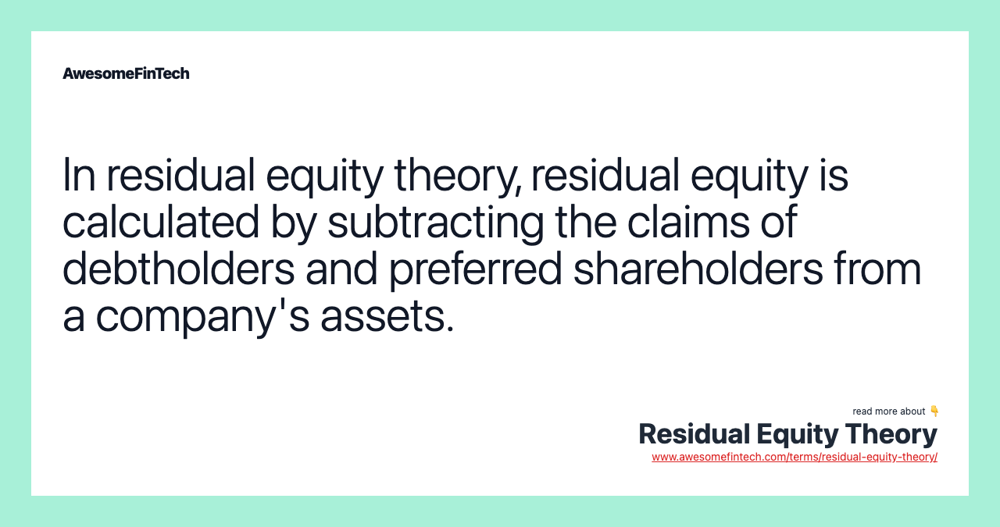

## Table of Contents

## What is Residual Equity Theory?

Residual Equity Theory is a way to figure out how much a business is worth by looking at what's left over after paying off all the debts. It's like if you owned a house and wanted to know its value. First, you would pay off the mortgage and any other loans on the house. Whatever money you have left after paying those debts is what the house is worth to you. In a business, you do the same thing but with all the company's assets and liabilities.

This theory is useful for business owners and investors because it helps them see the true value of the company. It's especially helpful when a company has a lot of debt. By focusing on what's left after debts are paid, people can make better decisions about buying, selling, or investing in the business. It's a straightforward way to understand a company's financial health and potential for growth.

## Who developed the Residual Equity Theory?

The Residual Equity Theory was developed by Ezra Solomon, an economist and finance professor. He came up with this idea in the 1960s as a way to help people understand how much a business is really worth. Solomon wanted to make it easier for investors and business owners to see the true value of a company, especially when it has a lot of debt.

Solomon's theory focuses on what's left over after all the company's debts are paid off. This leftover value is what he called the "residual equity." By looking at this, people can get a clearer picture of a company's financial health and make better decisions about buying, selling, or investing in it. His work has been important in the field of finance and is still used today to evaluate businesses.

## How does Residual Equity Theory differ from other equity theories?

Residual Equity Theory is different from other equity theories because it focuses on what's left after paying off all the debts. Other theories might look at the total value of a company, including its debts, or they might focus on the market value of the company's stock. But Residual Equity Theory is all about the "residual" or leftover value after debts are paid. This makes it a good tool for understanding a company's true worth, especially if the company has a lot of debt.

For example, another common equity theory is the Market Value Added (MVA) approach, which looks at the difference between the market value of a company and the capital invested in it. This theory doesn't care about debts in the same way as Residual Equity Theory. Instead, it focuses on how much more the market thinks the company is worth compared to what was put into it. So, while MVA might show a high value for a company with a lot of debt if the market likes it, Residual Equity Theory would show a lower value because it takes away the debt first. This difference helps investors and business owners see the company's value from different angles.

## What are the key components of Residual Equity Theory?

Residual Equity Theory is all about figuring out how much a business is worth after paying off all its debts. The key part of this theory is the idea of "residual equity." This is what's left over after you subtract all the company's liabilities from its assets. So, if a company has a lot of things it owns (assets) but also a lot of money it owes (liabilities), you take away the liabilities from the assets to see what's left. That leftover value is the residual equity, and it shows the true worth of the company to its owners or shareholders.

Another important part of Residual Equity Theory is that it helps people make better decisions about a business. By focusing on what's left after debts are paid, investors and business owners can see the real financial health of the company. This is especially useful for companies with a lot of debt. If a company looks valuable when you just look at its total assets, but it has a lot of debt, the Residual Equity Theory will show a lower value. This helps people understand if the company is a good investment or if it might be risky because of its debts.

## Can you explain the concept of residual equity in simple terms?

Residual equity is like figuring out how much money you have left after paying all your bills. Imagine you own a lemonade stand and you have $100 in your piggy bank. But you owe $30 to your friend for the lemons you borrowed. After you pay your friend back, you have $70 left. That $70 is your residual equity – it's what's left over after you pay off what you owe.

This idea is used in businesses to find out how much the company is really worth to its owners. If a company has a lot of things it owns, like buildings and machines, but also a lot of debts, you subtract the debts from the value of those things. What's left is the residual equity. This helps people see if the company is a good investment or if it might be risky because of its debts.

## How is residual equity calculated?

Residual equity is calculated by taking the total value of a company's assets and then subtracting all its liabilities. Imagine you own a small business with $500,000 worth of assets like buildings and equipment. If your business owes $200,000 in loans and other debts, you subtract those debts from the assets. So, $500,000 minus $200,000 leaves you with $300,000. That $300,000 is your residual equity, which shows the true value of your business after paying off all the debts.

This calculation helps business owners and investors understand the real financial health of a company. If a business has a lot of debt, looking at its total assets might make it seem more valuable than it really is. By using residual equity, you get a clearer picture of what the business is worth to its owners. It's like figuring out how much money you have left in your pocket after paying all your bills – that's the money you can really call your own.

## What are the practical applications of Residual Equity Theory in business?

Residual Equity Theory helps business owners and investors make smart choices. It's like figuring out how much money you have left after paying all your bills. If a business has a lot of things it owns but also a lot of debts, this theory shows what the business is really worth to its owners. This is super helpful when deciding if a company is a good investment. If a business looks valuable just by looking at its total assets, but it has a lot of debt, the Residual Equity Theory will show a lower value. This helps people see if the company is a good buy or if it might be risky because of its debts.

This theory is also useful for business owners who want to know the true value of their company. When thinking about selling the business or bringing in new investors, knowing the residual equity is key. It gives a clear picture of what the business is worth after all the debts are paid off. This can help set a fair price for the business and make sure everyone understands its real value. By using Residual Equity Theory, business owners can make better decisions and plan for the future of their company.

## How does Residual Equity Theory impact financial decision-making?

Residual Equity Theory helps people make better financial choices by showing them the true value of a business after all its debts are paid off. Imagine you're thinking about investing in a company. If you just look at how much stuff the company owns, it might seem like a good deal. But if the company also has a lot of debt, it might not be as valuable as it looks. Residual Equity Theory helps you see this by subtracting the debts from the assets, so you know what's really left for the owners. This can stop you from making a risky investment and helps you choose companies that are financially healthy.

This theory is also super useful for business owners who need to make big decisions, like selling their company or bringing in new investors. Knowing the residual equity gives them a clear picture of what their business is worth after paying off all the debts. This helps them set a fair price when selling or figure out how much of the company they should give away to new investors. By using Residual Equity Theory, business owners can plan better for the future and make sure they're making smart financial choices.

## What are the criticisms or limitations of Residual Equity Theory?

Some people think Residual Equity Theory has problems. One big issue is that it only looks at what's left after paying off debts, but it doesn't consider how the business might grow in the future. If a company is doing well and could make more money down the road, this theory might make it seem less valuable than it really is. Also, it doesn't take into account how easy or hard it might be to sell the company's stuff to pay off the debts. Some things, like buildings or machines, might not sell for as much as they're worth on paper, which can make the residual equity look different in real life.

Another criticism is that Residual Equity Theory can be too simple. It treats all debts the same, but in real life, some debts are more important than others. For example, a loan that needs to be paid back soon is different from one that can wait a long time. This theory doesn't show these differences, which can make it hard to understand the real risks a business faces. Plus, it doesn't look at other things that might affect a company's value, like how well it's run or what people think about its brand. So, while Residual Equity Theory can give a quick snapshot of a company's worth, it might miss important details that a more detailed look would catch.

## Can you provide a case study where Residual Equity Theory was applied successfully?

Imagine a small family-owned bakery that wanted to sell their business. They had a lot of equipment and a nice building, but they also had a big loan they needed to pay back. They used Residual Equity Theory to figure out what their bakery was really worth. They added up all their assets, like the ovens, mixers, and the building, which came to $300,000. Then, they subtracted their loan, which was $150,000. This left them with a residual equity of $150,000. Knowing this number helped them set a fair price when they sold the bakery. The new owner saw the true value of the business and felt confident about the purchase because they knew what was left after paying off the debt.

This approach worked well for the bakery because it gave a clear picture of the business's worth. It helped the family avoid asking for too much money, which could have scared off buyers, or selling it for too little, which would have been unfair to them. By using Residual Equity Theory, they made a smart decision that was good for both them and the new owner. It showed that even though the bakery had a lot of debt, there was still a solid value left over, making it a good investment.

## How does Residual Equity Theory integrate with other financial theories or models?

Residual Equity Theory works well with other financial ideas to give a fuller picture of a company's value. For example, it can be used alongside the Discounted Cash Flow (DCF) model, which looks at how much money a business will make in the future. While Residual Equity Theory focuses on what's left after debts are paid, DCF helps predict future earnings. Together, they give investors a better understanding of both the current worth and future potential of a business. This combination helps people make smarter choices by considering both the immediate financial health and long-term growth possibilities.

Another way Residual Equity Theory fits with other models is through the Capital Asset Pricing Model (CAPM), which looks at how much risk is involved in investing in a company. CAPM helps figure out the expected return on investment based on that risk. When you use Residual Equity Theory with CAPM, you can see not only what the business is worth after debts but also how risky it is to invest in it. This integration helps investors weigh the true value of the company against the potential risks, making it easier to decide if the investment is worth it. By combining these theories, people get a more complete view of a company's financial situation and can make more informed decisions.

## What are the latest research developments or advancements in Residual Equity Theory?

Recent research on Residual Equity Theory has focused on making it more useful for today's businesses. One big development is looking at how this theory can be used with new financial tools, like blockchain and digital assets. Researchers are trying to figure out how to include things like cryptocurrencies and digital property in the calculation of residual equity. This is important because more and more businesses are using these new kinds of assets, and they need to know how they affect the company's true worth after debts are paid.

Another advancement is the use of big data and machine learning to improve the accuracy of Residual Equity Theory. By analyzing large amounts of financial data quickly, these technologies can help predict how debts and assets might change in the future. This can give a more dynamic view of residual equity, showing how it might look over time rather than just at one moment. This kind of research helps business owners and investors make better decisions by giving them a clearer picture of the company's financial health, both now and in the future.

## How can Algorithmic Trading merge Technology with Financial Strategy?

Algorithmic trading signifies a profound intersection between finance and technology, revolutionizing the way trading decisions are made by employing pre-programmed, automated strategies. These strategies are designed to capitalize on perceived opportunities in the market, and operate with a speed and precision that surpasses human capabilities.

### Data Utilization and Algorithm Development

Algorithmic trading relies extensively on large datasets and sophisticated algorithms to analyze market trends and patterns. The primary goal is to identify and execute trades based on various parameters like timing, price, or market trends. Traders often leverage historical data to train their algorithms using [machine learning](/wiki/machine-learning) techniques. This enables the algorithms to predict future price movements based on statistical analysis.

For example, linear regression models or more complex neural networks can be applied to forecast stock prices. Consider a simple linear regression model expressed as:

$$
y = \beta_0 + \beta_1x + \epsilon
$$

where $y$ represents the stock price, $x$ is the predictive variable (such as historical price), $\beta_0$ is the intercept, $\beta_1$ is the slope of the line, and $\epsilon$ is the error term.

Python, being a prominent language for data analysis, is often used for developing these algorithms. Libraries such as NumPy, pandas, and scikit-learn facilitate the processing of large datasets and the application of machine learning techniques.

```python
import pandas as pd
from sklearn.model_selection import train_test_split
from sklearn.linear_model import LinearRegression

# Load dataset
data = pd.read_csv('historical_stock_prices.csv')
X = data[['predictive_variable']]
y = data['stock_price']

# Split data into training and test sets
X_train, X_test, y_train, y_test = train_test_split(X, y, test_size=0.2, random_state=42)

# Train the model
model = LinearRegression()
model.fit(X_train, y_train)

# Make predictions
predictions = model.predict(X_test)
```

### Equity Management in Algorithmic Trading

Equity management is an integral component of [algorithmic trading](/wiki/algorithmic-trading), encompassing areas such as risk assessment, leverage, and position sizing. Proper equity management ensures that trades align with broader financial strategies and risk appetites.

**Risk Assessment**: Algorithms are designed to evaluate market risks continuously and adjust trading strategies accordingly. Metrics such as Value at Risk (VaR) or Conditional Value at Risk (CVaR) are often calculated to assess potential losses within a specific time frame.

**Leverage**: Many traders utilize leverage to amplify potential returns. Algorithms help manage leverage by determining optimal levels based on market conditions and past performance. This involves calculating the breakeven point of a trade where:

$$
\text{Breakeven Point} = \frac{\text{Total Fixed Costs}}{\text{Price per Unit} - \text{Variable Cost per Unit}}
$$

**Position Sizing**: This refers to the number of units of an asset to buy or sell. Algorithmic systems calculate optimal position sizes based on current equity, risk tolerance, and expected market volatility to prevent over-exposure.

In conclusion, the adoption of algorithmic trading has transformed financial markets by introducing new efficiencies and complexities. It enables practitioners to manage risks dynamically and aligns trading activities with strategic financial objectives. As technological capabilities advance, the interdependence between robust algorithms and effective equity management will become even more critical, driving continued innovation in financial strategy execution.

## References & Further Reading

[1]: ["Advances in Financial Machine Learning"](https://www.amazon.com/Advances-Financial-Machine-Learning-Marcos/dp/1119482089) by Marcos Lopez de Prado

[2]: ["Machine Learning for Algorithmic Trading"](https://github.com/stefan-jansen/machine-learning-for-trading) by Stefan Jansen

[3]: ["Quantitative Trading: How to Build Your Own Algorithmic Trading Business"](https://www.amazon.com/Quantitative-Trading-Build-Algorithmic-Business/dp/1119800064) by Ernest P. Chan

[4]: Fama, E. F., & French, K. R. (1992). ["The Cross‐Section of Expected Stock Returns."](https://onlinelibrary.wiley.com/doi/full/10.1111/j.1540-6261.1992.tb04398.x) The Journal of Finance, 47(2), 427-465.

[5]: Adams, J. S. (1963). ["Toward an Understanding of Inequity."](https://psycnet.apa.org/record/1964-04111-001) Journal of Abnormal and Social Psychology, 67(5), 422-436.