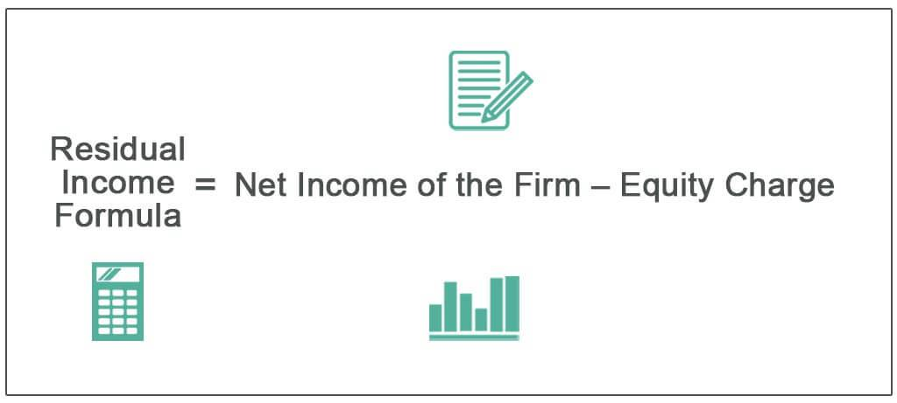

## Table of Contents

## What is residual income?

Residual income is money you keep earning even after you've done the initial work. It's different from regular income, where you get paid only for the time you work. For example, if you write a book, you might keep getting money from sales long after you finished writing it. This kind of income can help you become financially free because it keeps coming in without you having to do more work.

There are many ways to earn residual income. Some people invest in real estate and earn rent from tenants. Others might invest in stocks that pay dividends. You can also create online courses or YouTube videos that generate ad revenue over time. The key is to set up a system where your initial effort continues to pay off, allowing you to earn money while you focus on other things or even while you sleep.

## How is residual income different from passive income?

Residual income and passive income are similar because they both mean you can earn money without working all the time. But there's a small difference. Residual income is money you earn again and again from something you did once, like writing a book or making a song. You get paid every time someone buys your book or listens to your song.

Passive income is a bit broader. It includes residual income, but it also covers other ways to earn money without daily work. For example, if you own a rental property, the rent you get is passive income. Or if you invest in stocks that pay dividends, that's passive income too. So, all residual income is passive income, but not all passive income is residual income.

## What are the main types of residual income?

Residual income comes in different forms, but they all share the same idea: you do some work once and then keep getting paid for it. One common type is royalties from creative works. If you write a book, make a song, or create a piece of art, you can earn money every time someone buys or uses your work. Another type is affiliate marketing, where you get paid a commission for promoting other people's products or services. You set up links or ads, and you earn money whenever someone buys through your link.

Another way to earn residual income is through investments. If you invest in a business or real estate, you can earn money from the profits or rent without working there every day. For example, if you own a rental property, you get paid rent each month. You might also invest in stocks that pay dividends, which are regular payments from the company to its shareholders. These investments can keep paying you even if you're not actively working on them.

Overall, the key to residual income is setting up a system where your initial effort or investment keeps earning money over time. Whether it's through creative works, affiliate marketing, or investments, the goal is to create a steady stream of income that doesn't require constant work. This can help you achieve financial freedom and have more time for other things you enjoy.

## Can you explain how royalties work as a form of residual income?

Royalties are payments you get when someone uses or buys your creative work, like a book, song, or piece of art. When you create something and someone else wants to use it, they have to pay you a fee. This fee is called a royalty. For example, if you write a book and a publisher wants to sell it, they'll pay you a small amount every time someone buys your book. The same goes for music; if someone plays your song on the radio or streams it online, you get a royalty payment.

The great thing about royalties is that they keep coming in as long as people are using your work. This means you can earn money over and over again from something you created just once. If your book becomes a bestseller or your song becomes a hit, you could earn a lot of money in royalties. It's a way to keep getting paid without having to create something new all the time. This makes royalties a powerful form of residual income, helping you earn money even when you're not actively working.

## How does rental income qualify as residual income?

Rental income is a type of residual income because you can earn money from your property without working on it every day. If you own a house or an apartment and rent it out to someone else, they pay you rent every month. Once you've set up the rental agreement and found a tenant, you don't have to do much more work to keep getting that money. The rent comes in regularly, even if you're not doing anything else to the property.

Of course, being a landlord does come with some responsibilities, like fixing things when they break or dealing with tenant issues. But these tasks don't happen every day, and you can often hire someone else to do them for you. So, even though there's some work involved, the main idea is that you get a steady stream of income from your property without having to put in daily effort. This makes rental income a good example of residual income.

## What role do investments play in generating residual income?

Investments can help you earn residual income by giving you money without you having to work all the time. When you invest in things like stocks, bonds, or real estate, you can get money from them regularly. For example, if you buy stocks that pay dividends, you get a little bit of money from the company every few months just for owning those stocks. This money keeps coming in as long as you own the stocks, so you don't have to do anything else to earn it.

Another way investments can give you residual income is through real estate. If you buy a house or an apartment and rent it out, the rent money you get every month is a form of residual income. Once you've set up the rental agreement and found a tenant, you don't need to work every day to keep getting that rent money. Even though you might need to fix things sometimes or deal with tenant issues, the main idea is that you get a steady stream of money without having to work all the time. This makes investments a powerful way to create residual income and help you achieve financial freedom.

## How can someone start earning residual income through a business?

Starting a business that earns residual income can be a great way to make money without working all the time. One way to do this is by creating a product or service that people keep buying over and over. For example, you could start a subscription-based business where people pay you every month for something they need, like a membership to a fitness program or a software tool. Once you've set up the business and people start subscribing, you'll get money every month without having to do much more work. The key is to create something that people find valuable enough to keep paying for.

Another way to earn residual income through a business is by setting up a system where your business runs on its own. This might mean hiring people to do the day-to-day work while you focus on growing the business. For example, if you start a store that sells products online, you can use automation tools to handle orders and shipping. Once everything is set up, the business can keep making money even when you're not working. The goal is to build a business that can run smoothly without you having to be there all the time, allowing you to earn money from your initial effort and investment.

## What are the tax implications of different types of residual income?

The tax implications of residual income can vary depending on the type of income you're earning. For example, if you earn royalties from writing a book or creating music, this income is usually taxed as ordinary income. This means you'll pay taxes on it at your regular income tax rate. However, you might be able to deduct some expenses related to creating your work, like the cost of materials or travel, which can lower your taxable income.

Rental income from real estate is another common form of residual income, and it's also taxed as ordinary income. But you can deduct many expenses related to your rental property, such as mortgage interest, property taxes, and maintenance costs. These deductions can reduce the amount of rental income you have to pay taxes on. If you own a rental property for a long time, you might also benefit from depreciation, which allows you to spread out the cost of the property over several years and lower your taxable income even more.

Dividend income from stocks is another type of residual income, and it's usually taxed at a lower rate than ordinary income. This is called the qualified dividend tax rate, which can be 0%, 15%, or 20%, depending on your overall income. However, not all dividends qualify for this lower rate, so it's important to check if your dividends are considered "qualified." Also, if you sell stocks for a profit, you'll have to pay capital gains tax, which can also be lower than your regular income tax rate if you hold the stocks for more than a year.

## How can residual income be calculated for personal financial planning?

Residual income for personal financial planning can be calculated by figuring out how much money you have left after paying for all your necessary expenses. First, you need to add up all your regular income, like your salary or wages. Then, subtract all your monthly expenses, such as rent, utilities, food, and any other bills you have to pay. The money you have left over is your residual income. This is the amount you can use for saving, investing, or spending on things you enjoy.

For example, if you earn $3,000 a month and your expenses total $2,500, your residual income would be $500. This $500 can be used to build up your savings, invest in stocks or real estate, or even start a side business that could generate more residual income in the future. By keeping track of your residual income, you can make better financial decisions and work towards achieving financial freedom.

## What are some strategies to maximize residual income from intellectual property?

To maximize residual income from intellectual property, it's important to make sure your work reaches as many people as possible. One way to do this is by using different platforms to share your work. For example, if you write a book, you can sell it on websites like Amazon, but you can also offer it as an e-book or an audiobook to reach more readers. If you create music, you can put your songs on streaming services like Spotify and Apple Music, as well as sell them on platforms like Bandcamp. The more places your work is available, the more chances you have to earn royalties from it.

Another strategy is to keep promoting your work even after it's released. You can use social media to talk about your book, song, or artwork and share updates with your followers. This can help keep your work in people's minds and encourage them to buy it. You might also consider licensing your work to other companies or organizations. For example, if you create a popular character, you could license it for use in movies, games, or merchandise. This can open up new ways to earn money from your intellectual property and increase your residual income over time.

## How do economic conditions affect the stability of residual income sources?

Economic conditions can have a big impact on how stable your residual income sources are. When the economy is doing well, people have more money to spend, which can mean more sales for your books, music, or other creative works. They might also be more likely to rent your property or buy stocks that pay dividends. But if the economy takes a downturn, people might cut back on spending, which can lower your royalties or rental income. During tough economic times, companies might also reduce or stop paying dividends, which would affect your income from investments.

It's important to think about how different types of residual income might be affected by economic changes. For example, royalties from a popular book or song might be more stable because people often still want entertainment even during hard times. On the other hand, rental income can be less stable if tenants lose their jobs and can't pay rent. Investing in a mix of different types of residual income sources can help you weather economic ups and downs better. By spreading your income across books, music, real estate, and stocks, you can reduce the risk that one bad economic period will wipe out all your income.

## What advanced financial models are used to predict and optimize residual income streams?

To predict and optimize residual income streams, people use advanced financial models like discounted cash flow (DCF) analysis. This model helps you figure out how much money you'll get in the future from things like royalties, rental income, or dividends. It does this by taking the money you expect to earn and adjusting it for the time value of money. This means that money you get today is worth more than the same amount of money you get in the future because you can invest it now and earn more. By using DCF, you can see if your current investments or projects will be worth it in the long run and make better choices about where to put your money.

Another model that's helpful is the net present value (NPV) model. This model is similar to DCF but focuses more on comparing different investment options. It calculates the difference between the present value of cash inflows and outflows over time. If the NPV is positive, it means the investment will likely make you more money than it costs, which is good for building residual income. By using NPV, you can decide which projects or investments will give you the best return and help you plan your financial future. Both DCF and NPV help you understand and improve your residual income by giving you a clear picture of what your money will be worth over time.

## References & Further Reading

[1]: Bergstra, J., Bardenet, R., Bengio, Y., & Kégl, B. (2011). ["Algorithms for Hyper-Parameter Optimization."](https://papers.nips.cc/paper/4443-algorithms-for-hyper-parameter-optimization) Advances in Neural Information Processing Systems 24.

[2]: ["Advances in Financial Machine Learning"](https://www.amazon.com/Advances-Financial-Machine-Learning-Marcos/dp/1119482089) by Marcos Lopez de Prado

[3]: ["Evidence-Based Technical Analysis: Applying the Scientific Method and Statistical Inference to Trading Signals"](https://www.amazon.com/Evidence-Based-Technical-Analysis-Scientific-Statistical/dp/0470008741) by David Aronson

[4]: ["Machine Learning for Algorithmic Trading"](https://github.com/stefan-jansen/machine-learning-for-trading) by Stefan Jansen

[5]: ["Quantitative Trading: How to Build Your Own Algorithmic Trading Business"](https://www.amazon.com/Quantitative-Trading-Build-Algorithmic-Business/dp/1119800064) by Ernest P. Chan