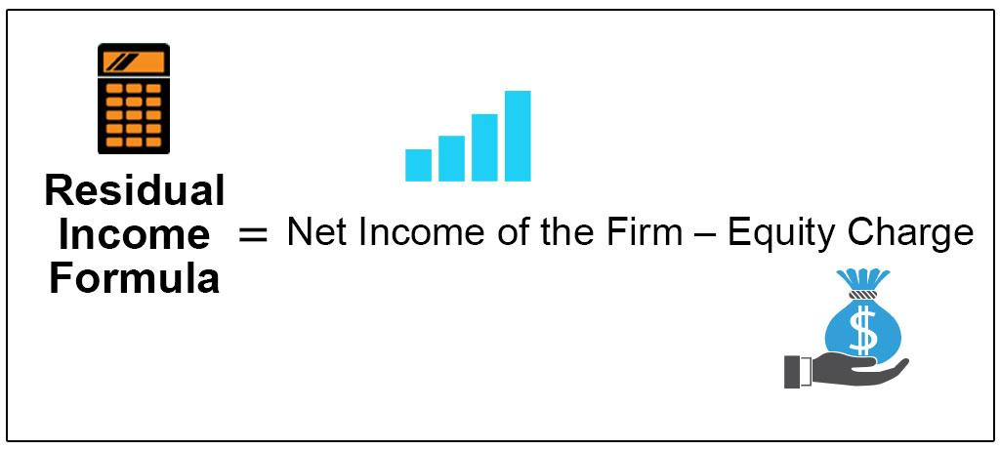

Residual income plays a crucial role at the intersection of company valuation, financial analysis, and algorithmic trading, serving as an essential tool for evaluating economic profitability. As a measure of profitability calculated after accounting for the cost of capital, residual income helps investors determine whether a company generates returns exceeding its capital costs. This capability positions residual income as an indispensable factor in assessing a company's financial health, beyond what traditional accounting metrics like net income can provide.

Understanding residual income's importance lies in its ability to capture the economic profits generated by a company. Unlike other metrics which might ignore the cost of equity, residual income ensures an accurate assessment by incorporating this critical cost. The formula for calculating residual income is:

$$
\text{Residual Income} = \text{Net Income} - (\text{Equity Charge})
$$

where:

$$
\text{Equity Charge} = \text{Equity Capital} \times \text{Cost of Equity}
$$

Companies that report positive residual income are effectively creating value, and those with negative residual income diminish shareholder wealth. In this way, investors and analysts can make informed decisions using residual income evaluations.

The fusion of financial analysis with modern algorithmic trading strategies further elevates the significance of residual income. Algorithmic trading involves using mathematical models and computational algorithms to make trading decisions. By integrating residual income metrics into these algorithms, traders can enhance their strategies, making more informed and data-driven decisions. For instance, algorithms can be programmed to prioritize investments in companies with consistently positive residual income, aligning trading activities with value creation.

This intersection of residual income and algorithmic trading offers significant prospects in the modern financial landscape. As technology continues to advance and financial markets grow in complexity, the use of residual income in automated trading systems presents opportunities for more precise decision-making. Moreover, this integration aligns with the broader shift towards data-driven approaches, leveraging financial models to optimize trading and investment outcomes.

In summary, residual income serves as a vital instrument for gauging economic profitability in company valuation, consolidating its position as a valuable asset in both financial analysis and [algorithmic trading](/wiki/algorithmic-trading). As financial landscapes evolve, the relevance and adaptability of residual income models make them indispensable tools for investors and traders aiming to navigate the complexities of modern markets.

## Table of Contents

## Understanding Residual Income in the Context of Company Valuation

Residual income is a crucial concept in financial analysis, widely used to evaluate the economic profitability and intrinsic value of a company. It represents the net income that exceeds the minimum required return on a company’s equity, thereby offering a deeper insight into a company's financial performance beyond conventional metrics. The significance of residual income lies in its ability to account for the cost of capital, which is often overlooked in traditional accounting measures like net income or earnings before interest and taxes (EBIT).

To understand the role of residual income in company valuation, it's essential to recognize its components and calculation method. Residual income is calculated using the formula:

$$
\text{Residual Income} = \text{Net Income} - (\text{Equity Charge})
$$

where the equity charge is the product of the book value of equity and the cost of equity:

$$
\text{Equity Charge} = \text{Book Value of Equity} \times \text{Cost of Equity}
$$

This formula highlights two critical components: net income, which measures the company's profitability, and the equity charge, which emphasizes the cost of using shareholders' capital. By deducting the equity charge from net income, residual income accounts for the returns required by investors, thus providing a more comprehensive view of a company's performance.

The role of residual income in assessing company value is particularly powerful because it allows analysts to isolate value creation from merely accounting profits. Traditional metrics often overlook the opportunity cost of capital or misinterpret growth that does not yield economic value. Residual income, however, illuminates the true economic value added by pinpointing surplus profits that exceed capital costs. This enables more accurate valuation estimates, helping investors identify companies that genuinely generate shareholder value over time.

Residual income offers insights that transcend traditional accounting metrics by capturing the concept of economic profit, which is the value created after covering all costs, including capital costs. This makes residual income a dynamic tool in financial analysis, capable of identifying sustainable competitive advantages or potential weaknesses in a company.

Overall, residual income serves as a powerful metric for attributing value to companies, complementing other valuation techniques. It gives analysts a robust framework for assessing whether management actions are genuinely accretive to shareholder value, ultimately aiding investors in making informed decisions based on comprehensive financial analysis rather than surface-level financial statements.

## Residual Income Valuation Methods

The Residual Income Model (RIM) serves as an important tool for company valuation, offering insights into a firm's economic profitability that go beyond traditional metrics. At its core, the RIM calculates a company's value by considering both the book value of its equity and the present value of expected future residual incomes. Residual income itself is defined as the net income a firm generates after accounting for the cost of equity. This means it reflects the income remaining after compensating shareholders for their opportunity cost, calculated as the product of equity capital invested and the required return on equity.

Several variations of the Residual Income Model exist to suit different valuation needs, including the perpetual growth model and the two-stage residual income model. The perpetual growth model assumes a constant growth rate for residual income indefinitely, making it particularly useful for stable companies with predictable earnings. The formula for this model is:

$$
\text{Value} = \text{Book Value} + \frac{\text{Residual Income}}{r - g}
$$

where $r$ is the required return and $g$ is the growth rate of residual income.

The two-stage model, on the other hand, allows for a more complex assessment by dividing the projection period into two phases—an initial high-growth phase followed by a stable growth phase. This approach is particularly advantageous for companies expected to experience substantial growth initially, followed by stability in the long term.

The RIM distinguishes itself from other valuation techniques such as Discounted Cash Flow (DCF) and dividend discount models. While DCF focuses on the present value of expected future cash flows and requires comprehensive cash flow forecasting, RIM directly incorporates equity costs and focuses on profitability after accounting for these costs. Dividend discount models, which value a company based on the present value of expected future dividends, often fall short for firms not paying consistent dividends, whereas RIM remains applicable by considering overall profitability.

Residual income models offer particular benefits in scenarios where other methods may struggle. For example, they prove advantageous when evaluating firms with inconsistent or non-existent dividend payouts, as RIM considers internal profitability rather than external payouts. Moreover, RIM can be particularly beneficial in assessing firms with recent equity investments or those undergoing financial restructuring, as it accounts for the cost and usage of this capital directly.

Therefore, residual income models can offer significant advantages over traditional methods by providing insights into a company’s value and performance, especially in conditions where equity cost and profitability are pivotal factors.

## Computing Residual Income for Financial Analysis

Residual income is a financial metric used to assess the profitability of a company after accounting for the cost of its equity. Calculation of residual income involves several key components that must be understood to accurately derive and interpret the metric.

### Steps to Compute Residual Income

1. **Determine Net Operating Profit After Taxes (NOPAT):**
   NOPAT is calculated by adjusting the company's operating income (EBIT) for taxes. It represents the profitability of a company's core business activities without the impact of capital structure.
$$
   \text{NOPAT} = \text{EBIT} \times (1 - \text{Tax Rate})

$$

2. **Calculate the Equity Charge:**
   The equity charge represents the cost of capital required by equity investors. It is calculated by multiplying the company's equity capital by the cost of equity.
$$
   \text{Equity Charge} = \text{Equity Capital} \times \text{Cost of Equity}

$$

   - **Equity Capital** can be determined using the book value of equity or market value, depending on the approach.
   - **Cost of Equity** can be derived using models such as the Capital Asset Pricing Model (CAPM), which requires the risk-free rate, the equity beta, and the expected market return.

3. **Compute Residual Income:**
   Residual income is the net profit that remains after deducting the equity charge from NOPAT. This offers insight into the economic profitability of the firm.
$$
   \text{Residual Income} = \text{NOPAT} - \text{Equity Charge}

$$

### Importance of the Equity Charge and Cost of Equity
The equity charge is crucial because it reflects the minimum return required by investors to compensate for the risk they undertake. The cost of equity is essential in computing the equity charge as it accounts for the systematic risk of investing in the equity market. A thorough understanding of these components ensures a more accurate evaluation of whether the firm is generating excess returns over its cost of equity capital.

### Example of Residual Income Calculation

Suppose a company reports an EBIT of $500,000, with a tax rate of 30%, an equity capital of $2,000,000, and a cost of equity of 8%.

1. **Calculate NOPAT:**
$$
   \text{NOPAT} = 500,000 \times (1 - 0.30) = 350,000

$$

2. **Calculate the Equity Charge:**
$$
   \text{Equity Charge} = 2,000,000 \times 0.08 = 160,000

$$

3. **Calculate Residual Income:**
$$
   \text{Residual Income} = 350,000 - 160,000 = 190,000

$$

In this example, the company has a residual income of $190,000, which indicates that it is generating an excess return after covering the cost of equity. This measure is particularly valuable for assessing the firm's ability to create shareholder value beyond the necessary capital requirements.

### Interpretation
A positive residual income suggests that the company is efficiently generating value for its shareholders, above the expected returns (equity charge) dictated by its cost of equity. Conversely, a negative residual income would signal that the firm is not meeting the minimum return expectations of its equity investors, potentially affecting its valuation and attractiveness to investors.

Incorporating residual income into financial analysis provides a nuanced understanding of a company's financial health, complementing traditional financial metrics, and offering deep insights into its long-term economic profitability.

## Role of Residual Income in Algorithmic Trading Strategies

Residual income metrics have become an essential tool in algorithmic trading strategies. By providing insights into a company's economic profitability, residual income can inform and optimize trading decisions. Algorithmic trading, which relies on predefined rules and quantitative models to execute trades rapidly, benefits from the integration of residual income analysis in several ways.

**Incorporating Residual Income in Trading Algorithms**

Residual income analysis aids in establishing the intrinsic value of a company by accounting for the cost of equity. This information can be integrated into algorithmic trading systems, helping to identify mispriced stocks. The basic formula for residual income is:

$$
\text{Residual Income} = \text{Net Income} - (\text{Equity Capital} \times \text{Cost of Equity})
$$

Using residual income, an algorithm can automatically assess whether a stock is undervalued or overvalued relative to its intrinsic value. If an algorithm detects that a company's residual income is consistently high, this may suggest that the stock is undervalued, prompting a buy signal. Conversely, consistently low residual income could trigger a sell signal.

**Advantages of Financial Models in Automated Trading**

The integration of financial models such as residual income in automated trading offers several substantial advantages. Firstly, algorithms based on residual income can continuously monitor and react to financial data faster than human traders. This allows for exploiting short-term market inefficiencies that would otherwise be inaccessible. Moreover, these models inherently bring a level of objectivity and consistency to trading decisions, diminishing the biases that might influence human judgment.

By reducing the human element, the risk of emotional trading is minimized, leading to potentially more stable returns over time. Financial models also provide a systematic approach to risk management; for example, risk-adjusted performance metrics can be employed to maintain the balance between seeking returns and controlling risk exposure.

**Case Studies: Algorithmic Trading with Residual Income**

One notable example is the use of residual income metrics in hedge funds that focus on fundamental-based algorithmic trading strategies. These funds employ sophisticated algorithms that analyze vast datasets to derive residual income, applying it to forecast future stock performance. By adjusting their portfolios based on these insights, such funds have successfully achieved returns above market averages.

Moreover, high-frequency trading firms have started integrating residual income indicators to enhance their algorithms. By incorporating these metrics, firms can better anticipate shifts in stock valuations, allowing them to adjust positions rapidly in response to changing financial conditions.

In summary, residual income metrics play a pivotal role in algorithmic trading, offering valuable insights into a company's valuation. By leveraging this information, trading algorithms can make more informed and timely decisions, thereby enhancing their effectiveness and profitability in modern financial markets.

## Limitations and Challenges

Residual income models, while valuable, come with inherent limitations in financial analysis. One significant limitation is the reliance on forward-looking estimates. Forecasting future company performance requires assumptions about growth rates, cost of equity, and economic conditions—variables fraught with uncertainty. Such assumptions can substantially impact residual income calculations, leading to potential misvaluations. For instance, in the Residual Income Model (RIM), future net income is often predicted based on historical data and expected economic outlooks, which might not materialize as anticipated.

Data interpretation poses another challenge. Residual income focuses on economic profitability by considering the cost of equity, but determining an appropriate cost of equity can be complex. Variations in the risk-free rate, market risk premium, and beta coefficients impact this measure, potentially leading to inconsistent interpretation of results across different analysis periods or between analysts. Moreover, diverse accounting practices may affect the reported figures used in these models, such as net income and book equity.

The increasing reliance on algorithmic trading models also presents risks. Algorithms incorporating residual income metrics can optimize trading strategies by assessing stocks' economic profitability. However, these models depend heavily on the quality of input data and underlying assumptions. Over-reliance on such systems can lead to significant financial losses if the algorithms misinterpret market signals or if the boundaries of historical data are surpassed due to unprecedented economic events.

Mitigating these limitations and challenges involves a multi-faceted approach. It is crucial to maintain a robust due diligence process that regularly verifies and updates the assumptions underlying financial forecasts. Utilizing various scenarios and sensitivity analyses can help assess how changes in critical assumptions impact residual income outputs, offering a more comprehensive understanding of potential outcomes.

In terms of algorithmic trading, integrating qualitative judgments alongside quantitative models strengthens the decision-making process. Regularly reviewing the performance of trading algorithms and incorporating feedback mechanisms can enhance their resilience. Moreover, diversifying trading strategies to prevent over-reliance on any single model helps mitigate risks associated with algorithmic trading based on residual income metrics.

While residual income models provide valuable insights, awareness and management of their limitations are crucial for accuracy and reliability in financial analysis and algorithmic trading.

## Conclusion

Residual income offers a unique perspective on company valuation and trading, providing insights beyond traditional financial metrics. By focusing on the economic profitability of an enterprise, residual income helps determine whether a business exceeds the cost of capital, offering a clear picture of potential financial health. This approach not only captures value creation but also aligns company performance with shareholder wealth.

Incorporating residual income into algorithmic trading further emphasizes its potential. Algorithmic systems can analyze residual income data to assess stock performance, allowing traders to design strategies based on underlying economic fundamentals. The dynamic nature of algorithmic trading benefits greatly from integrating financial analysis, as it provides a robust framework in identifying undervalued or overvalued securities.

The adaptability of residual income models is evident in their ability to blend traditional financial analysis with modern algorithmic strategies. This combination enhances decision-making processes, offering a holistic view of investment opportunities. Investors and analysts are encouraged to further explore residual income models across diversified strategies, as they offer a reliable tool for identifying growth potential within complex financial landscapes. Through continuous innovation and application, residual income can significantly contribute to more informed and strategic investment decisions.

## References & Further Reading

[1]: ["Valuation: Measuring and Managing the Value of Companies"](https://www.amazon.com/Valuation-Measuring-Managing-Companies-Finance/dp/1119610885) by McKinsey & Company Inc., Tim Koller, Marc Goedhart, and David Wessels

[2]: Residual Income and EVA by Young, S. David, and Stephen F. O'Byrne

[3]: ["Equity Valuation Using Multiples: An Empirical Investigation"](https://link.springer.com/book/10.1007/978-3-8350-9531-1) by Pablo Fernandez, Finance India, 2001.

[4]: ["Corporate Valuation and Value Creation"](https://books.google.com/books/about/CORPORATE_VALUATION_AND_VALUE_CREATION.html?id=RkOstJZK9SkC) by Pierre Vernimmen, Pascal Quiry, Maurizio Dallochio, Yann Le Fur, and Antonio Salvi

[5]: ["Residual Income as a Performance Measure: A Critique"](https://biz.libretexts.org/Bookshelves/Accounting/Managerial_Accounting/11%3A_How_Do_Managers_Evaluate_Performance_in_Decentralized_Organizations/11.06%3A_Using_Residual_Income_(RI)_to_Evaluate_Performance) by Stewart, Gwyneth, Accounting Perspectives, 1997.

[6]: ["Algorithmic Trading: Winning Strategies and Their Rationale"](https://www.wiley.com/en-us/Algorithmic+Trading%3A+Winning+Strategies+and+Their+Rationale-p-9781118460146) by Ernest P. Chan

[7]: ["Artificial Intelligence in Financial Markets: Cutting Edge Applications for Risk Management, Portfolio Optimization and Economics"](https://link.springer.com/content/pdf/10.1057/978-1-137-48880-0.pdf) edited by Christian L. Dunis, Peter W. Middleton, Andreas Karathanasopolous, and Daniel Ashton