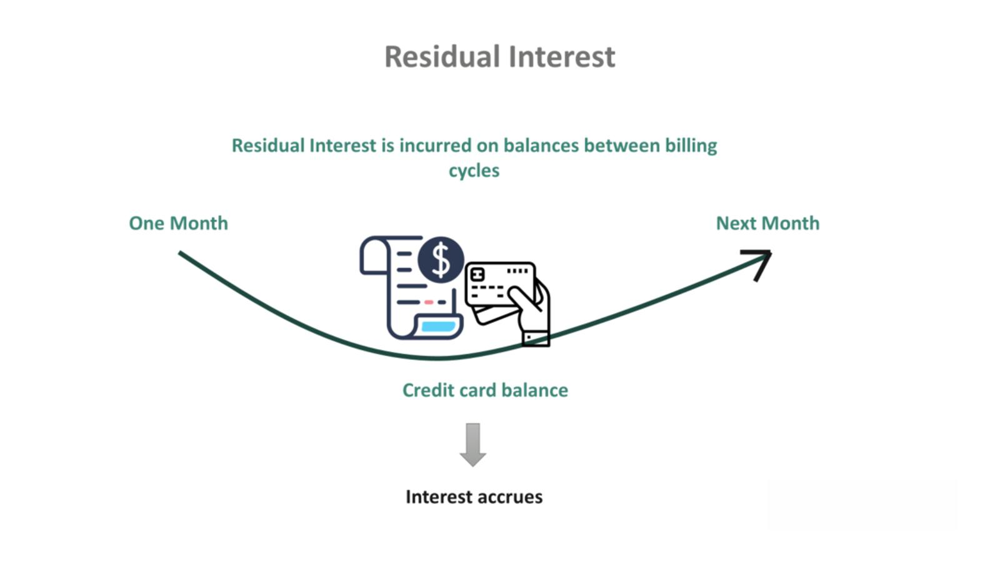

The world of finance is continuously evolving, introducing complex instruments that present both opportunities and risks to investors. One such instrument in the municipal bond market is the Residual Interest Bond (RIB). These bonds are innovative securities, allowing investors to potentially enhance yields while also presenting certain challenges in terms of risk and complexity. This article provides a thorough examination of RIBs, highlighting their purpose and how they have become an integral part of algorithmic trading.

Residual Interest Bonds distinguish themselves within the municipal bond market by their unique structure, which involves splitting the income stream of a municipal bond into two distinct components. Through this mechanism, they support the objectives of both institutional investors seeking higher yields and portfolio managers looking to manage bond maturity strategically. Understanding the mechanics of RIBs and their impact on portfolios allows investors to make informed decisions, optimizing their investment strategies amidst the volatile landscape of municipal bonds.



This article will explore the groundbreaking role of RIBs in enhancing yields and managing the maturity of investment portfolios. It will also consider how these bonds fit into the broader context of financial innovation and algorithmic trading strategies. Whether you are a seasoned institutional investor or simply curious about financial advancements, this piece provides insights into the intricate world of Residual Interest Bonds, equipping you with the knowledge to navigate this sophisticated investment space effectively.

## Table of Contents

## What Are Residual Interest Bonds?

Residual Interest Bonds, commonly known as RIBs, are a distinctive category of financial securities that derive their structure from dividing the income streams of a municipal bond. This segmentation creates two distinct classes of debt instruments: the residual inverse floating-rate bond and the primary direct floating-rate bond.

The residual inverse floating-rate bond is structured to have an interest rate that inversely correlates with a specified benchmark interest rate. Typically, if the benchmark rate decreases, the interest on the inverse floater increases, and conversely, it decreases when the benchmark rises. This feature provides a strategic tool for investors aiming to capitalize on interest rate fluctuations, albeit with an elevated risk profile.

Conversely, the primary direct floating-rate bond is tied more directly to interest rate indices such as the London Interbank Offered Rate (LIBOR). This portion generally offers a more stable and predictable income stream linked to prevailing short-term interest rates.

RIBs, through their bifurcation, allow municipal bond funds to augment their current yields. By isolating different risk-return spectra within the same overarching asset, fund managers can attract a broader range of investors seeking diverse return profiles.

Due to their intrinsic complexity and heightened [volatility](/wiki/volatility-trading-strategies), RIBs are primarily held by financial institutions that have the capability and acumen to manage and mitigate associated risks. These entities possess the technological infrastructure and market insight necessary for navigating the intricacies of such advanced financial instruments. As such, RIBs represent a tailored investment option that can strategically enhance yield for those equipped to manage their distinctive financial dynamics.

## Purpose and Functionality of RIBs

Residual Interest Bonds (RIBs) are designed primarily to enhance the yield available to investors by offering a higher potential income compared to traditional fixed-rate municipal bonds. This is achieved through a unique structural mechanism that divides the bond's income stream. The functionality of RIBs revolves around their inverse relationship with a reference [interest rate](/wiki/interest-rate-trading-strategies), such as the London Interbank Offered Rate (LIBOR).

The structure of RIBs involves segmenting the cash flows from an original municipal bond into two distinct securities: a residual inverse floating-rate bond and a primary direct floating-rate bond. By doing so, the investor holding the residual interest bond is subject to variable income that inversely correlates with changes in the underlying reference rate. As the reference interest rate decreases, the yield on the residual bond increases, thus potentially offering higher returns in falling interest rate environments.

For portfolio managers, RIBs present an effective tool for yield enhancement and maturity control within a bond portfolio. By incorporating RIBs, managers can actively adjust the duration and interest rate sensitivity of the portfolio. This is particularly useful in managing the portfolio’s average maturity against fluctuations in market interest rates and economic cycles. The flexibility in managing maturity profiles also allows for strategic positioning based on anticipated interest rate movements.

In practical terms, the revenue obtained from the original municipal bond is split such that one portion provides a stable, fixed coupon to the direct floating-rate bond, while the residual interest bond receives the remaining income. This distribution mechanism grants the RIB investor a potential for higher yields, albeit with an associated increase in risk and volatility. The segmentation of income streams requires careful consideration and management, particularly in understanding how shifts in interest rates may affect the residual returns. 

Thus, RIBs not only enhance yields but also offer sophisticated options for managing portfolio dynamics, enabling more adaptable investment strategies that align with investor risk preferences and market conditions.

## Types of Municipal Bonds

Municipal bonds serve as financial instruments issued by government entities to raise funds for various public projects. These bonds are an essential component of public finance, enabling the construction and maintenance of infrastructure such as schools, highways, and hospitals. The majority of municipal bonds can be classified into two primary categories: General Obligation Bonds (GOs) and Revenue Bonds.

General Obligation Bonds (GOs) are distinguished by their backing, which comes from the full faith and credit of the issuing municipality. This means that the issuer commits to using its taxing power to ensure the repayment of bondholders. The security of these bonds is generally considered high because the issuer pledges to utilize governmental resources such as property taxes, sales taxes, or other tax revenues to meet debt obligations. The promise of the issuer to levy taxes if necessary provides investors with a significant level of assurance regarding the bond's creditworthiness.

In contrast, Revenue Bonds are supported by the income generated from specific projects or sources. Unlike GOs, they do not rely on taxation but instead are secured by the revenue produced from funded entities, such as toll roads, airports, or utilities. The revenue stream is earmarked for bondholders, providing a direct line of repayment from the operational success of the project financed. As a result, the credit risk associated with revenue bonds can be higher than that of GOs, as they depend on the financial performance and revenue-generating ability of the project rather than the issuer’s broader financial resources.

These two forms of municipal bonds play critical roles in public financing strategies, offering varied risk profiles and benefits to investors. Government entities choose between issuing GOs or Revenue Bonds based on the nature of the project, expected revenue generation, and the fiscal landscape of the issuing body. Investors, in turn, assess these factors alongside macroeconomic indicators to make informed investment decisions.

## Algorithmic Trading and RIBs

Algorithmic trading has significantly transformed the financial markets, and its application in Residual Interest Bonds (RIBs) is a testament to its versatility and impact. Utilized by institutional investors, [algorithmic trading](/wiki/algorithmic-trading) leverages complex mathematical models and high-speed data processing to execute trading strategies that were once infeasible manually. This technological advancement allows for the optimization of yield generation and the hedging of portfolios that include RIBs.

The architecture of RIBs, which consists of an inverse relationship to interest rates, makes them particularly amenable to algorithmic trading techniques. Algorithms can be programmed to capitalize on this inverse relationship by buying or selling the bonds based on predicted movements in the reference interest rates such as the Libor or Fed funds rate. Such algorithms might incorporate predictive analytical tools, [machine learning](/wiki/machine-learning) models for risk assessment, and statistical [arbitrage](/wiki/arbitrage) strategies to make data-driven decisions quickly and effectively.

For example, consider an algorithm designed to manage a portfolio containing RIBs. This algorithm might include a predictive model for interest rate fluctuations using historical data and other economic indicators. Leveraging Python, portfolio managers could implement the algorithm as follows:

```python
import numpy as np
from sklearn.linear_model import LinearRegression

# Sample data for interest rates and bond yield responses
interest_rates = np.array([[0.01], [0.015], [0.02], [0.025], [0.03]])
bond_yields = np.array([0.03, 0.027, 0.025, 0.022, 0.02])

# Create linear regression model
model = LinearRegression()
model.fit(interest_rates, bond_yields)

# Predict bond yield response to a new interest rate (e.g., 0.021)
new_rate = np.array([[0.021]])
predicted_yield = model.predict(new_rate)

print(f"Predicted Bond Yield for interest rate {new_rate.item()}: {predicted_yield.item()}")
```

This example illustrates how an algorithm can help predict the bond yield based on changes in interest rates, assisting portfolio managers to adjust their holdings in RIBs effectively. Moreover, the predictive power of algorithms can be further enhanced by integrating machine learning techniques such as [reinforcement learning](/wiki/reinforcement-learning), which adapts over time to changing market conditions, thereby continually optimizing trading strategies.

Advanced analytics are crucial for managing the complex risk and return profiles of RIBs. Since these bonds can exhibit significant volatility due to fluctuations in interest rates, algorithmic strategies often include hedging components to mitigate potential losses. Dynamic hedging models might analyze thousands of scenarios quickly, providing real-time feedback to rebalance portfolios appropriately.

In conclusion, the sophistication of RIBs aligns well with the capabilities provided by algorithmic trading. By leveraging advanced data analytics and machine learning techniques, financial institutions can effectively manage the intricacies associated with RIB trading, thus maximizing yields while controlling risks.

References:
- [Sloan, L., & Sloan, C. (2015). Quantitative Finance with Machine Learning. CRC Press.]
- [Hull, J. C. (2018). Options, Futures, and Other Derivatives. Pearson Education.]

## Risks and Considerations

Residual Interest Bonds (RIBs) are financial instruments known for offering high yield potential. However, these benefits come with significant risks, particularly concerning interest rates and [liquidity](/wiki/liquidity-risk-premium). It is crucial for investors to recognize and manage these risks effectively.

Interest rate risk is a primary consideration for RIBs. RIBs exhibit an inverse relationship with reference interest rates such as the London Interbank Offered Rate (LIBOR). As interest rates rise, the value of RIBs tends to decrease. This inverse correlation is intrinsically linked to the structure of RIBs, where the residual inverse floating-rate component bears the brunt of interest rate fluctuations. This exposure can significantly affect both the yield and market value of these bonds. Therefore, changes in interest rates require continuous monitoring to mitigate adverse effects on investment returns.

Liquidity risk is another concern for RIB investors. Given their sophisticated nature, RIBs may not be as easily traded as more conventional fixed-income securities. The complexity and niche market for RIBs mean they might not have as many active participants, leading to challenges in executing buy or sell orders without substantial price concessions. This can limit an investor's ability to react swiftly to market changes or liquidate holdings without incurring losses.

Investors must also possess a comprehensive understanding of the complex mechanisms underlying RIBs. This complexity arises from the bond segmentation into floating-rate and inverse floating-rate components, each reacting differently to market conditions. Furthermore, potential market scenarios can have varied impacts on RIBs, necessitating a robust grasp of potential outcomes and strategic adjustments to maintain desired risk-return profiles.

To illustrate these concepts, consider a hypothetical scenario where an investor holds a RIB tied to a municipal bond with a primary floating-rate segment linked to LIBOR. A sudden interest rate hike could lead to a decline in the bond's price due to the inverse relationship between rate changes and RIB value. Here's a simple Python function to simulate the effect of interest rate changes on the price of a RIB:

```python
def calculate_RIB_price(initial_price, rate_change, sensitivity):
    """Calculate the new price of a RIB given an interest rate change."""
    return initial_price * (1 - sensitivity * rate_change)

# Example usage
initial_price = 1000  # Initial RIB price in monetary units
rate_change = 0.02    # 2% interest rate increase
sensitivity = 1.5     # Sensitivity of the RIB to interest rate changes

new_price = calculate_RIB_price(initial_price, rate_change, sensitivity)
print(f"The new price of the RIB is: {new_price}")
```

This simple model shows that for a RIB with an initial price of 1000 units and a sensitivity of 1.5, a 2% rise in interest rates would decrease its price. Such calculations underscore the importance of understanding both the quantitative and qualitative aspects of risk management in RIB investments.

## Conclusion

Residual Interest Bonds (RIBs) offer distinctive advantages by enhancing yields in the municipal bond market. As a specialized financial instrument, RIBs provide a pathway to increased returns, particularly for sophisticated investors and institutional entities. Their structure allows investors to engage with high returns, yet this is invariably tied to higher risks, notably interest rate and liquidity risks. These attributes necessitate a deep understanding and precise management of the product to effectively harness its benefits.

The integration of algorithmic trading practices with RIBs can further amplify the yield potential while addressing inherent volatilities. Through advanced computational algorithms, investors can dynamically adjust their portfolios, optimizing the balance between risks and returns. Algorithmic strategies can offer real-time data analysis and predictive modeling, mitigating the complexities embedded in RIB investment by offering insights into market trends and investment performance.

It is paramount for financial institutions to grasp the complexities of RIBs, as this understanding is crucial to exploiting high-risk, high-reward opportunities. The sophistication of these instruments means they require a level of expertise, along with robust risk management frameworks, to successfully incorporate them into a viable investment strategy. Financial institutions aiming to maximize returns in volatile markets must consider adopting algorithmic trading methodologies to leverage the full potential of Residual Interest Bonds.

## References & Further Reading

[1]: ["The Handbook of Municipal Bonds"](https://www.amazon.com/Handbook-Municipal-Bonds-Sylvan-Feldstein/dp/0470108754) edited by Sylvan G. Feldstein, Frank J. Fabozzi

[2]: ["Fixed Income Securities: Tools for Today's Markets"](https://www.amazon.com/Fixed-Income-Securities-Markets-Finance/dp/1119835550) by Bruce Tuckman, Angel Serrat

[3]: ["Algorithmic Trading: Winning Strategies and Their Rationale"](https://books.google.com/books/about/Algorithmic_Trading.html?id=WAlFDwAAQBAJ) by Ernest P. Chan

[4]: ["Handbook of Fixed-Income Securities"](https://www.amazon.com/Handbook-Fixed-Income-Securities-Ninth/dp/1260473899) by Frank J. Fabozzi

[5]: ["Understanding Options Markets"](https://www.investopedia.com/options-basics-tutorial-4583012) by Colin A. Bennett