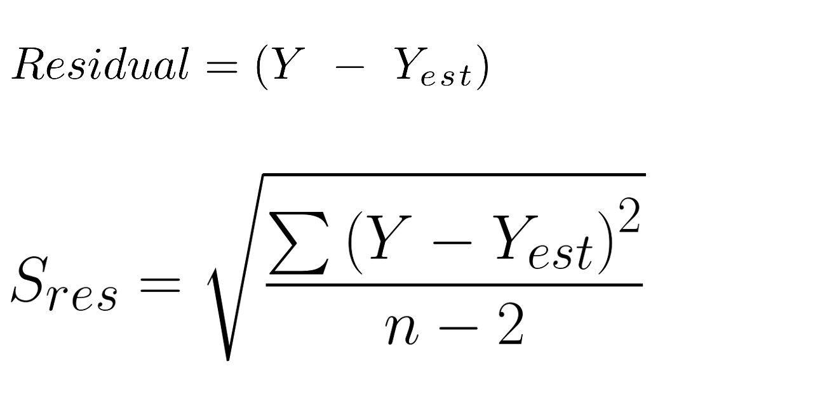

This article explores the intricate statistical concepts relevant to algorithmic trading, specifically focusing on the role of residual standard deviation in the understanding of financial models. Residual standard deviation serves as a key metric in finance, especially within regression analysis, for determining how well a model predicts outcomes. It effectively measures the dispersion of residual error terms in a regression model, providing insights into the accuracy and reliability of financial predictions.

Algorithmic trading relies heavily on accurate financial models to predict market movements and inform trading decisions. Hence, understanding the statistical formulas related to algorithmic trading, such as those involving standard deviation, is crucial. These formulas help in evaluating model performance and managing risk effectively. Standard deviation, a measure of data variability, is paramount in assessing model quality, affecting decisions around investment strategies and risk assessment.



The importance of residual standard deviation cannot be overstated, as it allows traders and analysts to refine models by understanding the extent of prediction errors. Lower residual standard deviations imply better-fit models with predictions aligning closely with actual data, enhancing confidence in trading algorithms. By leveraging this metric, traders can fine-tune their predictive models, optimizing them for greater accuracy and effectiveness in real-time market scenarios.

This article will illustrate the practical applications of these statistical concepts through examples and detailed analysis within trading contexts, demonstrating how residual standard deviation and related statistical measures can guide traders in developing robust, reliable algorithmic trading models.

## Table of Contents

## Understanding Residual Standard Deviation

Residual standard deviation is a crucial metric used to quantify the dispersion of residuals, or errors, from a statistical model. It is a key tool in regression analysis, which is widely employed in financial modeling to determine how well a model predicts outcomes. The residuals are the differences between observed and estimated values of the dependent variable. This measure provides insight into the accuracy and reliability of a regression model, as it indicates the extent to which observed data points deviate from the estimated regression line.

In mathematical terms, residual standard deviation is denoted as $S_{\text{res}}$ and is calculated using the formula:

$$
S_{\text{res}} = \sqrt{\frac{\sum (Y - \hat{Y})^2}{n - 2}}
$$

where:
- $Y$ represents the actual observed values,
- $\hat{Y}$ denotes the estimated values from the regression model,
- $n$ is the number of observations.

The numerator, $\sum (Y - \hat{Y})^2$, is the sum of the squared residuals, representing the total deviation of the observed values from the estimated values. The denominator, $n - 2$, accounts for the degrees of freedom in a linear regression model with two parameters: the slope and the intercept.

A lower residual standard deviation is indicative of a model whose predictions are closely aligned with actual data points, thereby enhancing the model's accuracy and reliability. This is particularly beneficial for traders who rely on robust predictive models to inform their decision-making processes in [algorithmic trading](/wiki/algorithmic-trading). By reducing the residual standard deviation, traders can achieve a model fit that better captures the underlying data patterns, which is essential for minimizing prediction errors and improving trading outcomes.

For practical implementation and deeper analysis, Python can be used to compute residual standard deviation. For instance:

```python
import numpy as np

# Observed and estimated values
Y = np.array([10, 15, 14, 10, 16])
Y_est = np.array([12, 14, 13, 11, 15])

# Degrees of freedom for simple linear regression (n - 2)
n = len(Y)
degrees_of_freedom = n - 2

# Compute residual standard deviation
squared_residuals = np.sum((Y - Y_est) ** 2)
S_res = np.sqrt(squared_residuals / degrees_of_freedom)

S_res
```

This Python code snippet calculates the residual standard deviation, providing traders and analysts with a means to evaluate the goodness of fit and refine their predictive trading models. As improvements in model accuracy directly translate into better risk management and trading performance, understanding and applying residual standard deviation is instrumental in the development of effective financial strategies.

## The Formula Behind Residual Standard Deviation

The formula for residual standard deviation is a key element in understanding the variability of a model's predictions. It is expressed as:

$$
S_{\text{res}} = \sqrt{\frac{\Sigma(Y - Y_{\text{est}})^2}{n - 2}}
$$

where:
- $Y$ represents the observed values,
- $Y_{\text{est}}$ is the estimated or predicted values,
- $n$ denotes the number of observations.

Each component plays an essential role in the calculation and interpretation of residual standard deviation:

1. **Observed Value ($Y$)**: These are the actual data points collected from the financial markets, representing real-world outcomes or prices of securities.

2. **Estimated Value ($Y_{\text{est}}$)**: These are the predicted values derived from the regression model or statistical analysis used by traders. The difference between $Y$ and $Y_{\text{est}}$, known as the residuals, indicates the prediction error.

3. **Number of Observations ($n$)**: This refers to the total data points considered in the regression analysis. The expression $n - 2$ in the denominator accounts for the degrees of freedom in the model, considering two parameters (intercept and slope) are estimated in simple linear regression.

By calculating the square of the residuals, we focus on the magnitude of prediction errors irrespective of their direction (positive or negative). The sum of these squares ($\Sigma(Y - Y_{\text{est}})^2$) represents the total scatter or deviation of the observed values from the regression line.

Traders utilize this formula to compute the residual standard deviation as a measure of their model's error margin. A lower value indicates a tighter fit of the model to the actual data, thereby increasing the model's reliability. This quantification is essential in risk management and decision-making processes, allowing traders to evaluate the potential deviations between expected and actual market performance.

Here's an example of how you might calculate this using Python:

```python
import numpy as np

# Sample data: observed vs. predicted values
observed = np.array([10, 15, 14, 18, 13])
predicted = np.array([12, 14, 13, 17, 12])

# Calculate residuals
residuals = observed - predicted

# Compute residual standard deviation
n = len(observed)
residual_std_dev = np.sqrt(np.sum(residuals**2) / (n - 2))

print(f"Residual Standard Deviation: {residual_std_dev}")
```

In this script, the `np.sqrt` and `np.sum` functions from the NumPy library are utilized to calculate the residual standard deviation. This code snippet demonstrates the practical application of the formula, providing real-time insights into model accuracy and the subsequent impact on trading strategies. By understanding and applying this formula, algorithmic traders can refine their predictive models to mitigate risk and improve their decision-making framework.

## Examples and Calculation

In the context of linear regression models, calculating residual standard deviation is key to understanding the accuracy of predictions. Let's consider a practical example involving asset prices, where a trader uses past data to predict future performance.

Suppose we have a dataset with observed asset prices over a period and a linear regression model that provides predicted prices for the same period. The observed values ($Y$) and predicted values ($Y_{\text{est}}$) for a set of five observations might be as follows:

$$
\begin{align*}
Y &= [100, 102, 105, 108, 110] \\
Y_{\text{est}} &= [98, 104, 103, 109, 112]
\end{align*}
$$

First, we calculate the residuals, which are the differences between the observed and predicted values. The residuals ($e$) are given by:

$$
e = Y - Y_{\text{est}} = [100 - 98, 102 - 104, 105 - 103, 108 - 109, 110 - 112] = [2, -2, 2, -1, -2]
$$

Next, we apply the formula for residual standard deviation:

$$
S_{\text{res}} = \sqrt{\frac{\sum (Y - Y_{\text{est}})^2}{n - 2}}
$$

where $n$ is the number of observations, in this case, 5. Calculating the sum of squared residuals:

$$
\sum (Y - Y_{\text{est}})^2 = 2^2 + (-2)^2 + 2^2 + (-1)^2 + (-2)^2 = 4 + 4 + 4 + 1 + 4 = 17
$$

Substitute these values into the formula:

$$
S_{\text{res}} = \sqrt{\frac{17}{5 - 2}} = \sqrt{\frac{17}{3}} \approx 2.38
$$

Therefore, the residual standard deviation is approximately 2.38. This value indicates the average deviation of observed asset prices from those predicted by the model. A lower residual standard deviation would suggest that the model predicts asset prices more accurately, while a higher value may prompt traders to refine their modeling strategies to improve prediction accuracy.

By regularly calculating residual standard deviation, traders can assess how well their predictive models capture market dynamics and make informed adjustments to their trading strategies accordingly. This process is integral to ensuring models maintain robust performance over time.

## Application in Algorithmic Trading

In algorithmic trading, the residual standard deviation is a key metric for evaluating the precision and performance of trading algorithms. It measures the extent to which actual trading outcomes deviate from predicted results, providing critical insights that can guide the refinement of these algorithms. By quantifying the expected deviations from predictions, traders can perform more accurate risk management and make necessary adjustments to enhance model performance.

Residual standard deviation plays a particularly important role in high-frequency trading, where the speed and accuracy of predictions are paramount. For example, in devising predictive models for asset price movements, the residual standard deviation can indicate how closely a model's forecasts are aligned with actual market behavior. A lower residual standard deviation suggests that the model has a better fit, allowing algorithms to operate with greater confidence and reduced risk.

Quantitative analysts can utilize this statistic to ensure that prediction models adhere to acceptable error margins. By analyzing the residuals, or the discrepancies between observed and predicted values, analysts can identify patterns and potential biases in the models. This analysis enables the continuous improvement of trading algorithms, ensuring they remain robust in the face of market [volatility](/wiki/volatility-trading-strategies) and complexity.

In practice, if you are implementing a model in Python, you might calculate residual standard deviation as follows:

```python
import numpy as np

# Sample observed and predicted values
observed_values = np.array([10, 12, 15, 18, 20])
predicted_values = np.array([9, 13, 14, 17, 21])

# Calculate residuals
residuals = observed_values - predicted_values

# Calculate residual standard deviation
n = len(observed_values)
residual_standard_deviation = np.sqrt(np.sum(residuals**2) / (n - 2))

print("Residual Standard Deviation:", residual_standard_deviation)
```

This code demonstrates how to compute residual standard deviation, a process that is integral to model evaluation and adjustment. By measuring and minimizing this metric, traders can optimize their algorithms for more reliable performance, ultimately improving their decision-making processes and financial outcomes in algorithmic trading environments.

## Improving Trading Models

To improve trading models and lower residual standard deviation, selecting relevant features and balancing model complexity are critical steps. Feature selection is essential as including unnecessary variables can increase model complexity without enhancing predictive power. By focusing on variables that have significant predictive value, traders can streamline their models, enhancing performance and potentially reducing residual standard deviation.

Regularization techniques, particularly LASSO (Least Absolute Shrinkage and Selection Operator) and Ridge regression, are notably effective in this aspect. These methods help mitigate overfitting, which occurs when a model fits the training data too closely and fails to generalize well to new data, leading to high residual standard deviation.

### LASSO and Ridge Regression

- **LASSO Regression**: LASSO adds a penalty equal to the absolute value of the magnitude of coefficients. This tends to shrink some coefficients to zero, effectively reducing the number of variables in the model. The LASSO objective function is:
$$
  \text{minimize}\left( \sum_{i=1}^{n} (y_i - \hat{y}_i)^2 + \lambda \sum_{j=1}^{p} | \beta_j | \right)

$$

- **Ridge Regression**: Ridge applies a penalty proportional to the square of the magnitude of coefficients. While this technique doesn't usually produce sparse solutions like LASSO, it effectively reduces the size of the coefficients, which is useful when dealing with multicollinearity. The Ridge objective function is:
$$
  \text{minimize}\left( \sum_{i=1}^{n} (y_i - \hat{y}_i)^2 + \lambda \sum_{j=1}^{p} \beta_j^2 \right)

$$

### Python Implementation Example

Below is an example of implementing LASSO and Ridge regression in Python using the `scikit-learn` library:

```python
from sklearn.linear_model import Lasso, Ridge
from sklearn.model_selection import train_test_split
from sklearn.metrics import mean_squared_error
import numpy as np

# Assuming X and y are the features and target variable
X_train, X_test, y_train, y_test = train_test_split(X, y, test_size=0.2, random_state=42)

# LASSO Regression
lasso = Lasso(alpha=0.1)  # alpha is the regularization parameter
lasso.fit(X_train, y_train)
lasso_pred = lasso.predict(X_test)
lasso_residual_std = np.sqrt(mean_squared_error(y_test, lasso_pred))
print("LASSO Residual Standard Deviation:", lasso_residual_std)

# Ridge Regression
ridge = Ridge(alpha=0.1)  # alpha is the regularization parameter
ridge.fit(X_train, y_train)
ridge_pred = ridge.predict(X_test)
ridge_residual_std = np.sqrt(mean_squared_error(y_test, ridge_pred))
print("Ridge Residual Standard Deviation:", ridge_residual_std)
```

### Effects on Residual Standard Deviation

Regularization reduces the model's complexity by constraining the coefficient size, which leads to lower variance in model estimates. As a result, the residual standard deviation, a metric indicating the [dispersion](/wiki/dispersion-trading) of prediction errors, tends to decrease. This culminates in models that are not only more robust but also have improved predictive accuracy.

In trading models, these refined predictive capabilities are crucial for making informed decisions, mitigating risks, and capitalizing on market opportunities. Regularization serves as a powerful technique in optimizing trading models, helping to ensure they remain reliable and efficient in changing market conditions.

## Conclusion

Residual standard deviation serves as a crucial metric in finance, particularly for traders engaged in algorithmic trading. This statistical tool helps in quantitatively assessing the accuracy and reliability of predictive models. By measuring how closely a model's predictions align with actual data, residual standard deviation acts as a benchmark for evaluating the quality of trading models.

Within algorithmic trading, the accurate application of residual standard deviation supports risk management strategies. By providing insights into potential variations and errors in model predictions, traders can better assess the risk associated with their trading strategies. This, in turn, allows for the optimization of algorithmic trading models, ensuring they operate within acceptable error margins and reduce the likelihood of unforeseen losses.

Despite its importance, residual standard deviation should not be the sole metric used in model evaluation. Comprehensive model assessment requires a combination of diagnostic tools to capture the full picture of a model’s performance. Integrating residual standard deviation with other statistical measures enables traders to enhance the robustness and reliability of their financial models. 

In summary, understanding and effectively utilizing residual standard deviation allows traders to refine their models, improve prediction accuracy, and ultimately optimize algorithmic trading strategies for better performance and risk mitigation.

## References & Further Reading

[1]: Bergstra, J., Bardenet, R., Bengio, Y., & Kégl, B. (2011). ["Algorithms for Hyper-Parameter Optimization."](https://dl.acm.org/doi/10.5555/2986459.2986743) Advances in Neural Information Processing Systems 24.

[2]: ["Advances in Financial Machine Learning"](https://www.amazon.com/Advances-Financial-Machine-Learning-Marcos/dp/1119482089) by Marcos Lopez de Prado

[3]: ["Evidence-Based Technical Analysis: Applying the Scientific Method and Statistical Inference to Trading Signals"](https://www.amazon.com/Evidence-Based-Technical-Analysis-Scientific-Statistical/dp/0470008741) by David Aronson

[4]: ["Machine Learning for Algorithmic Trading"](https://github.com/stefan-jansen/machine-learning-for-trading) by Stefan Jansen

[5]: ["Quantitative Trading: How to Build Your Own Algorithmic Trading Business"](https://www.amazon.com/Quantitative-Trading-Build-Algorithmic-Business/dp/1119800064) by Ernest P. Chan