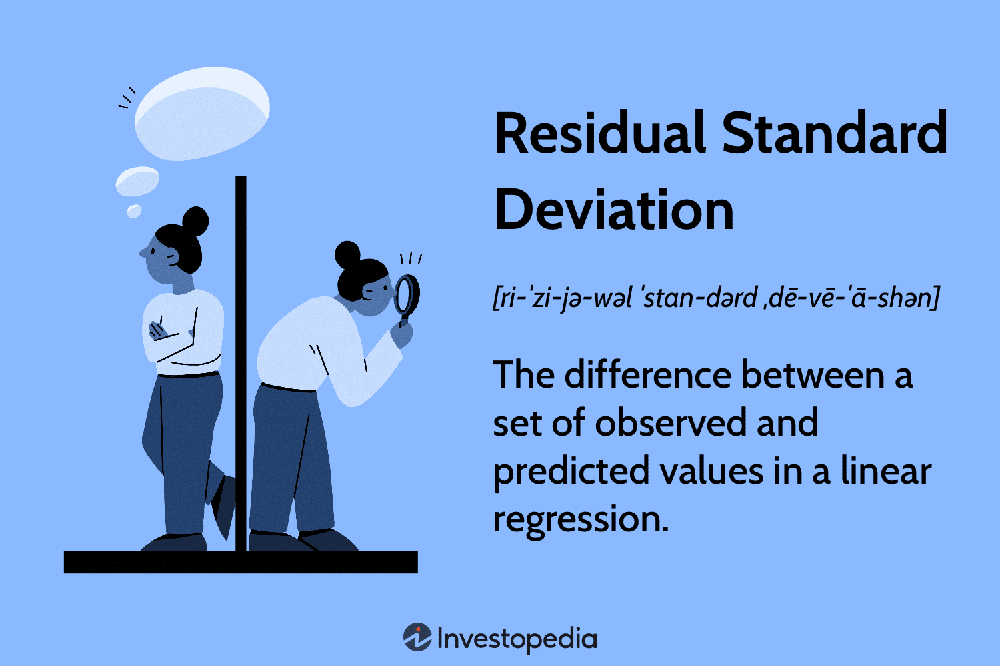

## Table of Contents

## What is residual standard deviation?

Residual standard deviation, often called the standard error of the regression, is a measure used in statistics to show how much the data points in a model vary around the fitted line or curve. It tells us how well a model fits the data by calculating the average distance between the observed values and the values predicted by the model. A smaller residual standard deviation means the model's predictions are closer to the actual data points, indicating a better fit.

In simpler terms, imagine you're trying to draw a line through a scatter plot of data points. The residual standard deviation measures how far, on average, each point is from that line. If the points are very close to the line, the residual standard deviation will be small, showing that your model is a good representation of the data. If the points are scattered far from the line, the residual standard deviation will be larger, suggesting that the model might need improvement.

## How does residual standard deviation differ from standard deviation?

Residual standard deviation and standard deviation both measure how spread out data is, but they are used in different ways. Standard deviation is a general measure that looks at how much all the data points in a set differ from the average of the whole set. It gives us an idea of the overall variability in the data. For example, if you have test scores from a class, the standard deviation tells you how much the scores vary from the class average.

Residual standard deviation, on the other hand, is specific to regression analysis. It measures how much the actual data points differ from the predictions made by a regression model. When you fit a line or curve to data, this measure tells you how well that line or curve represents the data. If the residual standard deviation is small, it means the model's predictions are close to the actual values, showing a good fit. If it's large, the model might not be representing the data well.

## What is the formula for calculating residual standard deviation?

To calculate the residual standard deviation, you first need to find the residuals. Residuals are the differences between the actual values of the data and the values predicted by your model. Once you have all the residuals, you square each one to get rid of negative values. Then, you find the average of these squared residuals. This average is called the mean squared error (MSE). 

Next, you take the square root of the mean squared error to get the residual standard deviation. The formula looks like this: Residual Standard Deviation = √(Σ(residuals^2) / (n - k - 1)), where Σ means "sum of," n is the number of observations, and k is the number of predictors in your model. The n - k - 1 part is called the degrees of freedom and adjusts for the number of parameters estimated in the model. This formula helps you understand how well your model fits the data by showing how spread out the residuals are.

## Can you explain each component of the residual standard deviation formula?

The formula for residual standard deviation is a way to measure how well a model fits the data. It uses something called residuals, which are the differences between the actual data points and what the model predicts. You start by finding all these residuals and then you square each one. Squaring them gets rid of any negative numbers, which is important because you want to add them up later. After squaring, you add all these squared residuals together. This sum is then divided by a number called the degrees of freedom, which is the total number of observations (n) minus the number of predictors in your model (k) minus one. This division gives you what's called the mean squared error (MSE).

Once you have the mean squared error, you take its square root to get the residual standard deviation. The square root step is important because it brings the number back to the same scale as the original data, making it easier to understand. The degrees of freedom (n - k - 1) in the formula is there to adjust for the fact that you used some of your data to make the model. If you didn't adjust for this, your estimate of how well the model fits might be too optimistic. So, the whole formula helps you see how spread out the residuals are, which tells you how well your model represents the data.

## Why is residual standard deviation important in regression analysis?

Residual standard deviation is important in regression analysis because it tells us how well our model fits the data. Imagine you're trying to predict something using a line or curve. The residual standard deviation measures how far off your predictions are from the actual data points. If this number is small, it means your model's predictions are close to the real values, so your model is doing a good job. If it's large, it means your predictions are not very accurate, and you might need to improve your model.

This measure helps us understand if our model is useful or not. In simple terms, a low residual standard deviation means our model is reliable and we can trust its predictions. On the other hand, a high residual standard deviation suggests that our model might not be capturing the important patterns in the data. By looking at the residual standard deviation, we can decide whether to keep using the model as it is, or if we need to make changes to make it better.

## How do you calculate residual standard deviation using a simple linear regression example?

Let's say you want to predict how much time it takes to walk to school based on the distance. You collect data from several students and draw a line that best fits this data. This line is your simple linear regression model. To find the residual standard deviation, you first need to see how far each student's actual time is from the time predicted by your line. These differences are called residuals. For example, if your line predicts it takes 10 minutes to walk 1 kilometer, but a student actually takes 12 minutes, the residual for that student is 2 minutes.

Next, you square each of these residuals. So, the 2-minute residual becomes 4 (2 squared). You do this for all the students and add up all these squared numbers. Let's say you have data from 10 students and the sum of the squared residuals is 50. You then divide this sum by the degrees of freedom, which is the number of students (10) minus the number of predictors (1 in this case, just the distance) minus 1. So, you divide 50 by 8 (10 - 1 - 1), which gives you 6.25. This number is called the mean squared error. Finally, you take the square root of 6.25, which is about 2.5. This 2.5 is your residual standard deviation. It tells you, on average, how far off your predictions are from the actual times, showing how well your line fits the data.

## What are the steps to compute residual standard deviation in a statistical software?

To compute the residual standard deviation using statistical software, you first need to run a regression analysis on your data. In software like R, Python, or SPSS, you would input your data and use commands or functions to fit a regression model. For example, in R, you might use the `lm()` function to create a linear model, and in Python, you might use the `statsmodels` library to fit a model. Once the model is fitted, the software will automatically calculate and display various statistics, including the residual standard deviation, often labeled as "Residual Standard Error" or something similar.

After fitting the model, you can usually find the residual standard deviation in the summary output of the regression analysis. In R, this value appears in the summary of the linear model under "Residual standard error." In Python, using `statsmodels`, you can access it through the `summary()` method of your fitted model, where it's listed as "Resid" in the "Standard Error" column. In SPSS, you'll find it in the regression output under "Std. Error of the Estimate." This value tells you how spread out the residuals are, helping you understand how well your model fits the data.

## How does residual standard deviation help in evaluating model fit?

Residual standard deviation is a key number that helps us see how well our model matches the real data. Think of it like this: when you draw a line or curve to predict something, like how long it takes to walk to school based on distance, you want to know how close your guesses are to what actually happens. The residual standard deviation tells you, on average, how far off your predictions are from the real times. If this number is small, it means your line or curve is a good fit because your predictions are close to the actual values. If it's big, your line might not be the best match for the data.

This measure is really useful because it gives you a clear way to judge if your model is doing a good job. Imagine you're trying to decide if you should use your model to make decisions or if you need to change it. By looking at the residual standard deviation, you can see if your model's predictions are reliable. If the number is low, you can feel more confident in using your model. But if it's high, you might want to rethink your model or try a different one to get better predictions.

## What are the implications of a high residual standard deviation in a regression model?

A high residual standard deviation in a regression model means that the predictions you're making are far away from the actual data points. It's like trying to guess how long it takes to walk to school based on distance, but your guesses are way off. When the residual standard deviation is high, it shows that your model isn't fitting the data well. This could happen because your model is too simple and can't capture all the important details in the data, or maybe there are other factors affecting the data that you haven't included in your model.

Having a high residual standard deviation is a sign that you might need to make changes to your model to get better predictions. You could try adding more variables to your model to see if they help explain the data better, or you might need to use a different kind of model that can handle the complexity of your data. Until you fix the issue, you should be careful about using the model's predictions because they might not be very accurate. It's important to keep working on your model until the residual standard deviation is lower, showing that your predictions are closer to the real values.

## How can residual standard deviation be used to compare different models?

Residual standard deviation is a helpful tool when you want to compare different models to see which one fits your data the best. Imagine you have two or more models trying to predict the same thing, like how long it takes to walk to school. You can look at the residual standard deviation for each model. The model with the smaller residual standard deviation is usually the better one because it means its predictions are closer to the actual times. It's like choosing the best-fitting pair of jeans; you pick the one that fits you the closest.

Using residual standard deviation to compare models is simple but powerful. If you're trying to decide between a simple model and a more complex one, you might find that the complex model has a lower residual standard deviation, suggesting it's better at capturing the details in your data. But remember, sometimes a simpler model with a slightly higher residual standard deviation might still be good enough if it's easier to understand and use. So, by looking at the residual standard deviation, you can make smarter choices about which model to use for your predictions.

## What are some common pitfalls or misconceptions about residual standard deviation?

One common pitfall is thinking that a lower residual standard deviation always means a better model. While it's true that a smaller number usually shows that your model's predictions are closer to the actual data, it's not the only thing you should look at. Sometimes, a model might be too complicated and fit the data too closely, which can actually make it less useful for predicting new data. This is called overfitting. So, it's important to balance having a low residual standard deviation with making sure your model isn't too complex.

Another misconception is believing that residual standard deviation is the same as regular standard deviation. They sound similar, but they're used for different things. Regular standard deviation tells you how spread out all your data is from the average. Residual standard deviation, on the other hand, tells you how spread out the differences between your model's predictions and the actual data are. It's a specific measure used in regression analysis to see how well your model fits the data, not a general measure of data spread like regular standard deviation.

## How does residual standard deviation relate to confidence intervals and prediction intervals in regression?

Residual standard deviation is really important when you're trying to figure out confidence intervals and prediction intervals in regression. Think of confidence intervals like a range where you think the true average value of something lies. For example, if you're trying to guess how long it takes to walk to school based on distance, a confidence interval tells you where you think the average time for everyone is. The residual standard deviation helps you figure out how wide this range should be. If the residual standard deviation is small, meaning your model's guesses are pretty close to the real times, then your confidence interval can be narrower. But if it's big, your guesses are more spread out, so you need a wider confidence interval to be sure you're covering the true average.

Prediction intervals are a bit different; they tell you a range where you think a single new observation will fall. So, if a new student walks to school, a prediction interval gives you a range for how long you think it might take them. Just like with confidence intervals, the residual standard deviation helps you decide how wide this range should be. A smaller residual standard deviation means your model is good at predicting, so you can have a narrower prediction interval. But if the residual standard deviation is larger, your model's predictions are less accurate, and you need a wider prediction interval to be confident that the new observation will fall within it. Both confidence and prediction intervals use the residual standard deviation to help you understand how certain you can be about your model's predictions.

## What is Understanding Residual Standard Deviation?

Residual standard deviation is a crucial metric used to quantify the dispersion of residuals, or errors, from a statistical model. It is a key tool in regression analysis, which is widely employed in financial modeling to determine how well a model predicts outcomes. The residuals are the differences between observed and estimated values of the dependent variable. This measure provides insight into the accuracy and reliability of a regression model, as it indicates the extent to which observed data points deviate from the estimated regression line.

In mathematical terms, residual standard deviation is denoted as $S_{\text{res}}$ and is calculated using the formula:

$$
S_{\text{res}} = \sqrt{\frac{\sum (Y - \hat{Y})^2}{n - 2}}
$$

where:
- $Y$ represents the actual observed values,
- $\hat{Y}$ denotes the estimated values from the regression model,
- $n$ is the number of observations.

The numerator, $\sum (Y - \hat{Y})^2$, is the sum of the squared residuals, representing the total deviation of the observed values from the estimated values. The denominator, $n - 2$, accounts for the degrees of freedom in a linear regression model with two parameters: the slope and the intercept.

A lower residual standard deviation is indicative of a model whose predictions are closely aligned with actual data points, thereby enhancing the model's accuracy and reliability. This is particularly beneficial for traders who rely on robust predictive models to inform their decision-making processes in [algorithmic trading](/wiki/algorithmic-trading). By reducing the residual standard deviation, traders can achieve a model fit that better captures the underlying data patterns, which is essential for minimizing prediction errors and improving trading outcomes.

For practical implementation and deeper analysis, Python can be used to compute residual standard deviation. For instance:

```python
import numpy as np

# Observed and estimated values
Y = np.array([10, 15, 14, 10, 16])
Y_est = np.array([12, 14, 13, 11, 15])

# Degrees of freedom for simple linear regression (n - 2)
n = len(Y)
degrees_of_freedom = n - 2

# Compute residual standard deviation
squared_residuals = np.sum((Y - Y_est) ** 2)
S_res = np.sqrt(squared_residuals / degrees_of_freedom)

S_res
```

This Python code snippet calculates the residual standard deviation, providing traders and analysts with a means to evaluate the goodness of fit and refine their predictive trading models. As improvements in model accuracy directly translate into better risk management and trading performance, understanding and applying residual standard deviation is instrumental in the development of effective financial strategies.

## What is the formula behind residual standard deviation?

The formula for residual standard deviation is a key element in understanding the variability of a model's predictions. It is expressed as:

$$
S_{\text{res}} = \sqrt{\frac{\Sigma(Y - Y_{\text{est}})^2}{n - 2}}
$$

where:
- $Y$ represents the observed values,
- $Y_{\text{est}}$ is the estimated or predicted values,
- $n$ denotes the number of observations.

Each component plays an essential role in the calculation and interpretation of residual standard deviation:

1. **Observed Value ($Y$)**: These are the actual data points collected from the financial markets, representing real-world outcomes or prices of securities.

2. **Estimated Value ($Y_{\text{est}}$)**: These are the predicted values derived from the regression model or statistical analysis used by traders. The difference between $Y$ and $Y_{\text{est}}$, known as the residuals, indicates the prediction error.

3. **Number of Observations ($n$)**: This refers to the total data points considered in the regression analysis. The expression $n - 2$ in the denominator accounts for the degrees of freedom in the model, considering two parameters (intercept and slope) are estimated in simple linear regression.

By calculating the square of the residuals, we focus on the magnitude of prediction errors irrespective of their direction (positive or negative). The sum of these squares ($\Sigma(Y - Y_{\text{est}})^2$) represents the total scatter or deviation of the observed values from the regression line.

Traders utilize this formula to compute the residual standard deviation as a measure of their model's error margin. A lower value indicates a tighter fit of the model to the actual data, thereby increasing the model's reliability. This quantification is essential in risk management and decision-making processes, allowing traders to evaluate the potential deviations between expected and actual market performance.

Here's an example of how you might calculate this using Python:

```python
import numpy as np

# Sample data: observed vs. predicted values
observed = np.array([10, 15, 14, 18, 13])
predicted = np.array([12, 14, 13, 17, 12])

# Calculate residuals
residuals = observed - predicted

# Compute residual standard deviation
n = len(observed)
residual_std_dev = np.sqrt(np.sum(residuals**2) / (n - 2))

print(f"Residual Standard Deviation: {residual_std_dev}")
```

In this script, the `np.sqrt` and `np.sum` functions from the NumPy library are utilized to calculate the residual standard deviation. This code snippet demonstrates the practical application of the formula, providing real-time insights into model accuracy and the subsequent impact on trading strategies. By understanding and applying this formula, algorithmic traders can refine their predictive models to mitigate risk and improve their decision-making framework.

## What are some examples and how do you perform the calculation?

In the context of linear regression models, calculating residual standard deviation is key to understanding the accuracy of predictions. Let's consider a practical example involving asset prices, where a trader uses past data to predict future performance.

Suppose we have a dataset with observed asset prices over a period and a linear regression model that provides predicted prices for the same period. The observed values ($Y$) and predicted values ($Y_{\text{est}}$) for a set of five observations might be as follows:

$$
\begin{align*}
Y &= [100, 102, 105, 108, 110] \\
Y_{\text{est}} &= [98, 104, 103, 109, 112]
\end{align*}
$$

First, we calculate the residuals, which are the differences between the observed and predicted values. The residuals ($e$) are given by:

$$
e = Y - Y_{\text{est}} = [100 - 98, 102 - 104, 105 - 103, 108 - 109, 110 - 112] = [2, -2, 2, -1, -2]
$$

Next, we apply the formula for residual standard deviation:

$$
S_{\text{res}} = \sqrt{\frac{\sum (Y - Y_{\text{est}})^2}{n - 2}}
$$

where $n$ is the number of observations, in this case, 5. Calculating the sum of squared residuals:

$$
\sum (Y - Y_{\text{est}})^2 = 2^2 + (-2)^2 + 2^2 + (-1)^2 + (-2)^2 = 4 + 4 + 4 + 1 + 4 = 17
$$

Substitute these values into the formula:

$$
S_{\text{res}} = \sqrt{\frac{17}{5 - 2}} = \sqrt{\frac{17}{3}} \approx 2.38
$$

Therefore, the residual standard deviation is approximately 2.38. This value indicates the average deviation of observed asset prices from those predicted by the model. A lower residual standard deviation would suggest that the model predicts asset prices more accurately, while a higher value may prompt traders to refine their modeling strategies to improve prediction accuracy.

By regularly calculating residual standard deviation, traders can assess how well their predictive models capture market dynamics and make informed adjustments to their trading strategies accordingly. This process is integral to ensuring models maintain robust performance over time.

## How can we improve trading models?

To improve trading models and lower residual standard deviation, selecting relevant features and balancing model complexity are critical steps. Feature selection is essential as including unnecessary variables can increase model complexity without enhancing predictive power. By focusing on variables that have significant predictive value, traders can streamline their models, enhancing performance and potentially reducing residual standard deviation.

Regularization techniques, particularly LASSO (Least Absolute Shrinkage and Selection Operator) and Ridge regression, are notably effective in this aspect. These methods help mitigate overfitting, which occurs when a model fits the training data too closely and fails to generalize well to new data, leading to high residual standard deviation.

### LASSO and Ridge Regression

- **LASSO Regression**: LASSO adds a penalty equal to the absolute value of the magnitude of coefficients. This tends to shrink some coefficients to zero, effectively reducing the number of variables in the model. The LASSO objective function is:
$$
  \text{minimize}\left( \sum_{i=1}^{n} (y_i - \hat{y}_i)^2 + \lambda \sum_{j=1}^{p} | \beta_j | \right)

$$

- **Ridge Regression**: Ridge applies a penalty proportional to the square of the magnitude of coefficients. While this technique doesn't usually produce sparse solutions like LASSO, it effectively reduces the size of the coefficients, which is useful when dealing with multicollinearity. The Ridge objective function is:
$$
  \text{minimize}\left( \sum_{i=1}^{n} (y_i - \hat{y}_i)^2 + \lambda \sum_{j=1}^{p} \beta_j^2 \right)

$$

### Python Implementation Example

Below is an example of implementing LASSO and Ridge regression in Python using the `scikit-learn` library:

```python
from sklearn.linear_model import Lasso, Ridge
from sklearn.model_selection import train_test_split
from sklearn.metrics import mean_squared_error
import numpy as np

# Assuming X and y are the features and target variable
X_train, X_test, y_train, y_test = train_test_split(X, y, test_size=0.2, random_state=42)

# LASSO Regression
lasso = Lasso(alpha=0.1)  # alpha is the regularization parameter
lasso.fit(X_train, y_train)
lasso_pred = lasso.predict(X_test)
lasso_residual_std = np.sqrt(mean_squared_error(y_test, lasso_pred))
print("LASSO Residual Standard Deviation:", lasso_residual_std)

# Ridge Regression
ridge = Ridge(alpha=0.1)  # alpha is the regularization parameter
ridge.fit(X_train, y_train)
ridge_pred = ridge.predict(X_test)
ridge_residual_std = np.sqrt(mean_squared_error(y_test, ridge_pred))
print("Ridge Residual Standard Deviation:", ridge_residual_std)
```

### Effects on Residual Standard Deviation

Regularization reduces the model's complexity by constraining the coefficient size, which leads to lower variance in model estimates. As a result, the residual standard deviation, a metric indicating the [dispersion](/wiki/dispersion-trading) of prediction errors, tends to decrease. This culminates in models that are not only more robust but also have improved predictive accuracy.

In trading models, these refined predictive capabilities are crucial for making informed decisions, mitigating risks, and capitalizing on market opportunities. Regularization serves as a powerful technique in optimizing trading models, helping to ensure they remain reliable and efficient in changing market conditions.

## References & Further Reading

[1]: Bergstra, J., Bardenet, R., Bengio, Y., & Kégl, B. (2011). ["Algorithms for Hyper-Parameter Optimization."](https://dl.acm.org/doi/10.5555/2986459.2986743) Advances in Neural Information Processing Systems 24.

[2]: ["Advances in Financial Machine Learning"](https://www.amazon.com/Advances-Financial-Machine-Learning-Marcos/dp/1119482089) by Marcos Lopez de Prado

[3]: ["Evidence-Based Technical Analysis: Applying the Scientific Method and Statistical Inference to Trading Signals"](https://www.amazon.com/Evidence-Based-Technical-Analysis-Scientific-Statistical/dp/0470008741) by David Aronson

[4]: ["Machine Learning for Algorithmic Trading"](https://github.com/stefan-jansen/machine-learning-for-trading) by Stefan Jansen

[5]: ["Quantitative Trading: How to Build Your Own Algorithmic Trading Business"](https://www.amazon.com/Quantitative-Trading-Build-Algorithmic-Business/dp/1119800064) by Ernest P. Chan