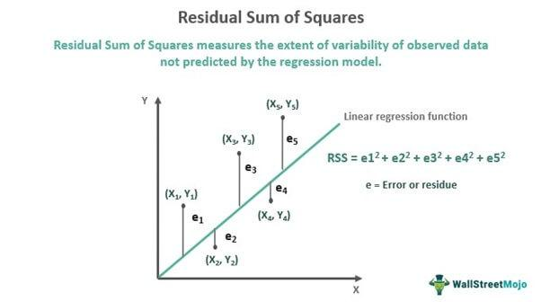

Algorithmic trading has become increasingly prominent, leveraging mathematical models and computational algorithms to make trading decisions at speeds and frequencies that are beyond human capacity. Within this framework, statistical calculations play a crucial role in developing models that are not only predictive but also robust. Among these statistical tools, Residual Sum of Squares (RSS) is a fundamental measure used in regression analysis to quantify the discrepancy between observed and predicted values in a model.

The Residual Sum of Squares is a key metric for assessing the accuracy of predictive models. Mathematically, RSS is calculated as the sum of the squares of residuals, where each residual represents the difference between the observed and predicted value:



$$
\text{RSS} = \sum_{i=1}^{n} (y_i - \hat{y}_i)^2
$$

In this formula, $y_i$ denotes the actual data point and $\hat{y}_i$ represents the predicted value from the model. An optimal model will aim to minimize the RSS, thereby indicating a closer fit to the actual data and thus more accurate predictions.

Statistical measures like RSS are vital for the refinement of trading algorithms as they provide quantitative feedback essential for model improvement. Minimizing RSS contributes to reducing prediction errors, which can directly impact the profitability and risk management of trading strategies. Efficient algorithms not only enhance model performance but also ensure that trading signals are based on sound statistical underpinnings, reducing market risks.

This article will cover several aspects of the application of RSS in algorithmic trading. It will begin with a detailed explanation of RSS, followed by its critical role in evaluating trading signal predictions within algorithmic trading frameworks. We will then explore how to calculate RSS in trading models, including necessary data inputs and the implementation of these calculations in popular programming languages. The discussion will extend to methodologies for improving trading algorithms using RSS. Finally, it will conclude with a summary of the importance of RSS in optimizing trading strategies and suggest directions for future advancements in this field.

Understanding how RSS is applied in algorithmic trading sets the stage for designing and refining models that can competently navigate the complexities of financial markets, ultimately leading to enhanced trading outcomes.

## Table of Contents

## Understanding Residual Sum of Squares (RSS)

Residual Sum of Squares (RSS) is a statistical measure used to quantify the discrepancy between the data observed in a dataset and the data predicted by a model. In simpler terms, it provides a numerical value that indicates how well a model approximates the real data points. In the context of regression and predictive analysis, RSS plays a pivotal role in determining the accuracy of the predictions made by a model.

Mathematically, RSS is calculated as the sum of the squares of the residuals. Residuals are the differences between the observed values ($y_i$) and the predicted values ($\hat{y}_i$) from a regression model. The formula for RSS is expressed as:

$$
\text{RSS} = \sum_{i=1}^{n} (y_i - \hat{y}_i)^2
$$

where $n$ is the number of observations, $y_i$ represents each observed value, and $\hat{y}_i$ is the corresponding predicted value by the model. By squaring the residuals, the formula ensures that positive and negative discrepancies do not cancel each other out, providing a more accurate assessment of model performance.

RSS is integral to regression analysis, serving as a key metric in assessing the fit of a model. It is used in various regression techniques, including linear regression, where the goal is to minimize the RSS to achieve the best-fitting line through the data points. A smaller RSS indicates that the model's predictions are very close to the actual data, thus reflecting a higher degree of accuracy.

Within the broader framework of regression analysis, RSS is a component of other statistical constructs, such as the coefficient of determination (R-squared), which is commonly used to measure the proportion of variance for a dependent variable that is explained by an independent variable in a regression model. By minimizing the RSS, one can effectively enhance the explanatory power of the model, ensuring that greater precision in prediction is achieved.

In [algorithmic trading](/wiki/algorithmic-trading), the minimization of RSS is crucial for developing efficient trading algorithms. Algorithms often rely on predictive models to make informed decisions based on historical market data. By reducing the RSS, traders can increase the accuracy of these models, which in turn enhances the reliability of trading signals. This reduction in error translates to a more robust execution of trading strategies, potentially leading to improved profitability while mitigating risks associated with erroneous predictions.

In summary, Residual Sum of Squares (RSS) is an essential metric for evaluating the accuracy of predictive models, especially in regression analysis. Its minimization is vital for developing effective algorithmic trading strategies, where precise predictions are paramount for making profitable trade decisions.

## Role of RSS in Algorithmic Trading

Algorithmic trading, also known as algo trading, refers to the automated execution of trading orders based on predefined criteria, often using complex algorithms and mathematical models. Its essence lies in the reliance on quantitative models that leverage statistical methods to make trading decisions with high efficiency and precision. Central to many of these models is the Residual Sum of Squares (RSS), a metric used to evaluate the accuracy of predictive models, particularly in the context of trading signal predictions.

RSS is a crucial tool for measuring the discrepancy between observed and predicted values generated by a model. In trading algorithms, RSS helps assess the precision of trading signals, gauges model performance, and guides subsequent model refinements. It is calculated using the formula:

$$
\text{RSS} = \sum_{i=1}^{n} (y_i - \hat{y}_i)^2
$$

where $y_i$ represents the observed values, and $\hat{y}_i$ are the predicted values.

Accuracy and error reduction in trading models cannot be overstated. The financial markets are highly sensitive environments where small predictive inaccuracies can have significant repercussions on trading strategies and profitability. Hence, minimizing RSS is pivotal for developing robust trading models that are resilient to market noise and can better forecast market movements, leading to improved trade execution.

The impact of reducing RSS on the profitability of trading strategies is multifaceted. First, a lower RSS indicates a model's improved accuracy, directly linked to better trade signals. More accurate predictions enable traders to execute trades with higher confidence, reduce slippage, and minimize exposure to adverse price movements. Additionally, the enhanced precision of trading signals is crucial for managing market risks effectively, thereby safeguarding capital and optimizing returns. As the quality of predictions improves, so too does the potential for strategies to exploit market inefficiencies and generate alpha.

By minimizing RSS, traders can make more informed decisions with reduced likelihood of overfitting, ensuring that the model performs well not only on historical data but also in real-time scenarios. This enhancement in predictive reliability reduces the risk associated with trading, ultimately leading to a sustained competitive edge in the algorithmic trading domain. As a result, traders are encouraged to embed RSS analysis as a core metric in model evaluation to refine their strategies continuously.

## Calculating RSS in Algo Trading Models

Calculating the Residual Sum of Squares (RSS) in algorithmic trading models is pivotal for assessing model accuracy and optimizing trading strategies. It involves understanding data inputs, employing appropriate programming techniques, and utilizing the right tools. Here's a guide to facilitate the calculation of RSS within trading algorithms.

### Step-by-Step Guide on Calculating RSS

1. **Data Inputs and Sources**:
   - **Historical Price Data**: Essential for constructing predictive models, this can be sourced from financial data providers like Bloomberg, Reuters, or free APIs such as Alpha Vantage.
   - **Predictive Signals**: These are generated by the trading model and need to be compared against actual market outcomes.
   - **Timeframes**: Ensure data consistency by aligning inputs to specific trading timeframes, e.g., daily, hourly.

2. **Mathematical Formula**:
   The RSS is calculated using the formula:
$$
   \text{RSS} = \sum_{i=1}^{n} (y_i - \hat{y}_i)^2

$$
   where $y_i$ represents the actual trading results and $\hat{y}_i$ the predicted values.

3. **Implementation in Popular Programming Languages**:
   - **Python**: Due to its extensive libraries for data analysis, Python is ideal for calculating RSS. Use libraries such as NumPy or Pandas for data manipulation and Scikit-learn for modeling.
   ```python
   import numpy as np

   # Assume actual and predicted are numpy arrays of the same length
   actual = np.array([...])  # Replace with actual outcome data
   predicted = np.array([...])  # Replace with predictions

   rss = np.sum((actual - predicted) ** 2)
   print("RSS:", rss)
   ```
   - **R**: Provides strong statistical packages for financial modeling.
   - **C++**: Suitable for high-frequency trading scenarios where execution speed is critical.

4. **Tools and Software**:
   - **Trading Platforms**: Many platforms like MetaTrader or QuantConnect support scripting capabilities that can be customized for RSS calculations.
   - **Analytical Tools**: Jupyter Notebooks and RStudio offer integrated environments for developing and testing trading strategies.
   - **Data Visualization**: Libraries like Matplotlib in Python can help visualize residuals to understand model performance.

5. **Challenges and Solutions**:
   - **Data Quality**: Inaccurate or incomplete data can skew RSS calculations. Implement robust data verification processes to ensure data integrity.
   - **Overfitting**: Models that fit training data too closely might underperform in real-market conditions. Cross-validation techniques can help mitigate this issue.
   - **Scalability**: Handle large datasets efficiently by leveraging distributed computing frameworks like Apache Spark.
   - **Dynamic Markets**: Financial markets are inherently volatile. Continuously update models to reflect current market conditions and reduce prediction errors.

Calculating RSS in trading algorithms helps improve the precision of predictions and refines the overall effectiveness of trading strategies. By systematically following these steps and addressing potential challenges, traders can enhance algorithm performance and decision-making capabilities in volatile markets.

## Improving Trading Models Using RSS

Traders can improve their trading models using the Residual Sum of Squares (RSS) as a feedback mechanism. One common approach is to iteratively test and refine models by examining how changes in the model affect RSS values. This iterative process involves adjusting model parameters and input variables to identify configurations that lead to a lower RSS, which indicates a better fit to historical data. By tracking these changes, traders can systematically pinpoint which alterations improve model predictions.

Minimizing RSS can be achieved through various techniques. One fundamental method is feature selection, where traders identify and utilize only the most relevant variables in their models, thereby reducing noise and improving prediction accuracy. Another approach is regularization, which adds a penalty term to the loss function to discourage overly complex models that may fit the training data too closely, causing poor out-of-sample performance. Techniques such as Lasso (L1 regularization) and Ridge (L2 regularization) are regularly used to balance fitting requirements and prevent overfitting by indirectly reducing RSS.

Advanced practices in [machine learning](/wiki/machine-learning), such as ensemble methods, can further enhance model accuracy by leveraging RSS. Algorithms like Random Forests or Gradient Boosting Machines aggregate the predictions from multiple models and minimize RSS iteratively across each model to enhance overall prediction reliability. These machine learning algorithms effectively use RSS to refine models by exploring a wider array of predictive possibilities and averaging the results for more accurate outcomes.

There are notable examples where RSS optimization has led to improved trading outcomes. For instance, by optimizing RSS, a financial institution could significantly enhance its credit scoring model's accuracy, leading to better risk assessment and a noticeable reduction in loan defaults. In another case, a [hedge fund](/wiki/hedge-fund-trading-strategies)'s predictive algorithm for asset returns was fine-tuned using RSS feedback, resulting in more consistent returns and less [volatility](/wiki/volatility-trading-strategies), demonstrating the practical benefits of minimizing RSS in real-world settings.

Monitoring and maintaining RSS levels is crucial in live trading to ensure sustained model performance. Traders should establish thresholds for acceptable RSS values and continuously monitor these levels using automated alert systems integrated into their trading platforms. This enables prompt action if RSS levels indicate model degradation. Regular updates and recalibration of models based on the latest data ensure that the RSS reflects current market conditions, making the models robust and reliable.

By implementing these methods, traders can optimize their models, ultimately leading to more accurate trading predictions and improved financial performance. The application of RSS provides a structured means to identify and apply necessary adjustments, ensuring trading models remain not only accurate but also resilient over time.

## Conclusion

The Residual Sum of Squares (RSS) plays a pivotal role in optimizing algorithmic trading strategies by providing a quantitative measure of the accuracy of predictive models. By minimizing RSS, traders can significantly enhance the performance of financial models, leading to more precise trading signals and decisions. Reducing RSS signifies an improvement in the model’s fit to the data, thereby decreasing the error in predictions and enhancing profitability.

Emphasizing RSS in model evaluation can transform trading strategies. Traders are encouraged to incorporate RSS analysis as a standard metric to routinely assess and refine their models. Doing so not only aids in identifying inefficiencies within a model but also guides the optimization process, ensuring that predictive performance is continuously improved.

Looking forward, further advancements in statistical analysis for algorithmic trading are anticipated, with machine learning and [artificial intelligence](/wiki/ai-artificial-intelligence) leading the charge. These technologies promise to automate and improve the iterative process of model refinement, reducing RSS more effectively than traditional methods. The integration of big data analytics will likely play a crucial role, allowing traders to utilize larger datasets to train more robust models with lower residual errors.

To leverage the full potential of RSS for improved trading outcomes, traders should commence implementing RSS analysis within their strategies. Regular monitoring and adaptation based on RSS feedback will enable traders to maintain high accuracy levels over time. This proactive approach will not only improve model precision but will also build a competitive edge in a technologically evolving trading landscape. The call to action is clear: start integrating RSS metrics into your trading strategy today to harness more accurate predictions and superior trading performance.

## Additional Resources and References

For those looking to expand their knowledge on Residual Sum of Squares (RSS) and its application in algorithmic trading, several resources, tools, and communities offer valuable insights:

### Books and Articles
1. **"The Elements of Statistical Learning: Data Mining, Inference, and Prediction" by Trevor Hastie, Robert Tibshirani, and Jerome Friedman** - This book provides comprehensive coverage of statistical learning techniques, including regression analysis and error measurement metrics like RSS.
2. **“Algorithmic Trading and DMA: An Introduction to Direct Access Trading Strategies” by Barry Johnson** - A detailed text on the mechanics of algorithmic trading with an emphasis on quantitative strategies and statistical methods.
3. **"Quantitative Trading: How to Build Your Own Algorithmic Trading Business" by Ernie Chan** - This book offers practical guidance on developing trading strategies, including model validation using statistical measures like RSS.

### Academic Papers
- **A. Timmermann and C. Granger (2004). "Efficient Market Hypothesis and Forecasting"** - This paper discusses forecasting accuracy and mentions various metrics, including RSS, for evaluating model performance.

### Online Courses and Tutorials
- **Coursera’s "Machine Learning" by Stanford University** - Contains modules on regression methods where RSS is a critical assessment tool.
- **edX's "Data Science: R Basics" by Harvard University** - Offers foundational knowledge of data manipulation and analysis, useful for calculating RSS in trading models.

### Online Forums and Trading Communities
- **Quantitative Finance Stack Exchange (quant.stackexchange.com)** - A question-and-answer platform for those interested in the quantitative analysis aspects of finance, including discussions on RSS.
- **Elite Trader (elitetrader.com)** - A trading community where algorithmic trading topics, including statistical measures like RSS, are actively discussed.

### Software and Tools
- **Python Libraries (such as NumPy and SciPy)** - These libraries offer computational tools for numerical data, essential for calculating RSS in algorithmic models.
  ```python
  import numpy as np
  residuals = np.array([2.3, 1.9, -1.5])  # Example residuals
  RSS = np.sum(np.square(residuals))
  ```
- **R Statistical Software** - Provides packages like `lm` for linear model fitting, enabling easy computation of RSS and other regression diagnostics.

### Additional Resources
- **“Python for Data Analysis” by Wes McKinney** - A practical guide on using Python libraries for data analysis, providing necessary skills for implementing RSS in trading algorithms.
- **"Hands-On Machine Learning with Scikit-Learn, Keras & TensorFlow" by Aurélien Géron** - While focused on machine learning, this book provides insights on optimization techniques which include reducing error measures like RSS.

These resources offer extensive guidance for those interested in integrating RSS analysis into their algorithmic trading strategies, fostering an understanding of how statistical measures enhance model precision and profitability.

## References & Further Reading

[1]: ["The Elements of Statistical Learning: Data Mining, Inference, and Prediction"](https://link.springer.com/book/10.1007/978-0-387-84858-7) by Trevor Hastie, Robert Tibshirani, and Jerome Friedman

[2]: ["Algorithmic Trading and DMA: An Introduction to Direct Access Trading Strategies"](https://www.amazon.com/Algorithmic-Trading-DMA-introduction-strategies/dp/0956399207) by Barry Johnson

[3]: ["Quantitative Trading: How to Build Your Own Algorithmic Trading Business"](https://www.amazon.com/Quantitative-Trading-Build-Algorithmic-Business/dp/1119800064) by Ernest P. Chan

[4]: Timmermann, A., & Granger, C. W. J. (2004). ["Efficient Market Hypothesis and Forecasting"](https://www.sciencedirect.com/science/article/abs/pii/S0169207003000128). International Journal of Forecasting.

[5]: ["Python for Data Analysis"](https://wesmckinney.com/book/) by Wes McKinney

[6]: ["Hands-On Machine Learning with Scikit-Learn, Keras & TensorFlow"](https://www.academia.edu/43840124/Hands_On_Machine_Learning_with_Scikit_Learn_Keras_and_TensorFlow_SECOND_EDITION_Concepts_Tools_and_Techniques_to_Build_Intelligent_Systems) by Aurélien Géron