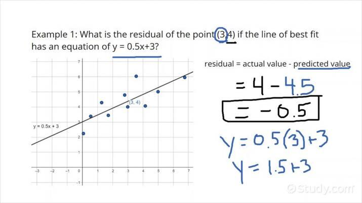

Asset valuation, residual value, and depreciation are fundamental concepts in financial analysis, playing a crucial role in the accurate representation of a company's financial health. Asset valuation determines the worth of a company's assets, providing insight into the tangible and intangible resources available to generate future income. Accurately valuing assets ensures that financial statements reflect true economic conditions, supporting informed decision-making by investors, creditors, and other stakeholders.

Residual value is the estimated amount that an asset is worth at the end of its useful life, an essential input for calculating depreciation. Depreciation allocates the cost of a tangible asset over its useful life, thus affecting financial statements through expense recognition and impacting taxable income. Common methods of depreciation include the straight-line method, which evenly spreads an asset's cost over its life, and the double declining balance method, which accelerates expense recognition in the asset's early years. The choice of depreciation method and the accuracy of asset valuation can significantly impact reported earnings and key financial ratios like return on assets (ROA).



Algorithmic trading, a technology-driven form of trading that utilizes automated systems to execute trades based on predetermined criteria, benefits immensely from these financial concepts. The precision of asset valuation and depreciation directly influences the quality of input data fed into trading algorithms, affecting their predictability and reliability. Discrepancies or inaccuracies in these inputs can lead to suboptimal trading decisions, highlighting the importance of integrating accurate depreciation and valuation data into trading algorithms.

The successful integration of these financial principles into algorithmic trading systems provides traders with a more comprehensive understanding of underlying asset values, enhancing decision-making accuracy. Consequently, investors and analysts can gain a competitive advantage by leveraging properly synthesized accounting data, contributing to more informed trading strategies and optimized portfolio performance. This underscores the critical nature of accurate financial analysis in the broader context of modern algorithmic trading systems.

## Table of Contents

## Understanding Residual Value and Asset Valuation

Residual value is the estimated amount that an asset will be worth at the end of its useful life. It plays a critical role in financial statements, particularly in the calculation of an asset's depreciation and in determining its book value on the balance sheet. Since residual value affects how an asset is depreciated over time, it also influences the financial metrics and ratios that are derived from the balance sheet. Accurately estimating residual value is thus essential for providing a true picture of a company's financial health and performance.

Asset valuation, on the other hand, encompasses several methodologies to determine the value of an asset. Two primary methods include historical cost and fair value accounting. Historical cost refers to the original purchase price of the asset, adjusted for any subsequent improvements. It presents a more stable and verifiable measure, making it reliable for financial reporting. However, it might not reflect current market conditions. Fair value accounting, in contrast, assesses what the asset would fetch in an orderly transaction between market participants at the measurement date. This method is more reflective of the current market environment and can provide a more dynamic and realistic measurement of an asset's worth, although it is subject to market fluctuations and may introduce volatility into financial statements.

Residual value's influence on depreciation scheduling is considerable. Depreciation refers to the allocation of an asset's cost over its useful life, and residual value plays a key role in this calculation. The basic formula for calculating depreciation using the straight-line method is:

$$
\text{Depreciation Expense} = \frac{\text{Cost of Asset} - \text{Residual Value}}{\text{Useful Life of Asset}}
$$

This equation shows that a higher residual value reduces the total amount depreciated over the asset’s life, lowering the annual depreciation expense. This, in turn, impacts the asset's book value on balance sheets and can affect financial ratios—such as the return on assets (ROA)—that rely on these metrics.

Different methods of asset valuation also impact balance sheets. Using historical cost typically results in a conservative asset valuation, often undervaluing them when compared to current market prices, while fair value can align asset values more closely with market conditions. The choice between these methods depends on regulatory requirements, the nature of the asset, and managerial discretion. Companies might lean towards fair value in industries where assets are readily marketable and fluctuate greatly in price, whereas historical cost might be favored for long-lived assets with less market [volatility](/wiki/volatility-trading-strategies).

In conclusion, residual value and asset valuation are integral components of financial statement preparation. They not only determine how assets are depreciated but also affect the representation of an organization's financial position. Understanding these concepts is crucial for accurate financial analysis and reporting.

## The Role of Depreciation in Asset Valuation

Depreciation represents the systematic allocation of the cost of a tangible asset over its useful life. It reflects wear and tear, or obsolescence, accounting for the gradual reduction in an asset's value. Two widely utilized methods to calculate depreciation are straight-line and double declining balance.

The straight-line method emphasizes simplicity and consistency by spreading the cost evenly over the asset's estimated useful life. It calculates annual depreciation using the formula:

$$
\text{Annual Depreciation} = \frac{\text{Initial Cost} - \text{Residual Value}}{\text{Useful Life}}
$$

For example, an asset with an initial cost of $10,000, a residual value of $2,000, and a useful life of 4 years would have an annual depreciation expense of:

$$
\text{Annual Depreciation} = \frac{10,000 - 2,000}{4} = 2,000
$$

In contrast, the double declining balance method, an accelerated depreciation technique, applies a constant rate to the declining book value of the asset, doubling the straight-line rate. This is calculated as:

$$
\text{Depreciation Expense} = 2 \times \text{Straight-Line Rate} \times \text{Beginning Book Value}
$$

Using this method leads to higher depreciation costs initially, tapering off as the asset ages.

Depreciation directly impacts asset book value, affecting financial ratios such as Return on Assets (ROA). As depreciation accumulates, reducing book value, ROA may appear higher assuming net income remains stable. ROA is calculated as:

$$
\text{ROA} = \frac{\text{Net Income}}{\text{Average Total Assets}}
$$

Reducing total assets through depreciation influences ROA, presenting strategic implications in financial analysis.

From a strategic viewpoint, depreciation affects financial statements by influencing profitability metrics. Tax considerations are paramount; higher depreciation in earlier years, as seen with accelerated methods, can reduce taxable income, offering tax deferrals. This manipulation of depreciation schedules, cognizant of tax regulations, allows firms to optimize cash flows and financial strategies. Understanding these effects is crucial for financial planning and analysis in asset-heavy industries, where depreciation plays a pivotal role in shaping fiscal outcomes.

## Intersection of Depreciation, Asset Valuation, and Algorithmic Trading

Depreciation plays a critical role in shaping the accuracy of [algorithmic trading](/wiki/algorithmic-trading) models, especially those that depend on the valuation of physical assets. Depreciation represents the reduction in the value of an asset over time due to factors like wear and tear or obsolescence. This diminishing value is crucial for algorithmic models that require up-to-date and precise asset valuations to make informed trading decisions.

The accuracy of these models can be significantly affected when depreciation is not properly accounted for. If an asset is overvalued because its depreciation has been underestimated, a trading algorithm might incorrectly assess the firm's or portfolio's overall value, leading to suboptimal trading decisions. For instance, if a trading algorithm evaluates a company that heavily relies on aging machinery, inaccurate depreciation estimates would mislead the model regarding the company's true financial health, potentially affecting buy or sell signals.

Precise asset valuation requires incorporating depreciation methods like straight-line or double declining balance to reflect asset values accurately at any point in time. These methods can be quantitatively represented in trading models. In the straight-line method, the formula for annual depreciation is:

$$
\text{Depreciation Expense} = \frac{\text{Cost of Asset} - \text{Residual Value}}{\text{Useful Life of Asset}}
$$

These calculations can be embedded in algorithmic trading systems using programming languages such as Python:

```python
def straight_line_depreciation(cost, residual_value, useful_life, years_elapsed):
    annual_depreciation = (cost - residual_value) / useful_life
    accumulated_depreciation = annual_depreciation * years_elapsed
    current_value = cost - accumulated_depreciation
    return current_value
```

This code snippet enables the dynamic calculation of an asset's current value, factoring in depreciation, which can then be used in valuation models within trading algorithms.

Algorithmic trading systems benefit when accounting principles are integrated into their models. By incorporating financial accounting aspects such as depreciation, algorithms can ensure that asset pricing takes essential, real-world financial factors into account, increasing accuracy and reliability in decision-making processes. This integration also aids in risk management by ensuring valuations reflect realistic scenarios, which is vital in assessing the financial statuses of entities being traded.

Overall, utilizing accurate asset valuation that considers depreciation enhances algorithmic trading's effectiveness, contributing to performing calculations that are essential for evaluating investment opportunities and maintaining a competitive edge in trading environments. It underscores the need to merge traditional accounting principles with modern computational trading techniques for optimal algorithm performance.

## Integrating Depreciation Data into Trading Algorithms

Integrating depreciation data into trading algorithms presents a range of challenges and opportunities. Accurately embedding this financial information requires an understanding of both accounting principles and algorithmic design. One of the primary challenges is the dynamic nature of markets, which necessitates a continuous update and integration of depreciation data to ensure algorithms reflect the current value of assets. Additionally, the complex nature of financial statements can hinder the seamless integration of depreciation details, as these often involve intricate calculations dependent on various accounting methods.

Employing strategies for successful integration involves leveraging advanced data processing technologies and robust computational models. Utilizing [machine learning](/wiki/machine-learning) algorithms can improve the predictive accuracy of trading models by better accounting for the impact of fluctuating asset values and depreciation trends. Machine learning models, such as regression analysis, can analyze historical data to forecast future depreciation and its potential impact on asset valuation, empowering trading strategies to adapt accordingly.

A notable example of a trading strategy incorporating depreciation data is the deployment of quantitative models that adjust asset weightings in portfolios based on expected depreciation rates. For instance, a model could adjust positions in technology stocks based on the rapid depreciation of tech equipment reflected in the companies' financials. This strategy ensures that the trading algorithm accounts for asset devaluation over time, optimizing portfolio returns.

Tools and technologies that facilitate the integration of financial data into trading algorithms include data aggregation platforms like Bloomberg and Reuters, which provide comprehensive and updated financial disclosures. These platforms often include APIs that allow for the seamless inclusion of financial metrics, such as depreciation, into trading models. Moreover, programming languages equipped with libraries like Python's pandas and NumPy facilitate sophisticated data analysis and manipulation, while machine learning frameworks such as TensorFlow and Scikit-learn allow for developing predictive models that can incorporate complex patterns in depreciation data.

In conclusion, by effectively integrating depreciation data into trading algorithms, traders can enhance the robustness and accuracy of their models, gaining a competitive edge. Utilizing advanced data processing and machine learning techniques, they can ensure that their algorithms not only reflect current market conditions but are also prepared for future shifts in asset valuation.

## Conclusion

Understanding the principles of residual value and depreciation is crucial for enhancing the efficacy and accuracy of trading systems. These financial concepts provide foundational insights that are pivotal in developing reliable and robust algorithmic trading models. Residual value, representing the anticipated worth of an asset at the end of its useful life, and depreciation, which systematically allocates the cost of an asset over its service period, are key in evaluating true financial health and thereby guiding informed trading decisions.

Incorporating accurate asset data into trading algorithms offers a competitive advantage by ensuring that trading strategies are based on comprehensive and precise information. The integration of exact asset valuations and depreciation factors into these algorithms can significantly refine forecasting models, enabling traders to anticipate market movements and make timely decisions. By aligning trading systems with true asset valuations, traders can better mitigate risk and enhance return on investment.

As trading technology evolves, the exploration and innovation in aligning financial data with algorithmic trading models should continue to be encouraged. Leveraging advanced analytics and computational models to integrate financial principles can lead to the development of more sophisticated trading algorithms that are capable of navigating increasingly complex financial markets.

To illustrate this further, consider a Python-based framework that integrates asset valuation insights into trading algorithms:

```python
def calculate_residual_value(initial_value, depreciation_rate, years):
    """
    Calculate the residual value of an asset given initial value, depreciation rate, and the number of years.
    """
    return initial_value * ((1 - depreciation_rate) ** years)

def adjust_trading_strategy(current_value, residual_value, indicator_threshold=0.05):
    """
    Adjust trading strategy based on the comparison of current asset value and its residual value.
    """
    if current_value < (residual_value * (1 + indicator_threshold)):
        return "Consider Buying"
    elif current_value > (residual_value * (1 + indicator_threshold)):
        return "Consider Selling"
    else:
        return "Hold Position"
```

Encouraging ongoing research and development in this arena will also facilitate the pursuit of innovative solutions that improve trading efficiency and effectiveness. Enhanced understanding and integration of financial data will empower traders with superior tools, ultimately fostering a more dynamic and responsive trading environment.

## References & Further Reading

[1]: Dinwoodie, J. R. (2008). ["Depreciation and Residual Values."](https://www.jstor.org/stable/pdf/30028237.pdf) Maritime Economics & Logistics.

[2]: Damodaran, A. (2012). ["Investment Valuation: Tools and Techniques for Determining the Value of Any Asset."](https://books.google.com/books/about/Investment_Valuation.html?id=5SRHAAAAQBAJ) 3rd Edition. Wiley.

[3]: ["Algorithmic Trading: Winning Strategies and Their Rationale"](https://www.amazon.com/Algorithmic-Trading-Winning-Strategies-Rationale-ebook/dp/B00CY5HC0U) by Ernest Chan

[4]: Srinivasan, M., & Rao, C. (2002). ["Asset Valuation Models: A Review."](https://www.researchgate.net/publication/228149938_Marketing_and_Firm_Value_Metrics_Methods_Findings_and_Future_Directions) Global Business Review.

[5]: ["Financial Statement Analysis and Security Valuation"](https://www.mheducation.com/highered/product/Financial-Statement-Analysis-and-Security-Valuation-Penman.html) by Stephen H. Penman