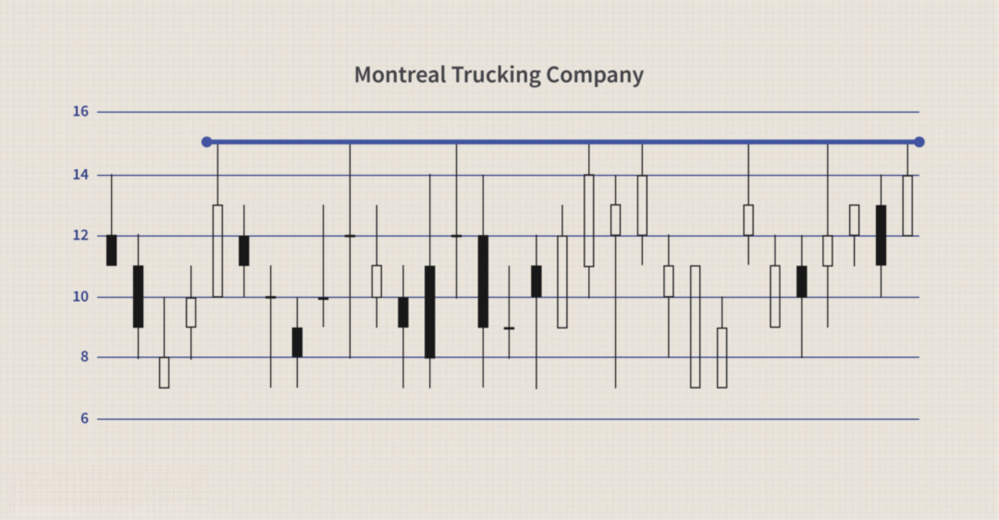

The financial markets have long been a rich landscape for traders who aim to profit by capitalizing on price fluctuations. In this dynamic environment, achieving consistent success is not merely a matter of chance; it requires a comprehensive understanding of market mechanics. One vital element in the trader's toolkit is the concept of resistance levels, which plays a significant role in technical analysis.

Resistance levels are price points that historically act as barriers, preventing an asset from increasing in value beyond a certain level. These levels arise from collective trader behavior and market sentiment, marking areas where selling pressure tends to halt upward momentum. Grasping the significance of resistance levels is crucial for traders as they seek to predict future price movements and make informed trading decisions.



With the emergence of algorithmic trading, the importance of resistance levels has only increased. Algorithmic trading involves using computer programs to execute trades at high speeds, often based on pre-set criteria derived from technical analysis. Incorporating resistance levels into these algorithms allows traders to automate decision-making processes, enhancing precision and reducing the influence of human emotion and delay.

This article will explore the complexities of financial markets, the technical analysis of resistance levels, and their integration into algorithmic trading. By examining these components, traders can develop more effective strategies to navigate the ever-changing landscape of financial markets.

## Table of Contents

## Understanding Resistance Levels in Financial Markets

Resistance levels are essential components of technical analysis used to forecast future price movements in financial markets. These levels represent specific price points where an asset historically faces difficulty advancing further. Understanding resistance levels requires an analysis of trader behavior and market sentiment, as they often coincide with an increase in supply, which stalls upward price movements.

Resistance levels occur because investors and traders remember prior price points where an asset reversed its direction. When the price approaches such a level again, market participants, especially those who have previously incurred losses or missed opportunities to sell, tend to sell their holdings. This collective behavior contributes to the emergence of supply that halts further advancement, thus establishing the resistance.

Resistance levels are not arbitrary; they are derived from the principles of technical analysis. This involves examining historical price data to identify patterns and levels that have previously acted as a ceiling for price movements. Consequently, resistance levels serve as indicators of potential reversal points, where assets might cease their rally and either consolidate or reverse.

To identify these levels, traders often use tools such as trendlines, moving averages, and chart patterns. For example, a horizontal trendline might connect several peaks in a price chart, indicating consistent resistance at a particular price point. Moving averages, like the 50-day or 200-day averages, can also act as dynamic levels of resistance, as prices frequently struggle to breach the averages. 

Additionally, technical indicators like the Relative Strength Index (RSI) and Bollinger Bands provide supplementary insights into market conditions around these levels. For instance, if the RSI indicates overbought conditions near a historical resistance level, it reinforces the expectation of a price pullback.

In summary, resistance levels are fundamental to understanding and predicting market dynamics, offering traders a framework to anticipate potential price ceilings based on past behavior and market sentiment. These levels reflect the psychological and strategic actions of market participants, making them indispensable tools in technical analysis.

## Technical Analysis: The Role of Resistance Levels

Technical analysis is a cornerstone of trading, enabling investors to study historical price patterns to predict future price movements. A key element within technical analysis is the identification of support and resistance levels. These levels provide insights into potential price behavior, offering strategic guidance for traders formulating their entry and [exit](/wiki/exit-strategy) points.

Resistance levels serve as psychological barriers in the financial markets. They are defined by previous price data, where an asset struggles to move beyond a certain price point due to increased selling interest. At these levels, sellers tend to enter the market vigorously, spurred by the perception that the asset's price has reached a temporary peak. This heightened selling activity prevents the asset from rising further, often leading to a reversal or consolidation.

Accurately identifying resistance levels is essential for traders aiming to improve their overall trading strategy and effectiveness. For instance, a trader noticing a stock consistently failing to rise above a particular price point may decide to sell shares as the price nears that resistance level, anticipating a potential reversal. This strategic action can maximize profits and minimize risk. Conversely, recognizing a resistance level breach, where the price moves significantly above the expected barrier, can also be valuable. It may signal a bullish sentiment, prompting traders to enter or increase their market position, anticipating continued price ascension.

The effectiveness of resistance levels can be enhanced when combined with other technical indicators, such as moving averages or the Relative Strength Index (RSI). These indicators can confirm resistance levels and provide additional context for interpreting price movements. For example, if a resistance level coincides with an overbought condition in the RSI, it may reinforce the likelihood of a price reversal.

Moreover, resistance levels are tools for setting stop-loss orders, safeguarding against potential losses. By setting stop-loss orders slightly above a recognized resistance level, traders can limit their exposure to adverse price movements in case the asset does not behave as expected. Employing these levels effectively requires continuous analysis and adaptability, as market conditions and sentiment can shift rapidly.

In essence, resistance levels in technical analysis offer traders a framework for anticipating price behavior and optimizing their trading strategies. Recognizing and interpreting these levels can enhance decision-making processes, contributing to more informed and profitable trading outcomes.

## Algorithmic Trading and Its Synergy with Resistance Levels

Algorithmic trading, often referred to as "algo trading," is transforming the landscape of financial markets. This technological advancement enables market participants to execute trades with remarkable speed and precision, surpassing human capabilities. At the core of many algorithmic systems lies the use of technical analysis principles, particularly resistance levels. These pre-determined price points are integral to executing trades efficiently and effectively.

Resistance levels are utilized in algorithms to automate the trading process. By leveraging historical price data, algorithms can be programmed to recognize these levels and make informed decisions about entering or exiting trades. This automation allows for the swift execution of trades at optimal price points, minimizing the risk of missed opportunities due to human error or hesitation. For instance, if an algorithm identifies that a stock's price is approaching a known resistance level, it can be programmed to execute a sell order, capitalizing on the expected reversal.

Incorporating resistance levels into trading algorithms significantly enhances the system’s precision. Algorithms operate without the emotional biases that often plague human traders. Emotions such as fear and greed can lead to impulsive decisions, whereas algorithms calculate based solely on data and pre-defined rules. The reduction in emotion-driven mistakes is a key advantage, as it stabilizes trading performance and improves the consistency of profits.

Moreover, resistance level data can be continually updated and integrated into algorithms to ensure up-to-date analysis. This adaptability allows traders to adjust their strategies in real-time, responding to dynamic market conditions with unparalleled speed. For example, Python—favored for its simplicity and robust libraries—can be used to develop such trading algorithms. Using libraries like NumPy and pandas for data manipulation, along with packages such as TA-Lib for technical analysis, traders can construct sophisticated models to identify and respond to resistance levels.

Here is a basic example of how such an algorithm might be structured in Python:

```python
import pandas as pd
import talib

# Assuming historical data is loaded into a DataFrame called 'data'
# with columns ['Date', 'Open', 'High', 'Low', 'Close']

# Calculate resistance levels using some technical indicators (e.g., ATR, Bollinger Bands)
data['upper_band'], data['middle_band'], data['lower_band'] = talib.BBANDS(
    data['Close'], timeperiod=20, nbdevup=2, nbdevdn=2, matype=0
)

# Define function to automate trades based on resistance levels
def trade_signals(data):
    signals = []
    for i in range(len(data)):
        if data['Close'][i] > data['upper_band'][i]:
            signals.append('Sell')
        elif data['Close'][i] < data['lower_band'][i]:
            signals.append('Buy')
        else:
            signals.append('Hold')
    return signals

data['Signal'] = trade_signals(data)

# Now 'Signal' column contains the trade actions based on resistance levels
```

This algorithm identifies when the price of an asset surpasses the upper Bollinger Band, signaling a potential resistance [breakout](/wiki/breakout-trading) and prompting a sell action. Conversely, crossing below the lower band indicates a buy action.

The incorporation of resistance levels in [algorithmic trading](/wiki/algorithmic-trading) not only enhances decision-making but also makes operations more efficient. By aligning trading strategies with technical analysis elements, market participants can optimize their performance, mitigate risks, and capitalize on market opportunities with unprecedented accuracy.

## Case Studies and Practical Applications

Various case studies have demonstrated the practical application of resistance levels in trading. These cases show how traders strategically utilize resistance points to optimize their profit potential in different market conditions.

One common approach involves setting a sell limit order at a known resistance level. This strategy is particularly effective in a bullish market trend, where traders predict that the security's price will rise up to a certain point before reversing direction. For example, consider a trader who identifies a resistance level at \$150 for a particular stock currently trading at \$140. The trader might set a sell limit order at \$150, anticipating that when the stock price reaches this level, it will face selling pressure and potentially reverse. By doing so, the trader can capitalize on the anticipated peak price, thus maximizing profit before a potential downturn.

In another case, trading algorithms have demonstrated the capability to identify resistance level breaches and execute trades automatically based on these insights. Algorithmic trading involves using computer programs to analyze market data and execute trades at speeds far beyond human capabilities. For instance, an algorithm might be programmed to recognize when a stock price breaches a resistance level, indicating a potential continued upward movement. Upon identifying this breakthrough, the algorithm may automatically place buy orders, anticipating further price ascension. This method leverages the absence of human emotion and rapid execution, allowing traders to seize opportunities that manual trading might miss.

Consider the following simplified Python code snippet illustrating a basic algorithm that triggers a buy order when the price exceeds a predefined resistance level:

```python
def check_resistance_breach(current_price, resistance_level):
    if current_price > resistance_level:
        place_buy_order(current_price)

def place_buy_order(price):
    print(f"Buy order placed at {price}")

# Example usage:
current_price = 152
resistance_level = 150
check_resistance_breach(current_price, resistance_level)
```

In practice, these algorithmic strategies are often more complex, incorporating multiple technical indicators and risk management rules to optimize performance and manage potential losses. Traders using such systems must continuously monitor and refine their algorithms to adapt to changing market conditions. Nevertheless, these case studies illustrate the varied and effective applications of resistance levels in real-world trading scenarios.

## Risks and Challenges in Using Resistance Levels

While resistance levels are powerful tools in technical analysis, relying solely on them can present significant risks. Financial markets are dynamic systems influenced by a multitude of factors, including geopolitical events, economic reports, and changes in interest rates. These factors can cause unexpected price movements, leading to what traders refer to as "false breakouts." A false breakout occurs when the price moves above a resistance level but lacks the [momentum](/wiki/momentum) to sustain a higher trend, often reversing back below the resistance. This can mislead traders into making premature or incorrect trading decisions, potentially resulting in financial losses.

To mitigate these risks, traders and algorithmic models must consider broader market contexts. This involves integrating various indicators and analyses into their strategies. For instance, combining resistance levels with indicators such as moving averages, Relative Strength Index (RSI), or the Moving Average Convergence Divergence (MACD) can provide a more comprehensive view of market conditions. These indicators can offer confirmation signals, thus helping to distinguish between genuine breakouts and false alarms.

Additionally, understanding market sentiment through news analysis tools, which gauge public and institutional outlook, can also aid in assessing the viability of resistance levels as entry or exit points. Sentiment analysis can identify potential shifts in market mood that might influence the sustainability of a breakout.

Here’s a simple Python example that illustrates how one might code an algorithm to [factor](/wiki/factor-investing) in RSI when evaluating resistance levels:

```python
import pandas as pd
import talib

# Load market data
data = pd.read_csv('market_data.csv')
close_prices = data['Close']

# Calculate RSI
rsi = talib.RSI(close_prices, timeperiod=14)

# Define resistance level
resistance_level = 150

# Trading decision based on resistance and RSI
for i in range(len(close_prices)):
    if close_prices[i] > resistance_level and rsi[i] < 70:
        print(f"Potential breakout at index {i}, consider buying.")
    elif close_prices[i] > resistance_level and rsi[i] >= 70:
        print(f"Possible false breakout at index {i}, RSI indicates overbought.")
```

To effectively manage the risks associated with resistance levels, it is also critical to incorporate risk management strategies such as stop-loss orders and position sizing. These strategies help limit potential losses in case of incorrect predictions. By understanding that no single indicator can predict market movements with absolute certainty, traders and algorithms can adapt to changing conditions and mitigate the impact of unforeseen market events. This multifaceted approach is essential for sustained success in trading.

## Conclusion

Resistance levels remain central to trading strategies and are a fundamental aspect of technical analysis. They provide crucial insights that help traders make informed decisions about entry and exit points, improving the likelihood of profitable trades. By understanding where resistance levels lie, traders can anticipate potential price reversals and make more strategic moves in various market conditions.

The integration of resistance levels into algorithmic trading has significantly enhanced market efficiency. Algorithms can respond to price movements with incredible speed and precision, far surpassing human capabilities. By pre-programming algorithms with specific resistance levels, traders can automate reactions to market changes, allowing for swift responses to breaking through resistance levels and optimizing trade execution.

As financial markets become increasingly complex, the convergence of technical analysis and algorithmic trading highlights the necessity of continuous learning and adaptation. Traders and developers of trading algorithms must stay informed of the latest tools and methods to refine their strategies continually. Understanding resistance levels is not a static skill but a dynamic one that evolves with market trends and technological advancements.

To maintain a competitive edge, market participants need to embrace both technological innovation and a robust grounding in technical analysis principles. As such, incorporating resistance levels into algorithmically-driven trading strategies is paramount to achieving long-term success in the ever-changing landscape of financial markets.

## References & Further Reading

[1]: Bergstra, J., Bardenet, R., Bengio, Y., & Kégl, B. (2011). ["Algorithms for Hyper-Parameter Optimization."](https://papers.nips.cc/paper/4443-algorithms-for-hyper-parameter-optimization) Advances in Neural Information Processing Systems 24.

[2]: ["Advances in Financial Machine Learning"](https://www.amazon.com/Advances-Financial-Machine-Learning-Marcos/dp/1119482089) by Marcos Lopez de Prado

[3]: ["Evidence-Based Technical Analysis: Applying the Scientific Method and Statistical Inference to Trading Signals"](https://www.amazon.com/Evidence-Based-Technical-Analysis-Scientific-Statistical/dp/0470008741) by David Aronson

[4]: ["Machine Learning for Algorithmic Trading"](https://github.com/PacktPublishing/Machine-Learning-for-Algorithmic-Trading-Second-Edition) by Stefan Jansen

[5]: ["Quantitative Trading: How to Build Your Own Algorithmic Trading Business"](https://books.google.com/books/about/Quantitative_Trading.html?id=j70yEAAAQBAJ) by Ernest P. Chan