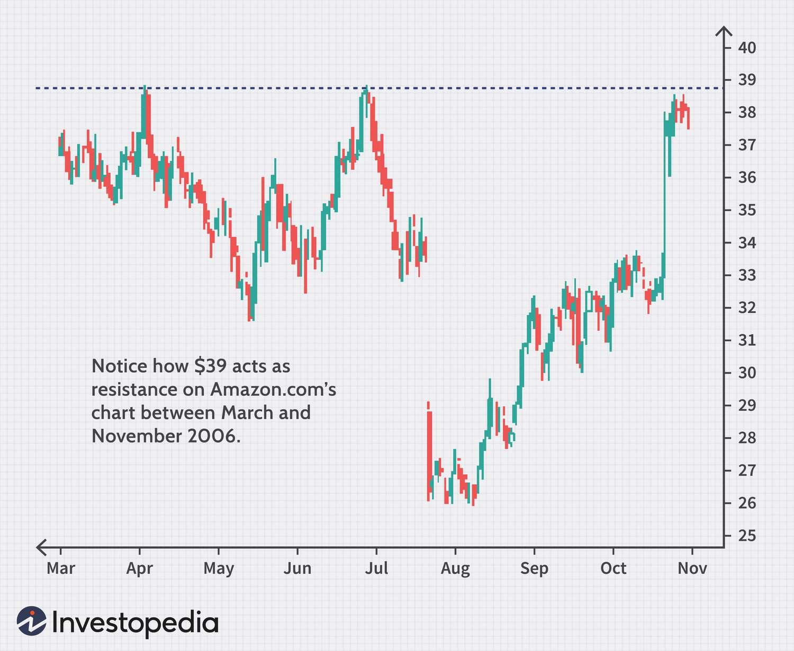

## Table of Contents

## What is a resistance level in financial markets?

A resistance level in financial markets is a price point at which an asset tends to stop rising and starts to fall again. It's like a ceiling that the price of a stock, currency, or other financial instrument struggles to break through. Traders and investors watch these levels closely because they often indicate that there might be more sellers than buyers at that price, causing the price to drop.

When the price of an asset approaches a resistance level, it can be a signal for traders to sell their holdings or take profits. This selling pressure can reinforce the resistance level, making it even harder for the price to go higher. If the price does manage to break through the resistance, it might mean that the asset is entering a new phase of growth, and the old resistance level could become a new support level where the price might find a floor in the future.

## How does a resistance level form?

A resistance level forms when a lot of people start selling a stock or another financial thing at the same price. Imagine a bunch of people all deciding that a certain price is too high, so they want to sell and take their money. This makes it hard for the price to go up past that point because there are so many sellers.

Over time, if the price keeps hitting this level and turning back down, more and more people notice it. They start to expect the price to fall when it reaches that level again, so they sell too. This creates a pattern where the price keeps getting pushed back down at the same spot, making the resistance level stronger.

## What is the significance of resistance levels for traders?

Resistance levels are important for traders because they help them decide when to buy or sell. When the price of a stock or another financial thing gets close to a resistance level, it might be a good time to sell. This is because a lot of other people are also thinking about selling at that price, which could make the price go down again. Traders watch these levels carefully to try to make the best decisions about when to get out of their investments.

If the price actually breaks through a resistance level, it can be a big deal. It might mean that the price is going to keep going up, and that the old resistance level could turn into a new support level. This is when traders might decide to buy more, hoping to make money as the price keeps rising. Understanding resistance levels helps traders make smarter moves and possibly earn more from their trades.

## Can you explain the concept of resistance with a simple example?

Imagine you're selling lemonade at a stand. You start selling cups for $1 each, and people are buying them. As you raise the price to $2, fewer people buy, but some still do. When you try to sell at $3, almost no one buys because they think it's too expensive. That $3 price is like a resistance level for your lemonade. It's the point where people stop buying, and the price can't go any higher easily.

Now, if one day you manage to sell a few cups at $3 because it's really hot outside, and people really want lemonade, you might be able to keep selling at that price. If this happens, the $3 price becomes the new normal, and it's no longer a resistance level. But if you try to raise the price to $4 and no one buys, then $4 becomes the new resistance level. This shows how resistance levels can change over time based on what people are willing to pay.

## How do resistance levels influence trading decisions?

Resistance levels help traders decide when to buy or sell. When the price of something gets close to a resistance level, traders might think it's a good time to sell. This is because a lot of other people might be selling at that price too, which can push the price down. Traders watch these levels to figure out the best time to get out of their investments and make some money.

If the price breaks through a resistance level, it can be a big sign for traders. It might mean the price will keep going up, and the old resistance level could become a new support level. When this happens, traders might decide to buy more, hoping to make money as the price keeps rising. Understanding resistance levels helps traders make smarter choices about when to buy or sell.

## What are the common tools used to identify resistance levels?

Traders use a few common tools to find resistance levels. One of the main tools is the price chart. They look at past prices and see where the price has stopped going up a lot of times. This can show them where the resistance might be. They also use trend lines, which are lines drawn on the chart to connect the high points where the price has hit resistance before.

Another tool is the moving average, which is a line that shows the average price over a certain time. If the price keeps hitting this line and turning back down, it can act like a resistance level. Traders also use indicators like the Relative Strength Index (RSI) to see if a stock is overbought, which might mean it's close to a resistance level.

These tools help traders spot resistance levels more easily. By watching these levels, traders can make better choices about when to buy or sell. It's like having a map that shows where the road might get bumpy, so they can plan their journey better.

## How do resistance levels interact with support levels?

Resistance and support levels are like two sides of the same coin in trading. A resistance level is a price where the thing you're trading, like a stock, stops going up and starts to go down. It's like a ceiling that the price can't easily break through. On the other hand, a support level is a price where the thing you're trading stops going down and starts to go up. It's like a floor that the price bounces off of.

When the price breaks through a resistance level, something interesting happens. That old resistance level can turn into a new support level. Imagine the price was stuck at $50 and couldn't go higher. If it finally breaks through to $51, then $50 might become the new floor where the price bounces back up from. This switching of roles helps traders understand where the price might go next and make better trading decisions.

## What are false breakouts and how do they relate to resistance levels?

A false [breakout](/wiki/breakout-trading) happens when the price of something looks like it's going to break through a resistance level, but then it quickly goes back down. Imagine the price gets close to a resistance level and then suddenly jumps above it. Traders might think, "Wow, the price is going to keep going up!" But then, the price drops right back down below the resistance level. That's a false breakout. It tricks traders into thinking the price is going to go higher, but it doesn't.

False breakouts are important because they can affect how traders make decisions. When traders see a false breakout, they might sell their investments quickly to avoid losing money. This can make the price drop even more. On the other hand, some traders might see a false breakout as a chance to buy at a lower price, hoping the price will eventually break through the resistance level for real. Understanding false breakouts helps traders be more careful and not get tricked by sudden price movements.

## How can resistance levels be used in different types of financial markets?

Resistance levels are important in all kinds of financial markets, like stocks, [forex](/wiki/forex-system), and commodities. In the stock market, traders watch resistance levels to decide when to sell their shares. For example, if a stock keeps hitting $100 and then going back down, traders might sell when it gets close to that price again. In the forex market, where people trade different currencies, resistance levels help traders know when a currency might stop getting stronger and start getting weaker. If the euro keeps hitting 1.20 against the dollar and then drops, traders might sell euros when it gets close to that level.

In the commodity market, like gold or oil, resistance levels are also used to make trading decisions. If the price of gold keeps hitting $1,800 an ounce and then falling, traders might sell their gold when it gets close to that price. These levels help traders in all markets understand where prices might change direction, so they can buy or sell at the right time. By watching these levels, traders can make smarter choices and hopefully make more money.

## What are some advanced techniques for predicting resistance level breaches?

To predict when a resistance level might be broken, traders often use something called [volume](/wiki/volume-trading-strategy) analysis. This means they look at how many people are buying and selling. If a lot of people are buying when the price gets close to the resistance level, it might be a sign that the price will break through. It's like a lot of people pushing a heavy door together; if enough people push, the door will open. Traders watch the volume to see if it's strong enough to push the price past the resistance.

Another technique is to use technical indicators like the Relative Strength Index (RSI) or the Moving Average Convergence Divergence (MACD). These tools help traders see if the price is getting too high or if it's about to change direction. If the RSI shows that the price is overbought but then starts to go down, it might mean the price will break the resistance soon. The MACD can show if the price is gaining or losing [momentum](/wiki/momentum), which can also help predict a breakout. By using these tools together, traders can get a better idea of when a resistance level might be breached.

## How do psychological factors affect the formation and breaking of resistance levels?

Psychological factors play a big role in how resistance levels form and break. When a lot of traders see a certain price and think it's too high, they start selling, which creates a resistance level. It's like a group of people agreeing that a price is too much, so they all decide to sell at that point. This shared belief makes the resistance level stronger because more and more people start to expect the price to fall when it gets close to that level.

Breaking through a resistance level can also be affected by psychology. If traders start to believe that the price will keep going up, they might keep buying even when it gets close to the resistance level. This belief can push the price past the resistance. It's like a group of people deciding that the price isn't too high anymore, so they keep buying, making the price go higher. Understanding these psychological factors helps traders predict when resistance levels might form or break.

## Can you discuss a case study where resistance levels played a critical role in market movement?

In 2020, Tesla's stock had a big resistance level at around $900. Every time the stock price got close to $900, it would stop going up and start going down again. A lot of people thought $900 was too high, so they sold their Tesla shares, which kept the price from going higher. Traders watched this resistance level closely because they knew that if the price could break through $900, it might keep going up a lot more.

In late 2020, something interesting happened. The price of Tesla's stock finally broke through the $900 resistance level. A lot of people started believing that the price could keep going up, so they kept buying even when it got close to $900. This belief pushed the price higher and higher, and soon it was over $1,000. The old resistance level at $900 turned into a new support level, where the price would bounce back up if it started to fall. This case shows how important resistance levels can be in deciding where the market might go next.

## References & Further Reading

[1]: Bergstra, J., Bardenet, R., Bengio, Y., & Kégl, B. (2011). ["Algorithms for Hyper-Parameter Optimization."](https://papers.nips.cc/paper/4443-algorithms-for-hyper-parameter-optimization) Advances in Neural Information Processing Systems 24.

[2]: ["Advances in Financial Machine Learning"](https://www.amazon.com/Advances-Financial-Machine-Learning-Marcos/dp/1119482089) by Marcos Lopez de Prado

[3]: ["Evidence-Based Technical Analysis: Applying the Scientific Method and Statistical Inference to Trading Signals"](https://www.amazon.com/Evidence-Based-Technical-Analysis-Scientific-Statistical/dp/0470008741) by David Aronson

[4]: ["Machine Learning for Algorithmic Trading"](https://github.com/PacktPublishing/Machine-Learning-for-Algorithmic-Trading-Second-Edition) by Stefan Jansen

[5]: ["Quantitative Trading: How to Build Your Own Algorithmic Trading Business"](https://books.google.com/books/about/Quantitative_Trading.html?id=j70yEAAAQBAJ) by Ernest P. Chan