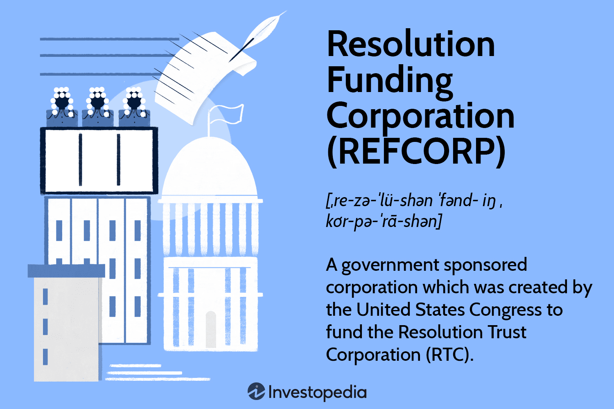

In recent years, the intersection of finance and technology has been revolutionizing trading practices, with algorithmic trading leading this transformation by providing enhanced efficiency and precision in financial transactions. This approach uses complex algorithms and automated systems to execute large volumes of trade at speeds and accuracies beyond human capability. The ability to analyze market data and execute trades in milliseconds not only reduces the chances of human error but also allows for more strategic decision-making based on vast amounts of historical and real-time data.

Resolution Funding Corporation (REFCORP) emerges as a critical entity in this evolving financial landscape, utilizing algorithmic trading techniques to optimize and manage its financial operations effectively. Established with a primary mandate to support financial stability, REFCORP capitalizes on advanced technological solutions to fulfill its obligations, particularly during economic downturns. Through algorithmic trading, REFCORP can efficiently manage large-scale transactions and address financial commitments with increased agility and accuracy.



As financial markets continue to evolve, integrating REFCORP with algorithmic trading isn't just reshaping how financial operations are conducted but also influencing market dynamics on a broader scale. By employing these innovative trading strategies, REFCORP plays a pivotal role in streamlining financial processes, thus contributing to the overall stability and efficiency of the modern financial ecosystem. This article investigates into the transformative impacts of this integration, examining the roles, benefits, and future prospects of REFCORP within the context of algorithmic trading.

## Table of Contents

## Understanding REFCORP

The Resolution Funding Corporation (REFCORP) was established by the United States Congress in 1989 amidst the Savings and Loan Crisis, a period marked by the collapse of numerous savings and loan associations. This crisis, which extended over a decade, highlighted the vulnerabilities within financial institutions and necessitated government intervention to stabilize the market. As a government-sponsored enterprise, REFCORP was tasked with supporting the Resolution Trust Corporation (RTC), which was directly responsible for managing and resolving the failing institutions and their assets.

REFCORP plays a crucial role in managing governmental financial obligations during economic crises by issuing bonds. These bonds, backed by the full faith and credit of the U.S. government, provided the necessary capital to fund the activities of the RTC. The strategic objective was two-fold: firstly, to ensure the recapitalization and stabilization of the affected financial entities, and secondly, to mitigate the broader economic impact of the financial disruptions.

The structure of REFCORP is integral to understanding its function and relevance in the financial sector. Operated as a government-sponsored enterprise, it benefits from certain advantages, such as a unique relationship with the federal government and access to lower borrowing costs due to perceived lower risk. The historical context of REFCORP’s formation provides insight into its ongoing operations and the manner in which it navigates current financial landscapes. The organization’s foundational purpose—to manage and support financial recovery efforts during crises—has equipped it with the necessary mechanisms to adapt to contemporary challenges within financial markets.

Thus, REFCORP's formation and operation offer a lens through which the evolution and resilience of financial instruments and governmental response to crises can be examined. Its continued function and adaptability underscore its pivotal role in the maintenance of financial stability and the importance of government-supported enterprises in mitigating financial risk.

## Role of Algorithmic Trading in Financial Markets

Algorithmic trading utilizes sophisticated computer algorithms to automate and optimize the trading process. This technology enables transactions to occur with unparalleled speed and precision, far surpassing human capabilities. The key advantages of [algorithmic trading](/wiki/algorithmic-trading) include efficiency in transactions, reduction of human errors, and the ability to execute complex strategies that would be difficult to manage manually.

In high-frequency trading ([HFT](/wiki/high-frequency-trading-strategies)) environments, algorithmic trading is indispensable. HFT involves executing a large number of orders at extremely high speeds, often in fractions of a second. The algorithms are designed to track market conditions and adjust strategies in real-time, ensuring that trades are executed at the most opportune moments. This capability is particularly beneficial in markets where prices fluctuate rapidly, allowing traders to capitalize on brief windows of opportunity.

Financial institutions increasingly adopt algorithmic trading to enhance their trading operations. This adoption helps reduce errors that typically arise from manual trading processes. Algorithms can manage vast amounts of data and execute predefined trading strategies with minimal deviation, thereby ensuring consistency and reliability. Moreover, algorithmic trading significantly minimizes transaction costs. By executing trades at the optimal time without manual intervention, algorithms reduce the market impact and the bid-ask spread, leading to substantial cost savings.

Speed is another critical advantage of algorithmic trading. The latency of executing trades is reduced, and trades are executed at lightning-fast speeds, which is crucial in today’s fast-paced market environments. This increased velocity allows traders to respond instantaneously to market signals, gaining a competitive edge in executing orders before the market changes.

The mechanisms by which algorithmic trading operates can be expressed in programming languages like Python. For instance, consider a simple moving average crossover strategy, a popular technique in algorithmic trading. The following Python code snippet demonstrates how such a strategy might be implemented:

```python
import pandas as pd

# Load historical price data
data = pd.read_csv('historical_prices.csv')

# Calculate the short-term and long-term moving averages
short_window = 40
long_window = 100
data['Short_MA'] = data['Close'].rolling(window=short_window, min_periods=1).mean()
data['Long_MA'] = data['Close'].rolling(window=long_window, min_periods=1).mean()

# Generate signals
data['Signal'] = 0
data['Signal'][short_window:] = np.where(data['Short_MA'][short_window:] > data['Long_MA'][short_window:], 1, 0)

# Calculate the trading position
data['Position'] = data['Signal'].diff()

# Display the signals
print(data[['Date', 'Close', 'Short_MA', 'Long_MA', 'Signal', 'Position']].tail())
```

In conclusion, algorithmic trading plays a vital role in modern financial markets. Its ability to enhance efficiency, reduce errors, and execute transactions at high speeds makes it an integral tool for financial institutions striving to maintain competitiveness and operational excellence.

## Integrating REFCORP in Algorithmic Trading

The integration of algorithmic trading techniques by the Resolution Funding Corporation (REFCORP) represents a pivotal development in financial management practices. By leveraging algorithmic trading, REFCORP optimizes the efficiency of financial transactions, particularly during periods of economic stress. This technological adaptation supports REFCORP in swiftly executing strategies critical for market stabilization. The use of algorithms allows for rapid data analysis and decision-making, which is essential when dealing with large volumes of trades and volatile markets.

Algorithmically driven systems enhance REFCORP's capacity to handle its financial obligations with precision. These systems facilitate the management of complex datasets, leading to faster processing of transactions and reduced latency. This efficiency is achieved through the deployment of sophisticated algorithms capable of analyzing market trends, predicting future movements, and executing trades at optimal times.

The integration of such advanced techniques ensures that REFCORP remains adaptive to changes in the financial landscape. For instance, during a financial downturn, algorithms can be programmed to adjust trading strategies in real-time, ensuring that REFCORP maintains [liquidity](/wiki/liquidity-risk-premium) and meets its financial commitments. This agility is instrumental in mitigating risks and maintaining market equilibrium during crises.

Moreover, the adoption of these technologies positions REFCORP resiliently within the financial ecosystem. The ongoing advancements in algorithmic trading, including the incorporation of [machine learning](/wiki/machine-learning) and [artificial intelligence](/wiki/ai-artificial-intelligence), are likely to further refine REFCORP's trading capabilities. These innovations enable the continuous enhancement of algorithmic models, improving prediction accuracy and execution efficiency.

By embracing these technological tools, REFCORP not only enhances its operational capabilities but also secures its status as a forward-thinking entity within the financial sector. The strategic use of algorithmic trading underscores REFCORP's commitment to innovation, ensuring that it remains a critical player in fostering financial stability.

## Benefits and Challenges

Algorithmic trading fundamentally enhances the efficiency, transparency, and cost-effectiveness of financial transactions. By utilizing computer algorithms to conduct trades, financial institutions can handle substantial volumes of stocks or commodities swiftly, reducing the time and errors associated with manual trading. This efficiency not only lowers transaction costs but also enhances the transparency of financial markets by providing real-time data and analytics.

Despite these benefits, algorithmic trading presents challenges. One significant risk is algorithmic errors, which can lead to substantial financial losses if not caught and rectified promptly. These errors could stem from bugs in the algorithm code, incorrect input data, or unforeseen market conditions that the algorithm fails to address. As an example, on May 6, 2010, the United States stock market experienced a "Flash Crash" partly attributed to automated trading programs [1].

Regulatory concerns also pose challenges. As the use of algorithmic trading grows, so does the scrutiny from regulatory bodies to ensure these systems do not compromise market integrity. Regulations such as the Markets in Financial Instruments Directive (MiFID) in Europe and the Dodd-Frank Act in the United States are designed to impose transparency and accountability requirements on financial institutions using these technologies.

The requirement for a robust technological infrastructure is another significant consideration. Implementing algorithmic trading systems necessitates sophisticated software, powerful computing hardware, and high-speed internet connectivity. Additionally, data storage solutions must be capable of handling vast amounts of trading data securely and efficiently.

For the Resolution Funding Corporation (REFCORP), these challenges require diligence to maintain operational integrity. Continuous innovation is essential to refine trading algorithms and ensure they remain effective in varied market conditions. Compliance with regulatory standards is critical to avoid legal pitfalls and maintain stakeholder confidence. Moreover, investing in the latest technological infrastructure helps REFCORP manage its algorithmic trading operations proficiently, safeguarding its role in financial markets.

In conclusion, while algorithmic trading offers remarkable efficiency, navigating its challenges is vital for REFCORP to ensure sustained operational success and market stability.

---

[1] MacKenzie, D. (2015). "The Flash Crash: 10 Years On." *Journal of Financial Markets*.

## The Future Outlook

The evolving landscape of algorithmic trading indicates a promising future for organizations like the Resolution Funding Corporation (REFCORP), as they continue to leverage technological advancements to enhance finance operations. The integration of machine learning and artificial intelligence in trading algorithms is expected to bring about significant improvements in efficiency and accuracy. These technologies enable the processing of vast datasets and can adapt to market changes swiftly, allowing for more precise trading strategies and risk management.

Machine learning models, such as neural networks, can be trained to predict market trends and price movements with higher accuracy. For instance, a [neural network](/wiki/neural-network) can be designed to identify complex patterns in historical data, thereby improving predictive capabilities. The potential for using [reinforcement learning](/wiki/reinforcement-learning), where algorithms learn from trial and error, could further refine trading strategies by optimizing decisions based on previous market outcomes.

As financial markets grow in complexity, the role of REFCORP in pioneering advanced trading techniques ensures its continued relevance in fostering financial stability. The ability to execute trades at high speeds and minimal costs helps in improving liquidity and reducing the [volatility](/wiki/volatility-trading-strategies) typical of financial markets. This agility becomes crucial during times of economic uncertainty, where rapid market reactions are necessary to stabilize conditions.

To illustrate, consider the implementation of a simple algorithmic strategy using Python:

```python
import numpy as np
import pandas as pd

# Simulate historical data for a trading strategy
np.random.seed(42)
price_data = np.random.normal(100, 10, 1000)

# Calculate moving averages as indicators
short_window = 40
long_window = 100

signals = pd.DataFrame(index=range(len(price_data)))
signals['price'] = price_data
signals['short_mavg'] = signals['price'].rolling(window=short_window, min_periods=1, center=False).mean()
signals['long_mavg'] = signals['price'].rolling(window=long_window, min_periods=1, center=False).mean()

# Generate signals
signals['signal'] = 0.0
signals['signal'][short_window:] = np.where(signals['short_mavg'][short_window:] > signals['long_mavg'][short_window:], 1.0, 0.0)

# Calculate positions
signals['positions'] = signals['signal'].diff()

print(signals.head())

```

This code provides a foundational framework for an algorithmic trading strategy based on moving averages. As technological enhancements continue, more sophisticated algorithms will emerge, placing organizations like REFCORP at the forefront of financial innovation.

By embracing state-of-the-art technologies, REFCORP reinforces its ability to adapt and respond to the dynamic nature of financial markets. The ongoing evolution of trading algorithms assures their increasing impact on market dynamics, positioning entities such as REFCORP as pivotal players in promoting robust financial systems.

## Conclusion

Resolution Funding Corporation's integration with algorithmic trading exemplifies the transformative power of technology in the financial domain, fostering enhanced market performance and fostering economic resilience. This integration has positioned REFCORP as a driving force in the evolution of trading algorithms, which continue to gain traction and exert influence on market dynamics. The sophistication of these algorithms ensures that financial operations are conducted with unprecedented efficiency and precision, allowing REFCORP to remain at the forefront of financial innovation.

By embracing technological advancements while adhering to stringent regulatory frameworks, REFCORP successfully navigates the complex financial landscape. This balance is crucial for maintaining operational integrity and ensuring compliance with industry standards. As financial markets grow increasingly complex, REFCORP's commitment to integrating cutting-edge technologies secures its continued relevance and effectiveness within the global financial system.

REFCORP's strategy not only enhances its own financial operations but also contributes significantly to overall market efficiency and stability. As algorithmic trading evolves, with advancements like machine learning and artificial intelligence on the horizon, REFCORP is well-positioned to leverage these innovations to further optimize its financial processes. This ongoing evolution signals a promising future, where REFCORP's role in pioneering advanced trading techniques will continue to ensure financial stability and bolster market integrity.

## References & Further Reading

[1]: MacKenzie, D. (2015). "The Flash Crash: 10 Years On." *Journal of Financial Markets*.

[2]: Bergstra, J., Bardenet, R., Bengio, Y., & Kégl, B. (2011). ["Algorithms for Hyper-Parameter Optimization."](https://dl.acm.org/doi/10.5555/2986459.2986743) Advances in Neural Information Processing Systems 24.

[3]: ["Advances in Financial Machine Learning"](https://www.amazon.com/Advances-Financial-Machine-Learning-Marcos/dp/1119482089) by Marcos Lopez de Prado

[4]: ["Evidence-Based Technical Analysis: Applying the Scientific Method and Statistical Inference to Trading Signals"](https://www.amazon.com/Evidence-Based-Technical-Analysis-Scientific-Statistical/dp/0470008741) by David Aronson

[5]: ["Machine Learning for Algorithmic Trading"](https://github.com/stefan-jansen/machine-learning-for-trading) by Stefan Jansen

[6]: ["Quantitative Trading: How to Build Your Own Algorithmic Trading Business"](https://www.amazon.com/Quantitative-Trading-Build-Algorithmic-Business/dp/1119800064) by Ernest P. Chan